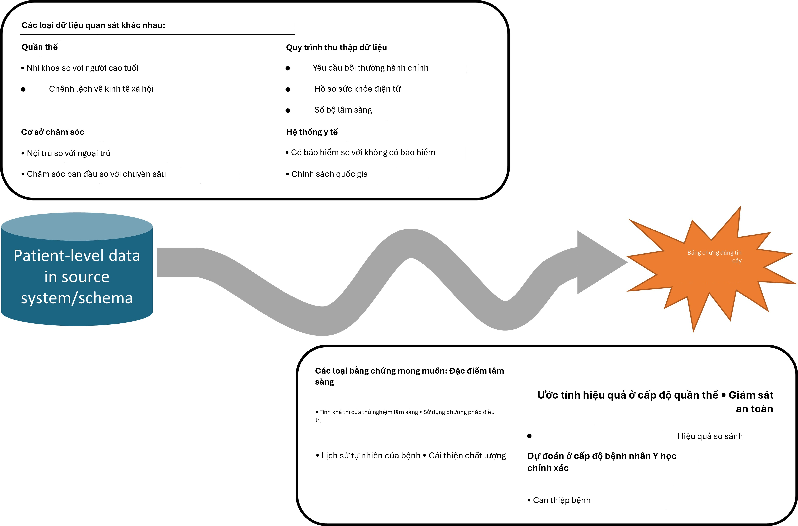
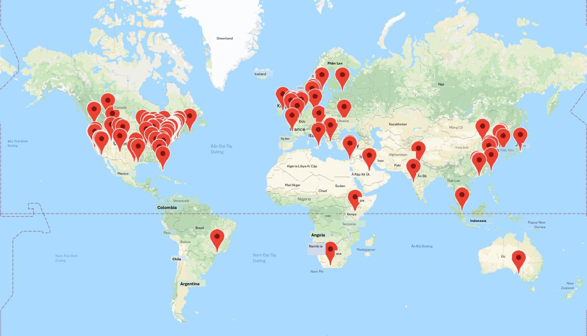

# Cộng đồng OHDSI

*Trưởng chương: Patrick Ryan & George Hripcsak*

"Đến với nhau là một sự khởi đầu; giữ được nhau là sự tiến bộ; làm việc
cùng nhau là thành công." Henry Ford

## Hành trình từ dữ liệu đến bằng chứng

Ở khắp mọi nơi trong lĩnh vực chăm sóc sức khỏe, trên toàn thế giới,
trong các trung tâm y tế học thuật và các phòng khám tư nhân, các cơ
quan quản lý và nhà sản xuất sản phẩm y tế, các công ty bảo hiểm và
các trung tâm chính sách, và tại trung tâm của mọi tương tác giữa bệnh
nhân và nhà cung cấp dịch vụ, có một thách thức chung: làm thế nào để
chúng ta áp dụng những gì đã học từ quá khứ để đưa ra quyết định tốt
hơn cho tương lai?

Trong hơn một thập kỷ, nhiều người đã ủng hộ tầm nhìn về một hệ thống
chăm sóc sức khỏe học tập, "được thiết kế để tạo ra và áp dụng bằng
chứng tốt nhất cho các lựa chọn chăm sóc sức khỏe hợp tác của mỗi bệnh
nhân và nhà cung cấp; để thúc đẩy quá trình khám phá như một kết quả
tự nhiên của việc chăm sóc bệnh nhân; và để đảm bảo sự đổi mới, chất
lượng, an toàn và giá trị trong chăm sóc sức khỏe". (Olsen et al.,
2007) Một thành phần chính của tham vọng này dựa trên triển vọng thú
vị rằng dữ liệu cấp độ bệnh nhân thu thập được trong quá trình chăm
sóc lâm sàng thường quy có thể được phân tích để tạo ra bằng chứng
thực tế, từ đó có thể được phổ biến khắp hệ thống chăm sóc sức khỏe để
thông tin cho thực hành lâm sàng. Năm 2007, Viện Y học Roundtable về Y
học dựa trên bằng chứng đã đưa ra một báo cáo thiết lập mục tiêu rằng
"Đến năm 2020, 90 phần trăm các quyết định lâm sàng sẽ được hỗ trợ bởi
thông tin lâm sàng chính xác, kịp thời và cập nhật, và sẽ phản ánh
bằng chứng tốt nhất hiện có." (Olsen et al., 2007) Mặc dù đã đạt được
những tiến bộ to lớn trên nhiều mặt trận khác nhau, chúng ta vẫn còn
cách xa những khát vọng đáng khen ngợi này.

Tại sao? Một phần là vì hành trình từ dữ liệu cấp độ bệnh nhân đến
bằng chứng đáng tin cậy là một hành trình gian nan. Không có con đường
duy nhất được xác định từ dữ liệu đến bằng chứng, và không có bản đồ
duy nhất nào có thể giúp điều hướng trên con đường đó. Trên thực tế,
không có khái niệm duy nhất về "dữ liệu", cũng như không có khái niệm
duy nhất về "bằng chứng".

{width="7.6in"
height="5.8in"}

Hình 1.1: Hành trình từ dữ liệu đến bằng chứng

Có nhiều loại cơ sở dữ liệu quan sát khác nhau thu thập dữ liệu cấp độ
bệnh nhân khác biệt trong các hệ thống nguồn. Các cơ sở dữ liệu này đa
dạng như chính hệ thống chăm sóc sức khỏe, phản ánh các quần thể, môi
trường chăm sóc và quy trình thu thập dữ liệu khác nhau. Cũng có nhiều
loại bằng chứng có thể hữu ích để thông tin cho việc ra quyết định, có
thể được phân loại theo các trường hợp sử dụng phân tích về đặc điểm
lâm sàng, ước tính hiệu quả cấp độ quần thể và dự đoán cấp độ bệnh
nhân. Độc lập với nguồn gốc (dữ liệu nguồn) và đích đến mong muốn
(bằng chứng), thách thức còn trở nên phức tạp hơn bởi sự rộng lớn của
các năng lực lâm sàng, khoa học và kỹ thuật cần thiết để thực hiện
hành trình. Nó đòi hỏi sự hiểu biết thấu đáo về tin học y tế, bao gồm
toàn bộ nguồn gốc của dữ liệu nguồn từ điểm tương tác chăm sóc giữa
bệnh nhân và nhà cung cấp thông qua các hệ thống hành chính và lâm
sàng và vào kho lưu trữ cuối cùng, với sự đánh giá cao về những sai
lệch có thể phát sinh như một phần của chính sách y tế và các động lực
hành vi liên quan đến quy trình thu thập và quản lý dữ liệu. Nó đòi
hỏi sự thông thạo các nguyên tắc dịch tễ học và phương pháp thống kê
để dịch một câu hỏi lâm sàng thành một thiết kế nghiên cứu quan sát
phù hợp để tạo ra câu trả lời thích hợp. Nó đòi hỏi khả năng kỹ thuật
để triển khai và thực hiện các thuật toán khoa học dữ liệu hiệu quả về
mặt tính toán trên các tập dữ liệu chứa hàng triệu bệnh nhân với hàng
tỷ quan sát lâm sàng qua nhiều năm theo dõi dọc. Nó đòi hỏi kiến thức
lâm sàng để tổng hợp những gì đã học được trên một mạng lưới dữ liệu
quan sát với bằng chứng từ các nguồn thông tin khác, và để xác định
cách thức kiến thức mới này nên tác động đến chính sách y tế và thực
hành lâm sàng. Theo đó, rất hiếm khi bất kỳ cá nhân nào sở hữu đủ các
kỹ năng và nguồn lực cần thiết để tự mình thực hiện thành công hành
trình từ dữ liệu đến bằng chứng. Thay vào đó, hành trình thường yêu-

*1.2. Đối tác Kết quả Y tế Quan sát 5*

cầu sự hợp tác giữa nhiều cá nhân và tổ chức để đảm bảo rằng dữ liệu
tốt nhất hiện có được phân tích bằng các phương pháp phù hợp nhất để
tạo ra bằng chứng mà tất cả các bên liên quan có thể tin tưởng và sử
dụng trong quy trình ra quyết định của họ.

## Đối tác Kết quả Y tế Quan sát

Một ví dụ đáng chú ý về sự hợp tác trong nghiên cứu quan sát là
Observational Medical Outcomes Partnership (OMOP). OMOP là một quan hệ
đối tác công-tư, do Cục Quản lý Thực phẩm và Dược phẩm Hoa Kỳ (FDA)
chủ trì, được quản lý bởi Quỹ Viện Y tế Quốc gia và được tài trợ bởi
một tập đoàn các công ty dược phẩm hợp tác với các nhà nghiên cứu học
thuật và các đối tác dữ liệu y tế để thiết lập một chương trình nghiên
cứu nhằm thúc đẩy khoa học về giám sát an toàn sản phẩm y tế chủ động
sử dụng dữ liệu chăm sóc sức khỏe quan sát. (Stang et al., 2010) OMOP
đã thiết lập một cấu trúc quản trị đa bên và thiết kế một loạt các thí
nghiệm phương pháp luận để thử nghiệm thực nghiệm hiệu suất của các
thiết kế dịch tễ học và phương pháp thống kê thay thế khi áp dụng cho
một loạt các cơ sở dữ liệu yêu cầu thanh toán hành chính và hồ sơ sức
khỏe điện tử cho nhiệm vụ xác định các liên kết an toàn thuốc thực sự
và phân biệt chúng với các kết quả dương tính giả.

Nhận thức được những thách thức kỹ thuật trong việc thực hiện nghiên
cứu trên các cơ sở dữ liệu quan sát khác biệt trong cả môi trường tập
trung và mạng lưới nghiên cứu phân tán, nhóm đã thiết kế Mô hình dữ
liệu chung OMOP (CDM) như một cơ chế để chuẩn hóa cấu trúc, nội dung
và ngữ nghĩa của dữ liệu quan sát và giúp việc viết mã phân tích thống
kê một lần có thể được tái sử dụng tại mỗi cơ sở dữ liệu. (Overhage et
al., 2012) Các thí nghiệm của OMOP đã chứng minh rằng có thể thiết lập
một mô hình dữ liệu chung và các từ vựng chuẩn hóa có thể chứa các
loại dữ liệu khác nhau từ các môi trường chăm sóc khác nhau và được
đại diện bởi các từ vựng nguồn khác nhau theo cách có thể tạo điều
kiện cho sự hợp tác liên tổ chức và phân tích hiệu quả về mặt tính
toán.

Ngay từ khi thành lập, OMOP đã áp dụng cách tiếp cận khoa học mở, đặt
tất cả các sản phẩm công việc của mình, bao gồm thiết kế nghiên cứu,
tiêu chuẩn dữ liệu, mã phân tích và kết quả thực nghiệm, vào phạm vi
công cộng để thúc đẩy tính minh bạch, xây dựng niềm tin vào nghiên cứu
mà OMOP đang thực hiện, nhưng cũng để cung cấp một nguồn lực cộng đồng
có thể được tái sử dụng để thúc đẩy các mục tiêu nghiên cứu của những
người khác. Mặc dù trọng tâm ban đầu của OMOP là an toàn thuốc, OMOP
CDM liên tục phát triển để hỗ trợ một tập hợp các trường hợp sử dụng
phân tích mở rộng, bao gồm hiệu quả so sánh của các can thiệp y tế và
chính sách hệ thống y tế.

Và trong khi OMOP thành công trong việc hoàn thành các thí nghiệm thực
nghiệm quy mô lớn của mình, (Ryan et al., 2012, 2013b) phát triển các
đổi mới phương pháp luận, (Schuemie et al., 2014) và tạo ra tri thức
hữu ích đã thông tin cho việc sử dụng thích hợp dữ liệu quan sát để ra
quyết định an toàn, (Madigan et al., 2013b,a) di sản của OMOP có thể
được nhớ đến nhiều hơn vì việc áp dụng sớm các nguyên tắc khoa học mở
và sự kích thích thúc đẩy việc hình thành cộng đồng OHDSI.

Khi dự án OMOP hoàn thành, sau khi hoàn thành nhiệm vụ thực hiện
nghiên cứu phương pháp luận để thông tin cho các hoạt động giám sát
chủ động của FDA, nhóm đã nhận ra

kết thúc của hành trình OMOP cần trở thành sự khởi đầu của một hành
trình mới cùng nhau. Mặc dù nghiên cứu phương pháp luận của OMOP cung
cấp những hiểu biết hữu hình về các thực hành tốt nhất khoa học có thể
chứng minh cải thiện chất lượng bằng chứng được tạo ra từ dữ liệu quan
sát, việc áp dụng các thực hành tốt nhất đó diễn ra chậm chạp. Một số
rào cản đã được xác định, bao gồm: 1) những lo ngại cơ bản về chất
lượng dữ liệu quan sát được coi là ưu tiên cao hơn cần giải quyết
trước các đổi mới phân tích; 2) sự hiểu biết khái niệm không đầy đủ về
các vấn đề và giải pháp phương pháp luận; 3) không có khả năng tự
triển khai các giải pháp trong môi trường địa phương của họ; 4) sự
không chắc chắn về việc liệu các phương pháp này có áp dụng được cho
các vấn đề lâm sàng mà họ quan tâm hay không. Một chủ đề chung cho mọi
rào cản là cảm giác rằng một người đơn độc không có tất cả những gì họ
cần để thực hiện thay đổi, nhưng với sự hỗ trợ hợp tác, tất cả các vấn
đề đều có thể được vượt qua. Nhưng cần có một số lĩnh vực hợp tác:

- Hợp tác trong việc thiết lập các tiêu chuẩn dữ liệu cộng đồng mở, các
từ vựng chuẩn hóa và các quy ước ETL (Trích xuất - Chuyển đổi - Nạp)
sẽ tăng cường niềm tin vào chất lượng dữ liệu cơ bản và thúc đẩy tính
nhất quán trong cấu trúc, nội dung và ngữ nghĩa để cho phép phân tích
chuẩn hóa.

- Hợp tác trong nghiên cứu phương pháp luận ngoài an toàn thuốc để thiết
lập các thực hành tốt nhất rộng rãi hơn cho đặc điểm lâm sàng, ước
tính hiệu quả cấp độ quần thể và dự đoán cấp độ bệnh nhân. Hợp tác
trong phát triển phân tích mã nguồn mở, để hệ thống hóa các thực hành
tốt nhất khoa học đã được chứng minh thông qua nghiên cứu phương pháp
luận và làm cho chúng có thể tiếp cận được dưới dạng các công cụ công
khai có thể dễ dàng được cộng đồng nghiên cứu áp dụng.

- Hợp tác trong các ứng dụng lâm sàng giải quyết các câu hỏi sức khỏe
quan trọng mà cộng đồng cùng quan tâm bằng cách cùng nhau điều hướng
hành trình từ dữ liệu đến bằng chứng.

Từ cái nhìn sâu sắc này, OHDSI đã ra đời.

## OHDSI như một cộng đồng hợp tác khoa học mở

Observational Health Data Sciences and Informatics (OHDSI, phát âm là
"Odyssey") là một cộng đồng khoa học mở nhằm cải thiện sức khỏe bằng
cách trao quyền cho cộng đồng cùng nhau tạo ra bằng chứng thúc đẩy các
quyết định sức khỏe tốt hơn và dịch vụ chăm sóc tốt hơn. (Hripcsak et
al., 2015) OHDSI thực hiện nghiên cứu phương pháp luận để thiết lập
các thực hành tốt nhất khoa học cho việc sử dụng thích hợp dữ liệu sức
khỏe quan sát, phát triển phần mềm phân tích mã nguồn mở hệ thống hóa
các thực hành này thành các giải pháp nhất quán, minh bạch, có thể tái
lập và áp dụng các công cụ và thực hành này vào các câu hỏi lâm sàng
để tạo ra bằng chứng có thể hướng dẫn chính sách chăm sóc sức khỏe và
chăm sóc bệnh nhân.

### Sứ mệnh của chúng tôi

Cải thiện sức khỏe bằng cách trao quyền cho một cộng đồng cùng nhau
tạo ra bằng chứng thúc đẩy các quyết định sức khỏe tốt hơn và dịch vụ
chăm sóc tốt hơn.

4.  *Tiến độ của OHDSI 7*

### Tầm nhìn của chúng tôi

Một thế giới mà nghiên cứu quan sát tạo ra sự hiểu biết toàn diện về
sức khỏe và bệnh tật.

### Mục tiêu của chúng tôi

- **Đổi mới&#58; Nghiên cứu quan sát là một lĩnh vực sẽ được hưởng lợi rất
nhiều từ tư duy đột phá. Chúng tôi tích cực tìm kiếm và khuyến khích
các cách tiếp cận phương pháp luận mới mẻ trong công việc của mình.**

- **Tính tái lập&#58; Bằng chứng chính xác, có thể tái lập và được hiệu
chuẩn tốt là cần thiết cho việc cải thiện sức khỏe.**

- **Cộng đồng&#58; Mọi người đều được chào đón tham gia tích cực vào OHDSI,
cho dù bạn là bệnh nhân, chuyên gia y tế, nhà nghiên cứu hay bất kỳ ai
tin tưởng vào mục tiêu của chúng tôi.**

- **Hợp tác&#58; Chúng tôi làm việc tập thể để ưu tiên và giải quyết các nhu
cầu thực tế của những người tham gia cộng đồng của chúng tôi.**

- **Tính mở: Chúng tôi cố gắng làm cho tất cả các thành quả của cộng
đồng chúng tôi trở nên mở và công khai, bao gồm các phương pháp, công
cụ và bằng chứng mà chúng tôi tạo ra.**

- **Tính nhân văn&#58; Chúng tôi tìm cách bảo vệ quyền của các cá nhân và tổ
chức trong cộng đồng của mình mọi lúc.**

## Tiến độ của OHDSI

OHDSI đã phát triển kể từ khi thành lập vào năm 2014 với hơn 2.500
cộng tác viên trên các diễn đàn trực tuyến từ các bên liên quan khác
nhau, bao gồm học viện, ngành công nghiệp sản phẩm y tế, cơ quan quản
lý, chính phủ, người trả tiền, nhà cung cấp công nghệ, hệ thống y tế,
bác sĩ lâm sàng, bệnh nhân và đại diện cho các ngành khác nhau, bao
gồm khoa học máy tính, dịch tễ học, thống kê, tin học y sinh, chính
sách y tế và khoa học lâm sàng. Danh sách các cộng tác viên OHDSI tự
xác định có sẵn trên trang web OHDSI. 1 Bản đồ cộng tác viên OHDSI
(Hình 1.2) làm nổi bật sự rộng lớn và đa dạng của cộng đồng quốc tế.

Tính đến tháng 8 năm 2019, OHDSI cũng đã thiết lập một mạng lưới dữ
liệu gồm hơn 100 cơ sở dữ liệu chăm sóc sức khỏe khác nhau từ hơn 20
quốc gia, cùng nhau thu thập hơn một tỷ hồ sơ bệnh nhân bằng cách áp
dụng cách tiếp cận mạng lưới phân tán sử dụng tiêu chuẩn dữ liệu cộng
đồng mở mà nó duy trì, OMOP CDM. Một mạng lưới phân tán có nghĩa là dữ
liệu cấp độ bệnh nhân không cần phải được chia sẻ giữa các cá nhân
hoặc tổ chức. Thay vào đó, các câu hỏi nghiên cứu được đặt ra bởi các
cá nhân trong cộng đồng dưới dạng một giao thức nghiên cứu và kèm theo
mã phân tích tạo ra bằng chứng dưới dạng một tập hợp các số liệu thống
kê tóm tắt tổng hợp, và chỉ những số liệu thống kê tóm tắt này mới
được chia sẻ giữa các đối tác lựa chọn hợp tác trong nghiên cứu. Với mạng lưới phân tán OHDSI, mỗi
đối tác dữ liệu giữ toàn quyền tự chủ đối với việc sử dụng dữ liệu cấp
độ bệnh nhân của họ và tiếp tục tuân thủ các chính sách quản trị dữ
liệu trong các tổ chức tương ứng của họ.

^1^<https://www.ohdsi.org/who-we-are/collaborators/>

{width="5.34375in"
height="3.0625in"}

Hình 1.2: Bản đồ cộng tác viên OHDSI tính đến tháng 8 năm 2019

Cộng đồng nhà phát triển OHDSI đã tạo ra một thư viện mạnh mẽ các công
cụ phân tích mã nguồn mở trên OMOP CDM để hỗ trợ 3 trường hợp sử
dụng: 1) đặc điểm lâm sàng cho lịch sử tự nhiên của bệnh, sử dụng điều
trị và cải thiện chất lượng; 2) ước tính hiệu quả cấp độ quần thể để
áp dụng các phương pháp suy luận nhân quả cho giám sát an toàn sản
phẩm y tế và hiệu quả so sánh; và 3) dự đoán cấp độ bệnh nhân để áp
dụng các thuật toán học máy cho y học chính xác và ngăn chặn bệnh tật.
Các nhà phát triển OHDSI cũng đã phát triển các ứng dụng để hỗ trợ
việc áp dụng OMOP CDM, đánh giá chất lượng dữ liệu và tạo điều kiện
cho các nghiên cứu mạng lưới OHDSI. Các công cụ này bao gồm các gói
thống kê phụ trợ được xây dựng bằng R và Python, và các ứng dụng web
giao diện người dùng được phát triển bằng HTML và Javascript. Tất cả
các công cụ OHDSI đều là mã nguồn mở và công khai thông qua Github.2

Cách tiếp cận cộng đồng khoa học mở của OHDSI, cùng với các công cụ mã
nguồn mở của nó, đã cho phép những tiến bộ to lớn trong nghiên cứu
quan sát. Một trong những phân tích mạng lưới OHDSI đầu tiên đã kiểm
tra các lộ trình điều trị trên ba bệnh mãn tính: tiểu đường, trầm cảm
và tăng huyết áp. Được xuất bản trong Kỷ yếu của Viện Hàn lâm Khoa học
Quốc gia, đây là một trong những nghiên cứu quan sát lớn nhất từng
được thực hiện, với kết quả từ 11 nguồn dữ liệu bao gồm hơn 250 triệu
bệnh nhân và tiết lộ những khác biệt địa lý to lớn và sự không đồng
nhất của bệnh nhân trong các lựa chọn điều trị mà trước đây chưa từng
quan sát được. (Hripcsak et al., 2016) OHDSI đã phát triển các phương
pháp thống kê mới để điều chỉnh sai lệch (Tian et al., 2018) và đánh
giá tính hợp lệ của bằng chứng quan sát cho suy luận nhân quả, (Schuemie et al., 2018a) và
nó đã áp dụng các cách tiếp cận này trong nhiều bối cảnh, từ một câu
hỏi giám sát an toàn cá nhân trong bệnh động kinh (Duke et al., 2017)
đến hiệu quả so sánh của các thuốc tiểu đường dòng thứ hai (Vashisht
et al., 2018) đến một nghiên cứu ước tính hiệu quả cấp độ quần thể quy
mô lớn về an toàn so sánh của các phương pháp điều trị trầm cảm.
(Schuemie et al., 2018b) Cộng đồng OHDSI cũng đã thiết lập một khung
cho cách áp dụng có trách nhiệm các thuật toán học máy vào dữ liệu
chăm sóc sức khỏe quan sát, (Reps et al., 2018) đã được áp dụng trên
nhiều lĩnh vực trị liệu khác nhau. (Johnston et al., 2019; Cepeda et
al., 2018; Reps et al., 2019)

^2^<https://github.com/OHDSI>

5.  *Hợp tác trong OHDSI 9*

## Hợp tác trong OHDSI

Vì OHDSI là một cộng đồng nhằm trao quyền hợp tác để tạo ra bằng
chứng, việc trở thành một cộng tác viên OHDSI có ý nghĩa gì? Nếu bạn
là người tin vào sứ mệnh của OHDSI và quan tâm đến việc đóng góp ở bất
kỳ đâu dọc theo hành trình từ dữ liệu đến bằng chứng, thì OHDSI có thể
là cộng đồng dành cho bạn. Các cộng tác viên có thể là những cá nhân
có quyền truy cập vào dữ liệu cấp độ bệnh nhân quan tâm đến việc thấy
dữ liệu đó được sử dụng để tạo ra bằng chứng. Các cộng tác viên có thể
là các nhà phương pháp luận quan tâm đến việc thiết lập các thực hành
tốt nhất khoa học và đánh giá các cách tiếp cận thay thế. Các cộng tác
viên có thể là các nhà phát triển phần mềm quan tâm đến việc áp dụng
các kỹ năng lập trình của họ để tạo ra các công cụ có thể được phần
còn lại của cộng đồng sử dụng. Các cộng tác viên có thể là các nhà
nghiên cứu lâm sàng có các câu hỏi sức khỏe cộng đồng quan trọng và
đang tìm cách cung cấp bằng chứng cho những câu hỏi đó cho cộng đồng
chăm sóc sức khỏe rộng lớn hơn thông qua xuất bản và các hình thức phổ
biến khác. Các cộng tác viên có thể là các cá nhân hoặc tổ chức tin
tưởng vào mục tiêu chung này vì sức khỏe cộng đồng và muốn cung cấp
các nguồn lực để đảm bảo rằng cộng đồng có thể duy trì chính mình và
tiếp tục sứ mệnh của mình, bao gồm tổ chức các hoạt động cộng đồng và
các buổi đào tạo trên khắp thế giới. Bất kể nền tảng kỷ luật hay sự
liên kết với bên liên quan của bạn là gì, OHDSI tìm cách trở thành một
nơi mà các cá nhân có thể làm việc cùng nhau hướng tới một mục đích
chung, mỗi người thực hiện những đóng góp cá nhân của mình, cùng nhau
có thể thúc đẩy chăm sóc sức khỏe. Nếu bạn quan tâm đến việc tham gia
hành trình, hãy xem Chương 2 ("Nơi bắt đầu") để biết cách bắt đầu.

## Tóm tắt

{width="0.4455205599300088in"
height="0.4644783464566929in"}

-	Sứ mệnh của OHDSI là cải thiện sức khỏe bằng cách trao quyền cho cộng đồng cùng nhau tạo ra bằng chứng thúc đẩy các quyết định y tế tốt hơn và dịch vụ chăm sóc tốt hơn.

- Tầm nhìn của chúng tôi là một thế giới nơi nghiên cứu quan sát tạo ra sự hiểu biết toàn diện về sức khỏe và bệnh tật, điều này sẽ đạt được thông qua các mục tiêu của chúng tôi về đổi mới, khả năng tái lập, cộng đồng, hợp tác, cởi mở và lòng nhân ái.

– Các cộng tác viên của OHDSI tập trung vào các tiêu chuẩn dữ liệu cộng đồng mở, nghiên cứu phương pháp luận, phát triển phân tích mã nguồn mở và các ứng dụng lâm sàng để cải thiện hành trình từ dữ liệu đến bằng chứng.

