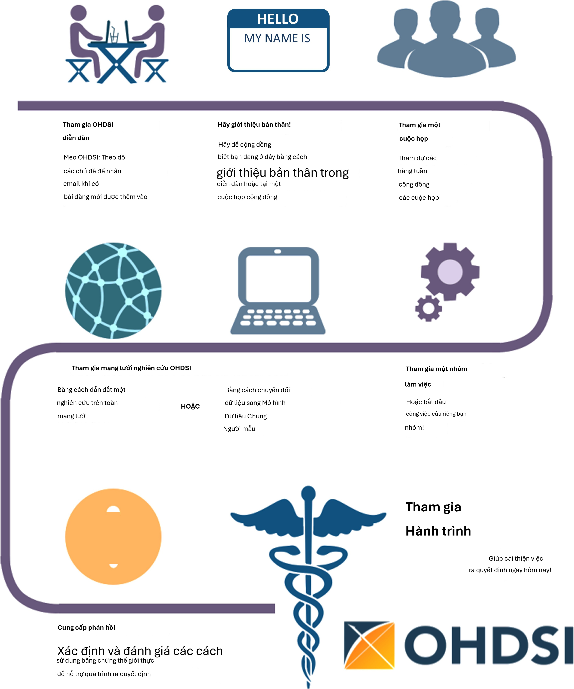

# Nơi bắt đầu

*Người phụ trách chương: Hamed Abedtash & Kristin Kostka*

"Hành trình ngàn dặm bắt đầu bằng một bước chân." - Lão Tử

Cộng đồng OHDSI đại diện cho một bức tranh khảm các bên liên quan trên
khắp học viện, ngành công nghiệp và các thực thể chính phủ. Công việc
của chúng tôi mang lại lợi ích cho một loạt các cá nhân và tổ chức,
bao gồm bệnh nhân, nhà cung cấp dịch vụ và nhà nghiên cứu, cũng như
các hệ thống chăm sóc sức khỏe, ngành công nghiệp và các cơ quan chính
phủ. Lợi ích này đạt được bằng cách cải thiện cả chất lượng phân tích
dữ liệu chăm sóc sức khỏe cũng như tính hữu ích của dữ liệu chăm sóc
sức khỏe đối với những bên liên quan này. Chúng tôi tin rằng nghiên
cứu quan sát là một lĩnh vực được hưởng lợi rất nhiều từ tư duy đột
phá. Chúng tôi tích cực tìm kiếm và khuyến khích các cách tiếp cận
phương pháp luận mới mẻ trong công việc của mình.

## Tham gia hành trình

Mọi người đều được chào đón tham gia tích cực vào OHDSI, cho dù bạn là
bệnh nhân, chuyên gia y tế, nhà nghiên cứu hay bất kỳ ai tin tưởng vào
mục tiêu của chúng tôi. OHDSI duy trì một mô hình thành viên bao trùm.
Để trở thành một cộng tác viên OHDSI không yêu cầu phí thành viên. Hợp
tác đơn giản như việc giơ tay để được đưa vào danh sách thành viên
OHDSI hàng năm. Sự tham gia hoàn toàn là tự nguyện. Một cộng tác viên
có thể có bất kỳ mức độ đóng góp nào trong cộng đồng, từ việc tham dự
các cuộc gọi cộng đồng hàng tuần đến dẫn đầu các nghiên cứu mạng lưới
hoặc các nhóm làm việc OHDSI. Các cộng tác viên không bắt buộc phải là
người nắm giữ dữ liệu để được coi là thành viên tích cực của cộng
đồng. Cộng đồng OHDSI nhằm phục vụ các nhà nắm giữ dữ liệu, nhà nghiên
cứu, nhà cung cấp dịch vụ chăm sóc sức khỏe và bệnh nhân & người tiêu
dùng như nhau. Hồ sơ của các cộng tác viên được duy trì và cập nhật
định kỳ trên trang web OHDSI. Tư cách thành viên được thúc đẩy thông
qua các cuộc gọi cộng đồng OHDSI, các nhóm làm việc và các chương khu
vực.

{width="4.931874453193351in"
height="5.920416666666667in"}

Hình 2.1: Tham gia hành trình - Cách trở thành một cộng tác viên
OHDSI.

### Diễn đàn OHDSI

Diễn đàn OHDSI1 là một trang thảo luận trực tuyến nơi các cộng tác
viên cộng đồng OHDSI có thể thực hiện các cuộc trò chuyện dưới dạng
các tin nhắn được đăng. Các diễn đàn bao gồm một cấu trúc thư mục
giống như cây. Phần trên cùng là "Danh mục". Các diễn đàn có thể được
chia thành các danh mục cho các cuộc thảo luận liên quan. Dưới các
danh mục là các diễn đàn con và các diễn đàn con này có thể có thêm
các diễn đàn con khác. Các chủ đề (thường được gọi là các luồng) nằm
dưới cấp độ diễn đàn con thấp nhất và đây là những nơi mà các thành
viên diễn đàn có thể bắt đầu các cuộc thảo luận hoặc bài đăng của họ.

Trong các diễn đàn OHDSI, bạn có thể tìm thấy các danh mục nội dung
bao gồm:

- **Chung&#58; dành cho các cuộc thảo luận chung về cộng đồng OHDSI và cách
tham gia**

- **Người triển khai&#58; dành cho các cuộc thảo luận về cách triển khai Mô
hình dữ liệu chung và khung phân tích OHDSI trong môi trường địa
phương của bạn**

- **Nhà phát triển&#58; dành cho các cuộc thảo luận xung quanh việc phát
triển mã nguồn mở các ứng dụng OHDSI và các công cụ khác tận dụng OMOP
CDM**

- **Nhà nghiên cứu&#58; dành cho các cuộc thảo luận xung quanh nghiên cứu
dựa trên CDM, bao gồm tạo bằng chứng, nghiên cứu hợp tác, phương pháp
thống kê và các chủ đề khác mà Mạng lưới nghiên cứu OHDSI quan tâm**

- **Người xây dựng CDM&#58; dành cho các cuộc thảo luận về việc phát triển
CDM đang diễn ra, bao gồm các yêu cầu, từ vựng và các khía cạnh kỹ
thuật**

- **Người dùng từ vựng&#58; dành cho thảo luận về nội dung từ vựng**

- **Các chi nhánh khu vực (ví dụ: Hàn Quốc, Trung Quốc, Châu Âu): dành
cho các thảo luận khu vực bằng ngôn ngữ bản địa liên quan đến việc
triển khai OMOP tại địa phương và các hoạt động của cộng đồng OHDSI**

Để bắt đầu đăng chủ đề của riêng bạn, bạn sẽ cần đăng ký tài khoản.
Sau khi có tài khoản diễn đàn, bạn được khuyến khích giới thiệu bản
thân trong Chủ đề Chung (General Topic) dưới luồng có tên "Chào mừng
đến với OHDSI! - Vui lòng giới thiệu bản thân". Bạn được mời phản hồi
và 1) Giới thiệu bản thân và cho chúng tôi biết một chút về công việc
của bạn và 2) Cho chúng tôi biết cách bạn muốn giúp đỡ cộng đồng (ví
dụ: phát triển phần mềm, chạy các nghiên cứu, viết bài báo nghiên cứu,
v.v.). Bây giờ bạn đã bắt đầu Hành trình OHDSI của mình! Từ đây, bạn
được khuyến khích tham gia vào các cuộc thảo luận. Cộng đồng OHDSI
khuyến khích sử dụng các Diễn đàn như một cách để đặt câu hỏi, thảo
luận về các ý tưởng mới và cộng tác.

{width="0.45499890638670165in"
height="0.45499890638670165in"}

^1^[https://forums.ohdsi.org](https://forums.ohdsi.org/)

### Các sự kiện OHDSI

OHDSI thường xuyên tổ chức các sự kiện trực tiếp để tạo cơ hội cho các
cộng tác viên học hỏi lẫn nhau và kết nối nhằm thúc đẩy các mối quan
hệ hợp tác trong tương lai. Các sự kiện này được thông báo trên trang
web OHDSI và miễn phí cho bất kỳ ai quan tâm tham dự.

Các Hội nghị chuyên đề OHDSI (OHDSI Symposia) là các hội nghị khoa
học, được tổ chức hàng năm tại Mỹ, Châu Âu và Châu Á, nơi các cộng tác
viên có thể trình bày nghiên cứu mới nhất của họ thông qua các bài
thuyết trình toàn thể, trình bày áp phích và giới thiệu phần mềm. Các
Hội nghị chuyên đề OHDSI cung cấp một địa điểm tuyệt vời để kết nối và
tìm hiểu về những tiến bộ mới nhất trên toàn cộng đồng. Các Hội nghị
chuyên đề OHDSI thường đi kèm với các buổi hướng dẫn OHDSI, do các
cộng tác viên OHDSI đồng nghiệp giảng dạy với tư cách là giảng viên
khóa học, cung cấp cho những người mới tham gia cộng đồng cơ hội thực
hành về các chủ đề xung quanh tiêu chuẩn dữ liệu và các phương pháp
phân tích tốt nhất. Các buổi hướng dẫn này thường được ghi hình và
cung cấp trên trang web OHDSI sau các sự kiện dành cho những người
không thể tham dự trực tiếp.

Các sự kiện gặp mặt trực tiếp của Cộng tác viên OHDSI là các diễn đàn
nhỏ hơn thường tập trung vào một vấn đề cùng quan tâm để giải quyết
trong thời gian làm việc cùng nhau. Các sự kiện trước đây bao gồm
hack-a-thon về kiểu hình, hack-a-thon về chất lượng dữ liệu và
hack-a-thon về tài liệu phần mềm nguồn mở. OHDSI đã tổ chức nhiều sự
kiện Study-a-thon, nơi mục tiêu của phiên làm việc kéo dài nhiều ngày
là cộng tác theo nhóm về một câu hỏi nghiên cứu cụ thể bằng cách thiết
kế và triển khai phân tích quan sát phù hợp, thực hiện nghiên cứu trên
mạng lưới OHDSI và tổng hợp bằng chứng để phổ biến công khai. Trong
tất cả các sự kiện này, có một mong muốn chung là giải quyết một vấn
đề chung nhưng cũng có mối quan tâm chung trong việc cung cấp một môi
trường thân thiện khuyến khích học tập và cải tiến liên tục quy trình
giải quyết vấn đề mang tính cộng tác.

Tìm hiểu thêm về sức mạnh của Cộng đồng OHDSI. Khám phá các hội nghị
chuyên đề, các cuộc họp trực tiếp trước đây và xem các buổi hướng dẫn
OHDSI bằng cách truy cập phần Các sự kiện trước đây (Past Events) trên
trang web OHDSI. Phần Các sự kiện trước đây được cập nhật thường xuyên
để lưu trữ các sự kiện của cộng đồng.

### Các cuộc gọi cộng đồng OHDSI

Các cuộc gọi cộng đồng OHDSI (OHDSI Community Calls) là cơ hội hàng
tuần để làm nổi bật các hoạt động đang diễn ra trong cộng đồng OHDSI.
Được tổ chức vào mỗi thứ Ba từ 12 giờ trưa đến 1 giờ chiều giờ ET, các
cuộc họp từ xa này là thời gian để cộng đồng OHDSI cùng nhau chia sẻ
những phát triển gần đây và ghi nhận những thành tựu của các cộng tác
viên cá nhân, các nhóm làm việc và cộng đồng nói chung. Mỗi cuộc họp
hàng tuần đều được ghi lại và các bài thuyết trình được lưu trữ trong
các tài nguyên trên trang web OHDSI.

Tất cả các Cộng tác viên OHDSI đều được chào đón tham gia cuộc họp từ
xa hàng tuần này và được khuyến khích đề xuất các chủ đề thảo luận của
cộng đồng. Các cuộc gọi cộng đồng OHDSI có thể là một diễn đàn để chia
sẻ kết quả nghiên cứu, trình bày và tìm kiếm phản hồi cho các công
việc đang thực hiện, giới thiệu các công cụ phần mềm nguồn mở đang
được phát triển, tranh luận về các phương pháp thực hành tốt nhất của
cộng đồng về mô hình hóa dữ liệu và phân tích, và cùng nhau suy nghĩ
về các cơ hội hợp tác trong tương lai cho các khoản tài trợ/ấn
phẩm/hội thảo hội nghị. Nếu bạn là một Cộng tác viên có chủ đề cho một
cuộc họp Cộng tác viên OHDSI sắp tới, bạn được mời đăng suy nghĩ của
mình trên

Diễn đàn OHDSI.

Là người mới tham gia cộng đồng OHDSI, bạn được khuyến khích thêm loạt
cuộc gọi này vào lịch của mình để làm quen với những gì đang diễn ra
trên mạng lưới OHDSI. Nếu bạn muốn tham gia một cuộc gọi OHDSI, vui
lòng tham khảo wiki OHDSI. Các chủ đề cuộc gọi cộng đồng thay đổi theo
từng tuần. Bạn cũng có thể tham khảo OHDSI Weekly Digest trên diễn đàn
OHDSI để biết thêm thông tin về các chủ đề thuyết trình hàng tuần.
Những người mới tham gia được mời giới thiệu bản thân trong cuộc gọi
đầu tiên của họ và kể cho cộng đồng nghe về bản thân, nền tảng của họ
và điều gì đã đưa họ đến với OHDSI.

### Các nhóm làm việc OHDSI

OHDSI có nhiều dự án đang diễn ra do các nhóm làm việc dẫn dắt. Mỗi
nhóm làm việc có đội ngũ lãnh đạo riêng để xác định các mục tiêu, đích
đến và các sản phẩm trí tuệ cần đóng góp cho cộng đồng. Việc tham gia
nhóm làm việc mở cho tất cả những ai quan tâm đến việc đóng góp cho
các mục tiêu và đích đến của dự án. Các nhóm làm việc có thể là các
nhóm lâu dài, các mục tiêu chiến lược hoặc các dự án ngắn hạn để hoàn
thành một nhu cầu cụ thể trong cộng đồng. Nhịp độ cuộc họp của nhóm
làm việc được xác định bởi lãnh đạo dự án và sẽ khác nhau giữa các
nhóm. Danh sách các nhóm làm việc đang hoạt động được duy trì trên
OHDSI Wiki.

Bảng 2.1 cung cấp tài liệu tham khảo nhanh về các nhóm làm việc OHDSI
đang hoạt động. Bạn được khuyến khích tham gia một cuộc gọi và tìm
hiểu thêm.

Bảng 2.1: Các nhóm làm việc OHDSI đáng chú ý

Nhóm làm việc

Tên Mục tiêu Đối tượng mục tiêu

Atlas & WebAPI

CDM &

Từ vựng

Atlas và WebAPI là một phần của kiến trúc phần mềm nguồn mở OHDSI nhằm
cung cấp các khả năng phân tích chuẩn hóa được xây dựng trên nền tảng
của Mô hình dữ liệu chung OMOP (CDM).

Tiếp tục phát triển Mô hình dữ liệu chung OMOP nhằm mục đích phân tích
có hệ thống, chuẩn hóa và quy mô lớn áp dụng cho dữ liệu bệnh nhân lâm
sàng. Cải thiện chất lượng của Từ vựng chuẩn hóa bằng cách tăng phạm
vi bao phủ của chúng đối với các hệ thống mã hóa quốc tế và các khía
cạnh lâm sàng của chăm sóc bệnh nhân để hỗ trợ các phân tích chuẩn hóa
do các nhóm làm việc khác phát triển.

Các nhà phát triển phần mềm Java & JavaScript nhằm mục đích cải thiện
và đóng góp cho

nền tảng Atlas/WebAPI nguồn mở Bất kỳ ai quan tâm đến việc cải thiện
Mô hình dữ liệu chung OMOP và Từ vựng chuẩn hóa để đáp ứng mọi nhu cầu
và trường hợp sử dụng

Nhóm làm việc

Tên Mục tiêu Đối tượng mục tiêu

Genomics Mở rộng OMOP CDM để kết hợp dữ liệu gen từ bệnh nhân. Nhóm sẽ
xác định một lược đồ tương thích với CDM có thể lưu trữ thông tin về
các biến thể di truyền từ nhiều quy trình giải trình tự khác nhau.

Mở cho tất cả

Ước tính cấp độ quần thể

Xử lý ngôn ngữ tự nhiên

Dự đoán cấp độ bệnh nhân

Thư viện kiểu hình chuẩn vàng FHIR

Nhóm làm việc

Phát triển các phương pháp khoa học cho nghiên cứu quan sát dẫn đến
các ước tính cấp độ quần thể về các tác động chính xác, đáng tin cậy
và có thể tái tạo, đồng thời tạo điều kiện cho cộng đồng sử dụng các
phương pháp này.

Thúc đẩy việc sử dụng thông tin văn bản từ Hồ sơ sức khỏe điện tử
(EHR) cho các nghiên cứu quan sát dưới sự bảo trợ của OHDSI. Để tạo
điều kiện cho mục tiêu này, nhóm sẽ phát triển các phương pháp và phần
mềm có thể được triển khai để sử dụng văn bản lâm sàng cho các nghiên
cứu của cộng đồng OHDSI. Thiết lập một quy trình chuẩn hóa để phát
triển các mô hình dự đoán lấy bệnh nhân làm trung tâm chính xác và
được hiệu chuẩn tốt, có thể được sử dụng cho nhiều kết quả quan tâm và
có thể áp dụng cho dữ liệu chăm sóc sức khỏe quan sát từ bất kỳ phân
nhóm bệnh nhân nào được quan tâm

Cho phép các thành viên của cộng đồng OHDSI tìm kiếm, đánh giá và sử
dụng các định nghĩa nhóm thuần tập đã được cộng đồng xác nhận cho
nghiên cứu và các hoạt động khác

Thiết lập lộ trình cho việc tích hợp OHDSI FHIR và đưa ra các khuyến
nghị cho cộng đồng rộng lớn hơn về việc tận dụng triển khai FHIR và dữ
liệu trong cộng đồng EHR cho

các nghiên cứu quan sát dựa trên OHDSI và để phổ biến dữ liệu và kết
quả nghiên cứu của OHDSI thông qua các công cụ và API dựa trên FHIR.

Mở cho tất cả

Mở cho tất cả

Mở cho tất cả

Mở cho tất cả những ai quan tâm đến việc giám tuyển và xác nhận kiểu
hình

Mở cho tất cả những ai quan tâm đến khả năng tương tác

GIS Mở rộng OMOP CDM và tận dụng các công cụ OHDSI để lịch sử tiếp xúc
môi trường của bệnh nhân có thể được liên kết với các kiểu hình lâm
sàng của họ

Mở cho tất cả những ai quan tâm đến

các thuộc tính địa lý liên quan đến sức khỏe

Nhóm làm việc

Tên Mục tiêu Đối tượng mục tiêu

Thử nghiệm lâm sàng

Tìm hiểu các trường hợp sử dụng thử nghiệm lâm sàng nơi nền tảng & hệ
sinh thái OHDSI có thể hỗ trợ các thử nghiệm ở bất kỳ khía cạnh nào,
và hỗ trợ thúc đẩy các cập nhật trong các công cụ OHDSI để hỗ trợ.

Mở cho tất cả những ai quan tâm đến thử nghiệm lâm sàng

THEMIS Mục tiêu của THEMIS là phát triển các quy ước tiêu chuẩn, vượt
ra ngoài các quy ước OMOP CDM, để đảm bảo các giao thức ETL được thiết
kế tại mỗi cơ sở OMOP có chất lượng cao nhất, có thể tái tạo và hiệu
quả.

Siêu dữ liệu &

Chú thích

Dữ liệu sức khỏe do bệnh nhân tạo ra (PGHD)

Phụ nữ OHDSI

Ban chỉ đạo

Mục tiêu của chúng tôi là xác định một quy trình tiêu chuẩn để lưu trữ
siêu dữ liệu và chú thích do con người và máy tạo ra trong Mô hình dữ
liệu chung để đảm bảo các nhà nghiên cứu có thể tiêu thụ và tạo ra các
sản phẩm dữ liệu hữu ích về các tập dữ liệu quan sát.

Mục tiêu của WG này là phát triển các quy ước ETL, quy trình tích hợp
với dữ liệu lâm sàng và quy trình phân tích cho PGHD, được tạo ra
thông qua các thiết bị Thông minh/Ứng dụng/Thiết bị đeo.

Cung cấp một diễn đàn cho phụ nữ trong cộng đồng OHDSI cùng nhau thảo
luận về những thách thức mà họ phải đối mặt khi là phụ nữ làm việc
trong lĩnh vực khoa học, công nghệ, kỹ thuật và toán học (STEM). Chúng
tôi nhằm mục đích tạo điều kiện cho các cuộc thảo luận nơi phụ nữ có
thể chia sẻ quan điểm, nêu lên mối quan ngại, đề xuất ý tưởng về cách
cộng đồng OHDSI có thể hỗ trợ phụ nữ trong lĩnh vực STEM, và cuối cùng
là truyền cảm hứng cho phụ nữ trở thành những nhà lãnh đạo trong cộng
đồng và các lĩnh vực tương ứng của họ.

Duy trì tầm nhìn, sứ mệnh và các giá trị của OHDSI bằng cách đảm bảo
tất cả các hoạt động và sự kiện của OHDSI đều phù hợp với nhu cầu của
cộng đồng đang phát triển của chúng ta. Ngoài ra, nhóm đóng vai trò là
nhóm cố vấn cho trung tâm điều phối OHDSI tại Columbia bằng cách cung
cấp hướng dẫn cho định hướng tương lai của OHDSI.

Mở cho tất cả

Mở cho tất cả

Mở cho tất cả những ai đồng nhất với sứ mệnh này

Các nhà lãnh đạo trong cộng đồng

### Các chi nhánh khu vực OHDSI

Một chi hội khu vực OHDSI đại diện cho một nhóm các cộng tác viên
OHDSI ở một khu vực địa lý, những người mong muốn tổ chức các sự kiện
kết nối và cuộc họp địa phương để giải quyết các vấn đề đặc thù của vị
trí địa lý của họ. Hiện nay, các chi hội khu vực OHDSI bao gồm OHDSI
tại Châu Âu2, OHDSI tại Hàn Quốc3 và OHDSI tại Trung Quốc.4 Nếu bạn
muốn thành lập một chi hội khu vực OHDSI tại khu vực của mình, bạn có
thể thực hiện theo quy trình thành lập chi hội khu vực OHDSI được nêu
trên trang web của OHDSI.

### Mạng lưới nghiên cứu OHDSI

Nhiều cộng tác viên OHDSI quan tâm đến việc chuyển đổi dữ liệu của họ
sang Mô hình dữ liệu chung OMOP. Mạng lưới nghiên cứu OHDSI đại diện
cho một cộng đồng toàn cầu, đa dạng của các cơ sở dữ liệu quan sát đã
trải qua các quy trình Trích xuất-Chuyển đổi-Nạp (ETL) để trở nên tuân
thủ OMOP. Nếu hành trình của bạn trong cộng đồng OHDSI bao gồm việc
chuyển đổi dữ liệu, có rất nhiều tài nguyên cộng đồng sẵn có để hỗ trợ
bạn trong hành trình của mình, bao gồm các bài hướng dẫn về OMOP CDM
và Từ vựng, các công cụ có sẵn miễn phí để hỗ trợ chuyển đổi và các
nhóm làm việc nhắm vào các lĩnh vực cụ thể hoặc các loại chuyển đổi dữ
liệu. Các cộng tác viên OHDSI được khuyến khích sử dụng diễn đàn OHDSI
để thảo luận và khắc phục các thách thức phát sinh trong quá trình
chuyển đổi CDM.

## Vị trí của bạn

Đến đây, bạn có thể đang tự hỏi: tôi phù hợp ở đâu trong Cộng đồng
OHDSI?

**Tôi là một nhà nghiên cứu lâm sàng đang muốn bắt đầu một nghiên cứu.
Nếu bạn là một nhà nghiên cứu lâm sàng quan tâm đến việc sử dụng Mạng
lưới nghiên cứu OHDSI để trả lời một câu hỏi cụ thể -- thậm chí có thể
xuất bản một bài báo -- bạn đã đến đúng nơi. Bạn có thể bắt đầu bằng
cách đăng ý tưởng của mình lên Chủ đề Nhà nghiên cứu OHDSI (OHDSI
Researchers Topic) trên Diễn đàn OHDSI. Điều này sẽ giúp bạn kết nối
với các nhà nghiên cứu có cùng mối quan tâm. OHDSI rất thích xuất bản
và có nhiều tài nguyên sẵn có để đẩy nhanh việc biến câu hỏi nghiên
cứu của bạn thành một phân tích và một bài báo. Bạn có thể tìm thêm
thông tin trong Chương 11, 12 và 13.**

**Tôi muốn đọc và tiêu thụ thông tin mà cộng đồng OHDSI tạo ra. Cho dù
bạn là bệnh nhân, bác sĩ lâm sàng hành nghề hay chuyên gia trong lĩnh
vực chăm sóc sức khỏe, OHDSI muốn cung cấp cho bạn bằng chứng chất
lượng cao để giúp bạn hiểu rõ hơn về kết quả sức khỏe. Có thể đã lâu
rồi bạn không viết mã. Có thể bạn không bao giờ lập trình. Bạn có một
vị trí trong cộng đồng này. Chúng tôi gọi bạn là người tiêu dùng bằng
chứng -- bạn là những cá nhân đang biến nghiên cứu OHDSI thành hành
động. Bạn đang sàng lọc để biết OHDSI đã và đang tạo ra bằng chứng gì,
có thể cũng muốn đề xuất các câu hỏi phù hợp với bạn. Chúng tôi chào
đón bạn tham gia thảo luận. Bắt đầu đặt câu hỏi trên Diễn đàn OHDSI.
Tham dự các Cuộc gọi Cộng đồng và nghe về các nghiên cứu mới nhất.
Tham dự các Hội nghị chuyên đề OHDSI và các Cuộc họp trực tiếp để
tương tác trực tiếp**

^2^<https://www.ohdsi-europe.org/>

^3https://forums.ohdsi.org/c/For-collaborators-wishing-to-communicate-in-Korea\ 4https://ohdschina.org/^

với cộng đồng. Câu hỏi của bạn là một phần quan trọng của cộng đồng
OHDSI. Hãy lên tiếng và giúp chúng tôi tìm hiểu thêm về bằng chứng bạn
đang tìm kiếm!

**Tôi làm việc trong vai trò lãnh đạo chăm sóc sức khỏe. Tôi có thể là
chủ sở hữu dữ liệu và/hoặc đại diện cho một tổ chức. Tôi đang đánh giá
tính hữu ích của OMOP CDM và các công cụ phân tích OHDSI cho tổ chức
của mình. Với tư cách là quản trị viên/lãnh đạo của một tổ chức, bạn
có thể đã nghe nói về OHDSI và tò mò muốn biết OMOP CDM có thể hoạt
động như thế nào cho các trường hợp sử dụng của bạn. Bạn có thể bắt
đầu bằng cách xem qua các tài liệu về Sự kiện quá khứ của OHDSI để xem
khối lượng nghiên cứu. Bạn có thể tham gia một Cuộc gọi Cộng đồng và
chỉ cần lắng nghe. Bạn cũng có thể thấy rằng Chương 7 (Các trường hợp
sử dụng phân tích dữ liệu) giúp bạn hiểu loại nghiên cứu mà OMOP CDM
và các công cụ phân tích OHDSI có thể kích hoạt. Cộng đồng OHDSI ở đây
để hỗ trợ bạn trong hành trình của mình. Đừng ngại lên tiếng và yêu
cầu các ví dụ nếu bạn có những lĩnh vực cụ thể mà bạn quan tâm. Hơn
200 tổ chức trên khắp thế giới đang cộng tác trong OHDSI, có rất nhiều
câu chuyện thành công để giúp giới thiệu giá trị của cộng đồng này.**

**Tôi là quản trị viên cơ sở dữ liệu đang tìm cách ETL/chuyển đổi dữ
liệu của tổ chức mình sang OMOP CDM. Việc chọn "OMOP" dữ liệu của bạn
là một nỗ lực mới mẻ và đáng giá. Nếu bạn chỉ mới bắt đầu với quy
trình ETL của mình, hãy tham khảo các Slide Hướng dẫn ETL Cộng đồng
OHDSI hoặc đăng ký tham gia đợt cung cấp tiếp theo tại một Hội nghị
chuyên đề OHDSI sắp tới. Hãy cân nhắc tham gia các cuộc gọi nhóm làm
việc THEMIS và tham gia Diễn đàn OHDSI với các câu hỏi của bạn. Bạn sẽ
tìm thấy rất nhiều kiến thức trong cộng đồng những người quan tâm đến
việc giúp bạn triển khai thành công OMOP CDM. Đừng ngại ngùng!**

**Tôi là nhà thống kê sinh học và/hoặc nhà phát triển phương pháp quan
tâm đến việc đóng góp vào ngăn xếp công cụ OHDSI. Bạn am hiểu về R.
Bạn biết cách cam kết với Git. Quan trọng nhất, bạn mong muốn mang
chuyên môn của mình vào Thư viện Phương pháp OHDSI và phát triển hơn
nữa các phương pháp luận này. Bạn sẽ muốn bắt đầu bằng cách tham gia
các cuộc gọi nhóm làm việc Ước tính cấp độ quần thể hoặc Dự đoán cấp
độ bệnh nhân để nghe thêm về các ưu tiên hiện tại của cộng đồng. Khi
bạn đang sử dụng các công cụ OHDSI, bạn cũng có thể gửi các Vấn đề
(Issues) dưới kho lưu trữ GitHub tương ứng (ví dụ: nếu đó là vấn đề về
gói SQL Render, bạn sẽ gửi dưới Kho lưu trữ GitHub cho
OHDSI/SqlRender). Chúng tôi chào đón những đóng góp của bạn!**

**Tôi là nhà phát triển phần mềm quan tâm đến việc xây dựng một công
cụ bổ sung cho ngăn xếp công cụ OHDSI. Chào mừng bạn đến với cộng
đồng! Là một phần của sứ mệnh OHDSI, các công cụ của chúng tôi là
nguồn mở và được quản lý theo giấy phép Apache. Bạn được chào đón phát
triển các giải pháp bổ sung cho ngăn xếp công cụ OHDSI. Hãy thoải mái
tham gia một nhóm làm việc và đưa ra ý tưởng của bạn. Vui lòng lưu ý
rằng OHDSI đầu tư rất nhiều vào khoa học mở và cộng tác mở. Các thuật
toán và giải pháp phần mềm độc quyền được chào đón nhưng không phải là
trọng tâm chính trong các nỗ lực phát triển phần mềm của chúng tôi.**

**Tôi là nhà tư vấn muốn tư vấn cho Cộng đồng OHDSI. Chào mừng bạn đến
với cộng đồng! Chuyên môn của bạn rất có giá trị và được đánh giá cao.
Bạn được chào đón quảng bá dịch vụ của mình trên Diễn đàn OHDSI, nếu
phù hợp. Bạn được mời tham gia cùng chúng tôi tại các Buổi hướng dẫn
OHDSI và cân nhắc đóng góp lại bằng cách đóng góp chuyên môn của bạn
trong các biên bản Hội nghị chuyên đề và các cuộc họp trực tiếp OHDSI
trong suốt cả năm.**

**Tôi là sinh viên đang muốn tìm hiểu thêm về OHDSI. Bạn đã đến đúng
nơi! Hãy cân nhắc**

tham gia một Cuộc gọi Cộng đồng OHDSI và giới thiệu bản thân. Bạn được
khuyến khích đi sâu vào các bài hướng dẫn OHDSI, tham dự các Hội nghị
chuyên đề OHDSI và các cuộc họp trực tiếp để tìm hiểu thêm về các
phương pháp và công cụ mà cộng đồng OHDSI cung cấp. Nếu bạn có một mối
quan tâm nghiên cứu cụ thể, hãy cho chúng tôi biết bằng cách đăng bài
trong chủ đề Nhà nghiên cứu trên Diễn đàn OHDSI. Nhiều tổ chức cung
cấp các cơ hội nghiên cứu được OHDSI tài trợ (ví dụ: sau Tiến sĩ, học
bổng nghiên cứu). Diễn đàn OHDSI sẽ cung cấp cho bạn thông tin mới
nhất về các cơ hội này và hơn thế nữa.

## Tóm tắt

{width="0.4455205599300088in"
height="0.4644783464566929in" .book-icon}

- Getting started in the OHDSI Community is as easy as saying hello!
Post on the **OHDSI Forum** and join a Community Call.

- Post your research or ETL questions to the OHDSI Forum.

