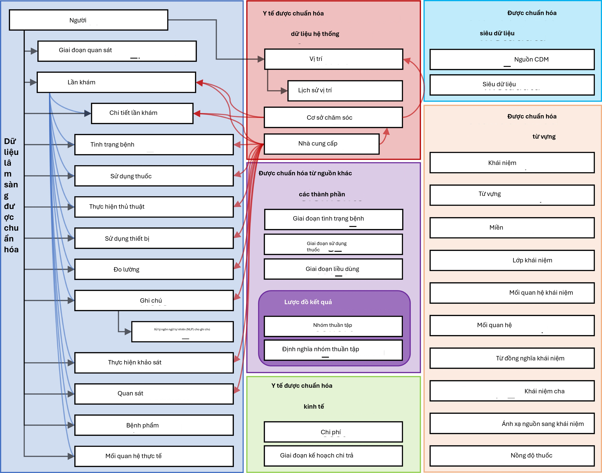
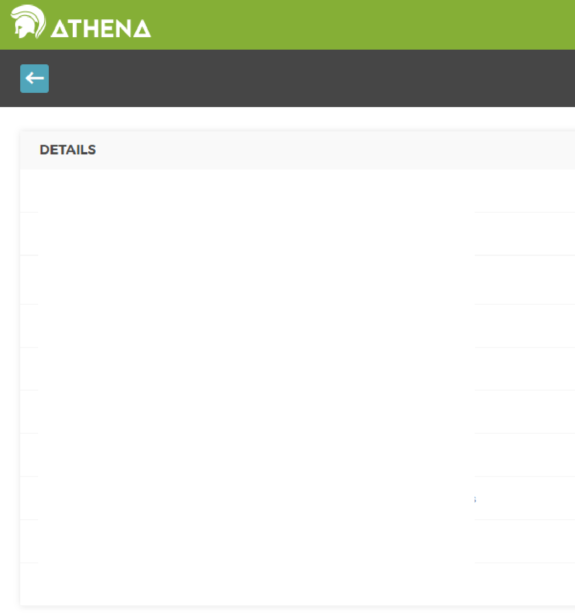
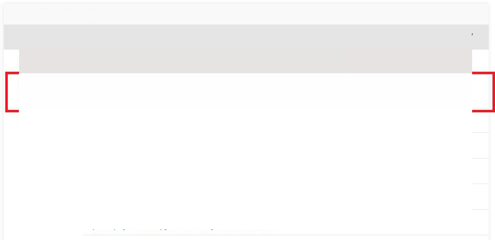

# Mô hình dữ liệu chung

*Trưởng chương: Clair Blacketer*

Dữ liệu quan sát cung cấp một cái nhìn về những gì xảy ra với bệnh
nhân trong khi nhận chăm sóc sức khỏe. Dữ liệu được thu thập và lưu
trữ cho số lượng bệnh nhân ngày càng lớn trên toàn thế giới tạo ra cái
thường được gọi là Dữ liệu sức khỏe lớn (Big Health Data). Mục đích
của các bộ sưu tập này có ba phần: (i) trực tiếp để tạo điều kiện
nghiên cứu (thường dưới dạng dữ liệu khảo sát hoặc đăng ký), hoặc (ii)
để hỗ trợ việc thực hiện chăm sóc sức khỏe (thường được gọi là EHR -
Hồ sơ sức khỏe điện tử) hoặc (iii) để quản lý việc thanh toán cho chăm
sóc sức khỏe (thường được gọi là dữ liệu yêu cầu thanh toán). Cả ba
đều thường xuyên được sử dụng cho nghiên cứu lâm sàng, hai loại sau là
dữ liệu sử dụng thứ cấp, và cả ba thường có định dạng và mã hóa nội
dung độc đáo riêng.

Tại sao chúng ta cần một Mô hình dữ liệu chung cho dữ liệu chăm sóc
sức khỏe quan sát?

Tùy thuộc vào nhu cầu chính của họ, không có cơ sở dữ liệu quan sát
nào nắm bắt tất cả các sự kiện lâm sàng tốt như nhau. Do đó, kết quả
nghiên cứu phải được rút ra từ nhiều nguồn dữ liệu khác nhau và được
so sánh và đối chiếu để hiểu tác động của thiên kiến nắm bắt tiềm ẩn.
Ngoài ra, để đưa ra kết luận với sức mạnh thống kê, chúng ta cần số
lượng lớn bệnh nhân được quan sát. Điều đó giải thích nhu cầu đánh giá
và phân tích đồng thời nhiều nguồn dữ liệu. Để làm được điều đó, dữ
liệu cần được hài hòa thành một tiêu chuẩn dữ liệu chung. Ngoài ra, dữ
liệu bệnh nhân yêu cầu mức độ bảo vệ cao. Để trích xuất dữ liệu cho
mục đích phân tích như cách làm truyền thống đòi hỏi các thỏa thuận sử
dụng dữ liệu nghiêm ngặt và kiểm soát truy cập phức tạp. Một tiêu
chuẩn dữ liệu chung có thể làm giảm bớt nhu cầu này bằng cách bỏ qua
bước trích xuất và cho phép một phân tích chuẩn hóa được thực thi trên
dữ liệu trong môi trường gốc của nó - phân tích đến với dữ liệu thay
vì dữ liệu đến với phân tích.

Tiêu chuẩn này được cung cấp bởi Mô hình dữ liệu chung (CDM). CDM, kết
hợp với nội dung chuẩn hóa của nó (xem Chương 5), sẽ đảm bảo rằng các
phương pháp nghiên cứu có thể được áp dụng một cách hệ thống để tạo ra
các kết quả có thể so sánh và tái tạo một cách có ý nghĩa. Trong
chương này, chúng tôi cung cấp tổng quan về chính mô hình dữ liệu,
thiết kế, các quy ước và thảo luận về các bảng được chọn.

Tổng quan về tất cả các bảng trong CDM được
cung cấp trong Hình 4.1.

{width="5.252498906386702in"
height="4.13125in"}

Hình 4.1: Tổng quan về tất cả các bảng trong CDM phiên bản 6.0. Lưu ý
rằng không phải tất cả các mối quan hệ giữa các bảng đều được hiển
thị.

1.  *Nguyên tắc thiết kế 33*

## Nguyên tắc thiết kế

CDM được tối ưu hóa cho các mục đích nghiên cứu quan sát điển hình của

- Xác định các quần thể bệnh nhân với các can thiệp chăm sóc sức khỏe
nhất định (tiếp xúc thuốc, thủ thuật, thay đổi chính sách chăm sóc sức
khỏe, v.v.) và các kết quả (tình trạng, thủ thuật, các tiếp xúc thuốc
khác, v.v.),

- Đặc điểm hóa các quần thể bệnh nhân này cho các tham số khác nhau như
thông tin nhân khẩu học, lịch sử tự nhiên của bệnh, cung cấp dịch vụ
chăm sóc sức khỏe, sử dụng và chi phí, bệnh tật, các phương pháp điều
trị và trình tự điều trị, v.v.,

- Dự đoán sự xuất hiện của các kết quả này ở từng bệnh nhân riêng lẻ -
xem Chương 13,

- Ước tính tác động của các can thiệp này đối với một quần thể - xem
Chương 12,

Để đạt được mục tiêu này, việc phát triển CDM tuân theo các yếu tố
thiết kế sau:

- **Sự phù hợp với mục đích&#58; CDM nhằm cung cấp dữ liệu được tổ chức theo
cách tối ưu cho phân tích, thay vì cho mục đích giải quyết các nhu cầu
vận hành của các nhà cung cấp dịch vụ chăm sóc sức khỏe hoặc người trả
tiền.**

- **Bảo vệ dữ liệu&#58; Tất cả dữ liệu có thể gây nguy hiểm cho danh tính và
sự bảo vệ của bệnh nhân, chẳng hạn như tên, ngày sinh chính xác, v.v.
đều bị hạn chế. Các trường hợp ngoại lệ có thể xảy ra khi nghiên cứu
yêu cầu rõ ràng thông tin chi tiết hơn, chẳng hạn như ngày sinh chính
xác cho việc nghiên cứu trẻ sơ sinh.**

- **Thiết kế các miền&#58; Các miền được mô hình hóa trong một mô hình dữ
liệu quan hệ lấy con người làm trung tâm, nơi đối với mỗi bản ghi,
danh tính của người đó và ngày tháng được ghi lại như một mức tối
thiểu. Ở đây, mô hình dữ liệu quan hệ là mô hình trong đó dữ liệu được
đại diện dưới dạng một tập hợp các bảng được liên kết bởi các khóa
chính và khóa ngoại.**

- **Cơ sở cho các miền&#58; Các miền được xác định và định nghĩa riêng biệt
trong một mô hình thực thể-mối quan hệ nếu chúng có một trường hợp sử
dụng phân tích (ví dụ: các tình trạng) và miền đó có các thuộc tính cụ
thể không áp dụng theo cách khác. Tất cả các dữ liệu khác có thể được
bảo tồn dưới dạng quan sát trong bảng quan sát trong cấu trúc thực
thể-thuộc tính-giá trị.**

- **Từ vựng chuẩn hóa&#58; Để chuẩn hóa nội dung của các bản ghi đó, CDM dựa
vào các Từ vựng chuẩn hóa chứa tất cả các khái niệm chăm sóc sức khỏe
tiêu chuẩn tương ứng cần thiết và phù hợp.**

- **Tái sử dụng các từ vựng hiện có: Nếu có thể, các khái niệm này được
tận dụng từ các tổ chức hoặc sáng kiến định nghĩa từ vựng hoặc tiêu
chuẩn hóa quốc gia hoặc ngành, chẳng hạn như Thư viện Y học Quốc gia,
Bộ Cựu chiến binh, Trung tâm Kiểm soát và Phòng ngừa Dịch bệnh, v.v.**

- **Duy trì mã nguồn&#58; Mặc dù tất cả các mã đều được ánh xạ sang Từ vựng
chuẩn hóa, mô hình cũng lưu trữ mã nguồn gốc để đảm bảo không có thông
tin nào bị mất.**

- **Tính trung lập về công nghệ: CDM không yêu cầu một công nghệ cụ thể.
Nó có thể được hiện thực hóa trong bất kỳ cơ sở dữ liệu quan hệ nào,
chẳng hạn như Oracle, SQL Server, v.v., hoặc dưới dạng các tập dữ liệu
phân tích SAS.**

- **Khả năng mở rộng&#58; CDM được tối ưu hóa cho xử lý dữ liệu và phân tích
tính toán để đáp ứng các nguồn dữ liệu có kích thước khác nhau, bao
gồm các cơ sở dữ liệu với tối đa**

hàng trăm triệu người và hàng tỷ quan sát lâm sàng.

- **Khả năng tương thích ngược&#58; Tất cả các thay đổi từ các CDM trước đây
đều được nêu rõ trong kho lưu trữ github
(https://github.com/OHDSI/CommonDataModel). Các phiên bản cũ hơn của
CDM có thể dễ dàng được tạo từ phiên bản hiện tại, và không có thông
tin nào bị mất vốn đã có trước đây.**

## Các quy ước mô hình dữ liệu

Có một số quy ước ngầm định và rõ ràng đã được áp dụng trong CDM. Các
nhà phát triển các phương pháp chạy trên CDM cần phải hiểu các quy ước
này.

### Các quy ước chung của mô hình

CDM được coi là một mô hình "lấy con người làm trung tâm", nghĩa là
tất cả các bảng Sự kiện lâm sàng đều được liên kết với bảng PERSON.
Cùng với ngày tháng hoặc ngày bắt đầu, điều này cho phép một cái nhìn
dọc về tất cả các Sự kiện liên quan đến chăm sóc sức khỏe theo từng
người. Các ngoại lệ đối với quy tắc này là các bảng dữ liệu hệ thống y
tế chuẩn hóa, được liên kết trực tiếp với các Sự kiện của các miền
khác nhau.

### Các quy ước chung của các lược đồ

Các lược đồ (schemas), hoặc người dùng cơ sở dữ liệu trong một số hệ
thống, cho phép phân tách giữa các bảng chỉ đọc và đọc-ghi. Các bảng
Sự kiện lâm sàng và từ vựng nằm trong lược đồ "CDM" và được coi là chỉ
đọc đối với người dùng cuối hoặc công cụ phân tích. Các bảng cần được
thao tác bởi các công cụ dựa trên web hoặc người dùng cuối được lưu
trữ trong lược đồ "Results". Hai bảng trong lược đồ "Results" là
COHORT và COHORT_DEFINITION. Các bảng này nhằm mô tả các nhóm quan tâm
mà người dùng có thể xác định, như được trình bày chi tiết trong
Chương

10\. Các bảng này có thể được ghi vào, nghĩa là một nhóm thuần tập có
thể được lưu trữ trong bảng COHORT tại thời điểm chạy. Vì chỉ có một
lược đồ đọc-ghi cho tất cả người dùng, việc tổ chức và kiểm soát quyền
truy cập của nhiều người dùng phụ thuộc vào việc triển khai CDM.

### Các quy ước chung của các bảng dữ liệu

CDM là độc lập với nền tảng. Các kiểu dữ liệu được định nghĩa chung
bằng các kiểu dữ liệu ANSI SQL (VARCHAR, INTEGER, FLOAT, DATE,
DATETIME, CLOB). Độ chính xác chỉ được cung cấp cho VARCHAR. Nó phản
ánh độ dài chuỗi tối thiểu cần thiết, nhưng có thể được mở rộng trong
một lần khởi tạo CDM cụ thể. CDM không quy định định dạng ngày và ngày
giờ. Các truy vấn tiêu chuẩn đối với CDM có thể thay đổi cho các phiên
bản cục bộ và cấu hình ngày/ngày giờ.

*Lưu ý: Mặc dù bản thân mô hình dữ liệu là độc lập với nền tảng, nhiều
công cụ được xây dựng để làm việc với nó yêu cầu các thông số kỹ thuật
nhất định. Để biết thêm về điều này, vui lòng xem Chương 8.*

### Các quy ước chung của các miền

Các sự kiện có bản chất khác nhau được tổ chức thành các Miền. Các Sự
kiện này được lưu trữ trong các bảng và trường cụ thể theo Miền, và
được đại diện bởi các Khái niệm Chuẩn cũng cụ thể theo Miền như được
định nghĩa trong Từ vựng chuẩn hóa (xem phần 5.2.3). Mỗi Khái niệm
Chuẩn có một nhiệm vụ Miền duy nhất, xác định bảng mà chúng được ghi
lại. Mặc dù nhiệm vụ Miền chính xác là chủ đề gây tranh cãi trong cộng
đồng, quy tắc tương ứng Miền-bảng-trường nghiêm ngặt này đảm bảo rằng
luôn có một vị trí không mơ hồ cho bất kỳ mã hoặc khái niệm nào. Ví
dụ, các Khái niệm về dấu hiệu, triệu chứng và chẩn đoán thuộc về Miền
Tình trạng, và được ghi lại trong CONDITION_CONCEPT_ID của bảng
CONDITION_OCCURRENCE. Các cái gọi là Thuốc Thủ thuật thường được ghi
lại dưới dạng mã thủ thuật trong một bảng thủ thuật trong dữ liệu
nguồn. Trong CDM, các bản ghi này được tìm thấy trong bảng
DRUG_EXPOSURE vì các Khái niệm Chuẩn được ánh xạ có nhiệm vụ Miền là
Thuốc. Có tổng cộng 30 Miền, như được hiển thị trong bảng 4.1.

Bảng 4.1: Số lượng các khái niệm chuẩn thuộc về mỗi miền.

***
Số lượng   ID miền         Số lượng    ID miền
khái niệm                  khái niệm
---------- --------------- ----------- ---------------
1731378    Thuốc           183         Đường dùng

477597     Thiết bị        180         Tiền tệ

257000     Thủ thuật       158         Bên chi trả

163807     Tình trạng      123         Lần khám

145898     Quan sát        51          Chi phí

89645      Đo lường        50          Chủng tộc

33759      Vị trí giải     13          Lý do dừng kế
phẫu mẫu                    hoạch

17302      Giá trị đo      11          Kế hoạch
lường

1799       Mẫu bệnh phẩm   6           Đợt điều trị

1215       Chuyên khoa nhà 6           Nhà tài trợ
cung cấp

1046       Đơn vị          5           Toán tử giá trị
đo lường

944        Siêu dữ liệu    3           Tình trạng bệnh
của mẫu

538        Mã doanh thu    2           Giới tính

336        Khái niệm loại  2           Dân tộc

194        Mối quan hệ     1           Loại quan sát
***

### Đại diện nội dung thông qua các Khái niệm

Trong các bảng dữ liệu CDM, nội dung của mỗi bản ghi được chuẩn hóa
hoàn toàn và đại diện thông qua các Khái niệm. Các Khái niệm được lưu
trữ trong các bảng Sự kiện với các giá trị CONCEPT_ID của chúng, là
các khóa ngoại đến bảng CONCEPT, đóng vai trò là bảng tham chiếu
chung. Tất cả các phiên bản CDM sử dụng cùng một bảng CONCEPT làm tham
chiếu của các Khái niệm, cùng với Mô hình dữ liệu chung là một cơ chế
chính của khả năng tương tác và là nền tảng của mạng lưới nghiên cứu
OHDSI. Nếu một Khái niệm Chuẩn không tồn tại hoặc không thể xác định
được, giá trị của CONCEPT_ID được đặt thành 0, đại diện cho một khái
niệm không tồn tại, một giá trị không xác định hoặc không thể ánh xạ.

Các bản ghi trong bảng CONCEPT chứa thông tin chi tiết về từng khái
niệm (tên, miền, lớp, v.v.). Các Khái niệm, Mối quan hệ Khái niệm, Tổ
tiên Khái niệm và thông tin khác liên quan đến Khái niệm được chứa
trong các bảng của Từ vựng chuẩn hóa (xem Chương 5).

### Các quy ước đặt tên chung của các trường

Tên biến trên tất cả các bảng tuân theo một quy ước:

Bảng 4.2: Các quy ước tên trường.

Ký hiệu Mô tả

\[Event\]\_ID Định danh duy nhất cho mỗi bản ghi, đóng vai trò là các
khóa ngoại thiết lập mối quan hệ giữa các bảng Sự kiện. Ví dụ,
PERSON_ID xác định duy nhất từng cá nhân. VISIT_OCCURRENCE_ID xác định
duy nhất một Chuyến thăm.

\[Event\]\_CONCEPT_ID Khóa ngoại đến một bản ghi Khái niệm Chuẩn trong

bảng tham chiếu CONCEPT. Đây là đại diện chính của Sự kiện, đóng vai
trò là cơ sở chính cho tất cả các phân tích chuẩn hóa. Ví dụ,
CONDITION_CONCEPT_ID = 31967 chứa giá trị tham chiếu cho khái niệm
SNOMED về "Buồn nôn".

\[Event\]\_SOURCE

\_CONCEPT_ID

Khóa ngoại đến một bản ghi trong bảng tham chiếu CONCEPT. Khái niệm
này tương đương với Giá trị Nguồn (bên dưới), và nó có thể tình cờ là
một Khái niệm Chuẩn, tại thời điểm đó nó sẽ giống hệt với
\[Event\]\_CONCEPT_ID, hoặc một khái niệm không chuẩn khác. Ví dụ,
CONDITION_SOURCE_CONCEPT_ID =

45431665 biểu thị khái niệm "Buồn nôn" trong thuật ngữ Read, và
CONDITION_CONCEPT_ID tương tự là Khái niệm SNOMED-CT Chuẩn 31967. Việc
sử dụng các Khái niệm Nguồn cho các ứng dụng phân tích chuẩn không
được khuyến khích vì chỉ các Khái niệm Chuẩn mới thể hiện nội dung ngữ
nghĩa của một Sự kiện theo cách không mơ hồ và do đó các Khái niệm
Nguồn không có khả năng tương tác.

Ký hiệu Mô tả

\[Event\]\_TYPE_CONCEPT_ID Khóa ngoại đến một bản ghi trong bảng tham
chiếu CONCEPT

đại diện cho nguồn gốc của thông tin nguồn, được chuẩn hóa trong Từ
vựng chuẩn hóa. Lưu ý rằng mặc dù tên trường này không phải là một
loại Sự kiện, hoặc loại Khái niệm, mà khai báo cơ chế nắm bắt đã tạo
ra bản ghi này. Ví dụ, DRUG_TYPE_CONCEPT_ID phân biệt liệu một bản ghi
Thuốc có được bắt nguồn từ một Sự kiện cấp phát trong nhà thuốc ("Cấp
phát nhà thuốc") hay từ một ứng dụng kê đơn điện tử ("Đơn thuốc đã
viết")

\[Event\]\_SOURCE_VALUE Mã nguyên văn hoặc chuỗi văn bản tự do phản
ánh cách

Sự kiện này được đại diện trong dữ liệu nguồn. Việc sử dụng nó không
được khuyến khích cho các ứng dụng phân tích chuẩn, vì các Giá trị
Nguồn này không được hài hòa giữa các nguồn dữ liệu. Ví dụ,
CONDITION_SOURCE_VALUE có thể chứa một bản ghi "78702", tương ứng với
mã ICD-9

787.02 được viết theo ký hiệu bỏ dấu chấm.

### Sự khác biệt giữa các Khái niệm và Giá trị Nguồn

Nhiều bảng chứa thông tin tương đương ở nhiều nơi: dưới dạng Giá trị
Nguồn, Khái niệm Nguồn và Khái niệm Chuẩn.

- **Các Giá trị Nguồn là đại diện gốc của một bản ghi Sự kiện trong dữ
liệu nguồn. Chúng có thể là các mã từ các hệ thống mã hóa được sử dụng
rộng rãi, thường là phạm vi công cộng, chẳng hạn như ICD9CM, NDC hoặc
Read, các hệ thống mã hóa độc quyền như CPT4, GPI hoặc MedDRA, hoặc
các từ vựng được kiểm soát chỉ được sử dụng trong dữ liệu nguồn, chẳng
hạn như F cho nữ và M cho nam. Chúng cũng có thể là các cụm từ văn bản
tự do ngắn không được chuẩn hóa và kiểm soát. Các Giá trị Nguồn được
lưu trữ trong các trường \[Event\]\_SOURCE_VALUE trong các bảng dữ
liệu.**

- **Các Khái niệm là các thực thể cụ thể của CDM chuẩn hóa ý nghĩa của
một sự kiện lâm sàng. Hầu hết các Khái niệm dựa trên các hệ thống mã
hóa công cộng hoặc độc quyền hiện có trong chăm sóc sức khỏe, trong
khi những khái niệm khác được tạo ra de-novo (CONCEPT_CODE bắt đầu
bằng "OMOP"). Các Khái niệm có các ID duy nhất trên tất cả các miền.**

- **Các Khái niệm Nguồn là các Khái niệm đại diện cho mã được sử dụng
trong nguồn. Các Khái niệm Nguồn chỉ được sử dụng cho các hệ thống mã
hóa công cộng hoặc độc quyền hiện có, không phải cho các Khái niệm do
OMOP tạo ra. Các Khái niệm Nguồn được lưu trữ trong trường
\[Event\]\_SOURCE_CONCEPT_ID trong các bảng dữ liệu.**

- **Các Khái niệm Chuẩn là những Khái niệm được sử dụng để xác định ý
nghĩa của một thực thể lâm sàng một cách duy nhất trên tất cả các cơ
sở dữ liệu và độc lập với hệ thống mã hóa được sử dụng trong các
nguồn. Các Khái niệm Chuẩn thường được rút ra từ các nguồn từ vựng
công cộng hoặc độc quyền hiện có.**

Các Khái niệm không chuẩn có ý nghĩa tương đương với một Khái niệm
Chuẩn có một ánh xạ đến Khái niệm Chuẩn trong Từ vựng chuẩn hóa. Các
Khái niệm Chuẩn được tham chiếu trong trường \[Event\]\_CONCEPT_ID của
các bảng dữ liệu.

Các Giá trị Nguồn chỉ được cung cấp cho mục đích thuận tiện và đảm bảo
chất lượng (QA). Chúng có thể chứa thông tin chỉ có ý nghĩa trong bối
cảnh của một nguồn dữ liệu cụ thể. Việc sử dụng các Giá trị Nguồn và
Khái niệm Nguồn là tùy chọn, mặc dù được khuyến khích mạnh mẽ nếu dữ
liệu nguồn sử dụng các hệ thống mã hóa. Tuy nhiên, các Khái niệm Chuẩn
là bắt buộc. Việc sử dụng bắt buộc các Khái niệm Chuẩn này là điều cho
phép tất cả các phiên bản CDM nói cùng một ngôn ngữ. Ví dụ, tình trạng
"Lao phổi" (TB, Hình 4.2) cho thấy mã ICD9CM cho TB là 011.

{width="4.0in"
height="4.266665573053368in"}

Hình 4.2: Mã ICD9CM cho Lao phổi

Nếu không có ngữ cảnh, mã 011 có thể được hiểu là "Bệnh nhân nội trú
(Bao gồm Medicare Phần A)" từ từ vựng UB04, hoặc là "U hệ thần kinh
không có biến chứng, bệnh đi kèm" từ từ vựng DRG. Đây là nơi các ID
Khái niệm, cả Nguồn và Chuẩn, trở nên có giá trị. Giá trị CONCEPT_ID
đại diện cho mã ICD9CM 011 là 44828631. Điều này phân biệt ICD9CM với
UBO4 và DRG. Khái niệm Nguồn TB ICD9CM ánh xạ sang Khái niệm Chuẩn
253954 từ SNOMED

từ vựng thông qua mối quan hệ \"Ánh xạ từ không chuẩn sang chuẩn
(OMOP)\" như được hiển thị trong hình 4.3. Mối quan hệ ánh xạ tương tự
cũng tồn tại đối với các mã Read, ICD10, CIEL và MeSH, cùng nhiều mã
khác, để đảm bảo rằng bất kỳ nghiên cứu nào tham chiếu đến khái niệm
SNOMED chuẩn đều chắc chắn bao gồm tất cả các mã nguồn được hỗ trợ.

{width="5.31in"
height="2.581874453193351in"}

Hình 4.3: Mã SNOMED cho bệnh Lao phổi

Một ví dụ về cách mô tả mối quan hệ giữa Khái niệm chuẩn và Khái niệm
nguồn được hiển thị trong Bảng 4.7.

## Các bảng chuẩn hóa CDM

CDM chứa 16 bảng Sự kiện lâm sàng, 10 bảng Từ vựng, 2 bảng siêu dữ
liệu, 4 bảng dữ liệu hệ thống y tế, 2 bảng dữ liệu kinh tế y tế, 3
phần tử dẫn xuất chuẩn hóa và 2 bảng lược đồ Kết quả. Các bảng này
được quy định đầy đủ trong CDM Wiki.1

Để minh họa cách các bảng này được sử dụng trong thực tế, dữ liệu của
một cá nhân sẽ được sử dụng làm sợi chỉ xuyên suốt phần còn lại của
chương.

### Ví dụ thực tế: Lạc nội mạc tử cung

Lạc nội mạc tử cung là một tình trạng đau đớn, trong đó các tế bào
thường được tìm thấy trong niêm mạc tử cung của phụ nữ lại xuất hiện ở
những nơi khác trong cơ thể. Các trường hợp nghiêm trọng có thể dẫn
đến vô sinh, các vấn đề về ruột và bàng quang. Các phần sau đây sẽ
trình bày chi tiết trải nghiệm của một bệnh nhân với căn bệnh này và
cách nó có thể được thể hiện trong Mô hình dữ liệu chung (CDM).

^1^<https://github.com/OHDSI/CommonDataModel/wiki>

{width="2.6640616797900263in"
height="1.7728116797900262in"}

Mỗi bước trong hành trình đau đớn này, tôi phải thuyết phục mọi người
rằng mình đang đau đớn đến mức nào.

Lauren đã gặp phải các triệu chứng lạc nội mạc tử cung trong nhiều
năm; tuy nhiên, phải đến khi một u nang trong buồng trứng bị vỡ, cô
mới được chẩn đoán. Bạn có thể đọc thêm về Lauren tại
https://endometriosis-uk.org/laurens-story.

### Bảng PERSON (Người)

#### Chúng ta biết gì về Lauren?

- Cô ấy là một phụ nữ 36 tuổi

- Ngày sinh của cô ấy là 12-03-1982

- Cô ấy là người da trắng

- Cô ấy là người Anh

Với suy nghĩ đó, bảng PERSON của cô ấy có thể trông như thế này:

Bảng 4.3: Bảng PERSON.

Tên cột Giá trị Giải thích

PERSON_ID 1 PERSON_ID phải là một số nguyên,

lấy trực tiếp từ nguồn hoặc được tạo ra như một phần của quá trình xây
dựng.

GENDER_CONCEPT_ID 8532 ID khái niệm chỉ giới tính nữ

là 8532.

YEAR_OF_BIRTH 1982

MONTH_OF_BIRTH 3

DAY_OF_BIRTH 12

BIRTH_DATETIME 1982-03-12

00:00:00

Khi không biết thời gian cụ thể, nửa đêm sẽ được sử dụng.

DEATH_DATETIME

Tên cột Giá trị Giải thích

RACE_CONCEPT_ID 8527 ID khái niệm chỉ chủng tộc da trắng là

8527\. Sắc tộc Anh là 4093769. Cả hai đều đúng, cái sau sẽ được gộp
vào cái trước. Lưu ý rằng sắc tộc được lưu trữ ở đây như một phần của
Chủng tộc, không phải trong ETHNICITY_CONCEPT_ID

ETHNICITY_CONCEPT\_ 38003564 Đây là ký hiệu điển hình của Hoa Kỳ để
phân biệt

ID người gốc Tây Ban Nha với những người còn lại. Sắc tộc, trong
trường hợp này là người Anh, được lưu trữ trong RACE_CONCEPT_ID. Bên
ngoài Hoa Kỳ, điều này không được sử dụng. 38003564 đề cập đến \"Không
phải người gốc Tây Ban Nha\".

LOCATION_ID Địa chỉ của cô ấy không được biết.

PROVIDER_ID Nhà cung cấp dịch vụ chăm sóc chính của cô ấy không được
biết.

CARE_SITE Cơ sở chăm sóc chính của cô ấy không được biết.

PERSON_SOURCE\_ VALUE

Giới tính_SOURCE\_ VALUE Giới tính_SOURCE\_ CONCEPT_ID

RACE_SOURCE\_ VALUE RACE_SOURCE\_ CONCEPT_ID ETHNICITY_SOURCE\_ VALUE
ETHNICITY_SOURCE\_ CONCEPT_ID

1 Thông thường đây sẽ là mã định danh của cô ấy trong dữ liệu nguồn,
mặc dù thường nó giống với PERSON_ID.

F Giá trị giới tính như xuất hiện trong nguồn được lưu trữ ở đây.

0 Nếu giá trị giới tính trong nguồn được mã hóa bằng cách sử dụng hệ
thống mã hóa được OHDSI hỗ trợ, Khái niệm đó sẽ nằm ở đây. Ví dụ, nếu
giới tính của cô ấy là \"sex-F\" trong nguồn và được xác định là thuộc
từ vựng PCORNet, khái niệm 44814665 sẽ đi vào trường này.

white Giá trị chủng tộc như xuất hiện trong nguồn được lưu trữ ở đây.

0 Nguyên tắc tương tự như GENDER_SOURCE_CONCEPT_ID.

english Giá trị sắc tộc như xuất hiện trong nguồn được lưu trữ ở đây.

0 Nguyên tắc tương tự như GENDER_SOURCE_CONCEPT_ID.

3.  Bảng OBSERVATION_PERIOD (Thời kỳ quan sát)

Bảng OBSERVATION_PERIOD được thiết kế để xác định khoảng thời gian mà
ít nhất các thông tin về nhân khẩu học, tình trạng bệnh, thủ thuật và
thuốc của bệnh nhân được ghi lại trong hệ thống nguồn với kỳ vọng về
độ nhạy và độ đặc hiệu hợp lý. Đối với dữ liệu bảo hiểm, đây thường là
thời gian đăng ký của bệnh nhân. Điều này phức tạp hơn trong hồ sơ sức
khỏe điện tử (EHR), vì hầu hết các hệ thống chăm sóc sức khỏe không
xác định được cơ sở

hoặc nhà cung cấp dịch vụ chăm sóc sức khỏe nào đã được thăm khám.
Giải pháp tốt nhất tiếp theo, thường là bản ghi đầu tiên trong hệ
thống được coi là Ngày bắt đầu của Thời kỳ Quan sát và bản ghi mới
nhất được coi là Ngày kết thúc.

#### Thời kỳ quan sát của Lauren được xác định như thế nào?

Giả sử thông tin của Lauren như hiển thị trong Bảng 4.4 được ghi lại
giống như trong hệ thống EHR. Các lần gặp mặt của cô ấy mà từ đó Thời
kỳ Quan sát được rút ra là:

Bảng 4.4: Các lần gặp mặt chăm sóc sức khỏe của Lauren.

***
ID lần    Ngày bắt đầu Ngày kết     Loại
gặp                    thúc
--------- ------------ ------------ --------
70        2010-01-06   2010-01-06   ngoại
trú

80        2011-01-06   2011-01-06   ngoại
trú

90        2012-01-06   2012-01-06   ngoại
trú

100       2013-01-07   2013-01-07   ngoại
trú

101       2013-01-14   2013-01-14   điều trị
ngoại
trú

102       2013-01-17   2013-01-24   nội trú
***

Dựa trên các bản ghi gặp mặt, bảng OBSERVATION_PERIOD của cô ấy có thể
trông như thế này:

Bảng 4.5: Bảng OBSERVATION_PERIOD.

Tên cột Giá trị Giải thích

QUAN SÁT\_ PERIOD_ID

1 Đây thường là một giá trị tự động tạo ra, tạo nên một mã định danh
duy nhất cho mỗi bản ghi trong bảng.

PERSON_ID 1 Đây là khóa ngoại dẫn đến bản ghi của Laura trong

bảng PERSON và liên kết PERSON với bảng OBSERVATION_PERIOD.

OBSERVATION_PERIOD_2010-01-06 Đây là ngày bắt đầu của lần gặp mặt sớm
nhất

START_DATE của cô ấy trong hồ sơ.

OBSERVATION_PERIOD_2013-01-24 Đây là ngày kết thúc của lần gặp mặt mới
nhất

END_DATE PERIOD_TYPE\_ CONCEPT_ID

trong hồ sơ.

44814725 Lựa chọn tốt nhất trong Từ vựng với lớp khái niệm "Obs Period
Type" là 44814724, viết tắt của "Thời kỳ bao gồm các lần gặp mặt chăm
sóc sức khỏe".

4.  VISIT_OCCURRENCE

Bảng VISIT_OCCURRENCE chứa thông tin về các lần gặp mặt của bệnh nhân
với hệ thống chăm sóc sức khỏe. Trong thuật ngữ OHDSI, các lần này
được gọi là Lần thăm khám (Visits) và được

coi là các sự kiện riêng biệt. Có 12 danh mục cấp cao nhất về Lần thăm
khám với hệ thống phân cấp mở rộng, mô tả nhiều hoàn cảnh khác nhau mà
dịch vụ chăm sóc sức khỏe có thể được cung cấp. Các Lần thăm khám phổ
biến nhất được ghi lại là nội trú, ngoại trú, khoa cấp cứu và các Lần
thăm khám tại cơ sở phi y tế.

#### Các lần gặp mặt của Lauren được thể hiện như thế nào dưới dạng Lần thăm khám?

Ví dụ, hãy thể hiện lần gặp mặt nội trú trong Bảng 4.4 trong bảng
VISIT_OCCURRENCE.

Bảng 4.6: bảng VISIT_OCCURRENCE.

Tên cột Giá trị Giải thích

VISIT_OCCURRENCE\_ ID

514 Đây thường là một giá trị tự động tạo ra, tạo nên một mã định danh
duy nhất cho mỗi bản ghi.

PERSON_ID 1 Đây là khóa ngoại dẫn đến bản ghi của Laura trong

bảng PERSON và liên kết PERSON với VISIT_OCCURRENCE.

VISIT_CONCEPT_ID 9201 Khóa ngoại đề cập đến một Lần thăm khám

Nội trú là 9201.

VISIT_START_DATE 2013-01-17 Ngày bắt đầu của Lần thăm khám.

VISIT_START\_ DATETIME

2013-01-17

00:00:00

Ngày và giờ của Lần thăm khám. Thời gian không được biết, vì vậy nửa
đêm được sử dụng.

VISIT_END_DATE 2013-01-24 Ngày kết thúc của Lần thăm khám. Nếu đây là

một Lần thăm khám trong một ngày, ngày kết thúc phải khớp với ngày bắt
đầu.

VISIT_END_DATETIME 24-01-2013

00:00:00

Ngày và giờ kết thúc của Lần thăm khám. Thời gian không được biết, vì
vậy nửa đêm được sử dụng.

VISIT_TYPE\_ CONCEPT_ID

32034 Điều này cung cấp thông tin về

nguồn gốc của bản ghi Lần thăm khám, ví dụ: nó đến từ yêu cầu bảo
hiểm, hóa đơn bệnh viện, bản ghi EHR, v.v. Đối với ví dụ này, ID khái
niệm 32035 (\"Lần thăm khám bắt nguồn từ bản ghi gặp mặt EHR\") được
sử dụng vì các lần gặp mặt tương tự như Hồ sơ sức khỏe điện tử

PROVIDER_ID\* NULL Nếu bản ghi gặp mặt có nhà cung cấp

liên quan, ID cho nhà cung cấp đó sẽ đi vào trường này. Đây phải là
nội dung của trường PROVIDER_ID từ bảng PROVIDER.

Tên cột Giá trị Giải thích

CARE_SITE_ID NULL Nếu bản ghi gặp mặt có Cơ sở chăm sóc

liên quan, ID cho Cơ sở chăm sóc đó sẽ đi vào trường này. Đây phải là
CARE_SITE_ID từ bảng CARE_SITE.

VISIT_SOURCE\_ VALUE VISIT_SOURCE\_ CONCEPT_ID

ADMITTED_FROM\_ CONCEPT_ID

ADMITTED_FROM\_ SOURCE_CONCEPT_ID

DISCHARGE_TO\_ CONCEPT_ID

DISCHARGE_TO\_ SOURCE_VALUE

PRECEDING_VISIT\_ OCCURRENCE_ID

inpatient Giá trị Lần thăm khám như xuất hiện trong nguồn đi vào đây.
Dữ liệu của Lauren không có thông tin đó.

0 Nếu giá trị Lần thăm khám từ nguồn được mã hóa bằng từ vựng được
OHDSI công nhận, giá trị CONCEPT_ID đại diện cho mã nguồn sẽ được tìm
thấy ở đây. Dữ liệu của Lauren không có thông tin đó.

0 Nếu biết, trường này chứa một Khái niệm đại diện cho nơi bệnh nhân
được nhập viện từ đó. Khái niệm này phải có miền \"Lần thăm khám\". Ví
dụ, nếu bệnh nhân được nhập viện từ nhà, nó sẽ chứa 8536 (\"Nhà\").

NULL Đây là giá trị từ nguồn

đại diện cho nơi bệnh nhân được nhập viện từ đó. Sử dụng ví dụ trên,
đây sẽ là \"nhà\".

0 Nếu biết, trường này đề cập đến một Khái niệm đại diện cho nơi bệnh
nhân được xuất viện đến. Khái niệm này phải có miền \"Lần thăm khám\".
Ví dụ, nếu một bệnh nhân được xuất viện đến một cơ sở hỗ trợ sinh
hoạt, ID khái niệm sẽ là 8615 (\"Cơ sở hỗ trợ sinh hoạt\").

0 Đây là giá trị từ nguồn đại diện cho nơi bệnh nhân được xuất viện
đến. Sử dụng ví dụ trên, đây sẽ là \"Cơ sở hỗ trợ sinh hoạt\".

NULL Điều này biểu thị Lần thăm khám ngay

trước lần hiện tại. Ngược lại với ADMITTED_FROM_CONCEPT_ID, điều này

liên kết với bản ghi Lần thăm khám thực tế thay vì một Khái niệm Lần
thăm khám. Ngoài ra, lưu ý rằng không có bản ghi cho Lần thăm khám
tiếp theo, các Lần thăm khám chỉ được liên kết thông qua trường này.

- Một bệnh nhân có thể tương tác với nhiều Nhà cung cấp dịch vụ chăm sóc
sức khỏe trong một lần thăm khám, như

thường xảy ra với các ca nội trú. Những tương tác này có thể được ghi
lại trong bảng VISIT_DETAIL. Mặc dù không được đề cập sâu trong chương
này, bạn có thể đọc thêm về bảng VISIT_DETAIL trong wiki CDM.

1.  CONDITION_OCCURRENCE

Các bản ghi trong bảng CONDITION_OCCURRENCE là các chẩn đoán, dấu hiệu
hoặc triệu chứng của một tình trạng bệnh được Nhà cung cấp dịch vụ
quan sát hoặc được bệnh nhân báo cáo.

#### Tình trạng bệnh của Lauren là gì?

Xem lại lời kể của cô ấy, cô ấy nói:

Khoảng 3 năm trước, tôi nhận thấy chu kỳ kinh nguyệt của mình, vốn đã
đau đớn, ngày càng đau hơn. Tôi bắt đầu cảm thấy một cơn đau nhói ngay
cạnh đại tràng và cảm thấy đau nhức, đầy hơi quanh vùng xương cụt và
vùng chậu dưới. Chu kỳ kinh nguyệt của tôi trở nên đau đớn đến mức tôi
phải nghỉ làm 1-2 ngày mỗi tháng. Thuốc giảm đau đôi khi làm dịu cơn
đau, nhưng thường thì chúng không có tác dụng nhiều.

Mã SNOMED cho chứng đau bụng kinh, hay còn gọi là thống kinh, là
266599000. Bảng 4.7 cho thấy cách điều đó sẽ được thể hiện trong bảng
CONDITION_OCCURRENCE:

Bảng 4.7: Bảng CONDITION_OCCURRENCE.

Tên cột Giá trị Giải thích

ĐIỀU KIỆN\_ OCCURRENCE_ID

964 Đây thường là một giá trị tự động tạo ra, tạo nên một mã định danh
duy nhất cho mỗi bản ghi.

PERSON_ID 1 Đây là khóa ngoại dẫn đến bản ghi của Laura trong

bảng PERSON và liên kết PERSON với CONDITION_OCCURRENCE.

CONDITION\_ CONCEPT_ID CONDITION_START\_ DATE

194696 Khóa ngoại đề cập đến mã SNOMED 266599000: 194696.

2010-01-06 Ngày khi trường hợp Tình trạng bệnh

được ghi lại.

CONDITION_START\_ DATETIME

2010-01-06

00:00:00

Ngày và giờ khi trường hợp Tình trạng bệnh được ghi lại. Nửa đêm được
sử dụng vì thời gian không được biết.

CONDITION_END\_ DATE

CONDITION_END\_ DATETIME

NULL Đây là ngày khi trường hợp Tình trạng bệnh được coi là đã kết
thúc, nhưng điều này hiếm khi được ghi lại.

NULL Nếu biết, đây là ngày và giờ khi trường hợp Tình trạng bệnh được
coi là đã kết thúc.

Tên cột Giá trị Giải thích

CONDITION_TYPE\_ CONCEPT_ID

CONDITION_STATUS\_ CONCEPT_ID

32020 Cột này nhằm cung cấp

thông tin về nguồn gốc của bản ghi, ví dụ: nó đến từ yêu cầu bảo hiểm,
hóa đơn bệnh viện, bản ghi EHR, v.v. Đối với ví dụ này, khái niệm
32020 (\"Chẩn đoán gặp mặt EHR\") được sử dụng vì các lần gặp mặt
tương tự như hồ sơ sức khỏe điện tử. Các khái niệm trong trường này
phải thuộc từ vựng \"Condition Type\".

0 Nếu biết, điều này cho biết hoàn cảnh. Ví dụ, một tình trạng bệnh có
thể là chẩn đoán nhập viện, trong trường hợp đó ID khái niệm 4203942
đã được sử dụng.

STOP_REASON NULL Nếu biết, lý do mà Tình trạng bệnh

không còn hiện diện nữa, như được chỉ ra trong dữ liệu nguồn.

PROVIDER_ID NULL Nếu bản ghi tình trạng bệnh có nhà cung cấp

chẩn đoán được liệt kê, ID cho nhà cung cấp đó sẽ đi vào trường này.
Đây phải là provider_id từ bảng PROVIDER đại diện cho nhà cung cấp
trong lần gặp mặt.

VISIT_OCCURRENCE\_ ID

CONDITION_SOURCE\_ VALUE

509 Lần thăm khám (khóa ngoại dẫn đến VISIT_OCCURRENCE_ID trong

bảng VISIT_OCCURRENCE) trong đó Tình trạng bệnh được chẩn đoán.

266599000 Đây là giá trị nguồn ban đầu

đại diện cho Tình trạng bệnh. Trong trường hợp thống kinh của Lauren,
mã SNOMED cho Tình trạng đó được lưu trữ ở đây, trong khi Khái niệm
đại diện cho mã đó đi vào CONDITION_SOURCE_CONCEPT_ID

và Khái niệm chuẩn được ánh xạ từ đó được lưu trữ trong trường
CONDITION_CONCEPT_ID.

Tên cột Giá trị Giải thích

CONDITION_SOURCE\_ 194696 Nếu giá trị tình trạng từ nguồn

CONCEPT_ID

CONDITION_STATUS\_ SOURCE_VALUE

được mã hóa bằng từ vựng được OHDSI công nhận, ID khái niệm đại diện
cho giá trị đó sẽ đi vào đây. Trong ví dụ về thống kinh, giá trị nguồn
là mã SNOMED nên Khái niệm đại diện cho mã đó là 194696. Trong trường
hợp này, nó có cùng giá trị với trường CONDITION_CONCEPT_ID.

0 Nếu giá trị Trạng thái tình trạng từ nguồn được mã hóa bằng hệ thống
mã hóa được OHDSI hỗ trợ, khái niệm đó sẽ đi vào đây.

2.  DRUG_EXPOSURE (Sử dụng thuốc)

Bảng DRUG_EXPOSURE ghi lại các bản ghi về ý định hoặc việc thực tế đưa
một loại thuốc vào cơ thể bệnh nhân. Thuốc bao gồm thuốc kê đơn và
thuốc không kê đơn, vắc-xin và các liệu pháp sinh học phân tử lớn.
Việc tiếp xúc với thuốc được suy ra từ các sự kiện lâm sàng liên quan
đến đơn đặt hàng, đơn thuốc được viết, thuốc được cấp phát tại nhà
thuốc, quản lý thủ thuật và các thông tin khác do bệnh nhân báo cáo.

#### Việc sử dụng thuốc của Lauren được thể hiện như thế nào?

Để giúp giảm đau do thống kinh, Lauren đã được cho 60 viên nén uống
với 375 mg Acetaminophen (hay còn gọi là Paracetamol, ví dụ: được bán
tại Hoa Kỳ dưới mã NDC 69842087651) mỗi viên trong 30 ngày tại Lần
thăm khám vào ngày 06-01-2010. Đây là cách điều đó có thể trông như
thế nào trong bảng DRUG_EXPOSURE:

Bảng 4.8: Bảng DRUG_EXPOSURE.

Tên cột Giá trị Giải thích

DRUG_EXPOSURE_ID 1001 Đây thường là một giá trị tự động tạo ra

tạo nên một mã định danh duy nhất cho mỗi bản ghi.

PERSON_ID 1 Đây là khóa ngoại dẫn đến bản ghi của Laura trong

bảng PERSON và liên kết PERSON với DRUG_EXPOSURE.

DRUG_CONCEPT_ID 1127433 Khái niệm cho sản phẩm Thuốc. Mã

NDC cho acetaminophen ánh xạ tới mã RxNorm 313782, được đại diện bởi
Khái niệm 1127433.

DRUG_EXPOSURE\_ START_DATE

2010-01-06 Ngày bắt đầu tiếp xúc với Thuốc.

Tên cột Giá trị Giải thích

DRUG_EXPOSURE\_ START_DATETIME

2010-01-06

00:00:00

Ngày và giờ bắt đầu tiếp xúc với thuốc. Nửa đêm được sử dụng vì thời
gian không được biết.

DRUG_EXPOSURE\_ END_DATE

2010-02-05 Ngày kết thúc tiếp xúc với Thuốc.

Tùy thuộc vào các nguồn khác nhau, đây có thể là ngày đã biết hoặc
ngày được suy luận và biểu thị ngày cuối cùng bệnh nhân vẫn tiếp xúc
với thuốc. Trong trường hợp này, ngày này được suy luận vì chúng ta
biết Lauren đã có nguồn cung cấp trong 30 ngày.

DRUG_EXPOSURE\_ END_DATETIME

2010-02-05

00:00:00

Ngày và giờ kết thúc tiếp xúc với thuốc. Các quy tắc tương tự áp dụng
như đối với DRUG_EXPOSURE_END_DATE.

Nửa đêm được sử dụng vì thời gian không được biết.

VERBATIM_END_DATE NULL Nếu nguồn ghi lại một ngày kết thúc

thực tế rõ ràng. Ngày kết thúc được suy luận dựa trên giả định rằng
toàn bộ phạm vi ngày cung cấp đã được bệnh nhân sử dụng.

DRUG_TYPE\_ CONCEPT_ID

38000177 Cột này nhằm cung cấp

thông tin về nguồn gốc của bản ghi, ví dụ: nó đến từ yêu cầu bảo hiểm,
bản ghi đơn thuốc, v.v. Đối với ví dụ này, khái niệm 38000177 (\"Đơn
thuốc được viết\") được sử dụng.

STOP_REASON NULL Lý do việc sử dụng Thuốc

bị dừng lại. Các lý do bao gồm chế độ điều trị đã hoàn thành, đã thay
đổi, đã loại bỏ, v.v. Thông tin này rất hiếm khi được ghi lại.

REFILLS NULL Số lần cấp lại thuốc tự động sau đơn thuốc ban đầu là một
phần của hệ thống đơn thuốc ở nhiều quốc gia. Đơn thuốc ban đầu không
được tính, các giá trị bắt đầu bằng NULL. Trong trường hợp
acetaminophen của Lauren, cô ấy không có lần cấp lại nào nên giá trị
là NULL.

QUANTITY 60 Số lượng thuốc như được ghi lại trong

đơn thuốc hoặc bản ghi cấp phát ban đầu.

DAYS_SUPPLY 30 Số ngày cung cấp

thuốc như đã kê đơn.

Tên cột Giá trị Giải thích

SIG NULL Hướng dẫn (\"signetur\") trên đơn thuốc như được ghi lại
trong đơn thuốc hoặc bản ghi cấp phát ban đầu (và được in trên hộp
thuốc trong hệ thống đơn thuốc của Hoa Kỳ). Signeturs chưa được chuẩn
hóa trong CDM và được cung cấp nguyên văn.

ROUTE_CONCEPT_ID 4132161 Khái niệm này nhằm đại diện cho

đường dùng của Thuốc mà bệnh nhân đã tiếp xúc. Lauren dùng
acetaminophen bằng đường uống nên ID khái niệm 4132161 (\"Đường
uống\") được sử dụng.

LOT_NUMBER NULL Một mã định danh được gán cho một

số lượng hoặc lô sản phẩm Thuốc cụ thể từ nhà sản xuất. Thông tin này
hiếm khi được ghi lại.

PROVIDER_ID NULL Nếu bản ghi thuốc có nhà cung cấp kê đơn

Nếu có nhà cung cấp được liệt kê, ID của nhà cung cấp đó sẽ được đưa
vào trường này. Trong trường hợp đó, nó chứa PROVIDER_ID từ bảng
PROVIDER.

ID LƯỢT KHÁM

509 Khóa ngoại liên kết đến bảng VISIT_OCCURRENCE trong thời gian
Thuốc được kê đơn.

VISIT_DETAIL_ID NULL Khóa ngoại liên kết đến bảng VISIT_DETAIL

trong thời gian Thuốc được kê đơn.

GIÁ TRỊ NGUỒN THUỐC

ID KHÁI NIỆM NGUỒN THUỐC

GIÁ TRỊ NGUỒN ĐƯỜNG DÙNG

69842087651 Đây là mã nguồn của Thuốc như xuất hiện trong dữ liệu
nguồn. Trong trường hợp của Lauren, mã NDC được lưu trữ tại đây.

750264 Đây là Khái niệm đại diện cho giá trị nguồn thuốc. Khái niệm
750264 đại diện cho mã NDC của "Viên nén Acetaminophen 325 MG dùng
đường uống".

NULL Thông tin nguyên văn về đường dùng thuốc như được chi tiết trong
nguồn.

3.  SỰ KIỆN THỦ THUẬT

Bảng PROCEDURE_OCCURRENCE chứa các bản ghi về các hoạt động hoặc quy
trình được chỉ định hoặc thực hiện bởi Nhà cung cấp dịch vụ chăm sóc
sức khỏe trên bệnh nhân với mục đích chẩn đoán hoặc điều trị. Các thủ
thuật xuất hiện trong các nguồn dữ liệu khác nhau dưới nhiều hình thức
với các mức độ chuẩn hóa khác nhau. Ví dụ:

- Các yêu cầu thanh toán y tế bao gồm các mã thủ thuật được gửi như một
phần của yêu cầu thanh toán cho các dịch vụ y tế đã thực hiện, bao gồm
các thủ thuật đã được tiến hành.

- Hồ sơ sức khỏe điện tử ghi lại các thủ thuật dưới dạng các chỉ định.

#### Lauren đã thực hiện những thủ thuật nào?

Từ mô tả của cô ấy, chúng ta biết rằng cô ấy đã thực hiện siêu âm
buồng trứng trái vào ngày 14/01/2013, cho thấy một nang kích thước
4x5cm. Dưới đây là cách hiển thị dữ liệu đó trong bảng
PROCEDURE_OCCURRENCE:

Bảng 4.9: Bảng PROCEDURE_OCCURRENCE.

Tên cột Giá trị Giải thích

ID SỰ KIỆN THỦ THUẬT

1277 Đây thường là giá trị được tự động tạo để tạo ra một định danh
duy nhất cho mỗi bản ghi.

PERSON_ID 1 Đây là khóa ngoại liên kết đến bản ghi của Laura trong

bảng PERSON và liên kết PERSON với PROCEDURE_OCCURRENCE

ID KHÁI NIỆM THỦ THUẬT

4127451 Mã thủ thuật SNOMED cho siêu âm vùng chậu là 304435002, được
đại diện bởi Khái niệm 4127451.

PROCEDURE_DATE 2013-01-14 Ngày thực hiện Thủ thuật

được thực hiện.

NGÀY GIỜ THỦ THUẬT

2013-01-14

00:00:00

Ngày và giờ thực hiện thủ thuật. Nếu không rõ thời gian, mặc định sử
dụng 00:00 (nửa đêm).

ID KHÁI NIỆM LOẠI THỦ THUẬT

ID KHÁI NIỆM BỔ SUNG

38000275 Cột này nhằm cung cấp

thông tin về nguồn gốc của bản ghi thủ thuật, ví dụ: nó đến từ yêu cầu
bảo hiểm, chỉ định EHR, v.v. Đối với ví dụ này, ID khái niệm 38000275
("nhập danh mục chỉ định EHR") được sử dụng vì bản ghi thủ thuật này
đến từ một bản ghi EHR.

0 Đây là ID khái niệm đại diện cho yếu tố bổ trợ (modifier) trên thủ
thuật. Ví dụ, nếu bản ghi chỉ ra rằng một thủ thuật CPT4 được thực
hiện ở cả hai bên, thì ID khái niệm 42739579 ("Thủ thuật hai bên") sẽ
được sử dụng.

QUANTITY 0 Số lượng Thủ thuật được chỉ định hoặc

được thực hiện. Số lượng bị thiếu, số 0 và số 1 đều có cùng ý nghĩa.

Tên cột Giá trị Giải thích

PROVIDER_ID NULL Nếu bản ghi Thủ thuật có Nhà cung cấp

được liệt kê, ID cho Nhà cung cấp đó sẽ được đưa vào trường này. Đây
phải là khóa ngoại liên kết đến PROVIDER_ID từ bảng PROVIDER.

ID LƯỢT KHÁM

740 Nếu biết, đây là Lần khám (được đại diện là VISIT_occurrence_id
lấy từ bảng VISIT_OCCURRENCE) trong đó thủ thuật được thực hiện.

VISIT_DETAIL_ID NULL Nếu biết, đây là chi tiết Lần khám

(được đại diện là VISIT_detail_id lấy từ bảng VISIT_DETAIL) trong đó
thủ thuật được thực hiện.

PROCEDURE_SOURCE\_ 304435002 Mã hoặc thông tin cho Thủ thuật

VALUE như xuất hiện trong dữ liệu nguồn.

PROCEDURE_SOURCE_4127451 Đây là Khái niệm đại diện cho

GIÁ TRỊ NGUỒN BỔ SUNG ID KHÁI NIỆM

giá trị nguồn thủ thuật.

NULL Mã nguồn cho yếu tố bổ trợ như xuất hiện trong dữ liệu nguồn.

## Thông tin bổ sung

Chương này chỉ bao gồm một phần các bảng có sẵn trong CDM như các ví
dụ về cách dữ liệu được biểu diễn. Bạn được khuyến khích truy cập
trang wiki2 để biết thêm thông tin.

## Tóm tắt

{width="0.4455205599300088in"
height="0.4644783464566929in"}

- The CDM is designed to support a wide range of observational research
ac-tivities.

- The CDM is a person-centric model.

- The CDM not only standardizes the structure of the data, but through
the Stan-dardized Vocabularies it also standardizes the representation
of the content.

- Source codes are maintained in the CDM for full traceability.

[]{#_bookmark72
.anchor}^2^<https://github.com/OHDSI/CommonDataModel/wiki>

## Bài tập

#### Điều kiện tiên quyết

Đối với những bài tập đầu tiên này, bạn sẽ cần xem lại các bảng CDM đã
thảo luận trước đó và bạn sẽ phải tra cứu các khái niệm trong Từ vựng,
có thể thực hiện thông qua ATHENA3 hoặc ATLAS.4

**Bài tập 4.1. John là một người đàn ông Mỹ gốc Phi sinh ngày 4 tháng
8 năm 1974. Hãy xác định một mục trong bảng PERSON mã hóa thông tin
này.**

**Bài tập 4.2. John đăng ký bảo hiểm hiện tại vào ngày 1 tháng 1 năm
2015. Dữ liệu từ cơ sở dữ liệu bảo hiểm của anh ấy được trích xuất vào
ngày 1 tháng 7 năm 2019. Hãy xác định một mục trong bảng
OBSERVATION_PERIOD mã hóa thông tin này.**

**Bài tập 4.3. John được kê đơn sử dụng Ibuprofen 200 MG dạng viên nén
dùng đường uống trong 30 ngày (mã NDC: 76168009520) vào ngày 1 tháng 5
năm 2019. Hãy xác định một mục trong bảng DRUG_EXPOSURE mã hóa thông
tin này.**

#### Điều kiện tiên quyết

Đối với ba bài tập cuối này, chúng tôi giả định rằng R, R-Studio và
Java đã được cài đặt như mô tả trong Mục 8.4.5. Ngoài ra, cần có các
gói SqlRender, DatabaseConnector và Eunomia, có thể cài đặt bằng cách
sử dụng:

**install.packages**(**c**(\"SqlRender\", \"DatabaseConnector\",
\"remotes\")) remotes**::install_github**(\"ohdsi/Eunomia\", ref =
\"v1.0.0\")

Gói Eunomia cung cấp một tập dữ liệu mô phỏng trong CDM sẽ chạy trong
phiên R cục bộ của bạn. Chi tiết kết nối có thể được lấy bằng cách sử
dụng:

connectionDetails \<- Eunomia**::getEunomiaConnectionDetails**()

Lược đồ cơ sở dữ liệu CDM là "main". Đây là một ví dụ truy vấn SQL để
truy xuất một hàng của bảng CONDITION_OCCURRENCE:

**library**(DatabaseConnector)

connection \<- **connect**(connectionDetails) sql \<- \"SELECT \*

FROM \@cdm.condition_occurrence LIMIT 1;\"

result \<- **renderTranslateQuerySql**(connection, sql, cdm =
\"main\")

^3^<http://athena.ohdsi.org/>
^4^[http://atlas-demo.ohdsi.org](http://atlas-demo.ohdsi.org/)

**Bài tập 4.4. Sử dụng SQL và R, truy xuất tất cả các bản ghi của tình
trạng "Xuất huyết tiêu hóa" (với ID khái niệm 192671).**

**Bài tập 4.5. Sử dụng SQL và R, truy xuất tất cả các bản ghi của tình
trạng "Xuất huyết tiêu hóa" bằng cách sử dụng các mã nguồn. Cơ sở dữ
liệu này sử dụng ICD-10 và mã ICD-10 liên quan là "K92.2".**

**Bài tập 4.6. Sử dụng SQL và R, truy xuất khoảng thời gian quan sát
của người có PERSON_ID 61.**

Các câu trả lời gợi ý có thể được tìm thấy trong Phụ lục E.1.

