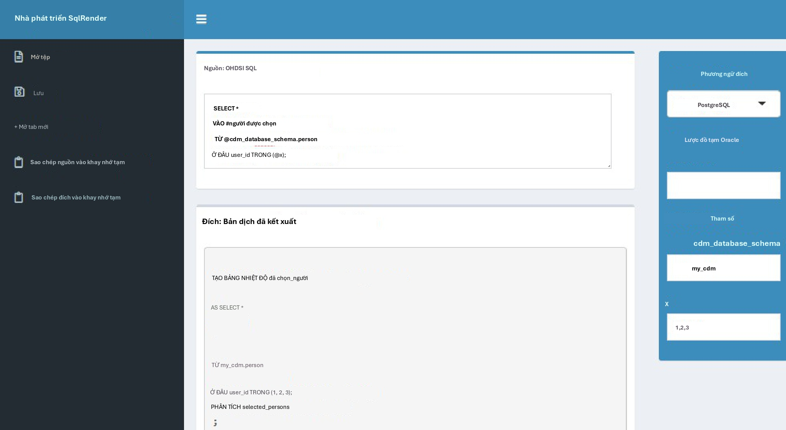
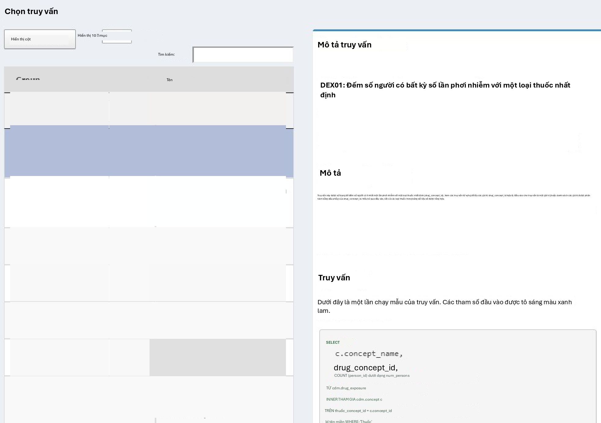
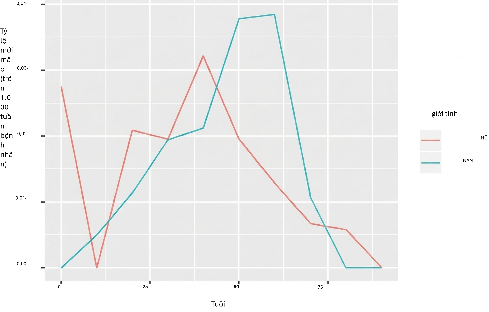

# SQL và R

*Dẫn chương: Martijn Schuemie & Peter Rijnbeek*

Mô hình dữ liệu chung (CDM) là một mô hình cơ sở dữ liệu quan hệ (tất
cả dữ liệu được biểu diễn dưới dạng các bản ghi trong các bảng có các
trường), có nghĩa là dữ liệu thường sẽ được lưu trữ trong một cơ sở dữ
liệu quan hệ sử dụng nền tảng phần mềm như PostgreSQL, Oracle hoặc
Microsoft SQL Server. Các công cụ OHDSI khác nhau như ATLAS và Thư
viện phương pháp hoạt động bằng cách truy vấn cơ sở dữ liệu phía sau,
nhưng chúng ta cũng có thể tự truy vấn cơ sở dữ liệu trực tiếp nếu
chúng ta có quyền truy cập thích hợp. Lý do chính để làm điều này là
để thực hiện các phân tích hiện không được hỗ trợ bởi bất kỳ công cụ
hiện có nào. Tuy nhiên, việc truy vấn trực tiếp cơ sở dữ liệu cũng đi
kèm với rủi ro mắc lỗi lớn hơn, vì các công cụ OHDSI thường được thiết
kế để giúp hướng dẫn người dùng phân tích dữ liệu một cách thích hợp.
Các truy vấn trực tiếp không cung cấp sự hướng dẫn như vậy.

Ngôn ngữ tiêu chuẩn để truy vấn cơ sở dữ liệu quan hệ là SQL (Ngôn ngữ
truy vấn có cấu trúc), có thể được sử dụng để truy vấn cơ sở dữ liệu
cũng như thực hiện các thay đổi đối với dữ liệu. Mặc dù các lệnh cơ
bản trong SQL thực sự là tiêu chuẩn, nghĩa là giống nhau trên các nền
tảng phần mềm, mỗi nền tảng lại có phương ngữ riêng với những thay đổi
tinh vi. Ví dụ, để truy xuất 10 hàng đầu của bảng PERSON trên SQL
Server, người ta sẽ gõ:

**SELECT** TOP 10 **\* FROM** person;

Trong khi truy vấn tương tự trên PostgreSQL sẽ là:

**SELECT \* FROM** person **LIMIT** 10;

Trong OHDSI, chúng tôi muốn không phụ thuộc vào phương ngữ cụ thể mà
một nền tảng sử dụng; chúng tôi muốn \'nói\' cùng một ngôn ngữ SQL
trên tất cả các cơ sở dữ liệu OHDSI. Vì lý do này, OHDSI đã phát triển
gói SqlRender, một gói R có thể dịch từ một phương ngữ tiêu chuẩn sang
bất kỳ phương ngữ được hỗ trợ nào sẽ được thảo luận sau trong chương
này. Phương ngữ tiêu chuẩn này - OHDSI SQL - chủ yếu là một tập hợp
con của phương ngữ SQL Server SQL.

Các câu lệnh SQL ví dụ được cung cấp trong
suốt chương này đều sẽ sử dụng OHDSI SQL.

Mỗi nền tảng cơ sở dữ liệu cũng đi kèm với các công cụ phần mềm riêng
để truy vấn cơ sở dữ liệu bằng SQL. Trong OHDSI, chúng tôi đã phát
triển gói DatabaseConnector, một gói R có thể kết nối với nhiều nền
tảng cơ sở dữ liệu. DatabaseConnector cũng sẽ được thảo luận sau trong
chương này.

Vì vậy, mặc dù người ta có thể truy vấn một cơ sở dữ liệu tuân thủ CDM
mà không cần sử dụng bất kỳ công cụ OHDSI nào, con đường được khuyến
nghị là sử dụng các gói DatabaseConnector và SqlRender. Điều này cho
phép các truy vấn được phát triển tại một trang web có thể được sử
dụng tại bất kỳ trang web nào khác mà không cần sửa đổi. Bản thân R
cũng ngay lập tức cung cấp các tính năng để phân tích thêm dữ liệu
được trích xuất từ cơ sở dữ liệu, chẳng hạn như thực hiện các phân
tích thống kê và tạo các biểu đồ (tương tác).

Trong chương này, chúng tôi giả định người đọc có hiểu biết cơ bản về
SQL. Trước tiên, chúng tôi xem xét cách sử dụng SqlRender và
DatabaseConnector. Nếu người đọc không có ý định sử dụng các gói này,
các phần này có thể được bỏ qua. Trong Phần 9.3, chúng tôi thảo luận
cách sử dụng SQL (trong trường hợp này là OHDSI SQL) để truy vấn CDM.
Phần tiếp theo nêu bật cách sử dụng Từ vựng chuẩn hóa OHDSI khi truy
vấn CDM. Chúng tôi làm nổi bật QueryLibrary, một tập hợp các truy vấn
thường được sử dụng trên CDM có sẵn công khai. Chúng tôi kết thúc
chương này với một nghiên cứu ví dụ ước tính tỷ lệ mắc bệnh và triển
khai nghiên cứu này bằng SqlRender và
DatabaseConnector.

## SqlRender

Gói SqlRender có sẵn trên CRAN (Mạng lưu trữ R toàn diện) và do đó có
thể được cài đặt bằng cách sử dụng:

**install.packages**(\"SqlRender\")

SqlRender hỗ trợ nhiều nền tảng kỹ thuật bao gồm các hệ thống cơ sở dữ
liệu truyền thống (PostgreSQL, Microsoft SQL Server, SQLite và
Oracle), kho dữ liệu song song (Microsoft APS, IBM Netezza và Amazon
Redshift), cũng như các nền tảng Dữ liệu lớn (Hadoop thông qua Impala
và Google BigQuery). Gói R đi kèm với hướng dẫn sử dụng gói và một
đoạn tài liệu khám phá đầy đủ chức năng. Ở đây chúng tôi mô tả một số
tính năng chính.

### Tham số hóa SQL

Một trong những chức năng của gói là hỗ trợ tham số hóa SQL. Thông
thường, các biến thể nhỏ của SQL cần được tạo dựa trên một số tham số.
SqlRender cung cấp một cú pháp đánh dấu đơn giản bên trong mã SQL để
cho phép tham số hóa. Việc kết xuất SQL dựa trên các giá trị tham số
được thực hiện bằng cách sử dụng hàm render().

#### Thay thế các giá trị tham số

Ký tự @ có thể được sử dụng để chỉ ra các tên tham số cần được trao
đổi cho các giá trị tham số thực tế khi kết xuất. Trong ví dụ sau, một
biến có tên là a được đề cập trong SQL. Trong lệnh gọi hàm render, giá
trị của tham số này được xác định:

sql \<- \"SELECT \* FROM concept WHERE concept_id = \@a;\"
**render**(sql, a = 123)

\## \[1\] \"CHỌN \* TỪ khái niệm WHERE concept_id = 123;\"

Lưu ý rằng, không giống như việc tham số hóa được cung cấp bởi hầu hết
các hệ quản trị cơ sở dữ liệu, việc tham số hóa tên bảng hoặc tên
trường cũng dễ dàng như các giá trị:

sql \<- \"SELECT \* FROM \@x WHERE person_id = \@a;\" **render**(sql,
x = \"observation\", a = 123)

\## \[1\] \"CHỌN \* TỪ quan sát WHERE user_id = 123;\"

Các giá trị tham số có thể là số, chuỗi, boolean, cũng như các vectơ,
được chuyển đổi thành danh sách phân tách bằng dấu phẩy:

sql \<- \"SELECT \* FROM concept WHERE concept_id IN (@a);\"
**render**(sql, a = **c**(123, 234, 345))

\## \[1\] \"CHỌN \* TỪ khái niệm WHERE concept_id IN (123,234,345);\"

#### If-Then-Else

Đôi khi các khối mã cần được bật hoặc tắt dựa trên giá trị của một
hoặc nhiều tham số. Điều này được thực hiện bằng cách sử dụng cú pháp
{Condition} ? {if true} : {if false}. Nếu điều kiện đánh giá là đúng
(true) hoặc 1, khối if true sẽ được sử dụng, ngược lại khối if false
sẽ được hiển thị (nếu có).

sql \<- \"SELECT \* FROM cohort {@x} ? {WHERE subject_id = 1}\"
**render**(sql, x = FALSE)

\## \[1\] \"CHỌN \* TỪ nhóm \"

**render**(sql, x = TRUE)

\## \[1\] \"CHỌN \* TỪ nhóm ở ĐÂU chủ_id = 1\"

Các so sánh đơn giản cũng được hỗ trợ:

sql \<- \"SELECT \* FROM cohort {@x == 1} ? {WHERE subject_id = 1};\"
**render**(sql, x = 1)

\## \[1\] \"CHỌN \* TỪ nhóm WHERE topic_id = 1;\"

**render**(sql, x = 2)

\## \[1\] \"CHỌN \* TỪ nhóm;\"

Cũng như toán tử IN:

sql \<- \"SELECT \* FROM cohort {@x IN (1,2,3)} ? {WHERE subject_id =
1};\" **render**(sql, x = 2)

\## \[1\] \"CHỌN \* TỪ nhóm WHERE topic_id = 1;\"

### Dịch sang các phương ngữ SQL khác

Một chức năng khác của gói SqlRender là dịch từ OHDSI SQL sang các
phương ngữ SQL khác. Ví dụ:

sql \<- \"SELECT TOP 10 \* FROM person;\" **translate**(sql,
targetDialect = \"postgresql\")

\## \[1\] \"CHỌN \* TỪ GIỚI HẠN người 10;\"

Tham số targetDialect có thể nhận các giá trị sau: "oracle",
"postgresql", "pdw", "redshift", "impala", "netezza", "bigquery",
"sqlite" và "sql server".

{width="0.455in"
height="0.45499890638670165in"}

Mặc dù đã nỗ lực hết sức, vẫn có khá nhiều điều cần cân nhắc khi viết
OHDSI SQL để chạy mà không có lỗi trên tất cả các nền tảng được hỗ
trợ. Trong phần tiếp theo, chúng tôi thảo luận chi tiết về những cân
nhắc này.

#### Các hàm và cấu trúc được Translate hỗ trợ

Các hàm SQL Server này đã được kiểm tra và được phát hiện là được dịch
chính xác sang các phương ngữ khác nhau:

Bảng 9.1: Các hàm được translate hỗ trợ.

+-------------------+---------------+--------------+
| Hàm               | > Hàm         | > Hàm        |
+===================+===============+==============+
| ABS               | > EXP         | > RAND       |
+-------------------+---------------+--------------+
| ACOS              | > FLOOR       | > RANK       |
+-------------------+---------------+--------------+
| ASIN              | > GETDATE     | > RIGHT      |
+-------------------+---------------+--------------+
| ATAN              | > HASHBYTES\* | > ROUND      |
+-------------------+---------------+--------------+
| AVG               | > ISNULL      | > ROW_NUMBER |
+-------------------+---------------+--------------+
| CAST              | > ISNUMERIC   | > RTRIM      |
+-------------------+---------------+--------------+
| CEILING           | > LEFT        | > SIN        |
+-------------------+---------------+--------------+
| CHARINDEX         | > LEN         | > SQRT       |
+-------------------+---------------+--------------+
| CONCAT            | > LOG         | > SQUARE     |
+-------------------+---------------+--------------+
| COS               | > LOG10       | > STDEV      |
+-------------------+---------------+--------------+
| COUNT             | > LOWER       | > SUM        |
+-------------------+---------------+--------------+
| COUNT_BIG         | > LTRIM       | > TAN        |
+-------------------+---------------+--------------+
| DATEADD           | > MAX         | > UPPER      |
+-------------------+---------------+--------------+
| DATEDIFF          | > MIN         | > VAR        |
+-------------------+---------------+--------------+
| DATEFROMPARTS     | > MONTH       | > YEAR       |
+-------------------+---------------+--------------+
| DATETIMEFROMPARTS | NEWID         |              |
+-------------------+---------------+--------------+
| DAY               | > PI          |              |
+-------------------+---------------+--------------+
| EOMONTH           | > POWER       |              |
+-------------------+---------------+--------------+

\* Yêu cầu đặc quyền đặc biệt trên Oracle. Không có tương đương trên
SQLite.

Tương tự, nhiều cấu trúc cú pháp SQL được hỗ trợ. Dưới đây là danh
sách không đầy đủ các biểu thức mà chúng tôi biết sẽ dịch tốt:

*\-- Simple selects:*

**SELECT \* FROM table**;

*\-- Selects with joins:*

**SELECT \* FROM** table_1 **INNER JOIN** table_2 **ON** a **=** b;

*\-- Nested queries:*

**SELECT \* FROM** (**SELECT \* FROM** table_1) tmp **WHERE** a **=**
b;

*\-- Limiting to top rows:*

**SELECT** TOP 10 **\* FROM table**;

*\-- Selecting into a new table:*

**SELECT \* INTO** new_table **FROM table**;

*\-- Creating tables:*

**CREATE TABLE table** (field INT);

*\-- Inserting verbatim values:*

**INSERT INTO** other_table (field_1) **VALUES** (1);

*\-- Inserting from SELECT:*

**INSERT INTO** other_table (field_1) **SELECT** value **FROM table**;

*\-- Simple drop commands:*

**DROP TABLE table**;

*\-- Drop table if it exists:*

**IF** OBJECT_ID(\'ACHILLES_analysis\', \'U\') **IS NOT NULL**

**DROP TABLE** ACHILLES_analysis;

*\-- Drop temp table if it exists:*

**IF** OBJECT_ID(\'tempdb..#cohorts\', \'U\') **IS NOT NULL DROP
TABLE** #cohorts;

*\-- Common table expressions:*

**WITH** cte **AS** (**SELECT \* FROM table**) **SELECT \* FROM** cte;

*\-- OVER clauses:*

**SELECT** ROW_NUMBER() **OVER** (**PARTITION BY** a **ORDER BY** b)

**AS** \"Row Number\" **FROM table**;

*\-- CASE WHEN clauses:*

**SELECT CASE WHEN** a**=**1 **THEN** a **ELSE** 0 **END AS** value
**FROM table**;

*\-- UNIONs:*

**SELECT \* FROM** a **UNION SELECT \* FROM** b;

*\-- INTERSECTIONs:*

**SELECT \* FROM** a **INTERSECT SELECT \* FROM** b;

*\-- EXCEPT:*

**SELECT \* FROM** a **EXCEPT SELECT \* FROM** b;

#### Nối chuỗi

Nối chuỗi là một lĩnh vực mà SQL Server ít cụ thể hơn các phương ngữ
khác. Trong SQL Server, người ta sẽ viết SELECT first_name + \' \' +
last_name AS full_name FROM table, nhưng điều này phải là SELECT
first_name \|\| \' \' \|\| last_name AS full_name FROM table trong
PostgreSQL và Oracle. SqlRender cố gắng đoán khi nào các giá trị đang
được nối là chuỗi. Trong ví dụ trên, vì chúng ta có một chuỗi rõ ràng
(khoảng trắng được bao quanh bởi các dấu ngoặc đơn), bản dịch sẽ chính
xác. Tuy nhiên, nếu truy vấn là SELECT first_name

\+ last_name AS full_name FROM table, SqlRender sẽ không thể biết được

hai trường là chuỗi và sẽ để lại dấu cộng một cách không chính xác.
Một manh mối khác cho thấy một

giá trị là chuỗi là một kiểu ép kiểu rõ ràng sang VARCHAR, vì vậy
SELECT last_name + CAST(age AS VARCHAR(3)) AS full_name FROM table
cũng sẽ được dịch chính xác. Để tránh hoàn toàn sự mơ hồ, có lẽ tốt
nhất là sử dụng hàm CONCAT() để nối hai hoặc nhiều chuỗi.

#### Bí danh bảng và từ khóa AS

Nhiều phương ngữ SQL cho phép sử dụng từ khóa AS khi định nghĩa bí
danh bảng, nhưng cũng sẽ hoạt động tốt mà không cần từ khóa này. Ví
dụ, cả hai câu lệnh SQL này đều ổn đối với SQL Server, PostgreSQL,
Redshift, v.v.:

*\-- Using AS keyword*

**SELECT \***

**FROM** my_table **AS** table_1 **INNER JOIN** (

**SELECT \* FROM** other_table

) **AS** table_2

**ON** table_1.person_id **=** table_2.person_id;

*\-- Not using AS keyword*

**SELECT \***

**FROM** my_table table_1 **INNER JOIN** (

**SELECT \* FROM** other_table

) table_2

**ON** table_1.person_id **=** table_2.person_id;

Tuy nhiên, Oracle sẽ báo lỗi khi sử dụng từ khóa AS. Trong ví dụ trên,
truy vấn đầu tiên sẽ thất bại. Do đó, khuyến nghị không nên sử dụng từ
khóa AS khi đặt bí danh cho bảng. (Lưu ý: chúng tôi không thể làm cho
SqlRender xử lý việc này, vì nó không thể dễ dàng phân biệt giữa bí
danh bảng nơi Oracle không cho phép sử dụng AS và bí danh trường nơi
Oracle yêu cầu sử dụng AS.)

#### Temp Tables

Các bảng tạm có thể rất hữu ích để lưu trữ các kết quả trung gian và
khi được sử dụng đúng cách có thể cải thiện đáng kể hiệu suất của các
truy vấn. Trên hầu hết các nền tảng cơ sở dữ liệu, các bảng tạm có các
thuộc tính rất tốt: chúng chỉ hiển thị với người dùng hiện tại, tự
động bị xóa khi phiên kết thúc và có thể được tạo ngay cả khi người
dùng không có quyền ghi. Thật không may, trong Oracle, các bảng tạm về
cơ bản là các bảng vĩnh viễn, với sự khác biệt duy nhất là dữ liệu bên
trong bảng chỉ hiển thị với người dùng hiện tại. Đây là lý do tại sao,
trong Oracle, SqlRender sẽ cố gắng mô phỏng các bảng tạm bằng cách

1.  Thêm một chuỗi ngẫu nhiên vào tên bảng để các bảng từ những người
dùng khác nhau sẽ không xung đột.

2.  Cho phép người dùng chỉ định lược đồ (schema) nơi các bảng tạm sẽ
được tạo.

Ví dụ:

sql \<- \"SELECT \* FROM #children;\"

**translate**(sql, targetDialect = \"oracle\", oracleTempSchema =
\"temp_schema\")

\## \[1\] \"CHỌN \* TỪ temp_schema.i9bg8xexchildren ;\"

Lưu ý rằng người dùng sẽ cần phải có quyền ghi trên temp_schema.

Cũng lưu ý rằng vì Oracle có giới hạn về tên bảng là 30 ký tự. Tên
bảng tạm chỉ được phép dài tối đa 22 ký tự, vì nếu không tên sẽ trở
nên quá dài sau khi thêm ID phiên.

Hơn nữa, hãy nhớ rằng các bảng tạm không tự động bị xóa trên Oracle,
vì vậy bạn sẽ cần phải TRUNCATE và DROP rõ ràng tất cả các bảng tạm
sau khi bạn hoàn tất để ngăn các bảng mồ côi tích tụ trong lược đồ tạm
của Oracle.

#### Ép kiểu ngầm định

Một trong số ít điểm mà SQL Server ít rõ ràng hơn các phương ngữ khác
là nó cho phép ép kiểu ngầm định. Ví dụ, mã này sẽ hoạt động trên SQL
Server:

**CREATE TABLE** #temp (txt VARCHAR);

**INSERT INTO** #temp **SELECT** \'1\';

**SELECT \* FROM** #temp **WHERE** txt **=** 1;

Mặc dù txt là trường VARCHAR và chúng ta đang so sánh nó với một số
nguyên, SQL Server sẽ tự động ép kiểu một trong hai sang kiểu chính
xác để cho phép so sánh. Ngược lại, các phương ngữ khác như PostgreSQL
sẽ báo lỗi khi cố gắng so sánh VARCHAR với INT.

Do đó, bạn nên luôn luôn thực hiện ép kiểu rõ ràng. Trong ví dụ trên,
câu lệnh cuối cùng nên được thay thế bằng

**SELECT \* FROM** #temp **WHERE** txt **=** CAST(1 **AS** VARCHAR);

hoặc

**SELECT \* FROM** #temp **WHERE** CAST(txt **AS** INT) **=** 1;

#### Phân biệt chữ hoa chữ thường trong so sánh chuỗi

Một số nền tảng DBMS như SQL Server luôn thực hiện so sánh chuỗi theo
cách không phân biệt chữ hoa chữ thường, trong khi các nền tảng khác
như PostgreSQL luôn phân biệt chữ hoa chữ thường. Do đó, khuyến nghị
luôn giả định so sánh có phân biệt chữ hoa chữ thường và thực hiện so
sánh không phân biệt chữ hoa chữ thường một cách rõ ràng khi không
chắc chắn về chữ hoa/thường. Ví dụ, thay vì

**SELECT \* FROM** concept **WHERE** concept_class_id **=** \'Clinical
Finding\'

tốt hơn là nên sử dụng

**SELECT \* FROM** concept **WHERE** LOWER(concept_class_id) **=**
\'clinical finding\'

#### Lược đồ và cơ sở dữ liệu

Trong SQL Server, các bảng nằm trong một lược đồ (schema), và các lược
đồ nằm trong một cơ sở dữ liệu. Ví dụ: cdm_data.dbo.person đề cập đến
bảng person trong lược đồ dbo thuộc cơ sở dữ liệu cdm_data. Ở các
phương ngữ khác, mặc dù hệ thống phân cấp tương tự thường tồn tại,
chúng lại được sử dụng theo những cách rất khác nhau. Trong SQL
Server, thường có một lược đồ cho mỗi cơ sở dữ liệu (thường được gọi
là dbo), và người dùng có thể dễ dàng sử dụng dữ liệu trong các cơ sở
dữ liệu khác nhau. Trên các nền tảng khác, ví dụ như PostgreSQL, không
thể sử dụng dữ liệu trên nhiều cơ sở dữ liệu trong cùng một phiên làm
việc, nhưng thường có nhiều lược đồ trong một cơ sở dữ liệu. Trong
PostgreSQL, có thể nói rằng tương đương với cơ sở dữ liệu của SQL
Server chính là lược đồ.

Do đó, chúng tôi khuyến nghị nối cơ sở dữ liệu và lược đồ của SQL
Server thành một tham số duy nhất, mà chúng tôi thường gọi là
\@databaseSchema. Ví dụ: chúng ta có thể có đoạn mã SQL được tham số
hóa

**SELECT \* FROM** \@databaseSchema.person

trong đó trên SQL Server, chúng ta có thể bao gồm cả tên cơ sở dữ liệu
và lược đồ trong giá trị: databaseSchema = \"cdm_data.dbo\". Trên các
nền tảng khác, chúng ta có thể sử dụng cùng một đoạn mã, nhưng chỉ cần
chỉ định lược đồ làm giá trị tham số: databaseSchema = \"cdm_data\".

Tình huống duy nhất mà cách này sẽ thất bại là lệnh USE, vì USE
cdm_data.dbo; sẽ gây ra lỗi. Do đó, tốt nhất là không nên sử dụng lệnh
USE, mà hãy luôn chỉ định cơ sở dữ liệu / lược đồ nơi bảng được lưu
trữ.

#### Gỡ lỗi SQL được tham số hóa

Việc gỡ lỗi SQL được tham số hóa có thể hơi phức tạp. Chỉ có SQL đã
kết xuất (rendered) mới có thể được kiểm tra trên máy chủ cơ sở dữ
liệu, nhưng các thay đổi đối với mã phải được thực hiện trong SQL được
tham số hóa (trước khi kết xuất).

Một ứng dụng Shiny được bao gồm trong gói SqlRender để chỉnh sửa tương
tác SQL nguồn và tạo SQL đã kết xuất và dịch. Ứng dụng có thể được
khởi chạy bằng cách:

**launchSqlRenderDeveloper**()

Lệnh đó sẽ mở trình duyệt mặc định với ứng dụng được hiển thị trong
Hình 9.1. Ứng dụng này cũng có sẵn công khai trên web.1

{width="5.319166666666667in"
height="2.9141666666666666in"}

Hình 9.1: Ứng dụng Shiny SqlDeveloper.

Trong ứng dụng, bạn có thể nhập SQL OHDSI, chọn phương ngữ mục tiêu
cũng như cung cấp các giá trị cho các tham số xuất hiện trong SQL của
bạn, và bản dịch sẽ tự động xuất hiện ở phía dưới.[]{#_bookmark231
.anchor}

## Trình kết nối cơ sở dữ liệu

DatabaseConnector là một gói R để kết nối với nhiều nền tảng cơ sở dữ
liệu khác nhau bằng cách sử dụng trình điều khiển JDBC của Java. Gói
DatabaseConnector có sẵn trên CRAN (Comprehensive R Archive Network),
và do đó có thể được cài đặt bằng cách:

**install.packages**(\"DatabaseConnector\")

DatabaseConnector hỗ trợ một loạt các nền tảng kỹ thuật bao gồm các hệ
thống cơ sở dữ liệu truyền thống (PostgreSQL, Microsoft SQL Server,
SQLite và Oracle), kho dữ liệu song song (Microsoft APS, IBM Netezza
và Amazon), cũng như các nền tảng Dữ liệu lớn (Hadoop thông qua Impala
và Google BigQuery). Gói này đã chứa hầu hết

^1^<http://data.ohdsi.org/SqlDeveloper/>

các trình điều khiển, nhưng vì lý do cấp phép, các trình điều khiển
cho BigQuery, Netezza và Impala không được bao gồm mà người dùng phải
tự lấy. Nhập ?jdbcDrivers để biết hướng dẫn về cách tải xuống các
trình điều khiển này. Sau khi tải xuống, bạn có thể sử dụng đối số
pathToDriver của các hàm connect, dbConnect và
createConnectionDetails.

### Tạo kết nối

Để kết nối với cơ sở dữ liệu, cần chỉ định một số chi tiết như nền
tảng cơ sở dữ liệu, vị trí máy chủ, tên người dùng và mật khẩu. Chúng
ta có thể gọi hàm connect và chỉ định trực tiếp các chi tiết này:

conn \<- **connect**(dbms = \"postgresql\",

server = \"localhost/postgres\", user = \"joe\",

password = \"secret\", schema = \"cdm\")

\## Kết nối bằng trình điều khiển PostgreSQL

Xem ?connect để biết thông tin về những chi tiết nào là bắt buộc cho
từng nền tảng. Đừng quên đóng mọi kết nối sau đó:

**disconnect**(conn)

Lưu ý rằng, thay vì cung cấp tên máy chủ, bạn cũng có thể cung cấp
chuỗi kết nối JDBC nếu cách này thuận tiện hơn:

connString \<- \"jdbc:postgresql://localhost:5432/postgres\" conn \<-
**connect**(dbms = \"postgresql\",

connectionString = connString, user = \"joe\",

password = \"secret\", schema = \"cdm\")

\## Kết nối bằng trình điều khiển PostgreSQL

Đôi khi chúng ta có thể muốn chỉ định trước các chi tiết kết nối và
trì hoãn việc kết nối đến sau. Điều này có thể thuận tiện, ví dụ như
khi kết nối được thiết lập bên trong một hàm và các chi tiết cần được
truyền dưới dạng đối số. Chúng ta có thể sử dụng hàm
createConnectionDetails cho mục đích này:

details \<- **createConnectionDetails**(dbms = \"postgresql\",

server = \"localhost/postgres\", user = \"joe\",

password = \"secret\",

schema = \"cdm\")

conn \<- **connect**(details)

\## Kết nối bằng trình điều khiển PostgreSQL

### Truy vấn

Các hàm chính để truy vấn cơ sở dữ liệu là hàm querySql và executeSql.
Sự khác biệt giữa các hàm này là querySql yêu cầu cơ sở dữ liệu trả về
dữ liệu và chỉ có thể xử lý một câu lệnh SQL tại một thời điểm. Ngược
lại, executeSql không yêu cầu trả về dữ liệu và chấp nhận nhiều câu
lệnh SQL trong một chuỗi SQL duy nhất.

Một số ví dụ:

**querySql**(conn, \"SELECT TOP 3 \* FROM person\")

\## user_id giới tính_concept_id năm_sinh

+------+----------+-------------+-------+
| \##  | > 1      | 8507        | 1975  |
| 1    |          |             |       |
+======+==========+============:+======:+
| \##  | > 2      | 8507        | 1976  |
| 2    |          |             |       |
+------+----------+-------------+-------+
| \##  | > 3      | 8507        | 1977  |
| 3    |          |             |       |
+------+----------+-------------+-------+

**executeSql**(conn, \"TRUNCATE TABLE foo; DROP TABLE foo;\")

Cả hai hàm đều cung cấp khả năng báo cáo lỗi mở rộng: Khi máy chủ đưa
ra lỗi, thông báo lỗi và đoạn SQL gây lỗi sẽ được ghi vào một tệp văn
bản để cho phép gỡ lỗi tốt hơn. Hàm executeSql cũng hiển thị thanh
tiến trình theo mặc định, cho biết tỷ lệ phần trăm các câu lệnh SQL đã
được thực thi. Nếu không muốn các thuộc tính đó, gói này cũng cung cấp
các hàm lowLevelQuerySql và lowLevelExecuteSql.

### Truy vấn sử dụng đối tượng Ffdf

Đôi khi dữ liệu cần lấy từ cơ sở dữ liệu quá lớn để chứa trong bộ nhớ.
Như đã đề cập trong Mục 8.4.2, trong trường hợp đó, chúng ta có thể sử
dụng gói ff để lưu trữ các đối tượng dữ liệu R trên tệp và sử dụng
chúng như thể chúng có sẵn trong bộ nhớ. DatabaseConnector có thể tải
xuống dữ liệu trực tiếp vào các đối tượng ffdf:

x \<- **querySql.ffdf**(conn, \"SELECT \* FROM person\")

x hiện là một đối tượng ffdf.

### Truy vấn các nền tảng khác nhau bằng cùng một mã SQL

Các hàm tiện ích sau đây có sẵn, chúng sẽ gọi trước các hàm render và
translate trong gói SqlRender: renderTranslateExecuteSql,
renderTranslateQuerySql, renderTranslateQuerySql.ffdf. Ví dụ:

x \<- **renderTranslateQuerySql**(conn,

sql = \"SELECT TOP 10 \* FROM \@schema.person\", schema =
\"cdm_synpuf\")

Lưu ý rằng cú pháp 'TOP 10' dành riêng cho SQL Server sẽ được dịch
thành ví dụ 'LIMIT 10' trên PostgreSQL, và tham số SQL \@schema sẽ
được khởi tạo với giá trị được cung cấp là 'cdm_synpuf'.

### Chèn bảng

Mặc dù cũng có thể chèn dữ liệu vào cơ sở dữ liệu bằng cách gửi các
câu lệnh SQL sử dụng hàm executeSql, nhưng thường thuận tiện và nhanh
hơn (do một số tối ưu hóa) khi sử dụng hàm insertTable:

**data**(mtcars)

**insertTable**(conn, \"mtcars\", mtcars, createTable = TRUE)

Trong ví dụ này, chúng tôi đang tải khung dữ liệu mtcars lên một bảng
có tên 'mtcars' trên máy chủ, bảng này sẽ được tự động
tạo.

## Truy vấn CDM

Trong các ví dụ sau, chúng tôi sử dụng SQL OHDSI để truy vấn cơ sở dữ
liệu tuân thủ CDM. Các truy vấn này sử dụng \@cdm để biểu thị lược đồ
cơ sở dữ liệu nơi có thể tìm thấy dữ liệu trong CDM.

Chúng ta có thể bắt đầu bằng cách chỉ truy vấn xem có bao nhiêu người
trong cơ sở dữ liệu:

**SELECT** COUNT(**\***) **AS** person_count **FROM** \@cdm.person;

PERSON_COUNT

26299001

Hoặc có lẽ chúng ta quan tâm đến thời gian quan sát trung bình:

**SELECT** AVG(DATEDIFF(DAY,

observation_period_start_date, observation_period_end_date) **/**
365.25) **AS** num_years

**FROM** \@cdm.observation_period;

NUM_YEARS

1.980803

Chúng ta có thể nối các bảng để tạo ra các số liệu thống kê bổ sung.
Phép nối kết hợp các trường từ nhiều bảng, thường bằng cách yêu cầu
các trường cụ thể trong các bảng phải có cùng giá trị. Ví dụ, ở đây
chúng ta nối bảng PERSON với bảng OBSERVATION_PERIOD trên các trường
PERSON_ID trong cả hai bảng. Nói cách khác, kết quả của phép nối là
một tập hợp giống như bảng mới, có tất cả các trường của hai bảng,
nhưng trong tất cả các hàng, các trường PERSON_ID từ hai bảng phải có
cùng giá trị. Bây giờ chúng ta có thể ví dụ tính tuổi tối đa khi kết
thúc quan sát bằng cách sử dụng trường OBSERVATION_PERIOD_END_DATE từ
bảng OBSERVATION_PERIOD cùng với trường year_of_birth của bảng PERSON:

**SELECT** MAX(YEAR(observation_period_end_date) **-**

year_of_birth) **AS** max_age

**FROM** \@cdm.person

**INNER JOIN** \@cdm.observation_period

**ON** person.person_id **=** observation_period.person_id;

MAX_AGE

Cần một truy vấn phức tạp hơn nhiều để xác định phân phối độ tuổi khi
bắt đầu quan sát. Trong truy vấn này, trước tiên chúng ta nối PERSON
với bảng OBSERVATION_PERIOD để tính tuổi khi bắt đầu quan sát. Chúng
ta cũng tính toán thứ tự cho tập hợp đã nối này dựa trên độ tuổi và
lưu trữ nó dưới dạng order_nr. Vì chúng ta muốn sử dụng kết quả của
phép nối này nhiều lần, chúng ta định nghĩa nó dưới dạng một biểu thức
bảng chung (CTE) (được định nghĩa bằng WITH

\... AS) mà chúng ta gọi là "ages", nghĩa là chúng ta có thể tham
chiếu đến ages như thể nó là một bảng hiện có.

Chúng ta đếm số hàng trong ages để tạo ra "n", và sau đó đối với mỗi
phân vị, tìm

độ tuổi tối thiểu nơi order_nr nhỏ hơn phân số nhân với n. Ví dụ, để
tìm trung vị, chúng ta sử dụng độ tuổi tối thiểu nơi 𝑜𝜏𝑑𝑒𝜏_𝑛𝜏 \< .50 ∗
𝑛. Độ tuổi tối thiểu và tối đa được tính toán riêng biệt:

**WITH** ages

**AS** (

**SELECT** age,

ROW_NUMBER() **OVER** (

**ORDER BY** age

) order_nr

**FROM** (

**SELECT** YEAR(observation_period_start_date) **-** year_of_birth
**AS** age

**FROM** \@cdm.person

**INNER JOIN** \@cdm.observation_period

**ON** person.person_id **=** observation_period.person_id

) age_computed

)

**SELECT** MIN(age) **AS** min_age, MIN(**CASE**

**WHEN** order_nr **\<** .25 **\*** n

**THEN** 9999

**ELSE** age

**END**) **AS** q25_age,

MIN(**CASE**

**WHEN** order_nr **\<** .50 **\*** n

**THEN** 9999

**ELSE** age

**END**) **AS** median_age,

MIN(**CASE**

**WHEN** order_nr **\<** .75 **\*** n

**THEN** 9999

**ELSE** age

**END**) **AS** q75_age, MAX(age) **AS** max_age

**FROM** ages

**CROSS JOIN** (

**SELECT** COUNT(**\***) **AS** n

**FROM** ages

) population_size;

MIN_AGE Q25_AGE MEDIAN_AGE Q75_AGE MAX_AGE

0 6 17 34 90

Các tính toán phức tạp hơn cũng có thể được thực hiện trong R thay vì
sử dụng SQL. Ví dụ, chúng ta có thể nhận được cùng một câu trả lời
bằng cách sử dụng mã R này:

sql \<- \"SELECT YEAR(observation_period_start_date) - year_of_birth
AS age

FROM \@cdm.person

INNER JOIN \@cdm.observation_period

ON person.person_id = observation_period.person_id;\"

age \<- **renderTranslateQuerySql**(conn, sql, cdm = \"cdm\")
**quantile**(age\[, 1\], **c**(0, 0.25, 0.5, 0.75, 1))

\## 0% 25% 50% 75% 100%

\## 0 6 17 34 90

Ở đây chúng ta tính tuổi trên máy chủ, tải xuống tất cả các độ tuổi,
sau đó tính toán phân phối độ tuổi. Tuy nhiên, điều này đòi hỏi hàng
triệu hàng dữ liệu phải được tải xuống từ máy chủ cơ sở dữ liệu, và do
đó không hiệu quả lắm. Bạn sẽ cần quyết định từng trường hợp cụ thể
xem một phép tính được thực hiện tốt nhất trong SQL hay trong R.

Các truy vấn có thể sử dụng các giá trị nguồn trong CDM. Ví dụ, chúng
ta có thể truy xuất 10 mã nguồn tình trạng thường gặp nhất bằng cách
sử dụng:

**SELECT** TOP 10 condition_source_value, COUNT(**\***) **AS**
code_count

**FROM** \@cdm.condition_occurrence **GROUP BY**
condition_source_value **ORDER BY -**COUNT(**\***);

***
CONDITION_SOURCE_VALUE   CODE_COUNT
------------------------ ------------
4019     49094668

25000     36149139

78099     28908399

319     25798284

31401     22547122

317     22453999

311     19626574

496     19570098

I10     19453451

3180     18973883
***

Ở đây chúng ta đã nhóm các bản ghi trong bảng CONDITION_OCCURRENCE
theo các giá trị của trường CONDITION_SOURCE_VALUE và đếm số lượng bản
ghi trong mỗi nhóm. Chúng ta truy xuất CONDITION_SOURCE_VALUE và số
lượng, sau đó sắp xếp ngược theo số lượng.

## Sử dụng từ vựng khi truy vấn

Nhiều thao tác yêu cầu từ vựng để trở nên hữu ích. Các bảng Từ vựng là
một phần của CDM, và do đó có sẵn bằng cách sử dụng các truy vấn SQL.
Ở đây chúng ta chỉ ra cách kết hợp các truy vấn đối với Từ vựng với
các truy vấn đối với CDM. Nhiều trường trong CDM chứa ID khái niệm có
thể được giải quyết bằng bảng CONCEPT. Ví dụ, chúng ta

có thể muốn đếm số người trong cơ sở dữ liệu
được phân tầng theo giới tính, và sẽ rất thuận tiện nếu giải quyết
trường GENDER_CONCEPT_ID thành tên khái niệm:

**SELECT** COUNT(**\***) **AS** subject_count, concept_name

**FROM** \@cdm.person

**INNER JOIN** \@cdm.concept

**ON** person.gender_concept_id **=** concept.concept_id **GROUP BY**
concept_name;

SUBJECT_COUNT CONCEPT_NAME 14927548 NỮ

11371453 MALE

Một tính năng rất mạnh mẽ của Từ vựng là hệ thống phân cấp của nó. Một
truy vấn rất phổ biến tìm kiếm một khái niệm cụ thể và tất cả các hậu
duệ của nó. Ví dụ, hãy tưởng tượng chúng ta muốn đếm số lượng đơn
thuốc chứa thành phần ibuprofen:

**SELECT** COUNT(**\***) **AS** prescription_count

**FROM** \@cdm.drug_exposure

**INNER JOIN** \@cdm.concept_ancestor

**ON** drug_concept_id **=** descendant_concept_id **INNER JOIN**
\@cdm.concept ingredient

**ON** ancestor_concept_id **=** ingredient.concept_id **WHERE**
LOWER(ingredient.concept_name) **=** \'ibuprofen\' **AND**
ingredient.concept_class_id **=** \'Ingredient\'

**AND** ingredient.standard_concept **=** \'S\';

PRESCRIPTION_COUNT

26871214

## QueryLibrary

QueryLibrary là một thư viện các truy vấn SQL thường được sử dụng cho
CDM. Nó có sẵn dưới dạng ứng dụng trực tuyến2 hiển thị trong Hình 9.2,
và dưới dạng một gói R.3

Mục đích của thư viện là giúp người dùng mới tìm hiểu cách truy vấn
CDM. Các truy vấn trong thư viện đã được cộng đồng OHDSI xem xét và
phê duyệt. Thư viện truy vấn chủ yếu dành cho mục đích đào tạo, nhưng
nó cũng là một tài nguyên có giá trị cho người dùng có kinh nghiệm.

^2^<http://data.ohdsi.org/QueryLibrary>
^3^<https://github.com/OHDSI/QueryLibrary>

{width="5.3043744531933505in"
height="3.729374453193351in"}

Hình 9.2: QueryLibrary: một thư viện các truy vấn SQL đối với CDM.

QueryLibrary sử dụng SqlRender để xuất các truy vấn theo phương ngữ
SQL mong muốn. Người dùng cũng có thể chỉ định lược đồ cơ sở dữ liệu
CDM, lược đồ cơ sở dữ liệu từ vựng (nếu tách biệt) và lược đồ tạm thời
Oracle (nếu cần), để các truy vấn sẽ được tự động kết xuất với các cài
đặt này.

## Thiết kế một nghiên cứu đơn giản

### Định nghĩa vấn đề

Phù mạch là một tác dụng phụ nổi tiếng của thuốc ức chế men chuyển
(ACEi). Slater và cộng sự (1988) ước tính tỷ lệ mắc phù mạch trong
tuần đầu tiên điều trị bằng ACEi là một trường hợp trên 3.000 bệnh
nhân mỗi tuần. Ở đây chúng ta tìm cách tái tạo kết quả này và phân
tầng theo độ tuổi và giới tính. Để đơn giản, chúng ta tập trung vào
một loại ACEi: lisinopril. Do đó, chúng ta trả lời câu hỏi

Tỷ lệ phù mạch trong tuần đầu tiên sau khi bắt đầu điều trị bằng
lisinopril, được phân tầng theo độ tuổi và giới tính là bao nhiêu?

### Phơi nhiễm

Chúng ta sẽ định nghĩa phơi nhiễm là lần phơi nhiễm đầu tiên với
lisinopril. Bằng từ \"đầu tiên\", chúng tôi có nghĩa là không có phơi
nhiễm nào trước đó với lisinopril. Chúng ta yêu cầu 365 ngày thời gian
quan sát liên tục trước lần

phơi nhiễm đầu tiên.

### Kết cục

Chúng ta định nghĩa phù mạch là bất kỳ sự xuất hiện nào của mã chẩn
đoán phù mạch trong một lần khám nội trú hoặc cấp cứu (ER).

### Thời gian có nguy cơ

Chúng ta sẽ tính tỷ lệ mắc bệnh trong tuần đầu tiên sau khi bắt đầu
điều trị, bất kể bệnh nhân có bị phơi nhiễm trong cả tuần hay
không.

## Triển khai nghiên cứu bằng SQL và R

Mặc dù chúng ta không bị ràng buộc bởi bất kỳ quy ước công cụ nào của
OHDSI, nhưng việc tuân theo các nguyên tắc tương tự sẽ rất hữu ích.
Trong trường hợp này, chúng ta sẽ sử dụng SQL để điền vào một bảng
thuần tập, tương tự như cách các công cụ OHDSI hoạt động. Bảng COHORT
được định nghĩa trong CDM và có một tập hợp các trường được xác định
trước mà chúng ta cũng sẽ sử dụng. Trước tiên, chúng ta phải tạo bảng
COHORT trong một lược đồ cơ sở dữ liệu nơi chúng ta có quyền ghi, điều
này có khả năng không giống với lược đồ cơ sở dữ liệu chứa dữ liệu ở
định dạng CDM.

**library**(DatabaseConnector)

conn \<- **connect**(dbms = \"postgresql\",

server = \"localhost/postgres\", user = \"joe\",

password = \"secret\") cdmDbSchema \<- \"cdm\"

cohortDbSchema \<- \"scratch\" cohortTable \<- \"my_cohorts\"

sql \<- \"

CREATE TABLE \@cohort_db_schema.@cohort_table ( cohort_definition_id
INT,

cohort_start_date DATE, cohort_end_date DATE, subject_id BIGINT

); \"

**renderTranslateExecuteSql**(conn, sql,

cohort_db_schema = cohortDbSchema, cohort_table = cohortTable)

Ở đây chúng ta đã tham số hóa lược đồ cơ sở dữ liệu và tên bảng, vì
vậy chúng ta có thể dễ dàng điều chỉnh chúng cho các môi trường khác
nhau. Kết quả là một bảng trống trên máy chủ cơ sở dữ liệu.

### Nhóm thuần tập phơi nhiễm

Tiếp theo, chúng ta tạo nhóm thuần tập phơi nhiễm của mình và chèn nó
vào bảng COHORT:

sql \<- \"

XÁC NHẬN VÀO \@cohort_db_schema.@cohort_table ( đoàn hệ_def định_id,

ngày_bắt_đầu, ngày_kết thúc_nhóm, chủ đề_id

)

CHỌN 1 NHƯ đoàn hệ_def định_id, đoàn hệ_bắt đầu_ngày, đoàn
hệ_end_date,

subject_id FROM (

CHỌN thuốc_era_start_date AS nhóm_start_date, thuốc_era_end_date AS
nhóm_end_date, user_id AS topic_id

FROM (

CHỌN thuốc_era_start_date, thuốc_era_end_date, user_id,

ROW_NUMBER() OVER (

PHẦN THAM GIA THEO user_id

ĐẶT HÀNG THEO thuốc_era_start_date

) order_nr

TỪ \@cdm_db_schema.drug_era

Ở ĐÂU thuốc_concept_id = 1308216 \-- Lisinopril

) order_exposures Ở ĐÂU order_nr = 1

) first_era

INNER THAM GIA \@cdm_db_schema.observation\_ Period TRÊN chủ đề_id =
user_id

VÀ ngày_thời gian_bắt đầu quan sát \< ngày_bắt đầu_nhóm VÀ ngày_thời
gian_kết thúc_quan sát \> ngày_bắt đầu_nhóm

Ở ĐÂU DATEDIFF(NGÀY,

ngày_bắt_đầu_quan sát, ngày_bắt đầu_quan sát) \>= 365;

\"

**renderTranslateExecuteSql**(conn, sql,

đoàn hệ_db_schema = đoàn hệDbSchema, đoàn hệ_table = bảng đoàn hệ,
cdm_db_schema = cdmDbSchema)

Ở đây chúng ta sử dụng bảng DRUG_ERA, một bảng tiêu chuẩn trong CDM
được tự động lấy từ bảng DRUG_EXPOSURE. Bảng DRUG_ERA chứa các kỷ
nguyên phơi nhiễm liên tục ở cấp độ thành phần. Do đó, chúng ta có thể
tìm kiếm lisinopril, và điều này

sẽ tự động xác định tất cả các trường hợp phơi nhiễm với thuốc có chứa
lisinopril. Chúng ta lấy lần phơi nhiễm thuốc đầu tiên cho mỗi người,
sau đó nối với bảng OBSERVATION_PERIOD, và vì một người có thể có
nhiều thời gian quan sát, chúng ta phải đảm bảo rằng chúng ta chỉ nối
với thời gian có chứa lần phơi nhiễm thuốc đó. Sau đó, chúng ta yêu
cầu ít nhất 365 ngày giữa OBSERVATION_PERIOD_START_DATE và
COHORT_START_DATE.

### Nhóm thuần tập kết cục

Cuối cùng, chúng ta phải tạo nhóm thuần tập kết cục của mình:

sql \<- \"

XÁC NHẬN VÀO \@cohort_db_schema.@cohort_table ( đoàn hệ_def định_id,

ngày_bắt_đầu, ngày_kết thúc_nhóm, chủ đề_id

)

CHỌN 2 NHƯ nhóm thuần tập_định nghĩa_id, nhóm_bắt đầu_ngày, nhóm_kết
thúc_ngày,

subject_id FROM (

CHỌN DISTINCT người_id làm chủ đề_id, điều kiện_ngày bắt đầu làm
ngày_bắt đầu, điều kiện_ngày_kết thúc làm ngày_kết thúc_nhóm

TỪ \@cdm_db_schema.condition_occurrence INNER THAM GIA
\@cdm_db_schema.concept_ancestor

TRÊN điều kiện_concept_id = hậu duệ_concept_id WHERE tổ
tiên_concept_id = 432791 \-- Phù mạch

) khác biệt_xuất hiện

INNER THAM GIA \@cdm_db_schema.visit_occurrence TRÊN chủ đề_id =
user_id

VÀvisit_start_date \<= đoàn hệ_start_date VÀ truy cập_end_date \>=
đoàn hệ_start_date

WHERE visit_concept_id IN (262, 9203, 9201) \-- Bệnh nhân nội trú hoặc
ER;

\"

**renderTranslateExecuteSql**(conn, sql,

đoàn hệ_db_schema = đoàn hệDbSchema, đoàn hệ_table = bảng đoàn hệ,
cdm_db_schema = cdmDbSchema)

Ở đây chúng ta nối bảng CONDITION_OCCURRENCE với bảng CONCEPT_ANCESTOR
để tìm tất cả các trường hợp phù mạch hoặc bất kỳ hậu duệ nào của nó.
Chúng ta sử dụng DISTINCT để đảm bảo rằng chúng ta chỉ chọn một bản
ghi mỗi ngày, vì chúng tôi tin rằng nhiều chẩn đoán phù mạch trong
cùng một ngày có khả năng là cùng một lần xuất hiện hơn là nhiều sự
kiện phù mạch. Chúng ta nối các sự kiện này với bảng VISIT_OCCURRENCE
để

đảm bảo chẩn đoán được thực hiện trong môi trường nội trú hoặc cấp
cứu.

### Tính toán tỷ lệ mắc bệnh

Bây giờ các nhóm thuần tập của chúng ta đã sẵn sàng, chúng ta có thể
tính tỷ lệ mắc bệnh, được phân tầng theo độ tuổi và giới tính:

sql \<- \"

WITH tar AS (

CHỌN tên_khái niệm NHƯ giới tính, TẦNG((YEAR(cohort_start_date) -

năm_sinh) / 10) AS tuổi, chủ đề_id,

đoàn hệ_start_date,

TRƯỜNG HỢP KHI DATEADD(NGÀY, 7, nhóm_bắt đầu_ngày) \> quan sát_thời
gian_kết thúc_ngày

SAU ĐÓ quan sát_thời gian_kết thúc_ngày

ELSE DATEADD(NGÀY, 7, ngày_bắt đầu_nhóm) KẾT THÚC LÀM ngày_kết
thúc_nhóm

TỪ \@cohort_db_schema.@cohort_table

INNER THAM GIA \@cdm_db_schema.observation\_ Period TRÊN chủ đề_id =
quan sát_thời gian.person_id

VÀ ngày_thời gian_bắt đầu quan sát \< ngày_bắt đầu_nhóm VÀ ngày_thời
gian_kết thúc_quan sát \> ngày_bắt đầu_nhóm

INNER THAM GIA \@cdm_db_schema.person TRÊN chủ đề_id = user.person_id

INNER THAM GIA \@cdm_db_schema.concept TRÊN giới tính_concept_id =
concept_id

WHERE đoàn hệ_def định_id = 1 \-- Tiếp xúc

)

CHỌN ngày.giới tính, ngày.tuổi,

days,

TRƯỜNG HỢP KHI sự kiện LÀ NULL THÌ 0 sự kiện ELSE KẾT THÚC NHƯ sự kiện
TỪ (

CHỌN giới tính, độ tuổi,

SUM(DATEDIFF(DAY, nhóm_bắt đầu_ngày, nhóm_ngày_kết thúc)) là ngày

FROM tar

NHÓM THEO giới tính, độ tuổi

) days

LEFT JOIN (

CHỌN giới tính, độ tuổi,

ĐẾM(\*) NHƯ sự kiện TỪ tar

INNER THAM GIA \@cohort_db_schema.@cohort_table phù mạch

ON tar.subject_id = angioedema.subject_id

AND tar.cohort_start_date \<= angioedema.cohort_start_date AND
tar.cohort_end_date \>= angioedema.cohort_start_date

WHERE cohort_definition_id = 2 \-- Outcome GROUP BY gender,

age

) events

ON days.gender = events.gender AND days.age = events.age;

\"

results \<- **renderTranslateQuerySql**(conn, sql,

cohort_db_schema = cohortDbSchema, cohort_table = cohortTable,
cdm_db_schema = cdmDbSchema, snakeCaseToCamelCase = TRUE)

Trước tiên, chúng ta tạo "tar", một CTE chứa tất cả các trường hợp
phơi nhiễm với thời gian có nguy cơ thích hợp. Lưu ý rằng chúng ta cắt
bớt thời gian có nguy cơ tại OBSERVATION_PERIOD_END_DATE. Chúng ta
cũng tính toán độ tuổi theo các nhóm 10 năm và xác định giới tính. Ưu
điểm của việc sử dụng CTE là chúng ta có thể sử dụng cùng một tập hợp
kết quả trung gian nhiều lần trong một truy vấn. Trong trường hợp này,
chúng ta sử dụng nó để đếm tổng thời gian có nguy cơ, cũng như số
lượng các sự kiện phù mạch xảy ra trong thời gian có nguy cơ.

Chúng ta sử dụng snakeCaseToCamelCase = TRUE vì trong SQL chúng ta có
xu hướng sử dụng snake_case cho tên trường (vì SQL không phân biệt chữ
hoa chữ thường), trong khi trong R chúng ta có xu hướng sử dụng
camelCase (vì R có phân biệt chữ hoa chữ thường). Tên cột của khung dữ
liệu kết quả bây giờ sẽ ở dạng camelCase.

Với sự trợ giúp của gói ggplot2, chúng ta có thể dễ dàng vẽ biểu đồ
kết quả của mình:

*\# Compute incidence rate (IR) :*

results**\$**ir \<- 1000 **\*** results**\$**events **/**
results**\$**days **/** 7

*\# Fix age scale:*

results**\$**age \<- results**\$**age **\*** 10

**library**(ggplot2)

**ggplot**(results, **aes**(x = age, y = ir, group = gender, color =
gender)) **+ geom_line**() **+**

**xlab**(\"Age\") **+**

**ylab**(\"Incidence (per 1,000 patient weeks)\")

{width="4.114583333333333in"
height="2.627603893263342in"}

### Dọn dẹp

Đừng quên dọn dẹp bảng chúng ta đã tạo và đóng kết nối:

sql \<- \"

TRUNCATE TABLE \@cohort_db_schema.@cohort_table; DROP TABLE
\@cohort_db_schema.@cohort_table;

\"

**renderTranslateExecuteSql**(conn, sql,

cohort_db_schema = cohortDbSchema, cohort_table = cohortTable)

**disconnect**(conn)

### Khả năng tương thích

Vì chúng ta sử dụng SQL OHDSI cùng với DatabaseConnector và SqlRender
xuyên suốt, mã chúng ta đã xem xét ở đây sẽ chạy trên bất kỳ nền tảng
cơ sở dữ liệu nào được OHDSI hỗ trợ.

Lưu ý rằng vì mục đích minh họa, chúng tôi đã chọn tạo các nhóm thuần
tập của mình bằng SQL thủ công. Có lẽ sẽ thuận tiện hơn nếu xây dựng
định nghĩa nhóm thuần tập trong ATLAS và sử dụng SQL do ATLAS tạo ra
để khởi tạo các nhóm thuần tập. ATLAS cũng tạo ra SQL OHDSI, và do đó
có thể dễ dàng sử dụng cùng với SqlRender và
DatabaseConnector.

*9.8. Tóm tắt 145*

## Tóm tắt

{width="0.4455205599300088in"
height="0.4644783464566929in" .book-icon}

- **SQL** (Structured Query Language) is a standard language for
querying databases, including those that conform to the Common Data
Model (CDM).

- Different database platforms have different SQL dialects, and require
differ-ent tools to query them.

- The **SqlRender** and **DatabaseConnector** R packages provide a
unified way to query data in the CDM, allowing the same analysis code
to be run in dif-ferent environments without modification.

- By using R and SQL together we can implement custom analyses that are
not supported by the OHDSI tools.

- The **QueryLibrary** provides a collection of re-usable SQL queries
for the CDM.

## Bài tập

#### Điều kiện tiên quyết

Đối với các bài tập này, chúng tôi giả định R, R-Studio và Java đã
được cài đặt như mô tả trong Mục 8.4.5. Ngoài ra, các gói SqlRender,
DatabaseConnector và Eunomia cũng được yêu cầu và có thể được cài đặt
bằng cách:

**install.packages**(**c**(\"SqlRender\", \"DatabaseConnector\",
\"remotes\")) remotes**::install_github**(\"ohdsi/Eunomia\", ref =
\"v1.0.0\")

Gói Eunomia cung cấp một tập dữ liệu mô phỏng trong CDM sẽ chạy bên
trong phiên R cục bộ của bạn. Chi tiết kết nối có thể được lấy bằng
cách sử dụng:

connectionDetails \<- Eunomia**::getEunomiaConnectionDetails**()

Lược đồ cơ sở dữ liệu CDM là "main".

**Bài tập 9.1. Sử dụng SQL và R, tính toán xem có bao nhiêu người
trong cơ sở dữ liệu.**

**Bài tập 9.2. Sử dụng SQL và R, tính toán xem có bao nhiêu người có
ít nhất một đơn thuốc celecoxib.**

**Bài tập 9.3. Sử dụng SQL và R, tính toán xem có bao nhiêu chẩn đoán
xuất huyết tiêu hóa xảy ra trong quá trình phơi nhiễm với celecoxib.
(Gợi ý: ID khái niệm cho xuất huyết tiêu hóa là 192671.)**

Câu trả lời gợi ý có thể được tìm thấy trong Phụ lục E.5.

