# Định nghĩa nhóm thuần tập

*Trưởng chương: Kristin Kostka*

Dữ liệu sức khỏe quan sát, còn được gọi là dữ liệu thế giới thực, là
dữ liệu liên quan đến tình trạng sức khỏe bệnh nhân và/hoặc việc cung
cấp dịch vụ chăm sóc sức khỏe thường xuyên được thu thập từ nhiều
nguồn khác nhau. Như vậy, những người quản lý dữ liệu OHDSI (các cộng
tác viên OHDSI duy trì dữ liệu trong CDM cho các trang web của họ) có
thể thu thập dữ liệu từ nhiều nguồn bao gồm Hồ sơ sức khỏe điện tử
(EHR), các yêu cầu thanh toán bảo hiểm y tế và hoạt động thanh toán,
sổ đăng ký sản phẩm và bệnh tật, dữ liệu do bệnh nhân tạo ra bao gồm
cả trong cài đặt sử dụng tại nhà, và dữ liệu được thu thập từ các
nguồn khác có thể cung cấp thông tin về tình trạng sức khỏe, chẳng hạn
như thiết bị di động. Vì những dữ liệu này không được thu thập cho mục
đích nghiên cứu, dữ liệu có thể không nắm bắt rõ ràng các yếu tố dữ
liệu lâm sàng mà chúng ta quan tâm.

Ví dụ: cơ sở dữ liệu yêu cầu thanh toán bảo hiểm y tế được thiết kế để
nắm bắt tất cả các dịch vụ chăm sóc được cung cấp cho một tình trạng
nào đó (ví dụ: phù mạch) để các chi phí liên quan có thể được hoàn trả
một cách thích hợp, và thông tin về tình trạng thực tế chỉ được nắm
bắt như một phần của mục tiêu này. Nếu chúng ta muốn sử dụng dữ liệu
quan sát như vậy cho mục đích nghiên cứu, chúng ta thường sẽ phải viết
một số logic sử dụng những gì được nắm bắt trong dữ liệu để suy ra
những gì chúng ta thực sự quan tâm. Nói cách khác, chúng ta thường cần
tạo một nhóm thuần tập bằng cách sử dụng một số định nghĩa về cách một
sự kiện lâm sàng biểu hiện. Do đó, nếu chúng ta muốn xác định các sự
kiện phù mạch trong cơ sở dữ liệu yêu cầu thanh toán bảo hiểm, chúng
ta có thể xác định logic yêu cầu mã chẩn đoán phù mạch được ghi lại
trong môi trường cấp cứu, để phân biệt với các yêu cầu chỉ mô tả việc
chăm sóc theo dõi cho một lần xuất hiện phù mạch trong quá khứ. Những
cân nhắc tương tự có thể áp dụng cho dữ liệu được thu thập trong các
tương tác chăm sóc sức khỏe định kỳ được ghi lại trong EHR. Vì dữ liệu
đang được sử dụng cho mục đích thứ cấp, chúng ta phải nhận thức được
những gì mỗi cơ sở dữ liệu ban đầu được thiết kế để làm. Mỗi khi thiết
kế một nghiên cứu, chúng ta phải suy nghĩ kỹ về các sắc thái của cách
nhóm thuần tập của chúng ta tồn tại trong nhiều môi trường chăm sóc
sức khỏe.

Chương này phục vụ việc giải thích ý nghĩa của việc tạo và chia sẻ các
định nghĩa nhóm thuần tập, các phương pháp phát triển nhóm thuần tập
và cách xây dựng nhóm thuần tập của riêng bạn bằng ATLAS hoặc
SQL.

## Nhóm thuần tập là gì?

Trong nghiên cứu OHDSI, chúng ta định nghĩa một nhóm thuần tập là một
tập hợp những người thỏa mãn một hoặc nhiều tiêu chí đưa vào trong một
khoảng thời gian. Thuật ngữ nhóm thuần tập thường được thay thế cho
thuật ngữ kiểu hình. Các nhóm thuần tập được sử dụng trong suốt các
công cụ phân tích OHDSI và các nghiên cứu mạng lưới như là các khối
xây dựng chính để thực hiện một câu hỏi nghiên cứu. Ví dụ, trong một
nghiên cứu nhằm dự đoán nguy cơ phù mạch ở một nhóm người bắt đầu dùng
thuốc ức chế men chuyển, chúng ta định nghĩa hai nhóm thuần tập: nhóm
thuần tập kết cục (phù mạch) và nhóm thuần tập mục tiêu (những người
bắt đầu dùng thuốc ức chế men chuyển). Một khía cạnh quan trọng của
các nhóm thuần tập trong OHDSI là chúng thường được định nghĩa độc lập
với các nhóm thuần tập khác trong nghiên cứu, do đó cho phép tái sử
dụng. Ví dụ, trong ví dụ của chúng ta, nhóm thuần tập phù mạch sẽ xác
định tất cả các sự kiện phù mạch trong quần thể, bao gồm cả những sự
kiện bên ngoài quần thể mục tiêu. Các công cụ phân tích của chúng tôi
sẽ lấy giao điểm của hai nhóm thuần tập này khi cần thiết tại thời
điểm phân tích. Ưu điểm của điều này là định nghĩa nhóm thuần tập phù
mạch tương tự bây giờ cũng có thể được sử dụng trong các phân tích
khác, ví dụ như một nghiên cứu ước tính so sánh thuốc ức chế men
chuyển với một số phơi nhiễm khác. Các định nghĩa nhóm thuần tập có
thể thay đổi từ nghiên cứu này sang nghiên cứu khác tùy thuộc vào câu
hỏi nghiên cứu quan tâm.

{width="0.45499890638670165in"
height="0.45499890638670165in"}

Điều quan trọng cần nhận ra là định nghĩa này về một nhóm thuần tập
được sử dụng trong OHDSI có thể khác với định nghĩa được những người
khác trong lĩnh vực này sử dụng. Ví dụ, trong nhiều bản thảo khoa học
được bình duyệt, một nhóm thuần tập được đề xuất tương tự như một tập
hợp mã của các mã lâm sàng cụ thể (ví dụ: ICD-9/ICD-10, NDC, HCPCS,
v.v.). Mặc dù các tập hợp mã là một phần quan trọng trong việc tập hợp
một nhóm thuần tập, nhưng một nhóm thuần tập không được định nghĩa bởi
tập hợp mã. Một nhóm thuần tập yêu cầu logic cụ thể về cách sử dụng
tập hợp mã cho các tiêu chí (ví dụ: đó có phải là lần xuất hiện đầu
tiên của mã ICD-9/ICD-10 không? bất kỳ lần xuất hiện nào?). Một nhóm
thuần tập được xác định rõ ràng quy định cách một bệnh nhân tham gia
vào nhóm thuần tập và cách một bệnh nhân rời khỏi nhóm thuần tập.

Có những sắc thái độc đáo khi sử dụng định nghĩa về nhóm thuần tập của
OHDSI, bao gồm:

- Một người có thể thuộc về nhiều nhóm thuần tập

- Một người có thể thuộc về cùng một nhóm thuần tập trong nhiều khoảng
thời gian khác nhau

- Một người không thể thuộc về cùng một nhóm thuần tập nhiều lần trong
cùng một khoảng thời gian

- Một nhóm thuần tập có thể có không hoặc nhiều thành viên

Có hai phương pháp chính để xây dựng một nhóm thuần tập:

1.  **Các định nghĩa nhóm thuần tập dựa trên quy tắc sử dụng các quy tắc
rõ ràng để mô tả khi nào một bệnh nhân ở trong nhóm thuần tập. Việc
xác định các quy tắc này thường dựa nhiều vào chuyên môn của cá nhân
thiết kế nhóm thuần tập để sử dụng kiến thức của họ về lĩnh vực trị
liệu quan tâm nhằm xây dựng các quy tắc cho các tiêu chí đưa vào
nhóm thuần tập.**

2.  **Các định nghĩa nhóm thuần tập xác suất sử dụng một mô hình xác
suất để tính toán xác suất từ 0 đến 100% bệnh nhân ở trong nhóm
thuần tập. Xác suất này có thể được chuyển thành phân loại có-không
bằng cách sử dụng một ngưỡng nào đó, hoặc trong một số thiết kế
nghiên cứu**

2.  *Các định nghĩa nhóm thuần tập dựa trên quy tắc 149*

có thể được sử dụng như hiện trạng. Mô hình xác suất thường được huấn
luyện bằng cách sử dụng học máy (ví dụ: hồi quy logistic) trên một số
dữ liệu mẫu để tự động xác định các đặc điểm bệnh nhân có liên quan có
tính dự đoán.

Các phần tiếp theo sẽ thảo luận chi tiết hơn
về các phương pháp này.

## Định nghĩa nhóm thuần tập dựa trên quy tắc

Một định nghĩa nhóm thuần tập dựa trên quy tắc bắt đầu bằng việc nêu
rõ một hoặc nhiều tiêu chí đưa vào (ví dụ: "những người bị phù mạch")
trong một khoảng thời gian cụ thể (ví dụ: "những người đã phát triển
tình trạng này trong vòng 6 tháng qua").

Các thành phần chuẩn mà chúng tôi sử dụng để tập hợp các tiêu chí này
là:

- **Miền (Domain): (Các) miền CDM nơi dữ liệu được lưu trữ (ví dụ&#58;
"Procedure Occurrence" (Sự kiện thủ thuật), "Drug Exposure" (Tiếp xúc
thuốc)) xác định loại thông tin lâm sàng và các khái niệm cho phép có
thể được biểu diễn bên trong bảng CDM đó. Các miền được thảo luận chi
tiết hơn trong Mục 4.2.4.**

- **Tập khái niệm (Concept set): Một biểu thức bất khả tri về dữ liệu
(data-agnostic) xác định một hoặc nhiều Khái niệm chuẩn bao gồm thực
thể lâm sàng được quan tâm. Các tập khái niệm này có thể tương tác
trên các dữ liệu sức khỏe quan sát khác nhau vì chúng đại diện cho các
thuật ngữ chuẩn mà thực thể lâm sàng ánh xạ tới trong Từ vựng. Các tập
khái niệm được thảo luận trong Mục 10.3.**

- Thuộc tính cụ thể theo miền (Domain-specific attribute): Các thuộc
tính bổ sung liên quan đến thực thể lâm sàng được quan tâm (Ví dụ&#58;
DAYS_SUPPLY cho một DRUG_EXPOSURE, hoặc VALUE_AS_NUMBER hoặc
RANGE_HIGH cho một MEASUREMENT).

- **Logic thời gian (Temporal logic): Các khoảng thời gian mà trong đó
mối quan hệ giữa tiêu chí đưa vào và một sự kiện được đánh giá (Ví dụ&#58;
Tình trạng được chỉ định phải xảy ra trong vòng 365 ngày trước hoặc
ngay tại thời điểm bắt đầu tiếp xúc).**

Khi xây dựng định nghĩa nhóm thuần tập của mình, bạn có thể thấy hữu
ích khi coi các Miền tương tự như các khối xây dựng (xem Hình 10.1)
đại diện cho các thuộc tính của nhóm thuần tập. Nếu bạn bối rối về nội
dung được phép trong mỗi miền, bạn luôn có thể tham khảo chương Mô
hình dữ liệu chung (Chương 4) để được trợ giúp.

Khi tạo một định nghĩa nhóm thuần tập, bạn cần tự hỏi mình những câu
hỏi sau:

- *Sự kiện ban đầu nào xác định thời điểm gia nhập nhóm thuần tập?*

- *Tiêu chí đưa vào nào được áp dụng cho các sự kiện ban đầu?*

- *Điều gì xác định thời điểm rời nhóm thuần tập?*

**Sự kiện gia nhập nhóm thuần tập: Sự kiện gia nhập nhóm thuần tập (sự
kiện ban đầu) xác định thời điểm mọi người tham gia vào nhóm thuần
tập, được gọi là ngày chỉ số nhóm thuần tập. Một sự kiện gia nhập nhóm
thuần tập có thể là bất kỳ sự kiện nào được ghi lại trong CDM như tiếp
xúc thuốc, tình trạng, thủ thuật, đo lường và lượt khám. Các sự kiện
ban đầu được xác định bởi miền CDM nơi dữ liệu được lưu trữ (ví dụ:
PROCEDURE_OCCURRENCE, DRUG_EXPOSURE, v.v.), các tập khái niệm được xây
dựng để xác định**

[]{#_bookmark256
.anchor}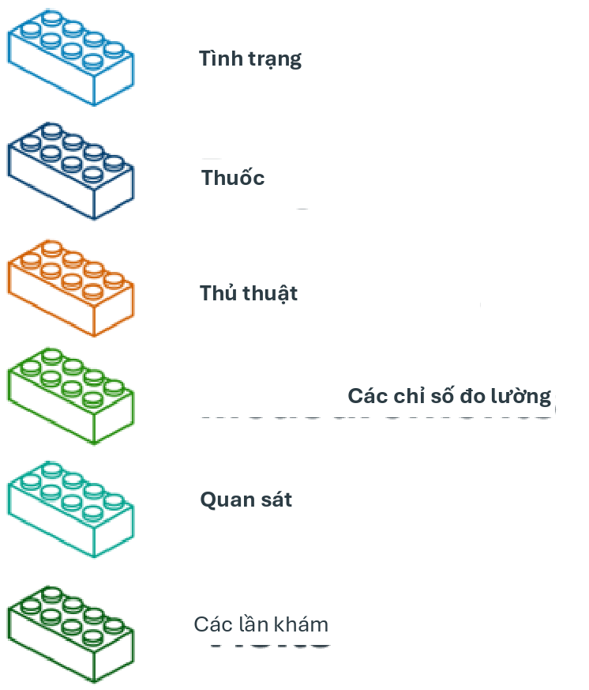{width="2.386665573053368in"
height="2.7933333333333334in"}

Hình 10.1: Các khối xây dựng của định nghĩa nhóm thuần tập.

hoạt động lâm sàng (ví dụ: mã SNOMED cho tình trạng, mã RxNorm cho
thuốc) cũng như bất kỳ thuộc tính cụ thể nào khác (ví dụ: tuổi khi xảy
ra, chẩn đoán/thủ thuật đầu tiên/v.v., chỉ định ngày bắt đầu và kết
thúc, chỉ định loại lượt khám hoặc tiêu chí, số ngày cung cấp, v.v.).
Tập hợp những người có sự kiện gia nhập được gọi là nhóm thuần tập sự
kiện ban đầu.

**Tiêu chí đưa vào: Tiêu chí đưa vào được áp dụng cho nhóm thuần tập
sự kiện ban đầu để hạn chế thêm tập hợp người tham gia. Mỗi tiêu chí
đưa vào được xác định bởi (các) miền CDM nơi dữ liệu được lưu trữ,
(các) tập khái niệm đại diện cho hoạt động lâm sàng, các thuộc tính cụ
thể theo miền (ví dụ: số ngày cung cấp, loại lượt khám, v.v.) và logic
thời gian tương đối so với ngày chỉ số nhóm thuần tập. Mỗi tiêu chí
đưa vào có thể được đánh giá để xác định tác động của tiêu chí đối với
sự suy giảm số lượng người từ nhóm thuần tập sự kiện ban đầu. Nhóm
thuần tập đủ điều kiện được định nghĩa là tất cả những người trong
nhóm thuần tập sự kiện ban đầu thỏa mãn tất cả các tiêu chí đưa vào.**

**Tiêu chí rời nhóm thuần tập: Sự kiện rời nhóm thuần tập biểu thị khi
một người không còn đủ điều kiện làm thành viên nhóm thuần tập. Việc
rời nhóm thuần tập có thể được xác định theo nhiều cách như kết thúc
thời kỳ quan sát, một khoảng thời gian cố định tương đối so với sự
kiện gia nhập ban đầu, sự kiện cuối cùng trong một chuỗi các quan sát
liên quan (ví dụ: tiếp xúc thuốc kéo dài) hoặc thông qua việc kiểm
duyệt khác về thời kỳ quan sát. Chiến lược rời nhóm thuần tập sẽ ảnh
hưởng đến việc một người có thể thuộc về nhóm thuần tập nhiều lần
trong các khoảng thời gian khác nhau hay không.**

{width="0.455in"
height="0.45499890638670165in"}

2.  *Các tập khái niệm 151*

## Các tập khái niệm

Một tập khái niệm là một biểu thức đại diện cho một danh sách các khái
niệm có thể được sử dụng như một thành phần có thể tái sử dụng trong
các phân tích khác nhau. Nó có thể được coi là một tương đương chuẩn
hóa, có thể thực thi bằng máy của các danh sách mã thường được sử dụng
trong các nghiên cứu quan sát. Một biểu thức tập khái niệm bao gồm một
danh sách các khái niệm với các thuộc tính sau:

- **Loại trừ (Exclude): Loại trừ khái niệm này (và bất kỳ hậu duệ nào
của nó nếu được chọn) khỏi tập khái niệm.**

- **Hậu duệ (Descendants): Xem xét không chỉ khái niệm này mà còn tất cả
các hậu duệ của nó.**

- **Được ánh xạ (Mapped): Cho phép tìm kiếm các khái niệm không chuẩn.**

Ví dụ, một biểu thức tập khái niệm có thể chứa hai khái niệm như được
mô tả trong Bảng

10.1. Ở đây chúng tôi bao gồm khái niệm 4329847 ("Nhồi máu cơ tim") và
tất cả các hậu duệ của nó, nhưng loại trừ khái niệm 314666 ("Nhồi máu
cơ tim cũ") và tất cả các hậu duệ của nó.

Bảng 10.1: Ví dụ về một biểu thức tập khái niệm.

+---------+------------------+-------+---------+------+
| ID khái | Tên khái niệm    | Đã    | Các     | Đã   |
| niệm    |                  | loại  | khái    | ánh  |
|         |                  | trừ   | niệm    | xạ   |
|         |                  |       | con     |      |
+=========+==================+=======+=========+======+
| 4329847 | Nhồi máu cơ tim  | NO    | CÓ      | > NO |
+---------+------------------+-------+---------+------+
| 314666  | Nhồi máu cơ tim  | CÓ    | CÓ      | > NO |
|         | cũ               |       |         |      |
+---------+------------------+-------+---------+------+

Như được hiển thị trong Hình 10.2, điều này sẽ bao gồm "Nhồi máu cơ
tim" và tất cả các hậu duệ của nó ngoại trừ "Nhồi máu cơ tim cũ" và
các hậu duệ của nó. Tổng cộng, biểu thức tập khái niệm này bao hàm gần
một trăm Khái niệm chuẩn. Những Khái niệm chuẩn này lần lượt phản ánh
hàng trăm mã nguồn (ví dụ: mã ICD-9 và ICD-10) có thể xuất hiện trong
các cơ sở dữ liệu khác nhau.

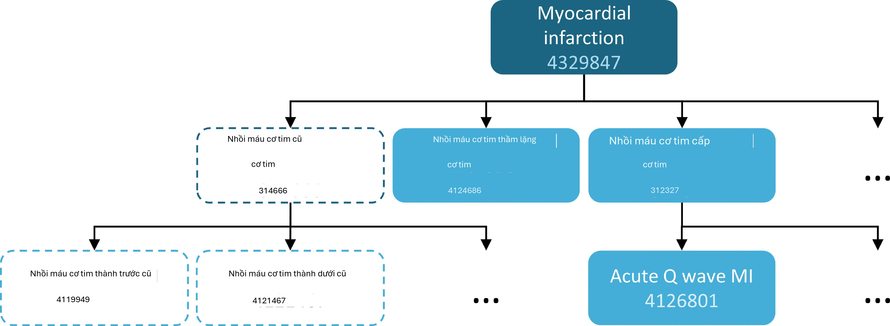{width="4.947498906386702in"
height="1.8125in"}

Hình 10.2: Một tập khái niệm bao gồm "Nhồi máu cơ tim" (với các hậu
duệ), nhưng loại trừ "Nhồi máu cơ tim cũ" (với các hậu duệ).

## Định nghĩa nhóm thuần tập xác suất

Các định nghĩa nhóm thuần tập dựa trên quy tắc là một phương pháp phổ
biến để tập hợp các định nghĩa nhóm thuần tập. Tuy nhiên, việc tập hợp
sự đồng thuận của chuyên gia cần thiết để tạo ra một nhóm thuần tập
nghiên cứu có thể cực kỳ tốn thời gian. Thiết kế nhóm thuần tập xác
suất là một phương pháp thay thế, dựa trên máy tính để đẩy nhanh việc
lựa chọn các thuộc tính nhóm thuần tập. Trong phương pháp này, học máy
có giám sát cho phép thuật toán kiểu hình học hỏi từ một tập hợp các
ví dụ được dán nhãn (trường hợp) về những thuộc tính nào góp phần vào
tư cách thành viên nhóm thuần tập. Thuật toán này sau đó có thể được
sử dụng để xác định rõ hơn các đặc điểm xác định của một kiểu hình và
những đánh đổi nào xảy ra về độ chính xác tổng thể của nghiên cứu khi
chọn sửa đổi các tiêu chí kiểu hình.

Một ví dụ về việc áp dụng phương pháp này trên dữ liệu trong CDM là
gói R APHRODITE (Automated PHenotype Routine for Observational
Definition, Identification, Training and Evaluation)1. Gói này cung
cấp một khung xây dựng nhóm thuần tập kết hợp khả năng học hỏi từ dữ
liệu được dán nhãn không hoàn hảo. (Banda và cộng sự,
2017)

## Tính hợp lệ của định nghĩa nhóm thuần tập

Khi bạn đang xây dựng một nhóm thuần tập, bạn nên xem xét điều nào
quan trọng hơn đối với bạn: tìm tất cả các bệnh nhân đủ điều kiện? hay
chỉ lấy những người mà bạn tự tin?

Chiến lược xây dựng nhóm thuần tập của bạn sẽ phụ thuộc vào sự nghiêm
ngặt về lâm sàng trong cách các chuyên gia của bạn xác định căn bệnh.
Điều này có nghĩa là, thiết kế nhóm thuần tập phù hợp sẽ phụ thuộc vào
câu hỏi bạn đang cố gắng trả lời. Bạn có thể chọn xây dựng một định
nghĩa nhóm thuần tập sử dụng mọi thứ bạn có thể có, sử dụng mẫu số
chung thấp nhất để bạn có thể chia sẻ nó trên các trang web OHDSI hoặc
là sự thỏa hiệp của cả hai. Cuối cùng, tùy thuộc vào quyết định của
nhà nghiên cứu về ngưỡng nghiêm ngặt nào là cần thiết để nghiên cứu
đầy đủ nhóm thuần tập được quan tâm.

Như đã đề cập ở phần đầu chương, một định nghĩa nhóm thuần tập là một
nỗ lực để suy luận ra điều gì đó mà chúng ta muốn quan sát từ dữ liệu
được ghi lại. Điều này đặt ra câu hỏi chúng ta đã thành công như thế
nào trong nỗ lực đó. Nhìn chung, việc xác nhận một định nghĩa nhóm
thuần tập dựa trên quy tắc hoặc thuật toán xác suất có thể được coi là
một thử nghiệm của nhóm thuần tập được đề xuất so với một hình thức
tham chiếu "tiêu chuẩn vàng" nào đó (ví dụ: xem xét biểu đồ thủ công
các trường hợp). Điều này được thảo luận chi tiết trong Chương 16
("Tính hợp lệ lâm sàng").

### Thư viện kiểu hình tiêu chuẩn vàng OHDSI

Để hỗ trợ cộng đồng trong việc kiểm kê và đánh giá tổng thể các định
nghĩa và thuật toán nhóm thuần tập hiện có, Nhóm làm việc Thư viện
kiểu hình tiêu chuẩn vàng OHDSI (GSPL) đã được thành lập. Mục đích của
nhóm làm việc GSPL là phát triển một thư viện kiểu hình được cộng đồng
hỗ trợ từ các phương pháp dựa trên quy tắc và xác suất. GSPL cho phép
các thành viên của cộng đồng OHDSI tìm kiếm, đánh giá và sử dụng các
định nghĩa nhóm thuần tập đã được cộng đồng xác nhận cho nghiên cứu và
các hoạt động khác. Những định nghĩa "tiêu chuẩn vàng" này sẽ nằm
trong một

^1^<https://github.com/OHDSI/Aphrodite>

*10.6. Xác định nhóm thuần tập cho bệnh tăng huyết áp 153*

thư viện, các mục trong đó được giữ theo các tiêu chuẩn thiết kế và
đánh giá cụ thể. Để biết thêm thông tin liên quan đến GSPL, hãy tham
khảo trang nhóm làm việc OHDSI.2 Nghiên cứu trong nhóm làm việc này
bao gồm APHRODITE (Banda và cộng sự, 2017) và công cụ PheValuator
(Swerdel và cộng sự, 2019), được thảo luận trong phần trước, cũng như
công việc được thực hiện để chia sẻ Thư viện kiểu hình eMERGE về Hồ sơ
y tế điện tử và Genomics trên mạng lưới OHDSI (Hripcsak và cộng sự,
2019). Nếu bạn quan tâm đến việc quản lý kiểu hình, hãy cân nhắc đóng
góp cho nhóm làm việc này.

## Xác định nhóm thuần tập cho bệnh tăng huyết áp

Chúng tôi bắt đầu thực hành các kỹ năng nhóm thuần tập bằng cách tập
hợp một định nghĩa nhóm thuần tập sử dụng phương pháp dựa trên quy
tắc. Trong ví dụ này, chúng tôi muốn tìm những bệnh nhân bắt đầu điều
trị đơn trị liệu bằng thuốc ức chế ACE như phương pháp điều trị đầu
tay cho bệnh tăng huyết áp

Với bối cảnh này, bây giờ chúng ta sẽ xây dựng nhóm thuần tập của
mình. Khi thực hiện bài tập này, chúng ta sẽ tiếp cận việc xây dựng
nhóm thuần tập tương tự như biểu đồ suy giảm tiêu chuẩn. Hình

10.3 cho thấy khung logic về cách chúng ta muốn xây dựng nhóm thuần
tập này.

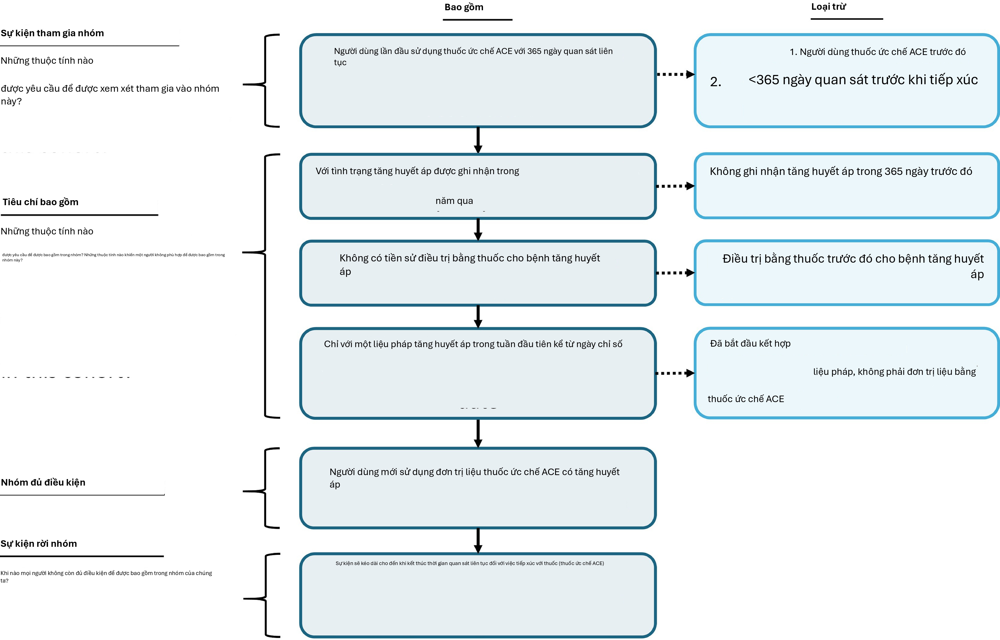{width="5.473333333333334in"
height="3.5033333333333334in"}

Hình 10.3: Sơ đồ logic của nhóm thuần tập dự kiến

Bạn có thể xây dựng một nhóm thuần tập trong giao diện người dùng của
ATLAS hoặc bạn có thể viết truy vấn trực tiếp vào CDM của mình. Chúng
tôi sẽ thảo luận ngắn gọn về cả hai trong chương này.[]{#_bookmark267
.anchor}

^2^[https://www.ohdsi.org/web/wiki/doku.php?id=projects:workgroups:gold-library-wg](https://www.ohdsi.org/web/wiki/doku.php?id=projects%3Aworkgroups%3Agold-library-wg)

## Triển khai nhóm thuần tập bằng ATLAS

Để bắt đầu trong ATLAS, hãy nhấp vào mô-đun. Khi mô-đun tải xong, hãy
nhấp vào "New cohort" (Nhóm thuần tập mới). Màn hình tiếp theo bạn sẽ
thấy là một định nghĩa nhóm thuần tập trống. Hình 10.4 cho thấy những
gì bạn sẽ thấy trên màn hình của
mình.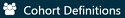{width="1.301920384951881in"
height="0.18747594050743657in"}

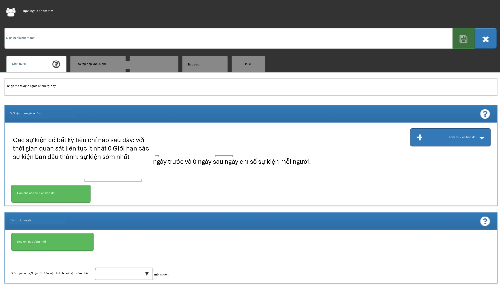{width="5.345833333333333in"
height="3.054165573053368in"}

Hình 10.4: Định nghĩa nhóm thuần tập mới

Trước khi làm bất cứ điều gì khác, bạn nên đổi tên nhóm thuần tập từ
"New Cohort Definition" thành tên duy nhất của riêng bạn cho nhóm
thuần tập này. Bạn có thể chọn một cái tên như "Người dùng mới thuốc
ức chế ACE như đơn trị liệu đầu tay cho bệnh tăng huyết áp".

{width="0.455in"
height="0.45499890638670165in"}

Sau khi đã chọn tên, bạn có thể lưu nhóm thuần tập bằng cách nhấp vào
.{width="0.18747594050743657in"
height="0.18747594050743657in"}

### Tiêu chí sự kiện ban đầu

Bây giờ chúng ta có thể tiếp tục xác định sự kiện nhóm thuần tập ban
đầu. Bạn sẽ nhấp vào "Add initial event" (Thêm sự kiện ban đầu). Bây
giờ bạn phải chọn miền mà bạn đang xây dựng tiêu chí xung quanh. Bạn
có thể tự hỏi, "làm thế nào để tôi biết miền nào là sự kiện nhóm thuần
tập ban đầu?" Hãy cùng tìm hiểu điều đó.

Như chúng ta thấy trong Hình 10.5, ATLAS cung cấp các mô tả bên dưới
mỗi tiêu chí để giúp bạn. Nếu chúng ta đang xây dựng tiêu chí dựa trên
CONDITION_OCCURRENCE, câu hỏi của chúng ta sẽ là tìm kiếm bệnh nhân có
chẩn đoán cụ thể. Nếu chúng ta đang xây dựng một DRUG_EXPOSURE

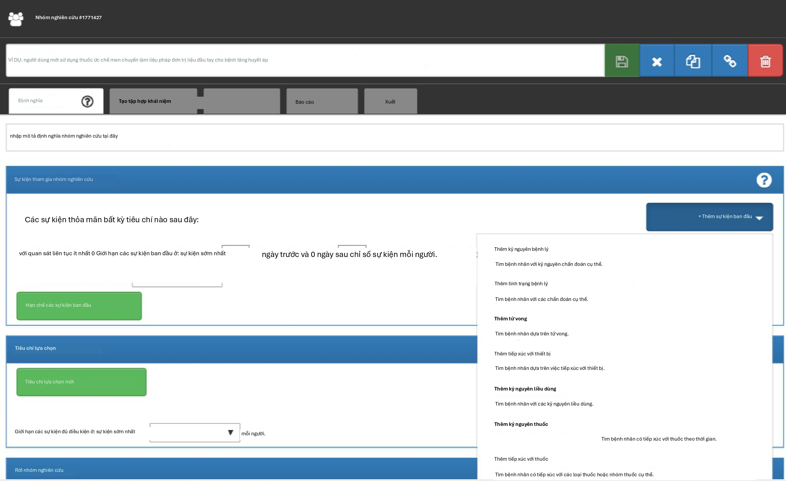{width="5.325in"
height="3.2624989063867016in"}

Hình 10.5: Thêm sự kiện ban đầu

dựa trên tiêu chí, câu hỏi của chúng ta sẽ là tìm kiếm bệnh nhân có
một loại thuốc hoặc nhóm thuốc cụ thể. Vì chúng ta muốn tìm những bệnh
nhân bắt đầu điều trị đơn trị liệu bằng thuốc ức chế ACE như phương
pháp điều trị đầu tay cho bệnh tăng huyết áp, chúng ta muốn chọn tiêu
chí DRUG_EXPOSURE. Bạn có thể nói, "nhưng chúng ta cũng quan tâm đến
tăng huyết áp như một chẩn đoán". Bạn nói đúng. Tăng huyết áp là một
tiêu chí khác mà chúng ta sẽ xây dựng. Tuy nhiên, ngày bắt đầu nhóm
thuần tập được xác định bởi việc bắt đầu điều trị bằng thuốc ức chế
ACE, do đó đây là sự kiện ban đầu. Chẩn đoán tăng huyết áp là cái mà
chúng ta gọi là tiêu chí đủ điều kiện bổ sung. Chúng ta sẽ quay lại
vấn đề này sau khi xây dựng tiêu chí này. Chúng ta sẽ nhấp vào "Add
Drug Exposure" (Thêm tiếp xúc thuốc).

Màn hình sẽ cập nhật với tiêu chí đã chọn của bạn nhưng bạn vẫn chưa
hoàn thành. Như chúng ta thấy trong Hình 10.6, ATLAS không biết chúng
ta đang tìm loại thuốc nào. Chúng ta cần nói cho ATLAS biết tập khái
niệm nào được liên kết với thuốc ức chế ACE.

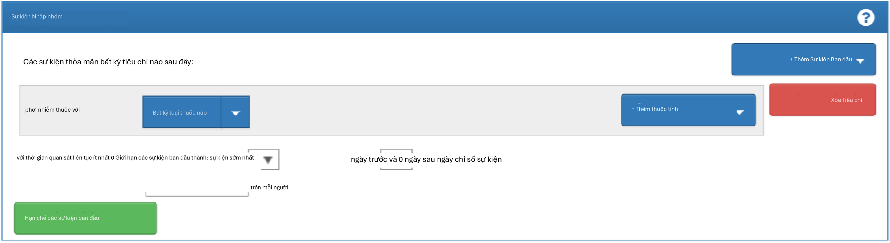{width="5.291666666666667in"
height="1.45in"}

Hình 10.6: Xác định tiếp xúc thuốc

### Xác định tập khái niệm

Bạn sẽ cần nhấp vào để mở hộp thoại cho phép bạn truy xuất một tập
khái niệm để xác định thuốc ức chế
ACE.{width="0.1458147419072616in"
height="0.18747594050743657in"}

#### Kịch bản 1: Bạn chưa xây dựng tập khái niệm

Nếu bạn chưa tập hợp các tập khái niệm của mình để áp dụng cho các
tiêu chí, bạn sẽ cần làm như vậy trước khi tiếp tục. Bạn có thể xây
dựng một tập khái niệm trong định nghĩa nhóm thuần tập bằng cách điều
hướng đến tab "Concept set" và nhấp vào "New Concept Set". Bạn sẽ cần
đổi tên tập khái niệm từ "Unnamed Concept Set" thành một cái tên mà
bạn chọn. Từ đó, bạn có thể sử dụng mô-đun để tìm kiếm các khái niệm
lâm sàng đại diện cho thuốc ức chế ACE (Hình
10.7).{width="0.635336832895888in"
height="0.18747594050743657in"}

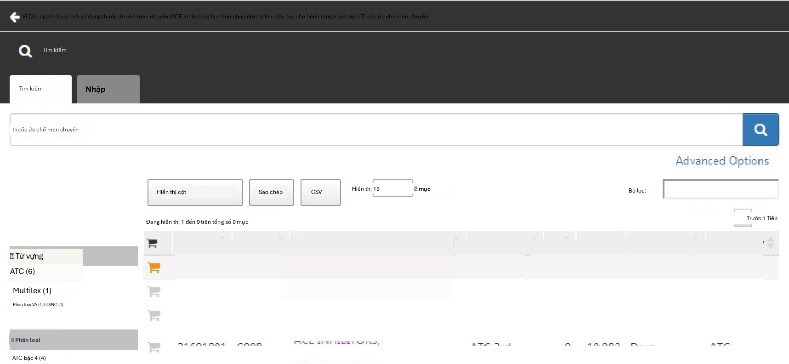{width="5.321666666666666in"
height="2.4541666666666666in"}

Hình 10.7: Tìm kiếm từ vựng - Thuốc ức chế ACE

Khi bạn đã tìm thấy các thuật ngữ mà bạn muốn sử dụng để xác định sự
tiếp xúc thuốc này, bạn có thể chọn khái niệm bằng cách nhấp vào. Bạn
có thể quay lại định nghĩa nhóm thuần tập của mình bằng cách sử dụng
mũi tên trái ở trên cùng bên trái của Hình 10.7. Bạn có thể tham khảo
lại Chương 5 (Từ vựng chuẩn
hóa{width="0.15622922134733158in"
height="0.12498359580052494in"}

) về cách điều hướng các từ vựng để tìm các khái niệm lâm sàng quan
tâm.

Hình 10.8 cho thấy biểu thức tập khái niệm của chúng tôi. Chúng tôi đã
chọn tất cả các thành phần thuốc ức chế ACE mà chúng tôi quan tâm và
bao gồm tất cả các hậu duệ của chúng, do đó bao gồm tất cả các loại
thuốc có chứa bất kỳ thành phần nào trong số này. Chúng ta có thể nhấp
vào "Included concepts" để xem tất cả 21.536 khái niệm được bao hàm
bởi biểu thức này, hoặc chúng ta có thể nhấp vào "Included Source
Codes" để khám phá tất cả các mã nguồn trong các hệ thống mã hóa khác
nhau được bao hàm.

#### Kịch bản 2: Bạn đã xây dựng tập khái niệm

Nếu bạn đã tạo một tập khái niệm và lưu nó trong ATLAS, bạn có thể
nhấp để "Import Concept Set" (Nhập tập khái niệm). Một hộp thoại sẽ mở
ra nhắc bạn tìm khái niệm của mình trong

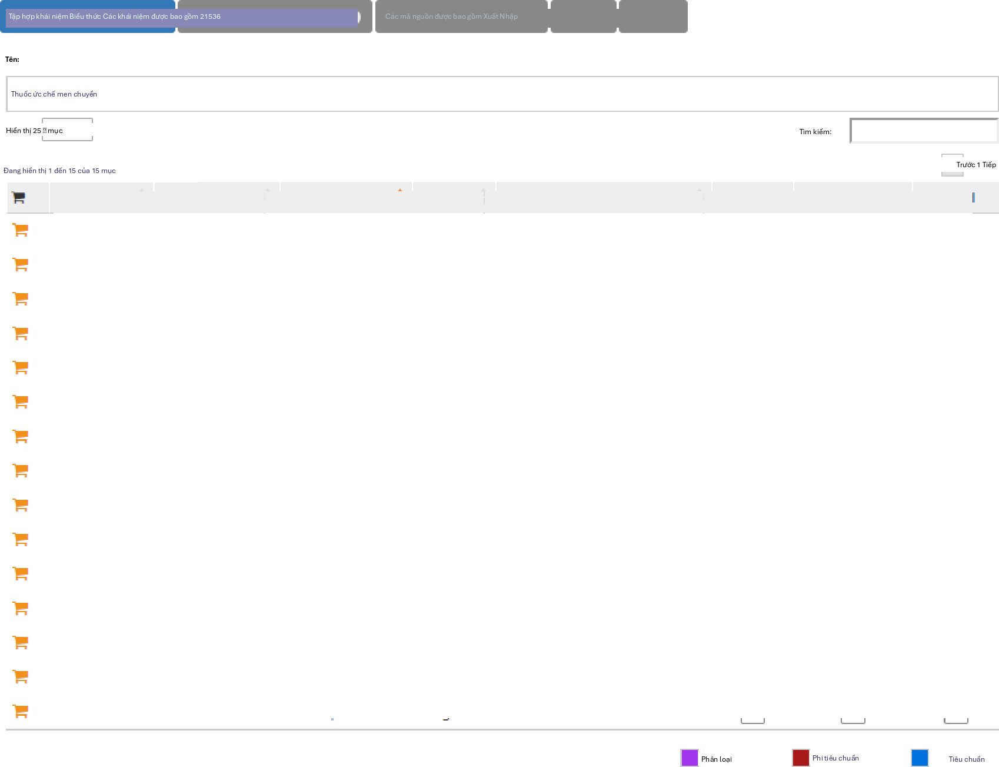{width="5.263541119860018in"
height="4.036457786526684in"}

Hình 10.8: Một tập khái niệm chứa các loại thuốc ức chế ACE.

kho lưu trữ tập khái niệm của ATLAS của bạn như được hiển thị trong
Hình 10.9. Trong hình ví dụ, người dùng đang truy xuất các tập khái
niệm được lưu trữ trong ATLAS. Người dùng đã nhập tên được đặt cho tập
khái niệm này "ace inhibitors" vào ô tìm kiếm bên phải. Điều này đã
rút ngắn danh sách tập khái niệm chỉ còn các khái niệm có tên khớp. Từ
đó, người dùng có thể nhấp vào hàng của tập khái niệm để chọn nó. (Lưu
ý: hộp thoại sẽ biến mất sau khi bạn đã chọn một tập khái niệm.) Bạn
sẽ biết hành động này thành công khi hộp Any Drug được cập nhật với
tên của tập khái niệm bạn đã chọn.

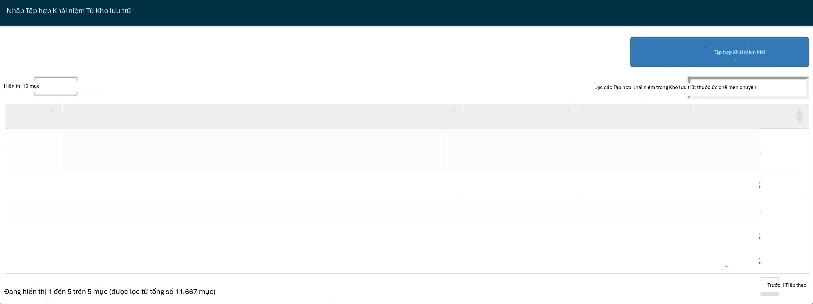{width="5.312916666666666in"
height="1.990207786526684in"}

Hình 10.9: Nhập tập khái niệm từ kho lưu trữ ATLAS

### Tiêu chí sự kiện ban đầu bổ sung

Bây giờ bạn đã đính kèm một tập khái niệm, bạn vẫn chưa hoàn thành.
Câu hỏi của bạn đang tìm kiếm những người dùng mới hoặc lần đầu tiên
trong lịch sử của ai đó họ tiếp xúc với thuốc ức chế ACE. Điều này
chuyển thành lần tiếp xúc đầu tiên với thuốc ức chế ACE trong hồ sơ
của bệnh nhân. Để chỉ định điều này, bạn cần nhấp vào "+Add attribute"
(Thêm thuộc tính). Bạn sẽ muốn chọn "Add first exposure criteria"
(Thêm tiêu chí tiếp xúc đầu tiên). Lưu ý, bạn có thể chỉ định các
thuộc tính khác của tiêu chí mà bạn xây dựng. Bạn có thể chỉ định
thuộc tính tuổi khi xảy ra, ngày xảy ra, giới tính hoặc các thuộc tính
khác liên quan đến thuốc. Các tiêu chí có sẵn để lựa chọn sẽ trông
khác nhau đối với mỗi miền.

Từ đó, cửa sổ sẽ tự động đóng lại. Sau khi được chọn, thuộc tính bổ
sung này sẽ xuất hiện trong cùng hộp với tiêu chí ban đầu (xem Hình
10.10).

Bây giờ bạn đã xây dựng một sự kiện đủ điều kiện ban đầu. Để đảm bảo
bạn đang nắm bắt được lần tiếp xúc thuốc được quan sát đầu tiên, bạn
sẽ muốn thêm một cửa sổ nhìn lại để biết rằng bạn đang xem xét đủ lịch
sử của bệnh nhân để biết điều gì đến trước. Có thể một bệnh nhân có
thời gian quan sát ngắn đã nhận được sự tiếp xúc ở nơi khác mà

chúng ta không thấy. Chúng ta không thể kiểm soát điều này nhưng chúng
ta có thể bắt buộc một khoảng thời gian tối thiểu bệnh nhân phải có
trong dữ liệu trước ngày chỉ số. Bạn có thể thực hiện việc này bằng
cách điều chỉnh các menu thả xuống quan sát liên tục. Bạn cũng có thể
nhấp vào hộp và nhập giá trị vào các cửa sổ này. Chúng tôi sẽ yêu cầu
365 ngày quan sát liên tục trước sự kiện ban đầu. Bạn sẽ cập nhật thời
kỳ quan sát của mình thành: với quan sát liên tục 365 ngày trước đó,
như được hiển thị trong Hình 10.10. Cửa sổ nhìn lại này tùy thuộc vào
quyết định của nhóm nghiên cứu của bạn. Bạn có thể chọn khác đi trong
các nhóm thuần tập khác. Điều này tạo ra, tốt nhất có thể, một khoảng
thời gian tối thiểu chúng ta thấy bệnh nhân để đảm bảo chúng ta đang
nắm bắt hồ sơ đầu tiên. Tiêu chí này nói về lịch sử trước đó và không
liên quan đến thời gian sau sự kiện chỉ số. Do đó, chúng tôi yêu cầu 0
ngày sau sự kiện chỉ số. Sự kiện đủ điều kiện của chúng tôi là lần sử
dụng thuốc ức chế ACE đầu tiên từ trước đến nay. Do đó, chúng tôi giới
hạn các sự kiện ban đầu ở "sự kiện sớm nhất" mỗi người.

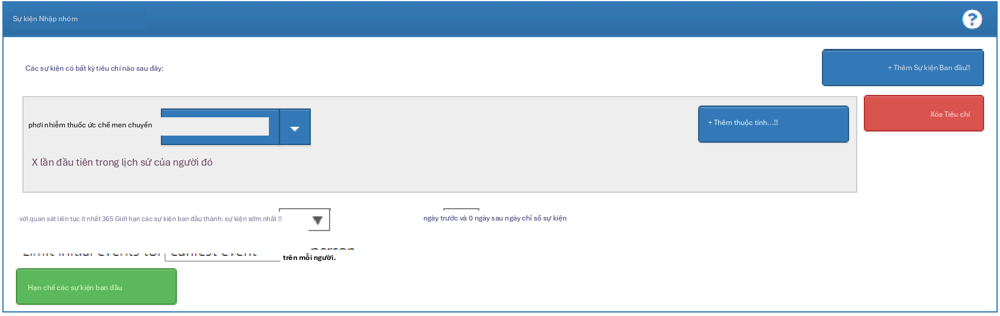{width="5.341875546806649in"
height="1.6865616797900262in"}

Hình 10.10: Thiết lập quan sát liên tục bắt buộc trước ngày chỉ số.

Để giải thích thêm về cách logic này kết hợp với nhau, bạn có thể nghĩ
về việc tập hợp các mốc thời gian của bệnh nhân.

Trong Hình 10.11, mỗi dòng đại diện cho một bệnh nhân duy nhất có thể
đủ điều kiện tham gia nhóm thuần tập. Các ngôi sao được tô đầy đại
diện cho thời điểm bệnh nhân thỏa mãn các tiêu chí được chỉ định. Khi
tiêu chí bổ sung được áp dụng, bạn có thể thấy một số ngôi sao có màu
nhạt hơn. Điều này có nghĩa là những bệnh nhân này có các hồ sơ khác
thỏa mãn tiêu chí nhưng có một hồ sơ khác xuất hiện trước đó. Đến khi
chúng ta đạt đến tiêu chí cuối cùng, chúng ta đang nhìn vào cái nhìn
tích lũy của những bệnh nhân có thuốc ức chế ACE lần đầu tiên và có
365 ngày trước khi xảy ra lần đầu. Về mặt logic, việc giới hạn ở sự
kiện ban đầu là dư thừa mặc dù nó hữu ích để duy trì logic rõ ràng của
chúng ta trong mọi lựa chọn mà chúng ta thực hiện. Khi bạn đang tự xây
dựng nhóm thuần tập của mình, bạn có thể chọn tham gia phần Nhà nghiên
cứu của Diễn đàn OHDSI để nhận ý kiến thứ hai về cách xây dựng logic
nhóm thuần tập của bạn.

### Tiêu chí đưa vào

Sau khi chúng ta đã chỉ định một sự kiện gia nhập nhóm thuần tập, bạn
có thể tiến hành một trong hai nơi để thêm các sự kiện đủ điều kiện bổ
sung của mình: "Restrict initial events" (Hạn chế các sự kiện ban đầu)
và "New inclusion criteria" (Tiêu chí đưa vào mới). Sự khác biệt cơ
bản giữa hai tùy chọn này là thông tin trung gian nào bạn muốn ATLAS
cung cấp lại cho bạn. Nếu bạn thêm tiêu chí đủ điều kiện bổ sung vào
hộp Sự kiện gia nhập nhóm thuần tập bằng cách chọn "Restrict initial
events", khi bạn chọn tạo số lượng trong ATLAS, bạn sẽ chỉ nhận lại
được số lượng người đáp ứng TẤT CẢ các

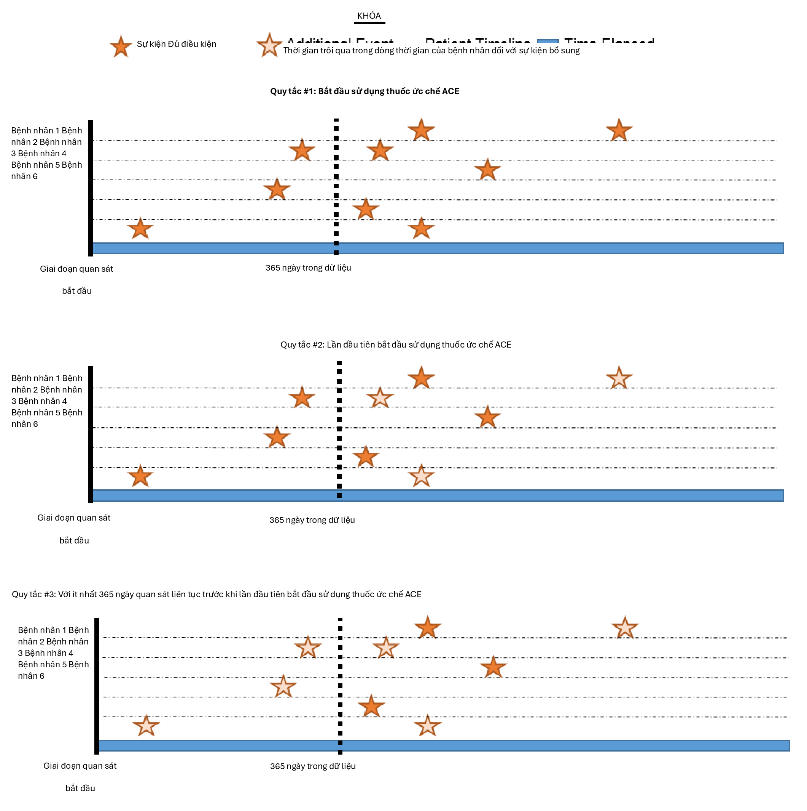{width="5.302082239720035in"
height="5.317707786526684in"}

Hình 10.11: Giải thích tính đủ điều kiện của bệnh nhân theo tiêu chí
áp dụng

tiêu chí này. Nếu bạn chọn thêm tiêu chí vào "New inclusion criteria",
bạn sẽ nhận được một biểu đồ suy giảm để cho bạn thấy bao nhiêu bệnh
nhân bị mất do áp dụng các tiêu chí đưa vào bổ sung. Rất khuyến khích
sử dụng phần Tiêu chí đưa vào để bạn có thể hiểu tác động của từng quy
tắc đối với sự thành công tổng thể của định nghĩa nhóm thuần tập. Bạn
có thể thấy một tiêu chí đưa vào nhất định hạn chế nghiêm trọng số
lượng người kết thúc trong nhóm thuần tập. Bạn có thể chọn nới lỏng
tiêu chí này để có một nhóm thuần tập lớn hơn. Điều này cuối cùng sẽ
tùy thuộc vào quyết định của sự đồng thuận của chuyên gia tập hợp nhóm
thuần tập này.

Bây giờ bạn sẽ muốn nhấp vào "New inclusion criteria" để thêm một phần
logic tiếp theo về tư cách thành viên cho nhóm thuần tập này. Chức
năng trong phần này giống hệt với cách chúng ta đã thảo luận về việc
xây dựng tiêu chí nhóm thuần tập ở trên. Bạn có thể chỉ định tiêu chí
và thêm các thuộc tính cụ thể. Tiêu chí bổ sung đầu tiên của chúng tôi
là tập hợp con nhóm thuần tập chỉ cho các bệnh nhân: Với ít nhất 1 lần
xảy ra rối loạn tăng huyết áp trong khoảng từ 365 đến 0 ngày sau ngày
chỉ số (lần bắt đầu đầu tiên của thuốc ức chế ACE). Bạn sẽ nhấp vào
"New inclusion criteria" để thêm một tiêu chí mới. Bạn nên đặt tên cho
tiêu chí của mình và, nếu muốn, hãy đưa ra một mô tả nhỏ về những gì
bạn đang tìm kiếm. Điều này phục vụ cho mục đích riêng của bạn để nhớ
lại những gì bạn đã xây dựng -- nó sẽ không ảnh hưởng đến tính toàn
vẹn của nhóm thuần tập mà bạn đang xác định.

Sau khi bạn đã chú thích tiêu chí mới này, bạn sẽ nhấp vào nút "+Add
criteria to group" (Thêm tiêu chí vào nhóm) để xây dựng tiêu chí thực
tế của bạn cho quy tắc này. Nút này hoạt động tương tự như "Add
Initial Event" ngoại trừ việc chúng ta không còn chỉ định một sự kiện
ban đầu nữa. Chúng ta có thể thêm nhiều tiêu chí vào đây -- đó là lý
do tại sao nó chỉ định "add criteria to group". Một ví dụ là nếu bạn
có nhiều cách để tìm một căn bệnh (ví dụ: logic cho
CONDITION_OCCURRENCE, logic sử dụng DRUG_EXPOSURE làm đại diện cho
tình trạng này, logic sử dụng MEASUREMENT làm đại diện cho tình trạng
này). Đây sẽ là các miền riêng biệt và yêu cầu các tiêu chí khác nhau
nhưng có thể được nhóm thành một tiêu chí tìm kiếm tình trạng này.
Trong trường hợp này, chúng ta muốn tìm chẩn đoán tăng huyết áp nên
chúng ta "Add condition occurrence" (Thêm sự kiện tình trạng). Chúng
ta sẽ thực hiện các bước tương tự như chúng ta đã làm với sự kiện ban
đầu bằng cách đính kèm một tập khái niệm vào hồ sơ này. Chúng ta cũng
muốn chỉ định sự kiện bắt đầu trong khoảng từ 365 ngày trước đến 0
ngày sau ngày chỉ số (sự kiện lần đầu tiên sử dụng thuốc ức chế ACE).
Bây giờ hãy kiểm tra logic của bạn với Hình 10.12.

Sau đó, bạn sẽ muốn thêm một tiêu chí khác để tìm kiếm bệnh nhân: với
chính xác 0 lần xảy ra thuốc tăng huyết áp TẤT CẢ các ngày trước và 1
ngày trước ngày bắt đầu chỉ số (không tiếp xúc với thuốc tăng huyết áp
trước khi dùng thuốc ức chế ACE). Quá trình này bắt đầu như chúng ta
đã làm trước đó bằng cách nhấp vào nút "New inclusion criteria", thêm
chú thích của bạn vào tiêu chí này và sau đó nhấp vào "+Add criteria
to group". Đây là DRUG_EXPOSURE nên bạn sẽ nhấp vào "Add Drug
Exposure", đính kèm một tập khái niệm cho thuốc tăng huyết áp, và sẽ
chỉ định TẤT CẢ các ngày trước và 0 ngày sau (hoặc "1 ngày trước" là
tương đương như thấy trong hình) ngày chỉ số. Đảm bảo xác nhận bạn đã
chọn chính xác 0 lần xảy ra. Bây giờ hãy kiểm tra logic của bạn với
Hình 10.13.

Bạn có thể bối rối tại sao "không có lần xảy ra nào" được mã hóa là
"chính xác 0 lần xảy ra". Đây là một sắc thái của cách ATLAS tiêu thụ
kiến thức. ATLAS chỉ tiêu thụ các tiêu chí đưa vào. Bạn phải sử dụng
các toán tử logic để chỉ ra khi bạn muốn sự vắng mặt của một thuộc
tính cụ thể như: "Chính xác 0". Theo thời gian, bạn sẽ trở nên quen
thuộc hơn với

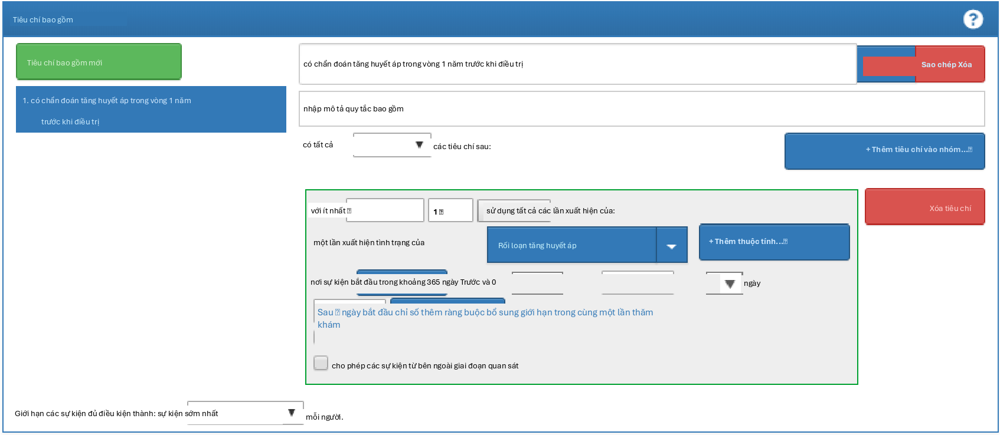{width="5.335311679790026in"
height="2.323124453193351in"}

Hình 10.12: Tiêu chí đưa vào bổ sung 1

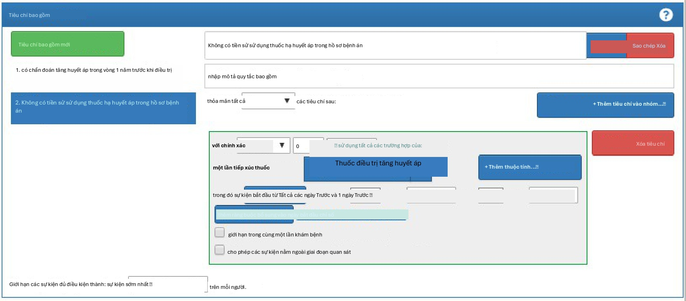{width="5.348437226596675in"
height="2.349374453193351in"}

Hình 10.13: Tiêu chí đưa vào bổ sung 2

các toán tử logic có sẵn trong tiêu chí ATLAS.

Cuối cùng, bạn sẽ muốn thêm một tiêu chí khác để tìm kiếm bệnh nhân:
với chính xác 1 lần xảy ra thuốc tăng huyết áp trong khoảng từ 0 ngày
trước đến 7 ngày sau ngày bắt đầu chỉ số VÀ chỉ có thể bắt đầu một
loại thuốc tăng huyết áp (một thuốc ức chế ACE). Quá trình này bắt đầu
như chúng ta đã làm trước đó bằng cách nhấp vào nút "New inclusion
criteria", thêm chú thích của bạn vào tiêu chí này và sau đó nhấp vào
"+Add criteria to group". Đây là DRUG_ERA nên bạn sẽ nhấp vào "Add
Drug Era", đính kèm một tập khái niệm cho thuốc tăng huyết áp, và sẽ
chỉ định 0 ngày trước và 7 ngày sau ngày chỉ số. Bây giờ hãy kiểm tra
logic của bạn với Hình 10.14.

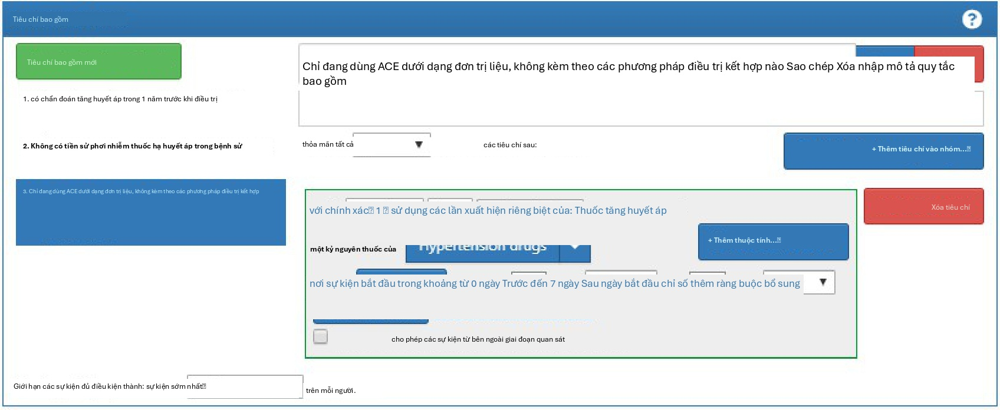{width="5.341875546806649in"
height="2.1918744531933507in"}

Hình 10.14: Tiêu chí đưa vào bổ sung 3

### Tiêu chí rời nhóm thuần tập

Bây giờ bạn đã thêm tất cả các tiêu chí đưa vào đủ điều kiện của mình.
Bây giờ bạn phải chỉ định tiêu chí rời nhóm thuần tập của mình. Bạn sẽ
tự hỏi, "khi nào mọi người không còn đủ điều kiện để được đưa vào nhóm
thuần tập này nữa?" Trong nhóm thuần tập này, chúng ta đang theo dõi
những người dùng mới của một sự tiếp xúc thuốc. Chúng ta muốn xem xét
thời kỳ quan sát liên tục vì nó liên quan đến sự tiếp xúc thuốc. Như
vậy, tiêu chí rời nhóm được chỉ định để theo dõi toàn bộ sự tiếp xúc
thuốc liên tục. Nếu có một sự gián đoạn tiếp theo trong sự tiếp xúc
thuốc, bệnh nhân sẽ rời khỏi nhóm thuần tập tại thời điểm này. Chúng
tôi làm điều này vì chúng tôi không thể xác định điều gì đã xảy ra với
người đó trong thời gian gián đoạn tiếp xúc thuốc. Chúng tôi cũng có
thể đặt một tiêu chí trên cửa sổ bền bỉ để chỉ định một khoảng trống
cho phép giữa các lần tiếp xúc thuốc. Trong trường hợp này, các chuyên
gia của chúng tôi dẫn đầu nghiên cứu này đã kết luận rằng tối đa 30
ngày giữa các hồ sơ tiếp xúc là có thể chấp nhận được khi suy luận về
kỷ nguyên tiếp xúc bền bỉ.

**Tại sao các khoảng trống lại được cho phép? Trong một số tập dữ
liệu, chúng ta chỉ thấy các phần của các tương tác lâm sàng. Tiếp xúc
thuốc, cụ thể, có thể đại diện cho việc cấp phát một đơn thuốc có thể
bao phủ một khoảng thời gian nhất định. Do đó, chúng ta cho phép một
khoảng thời gian nhất định giữa các lần tiếp xúc thuốc vì chúng ta
biết bệnh nhân về mặt logic vẫn có thể có quyền truy cập vào lần tiếp
xúc thuốc ban đầu vì đơn vị cấp phát vượt quá một ngày.**

Chúng ta có thể cấu hình điều này bằng cách chọn Sự kiện sẽ bền bỉ
"end of a continuous drug exposure" (kết thúc của một tiếp xúc thuốc
liên tục). Sau đó, chúng ta sẽ thêm cửa sổ bền bỉ của mình để "allow
for a maximum of 30 days" (cho phép tối đa 30 ngày)

và đính kèm tập khái niệm cho "ACE inhibitors". Bây giờ hãy kiểm tra
logic của bạn với Hình 10.15.

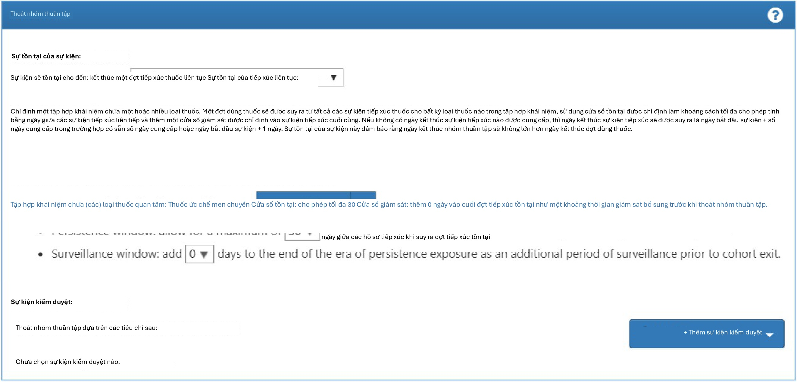{width="5.291666666666667in"
height="2.5375in"}

Hình 10.15: Tiêu chí rời nhóm thuần tập

Trong trường hợp của nhóm thuần tập này, không có sự kiện kiểm duyệt
nào khác. Tuy nhiên, bạn có thể xây dựng các nhóm thuần tập khác mà
bạn cần chỉ định tiêu chí này. Bạn sẽ tiến hành tương tự như cách
chúng ta đã thêm các thuộc tính khác vào định nghĩa nhóm thuần tập
này. Bây giờ bạn đã hoàn thành thành công việc tạo nhóm thuần tập của
mình. Đảm bảo nhấn nút. Xin chúc mừng! Xây dựng một nhóm thuần tập là
khối xây dựng quan trọng nhất để trả lời một câu hỏi trong các công cụ
OHDSI. Bây giờ bạn có thể sử dụng tab "Export" để chia sẻ định nghĩa
nhóm thuần tập của mình với các cộng tác viên khác dưới dạng mã SQL
hoặc tệp JSON để tải vào
ATLAS.{width="0.18747594050743657in"
height="0.18747594050743657in"}

## Triển khai nhóm thuần tập bằng SQL

Ở đây chúng tôi mô tả cách tạo cùng một nhóm thuần tập, nhưng sử dụng
SQL và R. Như đã thảo luận trong Chương 9, OHDSI cung cấp hai gói R,
được gọi là SqlRender và DatabaseConnector, cùng cho phép viết mã SQL
có thể được tự động dịch và thực thi trên nhiều nền tảng cơ sở dữ liệu
khác nhau.

Để rõ ràng, chúng tôi sẽ chia SQL thành nhiều phần, mỗi phần tạo ra
một bảng tạm được sử dụng trong phần tiếp theo. Đây có thể không phải
là cách hiệu quả nhất về mặt tính toán để thực hiện, nhưng nó dễ đọc
hơn một câu lệnh rất dài duy nhất.

### Kết nối với cơ sở dữ liệu

Đầu tiên chúng ta cần cho R biết cách kết nối với máy chủ. Chúng tôi
sử dụng gói DatabaseConnector, cung cấp một hàm gọi là
createConnectionDetails. Nhập

?createConnectionDetails cho các cài đặt cụ thể cần thiết cho các cơ
sở dữ liệu khác nhau

hệ thống quản lý (DBMS). Ví dụ, người ta có thể kết nối với cơ sở dữ
liệu PostgreSQL bằng mã này:

**library**(CohortMethod)

connDetails \<- **createConnectionDetails**(dbms = \"postgresql\",

server = \"localhost/ohdsi\", user = \"joe\",

password = \"supersecret\")

cdmDbSchema \<- \"my_cdm_data\" cohortDbSchema \<- \"scratch\"
cohortTable \<- \"my_cohorts\"

Ba dòng cuối cùng xác định các biến cdmDbSchema, cohortDbSchema và
cohortTable. Chúng tôi sẽ sử dụng chúng sau để cho R biết dữ liệu ở
định dạng CDM nằm ở đâu và các nhóm thuần tập quan tâm phải được tạo ở
đâu. Lưu ý rằng đối với Microsoft SQL Server, các lược đồ cơ sở dữ
liệu cần chỉ định cả cơ sở dữ liệu và lược đồ, vì vậy ví dụ
cdmDbSchema

\<- \"my_cdm_data.dbo\".

### Chỉ định các khái niệm

Để dễ đọc, chúng tôi sẽ xác định các ID khái niệm chúng ta cần trong R
và chuyển chúng sang SQL:

aceI \<- **c**(1308216, 1310756, 1331235, 1334456, 1335471, 1340128,
1341927,

1342439, 1363749, 1373225)

hypertension \<- 316866

allHtDrugs \<- **c**(904542, 907013, 932745, 942350, 956874, 970250,
974166,

978555, 991382, 1305447, 1307046, 1307863, 1308216,

1308842, 1309068, 1309799, 1310756, 1313200, 1314002,

1314577, 1317640, 1317967, 1318137, 1318853, 1319880,

1319998, 1322081, 1326012, 1327978, 1328165, 1331235,

1332418, 1334456, 1335471, 1338005, 1340128, 1341238,

1341927, 1342439, 1344965, 1345858, 1346686, 1346823,

1347384, 1350489, 1351557, 1353766, 1353776, 1363053,

1363749, 1367500, 1373225, 1373928, 1386957, 1395058,

1398937, 40226742, 40235485)

### Tìm lần sử dụng đầu tiên

Trước tiên chúng ta sẽ tìm lần sử dụng thuốc ức chế ACE đầu tiên cho
mỗi bệnh nhân:

conn \<- **connect**(connectionDetails)

sql \<- \"SELECT person_id AS subject_id,
MIN(drug_exposure_start_date) AS cohort_start_date

INTO #first_use

FROM \@cdm_db_schema.drug_exposure

INNER JOIN \@cdm_db_schema.concept_ancestor ON descendant_concept_id =
drug_concept_id

WHERE ancestor_concept_id IN (@ace_i) GROUP BY person_id;\"

**renderTranslateExecuteSql**(conn,

sql,

cdm_db_schema = cdmDbSchema, ace_i = aceI)

Lưu ý rằng chúng tôi tham gia bảng DRUG_EXPOSURE vào bảng
CONCEPT_ANCESTOR để tìm tất cả các loại thuốc có chứa thuốc ức chế
ACE.

### Yêu cầu 365 ngày quan sát trước đó

Tiếp theo, chúng ta yêu cầu 365 ngày quan sát liên tục trước đó bằng
cách tham gia vào bảng OBSERVATION_PERIOD:

### Yêu cầu tăng huyết áp trước đó

Chúng ta yêu cầu một chẩn đoán tăng huyết áp trong 365 ngày trước đó:

sql \<- \"SELECT DISTINCT subject_id, cohort_start_date

INTO #has_ht

FROM #has_prior_obs

INNER JOIN \@cdm_db_schema.condition_occurrence ON subject_id =
person_id

AND condition_start_date \<= cohort_start_date

AND condition_start_date \>= DATEADD(DAY, -365, cohort_start_date)
INNER JOIN \@cdm_db_schema.concept_ancestor

ON descendant_concept_id = condition_concept_id WHERE
ancestor_concept_id = \@hypertension;\"

**renderTranslateExecuteSql**(conn,

sql,

cdm_db_schema = cdmDbSchema, hypertension = hypertension)

Lưu ý rằng chúng tôi SELECT DISTINCT, vì nếu không, nếu một người có
nhiều chẩn đoán tăng huyết áp trong quá khứ, chúng tôi sẽ tạo ra các
mục nhóm thuần tập trùng lặp.

### Không điều trị trước đó

Chúng ta yêu cầu không có sự tiếp xúc trước đó với bất kỳ phương pháp
điều trị tăng huyết áp nào:

sql \<- \"SELECT subject_id, cohort_start_date

INTO #no_prior_ht_drugs FROM #has_ht

LEFT JOIN ( SELECT \*

FROM \@cdm_db_schema.drug_exposure

INNER JOIN \@cdm_db_schema.concept_ancestor ON descendant_concept_id =
drug_concept_id

WHERE ancestor_concept_id IN (@all_ht_drugs)

) ht_drugs

ON subject_id = person_id

AND drug_exposure_start_date \< cohort_start_date WHERE person_id IS
NULL;\"

**renderTranslateExecuteSql**(conn,

sql,

cdm_db_schema = cdmDbSchema, all_ht_drugs = allHtDrugs)

Lưu ý rằng chúng tôi sử dụng left join và chỉ cho phép các hàng mà
person_id, đến từ bảng DRUG_EXPOSURE là NULL, nghĩa là không tìm thấy
hồ sơ khớp.

### Đơn trị liệu

Chúng ta yêu cầu chỉ có một lần tiếp xúc với điều trị tăng huyết áp
trong bảy ngày đầu tiên của việc gia nhập nhóm thuần tập:

sql \<- \"SELECT subject_id, cohort_start_date

INTO #monotherapy

FROM #no_prior_ht_drugs

INNER JOIN \@cdm_db_schema.drug_exposure ON subject_id = person_id

AND drug_exposure_start_date \>= cohort_start_date

AND drug_exposure_start_date \<= DATEADD(DAY, 7, cohort_start_date)
INNER JOIN \@cdm_db_schema.concept_ancestor

ON descendant_concept_id = drug_concept_id WHERE ancestor_concept_id
IN (@all_ht_drugs) GROUP BY subject_id,

cohort_start_date HAVING COUNT(\*) = 1;\"

**renderTranslateExecuteSql**(conn,

sql,

cdm_db_schema = cdmDbSchema, all_ht_drugs = allHtDrugs)

### Rời nhóm thuần tập

Bây giờ chúng ta đã chỉ định đầy đủ nhóm thuần tập của mình ngoại trừ
ngày kết thúc nhóm thuần tập. Nhóm thuần tập được định nghĩa là kết
thúc khi sự tiếp xúc dừng lại, cho phép tối đa 30 ngày khoảng trống
giữa các lần tiếp xúc tiếp theo. Điều này có nghĩa là chúng ta cần
không chỉ xem xét lần tiếp xúc thuốc đầu tiên, mà còn cả các lần tiếp
xúc thuốc tiếp theo với thuốc ức chế ACE. SQL để kết hợp các lần tiếp
xúc tiếp theo thành các kỷ nguyên có thể rất phức tạp. May mắn thay,
mã chuẩn đã được xác định có thể tạo ra các kỷ nguyên một cách hiệu
quả. (Mã này được viết bởi Chris Knoll, và thường được gọi trong OHDSI
là 'phép thuật'). Trước tiên, chúng ta tạo một bảng tạm chứa tất cả
các lần tiếp xúc mà chúng ta muốn hợp nhất:

sql \<- \"

SELECT person_id,

CAST(1 AS INT) AS concept_id, drug_exposure_start_date AS
exposure_start_date, drug_exposure_end_date AS exposure_end_date

INTO #exposure

FROM \@cdm_db_schema.drug_exposure

INNER JOIN \@cdm_db_schema.concept_ancestor ON descendant_concept_id =
drug_concept_id

WHERE ancestor_concept_id IN (@ace_i);\"
**renderTranslateExecuteSql**(conn,

sql,

cdm_db_schema = cdmDbSchema, ace_i = aceI)

Sau đó, chúng ta chạy mã chuẩn để hợp nhất các lần tiếp xúc tuần tự:

sql \<- \"

SELECT ends.person_id AS subject_id, ends.concept_id AS
cohort_definition_id,

MIN(exposure_start_date) AS cohort_start_date,

kết thúc.era_end_date AS nhóm_end_date VÀO #exposure_era

FROM (

CHỌN Exposure.person_id, Exposure.concept_id,
Exposure.exposure_start_date, MIN(events.end_date) AS era_end_date

TỪ #tiếp xúc tiếp xúc THAM GIA (

\--cteEndDates

CHỌN người_id, khái niệm_id,

DATEADD(DAY, - 1 \* \@max_gap, event_date) NHƯ ngày kết thúc TỪ (

CHỌN người_id, concept_id, sự kiện_ngày, sự kiện_type,

MAX(bắt đầu_thứ tự) QUÁ (

THAM GIA THEO user_id, concept_id ĐẶT HÀNG THEO sự kiện_ngày, sự
kiện_loại HÀNG KHÔNG GIỚI HẠN TRƯỚC

) NHƯ thứ tự bắt đầu, ROW_NUMBER() QUÁ (

THAM GIA THEO user_id, concept_id ĐẶT HÀNG THEO sự kiện_ngày, sự
kiện_type

) NHƯ tổng thể_ord TỪ (

\-- chọn ngày bắt đầu, gán số thứ tự cho mỗi SELECT person_id,

concept_id,

tiếp xúc_bắt đầu_ngày AS sự kiện_ngày,

0.  NHƯ loại sự kiện, ROW_NUMBER() QUÁ (

THAM GIA THEO user_id, concept_id ĐẶT HÀNG THEO Exposure_start_date

) NHƯ start_order TỪ #exposure tiếp xúc

UNION ALL

\-- thêm ngày kết thúc với NULL làm số thứ tự, đệm ngày kết thúc bằng

\-- \@max_gap để cho phép khoảng thời gian ân hạn cho các phạm vi
chồng lấp.

CHỌN người_id, khái niệm_id,

DATEADD(ngày, \@max_gap, Exposure_end_date),

1.  NHƯ loại sự kiện, NULL

TỪ #tiếp xúc

) rawdata

) events

WHERE 2 \* events.start_ordinal - events.overall_ord = 0

) events

ON exposure.person_id = events.person_id

AND exposure.concept_id = events.concept_id

AND events.end_date \>= exposure.exposure_end_date GROUP BY
exposure.person_id,

exposure.concept_id, exposure.exposure_start_date

) ends

GROUP BY ends.person_id, concept_id, ends.era_end_date;\"

**renderTranslateExecuteSql**(conn,

sql,

cdm_db_schema = cdmDbSchema, max_gap = 30)

Mã này hợp nhất tất cả các lần tiếp xúc tiếp theo, cho phép một khoảng
trống giữa các lần tiếp xúc như được xác định bởi đối số max_gap. Các
kỷ nguyên tiếp xúc thuốc kết quả được ghi vào một bảng tạm gọi là
#exposure_era.

Tiếp theo, chúng ta chỉ cần tham gia các kỷ nguyên tiếp xúc thuốc ức
chế ACE này vào nhóm thuần tập ban đầu của chúng ta để sử dụng ngày
kết thúc kỷ nguyên làm ngày kết thúc nhóm thuần tập của chúng ta:

sql \<- \"SELECT ee.subject_id,

CAST(1 AS INT) AS cohort_definition_id, ee.cohort_start_date,
ee.cohort_end_date

INTO \@cohort_db_schema.@cohort_table FROM #monotherapy mt

INNER JOIN #exposure_era ee

ON mt.subject_id = ee.subject_id

AND mt.cohort_start_date = ee.cohort_start_date;\"

**renderTranslateExecuteSql**(conn,

sql,

cohort_db_schema = cohortDbSchema, cohort_table = cohortTable)

Ở đây chúng ta lưu trữ nhóm thuần tập cuối cùng trong lược đồ và bảng
chúng ta đã xác định trước đó. Chúng ta gán cho nó một ID định nghĩa
nhóm thuần tập là 1, để phân biệt nó với các nhóm thuần tập khác mà
chúng ta có thể muốn lưu trữ trong cùng một bảng.

*10.9. Tóm tắt 171*

### 10.8.9 Dọn dẹp

Cuối cùng, luôn luôn khuyến khích dọn dẹp bất kỳ bảng tạm nào đã được
tạo và ngắt kết nối khỏi máy chủ cơ sở dữ liệu:

sql \<- \"TRUNCATE TABLE #first_use; DROP TABLE #first_use;

TRUNCATE TABLE #has_prior_obs; DROP TABLE #has_prior_obs;

TRUNCATE TABLE #has_ht;

DROP TABLE #has_ht;

TRUNCATE TABLE #no_prior_ht_drugs; DROP TABLE #no_prior_ht_drugs;

TRUNCATE TABLE #monotherapy; DROP TABLE #monotherapy;

TRUNCATE TABLE #exposure; DROP TABLE #exposure;

TRUNCATE TABLE #exposure_era; DROP TABLE #exposure_era;\"

**renderTranslateExecuteSql**(conn, sql)

**disconnect**(conn)

## Tóm tắt

{width="0.4455205599300088in"
height="0.4644783464566929in"}

- A cohort is set of persons who satisfy one or more inclusion criteria
for a duration of time.

- A cohort definition is the description of logic used for identifying a
particular cohort.

- Cohorts are used (and re-used) throughout the OHDSI analytics tools to
define for example the exposures and outcomes of interest.

- There are two major approaches to building a cohort&#58; rule-based and
proba-bilistic.

- Rule-based cohort definitions can be created in ATLAS, or using SQL

## Bài tập

#### Điều kiện tiên quyết

Đối với bài tập đầu tiên, cần có quyền truy cập vào một phiên bản
ATLAS. Bạn có thể sử dụng phiên bản tại http://atlas-demo.ohdsi.org,
hoặc bất kỳ phiên bản nào khác mà bạn có quyền truy cập.

**Bài tập 10.1. Sử dụng ATLAS để tạo một định nghĩa nhóm thuần tập
tuân theo các tiêu chí sau:**

- Người dùng mới thuốc diclofenac

- Từ 16 tuổi trở lên

- Với ít nhất 365 ngày quan sát liên tục trước khi tiếp xúc

- Không có sự tiếp xúc trước đó với bất kỳ NSAID (Thuốc chống viêm không
steroid) nào

- Không có chẩn đoán ung thư trước đó

- Với việc rời nhóm thuần tập được xác định là ngừng tiếp xúc (cho phép
khoảng trống 30 ngày)

#### Điều kiện tiên quyết

Đối với bài tập thứ hai, chúng tôi giả định R, R-Studio và Java đã
được cài đặt như mô tả trong Mục 8.4.5. Cũng cần có các gói SqlRender,
DatabaseConnector và Eunomia, có thể được cài đặt bằng cách sử dụng:

**install.packages**(**c**(\"SqlRender\", \"DatabaseConnector\",
\"remotes\")) remotes**::install_github**(\"ohdsi/Eunomia\", ref =
\"v1.0.0\")

Gói Eunomia cung cấp một tập dữ liệu mô phỏng trong CDM sẽ chạy bên
trong phiên R cục bộ của bạn. Chi tiết kết nối có thể được lấy bằng
cách sử dụng:

connectionDetails \<- Eunomia**::getEunomiaConnectionDetails**()

Lược đồ cơ sở dữ liệu CDM là "main".

**Bài tập 10.2. Sử dụng SQL và R để tạo một nhóm thuần tập cho nhồi
máu cơ tim cấp tính (AMI) trong bảng COHORT hiện có, tuân theo các
tiêu chí sau:**

- Một lần xảy ra chẩn đoán nhồi máu cơ tim (khái niệm 4329847 "Nhồi máu
cơ tim" và tất cả các hậu duệ của nó, loại trừ khái niệm 314666 "Nhồi
máu cơ tim cũ" và bất kỳ hậu duệ nào của nó).

- Trong một lượt khám nội trú hoặc ER (các khái niệm 9201, 9203 và 262
cho "Lượt khám nội trú", "Lượt khám phòng cấp cứu" và "Lượt khám phòng
cấp cứu và nội trú", tương ứng).

Các câu trả lời gợi ý có thể được tìm thấy trong Phụ lục E.6.

