# Ước tính cấp độ quần thể

*Trưởng nhóm chương: Martijn Schuemie, David Madigan, Marc Suchard &
Patrick Ryan*

Dữ liệu chăm sóc sức khỏe quan sát, chẳng hạn như yêu cầu thanh toán
hành chính và hồ sơ sức khỏe điện tử, mang đến cơ hội tạo ra bằng
chứng thực tế về hiệu quả của các phương pháp điều trị có thể cải
thiện đáng kể cuộc sống của bệnh nhân. Trong chương này, chúng ta tập
trung vào ước tính hiệu quả cấp độ quần thể, đề cập đến việc ước tính
các hiệu quả nhân quả trung bình của các lần tiếp xúc (ví dụ: các can
thiệp y tế như tiếp xúc thuốc hoặc thủ thuật) đối với các kết cục sức
khỏe cụ thể được quan tâm. Trong phần tiếp theo, chúng ta xem xét hai
nhiệm vụ ước tính khác nhau:

- **Ước tính hiệu quả trực tiếp&#58; ước tính hiệu quả của một lần tiếp xúc
đối với nguy cơ xảy ra kết cục, so với không tiếp xúc.**

- **Ước tính hiệu quả so sánh&#58; ước tính hiệu quả của một lần tiếp xúc
(tiếp xúc mục tiêu) đối với nguy cơ xảy ra kết cục, so với một lần
tiếp xúc khác (tiếp xúc đối chứng).**

Trong cả hai trường hợp, hiệu quả nhân quả cấp độ bệnh nhân tương phản
giữa một kết cục thực tế, tức là, điều gì đã xảy ra với bệnh nhân được
tiếp xúc, với một kết cục phản thực tế, tức là, điều gì sẽ xảy ra nếu
việc tiếp xúc không xảy ra (trực tiếp) hoặc nếu một lần tiếp xúc khác
đã xảy ra (so sánh). Vì bất kỳ bệnh nhân nào cũng chỉ tiết lộ kết cục
thực tế (vấn đề cơ bản của suy luận nhân quả), các thiết kế ước tính
hiệu quả khác nhau sử dụng các thiết bị phân tích khác nhau để làm
sáng tỏ các kết cục phản thực tế.

Các trường hợp sử dụng cho ước tính hiệu quả cấp độ quần thể bao gồm
lựa chọn điều trị, giám sát an toàn và hiệu quả so sánh. Các phương
pháp có thể kiểm tra từng giả thuyết cụ thể (ví dụ: \'đánh giá tín
hiệu\') hoặc khám phá nhiều giả thuyết cùng một lúc (ví dụ: \'phát
hiện tín hiệu\'). Trong mọi trường hợp, mục tiêu vẫn không thay đổi:
tạo ra một ước tính chất lượng cao về hiệu quả nhân quả.

Trong chương này, trước tiên chúng ta mô tả các thiết kế nghiên cứu
ước tính cấp độ quần thể khác nhau, tất cả đều được triển khai dưới
dạng các gói R trong Thư viện Phương pháp OHDSI. Sau đó, chúng ta
trình bày chi tiết thiết kế của một nghiên cứu ước tính ví dụ, theo
sau là các hướng dẫn từng bước về cách triển khai thiết kế bằng ATLAS
và R. Cuối cùng, chúng ta xem xét các kết quả đầu ra khác nhau được
tạo ra

bởi nghiên cứu, bao gồm các chẩn đoán nghiên
cứu và các ước tính quy mô hiệu quả.

## Thiết kế phương pháp nhóm thuần tập

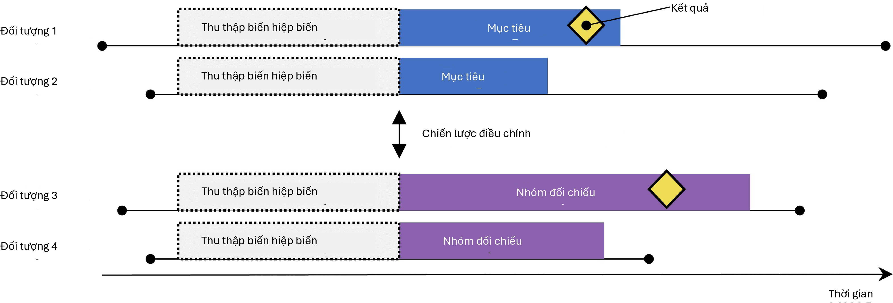{width="4.7671872265966755in"
height="1.6218744531933509in"}

Hình 12.1: Thiết kế nhóm thuần tập người dùng mới. Các đối tượng được
quan sát bắt đầu điều trị mục tiêu được so sánh với những đối tượng
bắt đầu điều trị đối chứng. Để điều chỉnh sự khác biệt giữa hai nhóm
điều trị, có thể sử dụng một số chiến lược điều chỉnh, chẳng hạn như
phân tầng, ghép cặp hoặc trọng số theo điểm xu hướng, hoặc bằng cách
thêm các đặc điểm nền vào mô hình kết cục. Các đặc điểm được bao gồm
trong mô hình điểm xu hướng hoặc mô hình kết cục được ghi lại trước
khi bắt đầu điều trị.

Phương pháp nhóm thuần tập cố gắng mô phỏng một thử nghiệm lâm sàng
ngẫu nhiên. (Hernan và Robins, 2016) Các đối tượng được quan sát bắt
đầu một phương pháp điều trị (mục tiêu) được so sánh với các đối tượng
bắt đầu một phương pháp điều trị khác (đối chứng) và được theo dõi
trong một khoảng thời gian cụ thể sau khi bắt đầu điều trị, ví dụ như
khoảng thời gian họ duy trì việc điều trị. Chúng ta có thể chỉ định
các câu hỏi mà chúng ta muốn trả lời trong một nghiên cứu nhóm thuần
tập bằng cách đưa ra năm lựa chọn được nêu bật trong Bảng 12.1.

Bảng 12.1: Các lựa chọn thiết kế chính trong thiết kế nhóm thuần tập
so sánh.

Lựa chọn Mô tả

Nhóm thuần tập mục tiêu Một nhóm thuần tập đại diện cho phương pháp
điều trị mục tiêu Nhóm thuần tập đối chứng Một nhóm thuần tập đại diện
cho phương pháp điều trị đối chứng Nhóm thuần tập kết cục Một nhóm
thuần tập đại diện cho kết cục được quan tâm

Thời gian có nguy cơ Tại thời điểm nào (thường liên quan đến ngày bắt
đầu và kết thúc của nhóm thuần tập mục tiêu và đối chứng) chúng ta xem
xét nguy cơ xảy ra kết cục?

Mô hình Mô hình được sử dụng để ước tính hiệu quả trong khi điều chỉnh
sự khác biệt giữa mục tiêu và đối chứng

Việc lựa chọn mô hình chỉ định, trong số những thứ khác, loại mô hình
kết cục. Ví dụ, chúng ta có thể sử dụng hồi quy logistic, đánh giá xem
kết cục có xảy ra hay không và tạo ra một tỷ số chênh (odds ratio).
Hồi quy logistic giả định thời gian có nguy cơ có cùng độ dài cho cả
mục tiêu và đối chứng, hoặc là không liên quan. Ngoài ra, chúng ta có
thể

chọn hồi quy Poisson để ước tính tỷ suất mới mắc, giả định tỷ suất mới
mắc không đổi. Thông thường, hồi quy Cox được sử dụng để xem xét thời
gian đến kết cục đầu tiên nhằm ước tính tỷ số nguy cơ (hazard ratio),
giả định các nguy cơ tỷ lệ giữa mục tiêu và đối chứng.

![The new-user cohort method inherently is a method for comparative
effect esti-mation, comparing one treatment to another. It is difficult
to use this method to compare a treatment against no treatment, since it
is hard to define a group of un-exposed people that is comparable with
the exposed group. If one wants to use this design for direct effect
estimation, the preferred way is to select a comparator treatment for
the same indication as the exposure of interest, where the compara-tor
treatment is believed to have no effect on the outcome. Unfortunately,
such a comparator might not always be
available.](media/image6.png){width="0.45499890638670165in"
height="0.45499890638670165in"}

Một mối quan tâm chính là bệnh nhân nhận phương pháp điều trị mục tiêu
có thể khác biệt một cách có hệ thống với những bệnh nhân nhận phương
pháp điều trị đối chứng. Ví dụ, giả sử nhóm thuần tập mục tiêu trung
bình 60 tuổi, trong khi nhóm thuần tập đối chứng trung bình 40 tuổi.
Việc so sánh mục tiêu với đối chứng đối với bất kỳ kết cục sức khỏe
liên quan đến tuổi nào (ví dụ: đột quỵ) sau đó có thể cho thấy sự khác
biệt đáng kể giữa các nhóm. Một nhà nghiên cứu thiếu thông tin có thể
đi đến kết luận rằng có một mối liên hệ nhân quả giữa phương pháp điều
trị mục tiêu và đột quỵ so với phương pháp đối chứng. Một cách đơn
giản hơn hoặc phổ biến hơn, nhà nghiên cứu có thể kết luận rằng tồn
tại những bệnh nhân mục tiêu bị đột quỵ mà lẽ ra họ sẽ không bị nếu họ
nhận phương pháp đối chứng. Kết luận này có thể hoàn toàn không chính
xác! Có lẽ những bệnh nhân mục tiêu đó bị đột quỵ một cách không tương
xứng chỉ vì họ già hơn; có lẽ những bệnh nhân mục tiêu bị đột quỵ có
thể đã bị ngay cả khi họ nhận phương pháp đối chứng. Trong bối cảnh
này, tuổi tác là một "yếu tố gây nhiễu". Một cơ chế để đối phó với các
yếu tố gây nhiễu trong các nghiên cứu quan sát là thông qua điểm xu
hướng.

### Điểm xu hướng

Trong một thử nghiệm ngẫu nhiên, việc tung đồng xu (ảo) sẽ chỉ định
bệnh nhân vào các nhóm tương ứng của họ. Do đó, theo thiết kế, xác
suất một bệnh nhân nhận phương pháp điều trị mục tiêu so với phương
pháp đối chứng không liên quan theo bất kỳ cách nào đến các đặc điểm
của bệnh nhân như tuổi tác. Đồng xu không biết gì về bệnh nhân, và hơn
nữa, chúng ta biết chắc chắn xác suất chính xác mà một bệnh nhân nhận
được phương pháp tiếp xúc mục tiêu. Kết quả là, và với sự tự tin ngày
càng tăng khi số lượng bệnh nhân trong thử nghiệm tăng lên, hai nhóm
bệnh nhân về cơ bản không thể khác biệt một cách có hệ thống đối với
bất kỳ đặc điểm nào của bệnh nhân. Sự cân bằng được đảm bảo này đúng
với các đặc điểm mà thử nghiệm đã đo lường (chẳng hạn như tuổi tác)
cũng như các đặc điểm mà thử nghiệm không đo lường được, chẳng hạn như
các yếu tố di truyền của bệnh nhân.

Đối với một bệnh nhân nhất định, điểm xu hướng (PS) là xác suất bệnh
nhân đó nhận phương pháp điều trị mục tiêu so với đối chứng.
(Rosenbaum và Rubin, 1983) Trong một thử nghiệm ngẫu nhiên hai nhánh
cân bằng, điểm xu hướng là 0,5 cho mọi bệnh nhân. Trong một nghiên cứu
quan sát được điều chỉnh bằng điểm xu hướng, chúng ta ước tính xác
suất một bệnh nhân nhận

phương pháp điều trị mục tiêu dựa trên những gì chúng ta có thể quan
sát được trong dữ liệu tại và trước thời điểm bắt đầu điều trị (bất kể
phương pháp điều trị họ thực sự nhận được). Đây là một ứng dụng mô
hình dự báo đơn giản; chúng ta khớp một mô hình (ví dụ: hồi quy
logistic) dự đoán liệu một đối tượng có nhận phương pháp điều trị mục
tiêu hay không và sử dụng mô hình này để tạo xác suất dự đoán (PS) cho
mỗi đối tượng. Không giống như trong một thử nghiệm ngẫu nhiên tiêu
chuẩn, các bệnh nhân khác nhau sẽ có xác suất nhận phương pháp điều
trị mục tiêu khác nhau. PS có thể được sử dụng theo một số cách bao
gồm ghép cặp các đối tượng mục tiêu với các đối tượng đối chứng có PS
tương tự, phân tầng quần thể nghiên cứu dựa trên PS, hoặc sử dụng
trọng số cho các đối tượng bằng cách sử dụng Trọng số xác suất nghịch
đảo của điều trị (IPTW) bắt nguồn từ PS. Khi ghép cặp, chúng ta có thể
chọn chỉ một đối tượng đối chứng cho mỗi đối tượng mục tiêu, hoặc
chúng ta có thể cho phép nhiều hơn một đối tượng đối chứng cho mỗi đối
tượng mục tiêu, một kỹ thuật được gọi là ghép cặp tỷ lệ biến đổi.
(Rassen và cộng sự, 2012)

Ví dụ, giả sử chúng ta sử dụng ghép cặp PS một-một, và Jan có xác suất
a priori là 0,4 nhận phương pháp điều trị mục tiêu và trên thực tế
nhận phương pháp điều trị mục tiêu. Nếu chúng ta có thể tìm thấy một
bệnh nhân (tên là Jun) cũng có xác suất a priori là 0,4 nhận phương
pháp điều trị mục tiêu nhưng trên thực tế nhận phương pháp đối chứng,
việc so sánh kết cục của Jan và Jun giống như một thử nghiệm ngẫu
nhiên nhỏ, ít nhất là đối với các yếu tố gây nhiễu đã đo lường. Việc
so sánh này sẽ mang lại một ước tính về sự tương phản nhân quả Jan-Jun
tốt như những gì mà sự ngẫu nhiên hóa đã tạo ra. Việc ước tính sau đó
tiến hành như sau: đối với mọi bệnh nhân nhận phương pháp mục tiêu,
hãy tìm một hoặc nhiều bệnh nhân được ghép cặp đã nhận phương pháp đối
chứng nhưng có cùng xác suất tiên nghiệm nhận phương pháp mục tiêu. So
sánh kết cục cho bệnh nhân mục tiêu với các kết cục cho các bệnh nhân
đối chứng trong mỗi nhóm được ghép cặp này.

Điểm xu hướng kiểm soát các yếu tố gây nhiễu đã đo lường. Trên thực
tế, nếu việc chỉ định điều trị là "có thể bỏ qua một cách mạnh mẽ"
(strongly ignorable) dựa trên các đặc điểm đã đo lường, điểm xu hướng
sẽ mang lại một ước tính không thiên lệch về hiệu quả nhân quả. "Có
thể bỏ qua một cách mạnh mẽ" về cơ bản có nghĩa là không có yếu tố gây
nhiễu chưa đo lường nào, và các yếu tố gây nhiễu đã đo lường được điều
chỉnh một cách thích hợp. Thật không may, đây không phải là một giả
định có thể kiểm chứng được. Xem Chương 18 để thảo luận thêm về vấn đề
này.

### Lựa chọn biến

Trước đây, PS được tính toán dựa trên các đặc điểm được chọn thủ công,
và mặc dù các công cụ OHDSI có thể hỗ trợ những phương pháp như vậy,
chúng tôi ưu tiên sử dụng nhiều đặc điểm chung (tức là các đặc điểm
không được chọn dựa trên các phơi nhiễm và kết cục cụ thể trong nghiên
cứu). (Tian et al., 2018) Những đặc điểm này bao gồm nhân khẩu học,
cũng như tất cả các chẩn đoán, phơi nhiễm thuốc, đo lường và thủ thuật
y tế được quan sát trước và vào ngày bắt đầu điều trị. Một mô hình
thường bao gồm từ 10.000 đến 100.000 đặc điểm duy nhất, được chúng tôi
khớp bằng hồi quy chuẩn hóa quy mô lớn (Suchard et al., 2013) được
triển khai trong gói Cyclops. Về cơ bản, chúng tôi để dữ liệu quyết
định những đặc điểm nào có khả năng dự đoán việc phân bổ điều trị và
nên được đưa vào mô hình.

{width="0.45499890638670165in"
height="0.45499890638670165in"}

We typically include the day of treatment
initiation in the covariate capture window because many relevant data
points such as the diagnosis leading to the treatment are recorded on
that date. On this day the target and comparator treatment themselves
are also recorded, but these should *not* be included in the
propensity model, because they are the very thing we are trying to
predict. We must therefore explicitly exclude the target and
comparator treatment from the set of covariates

Một số người cho rằng cách tiếp cận dựa trên dữ liệu để lựa chọn đồng
biến mà không phụ thuộc vào chuyên môn lâm sàng để xác định cấu trúc
nhân quả \"đúng\" sẽ có nguy cơ vô tình đưa vào các biến gọi là biến
công cụ và biến nhiễu (colliders), từ đó làm tăng phương sai và có khả
năng gây sai lệch. (Hernan et al., 2002) Tuy nhiên, những lo ngại này
khó có tác động lớn trong các tình huống thực tế. (Schneeweiss, 2018)
Hơn nữa, trong y học, cấu trúc nhân quả thực sự hiếm khi được biết rõ,
và khi các nhà nghiên cứu khác nhau được yêu cầu xác định các đồng
biến \'đúng\' để đưa vào cho một câu hỏi nghiên cứu cụ thể, mỗi nhà
nghiên cứu luôn đưa ra một danh sách khác nhau, do đó làm cho quá
trình này không thể tái lập. Quan trọng nhất, các chẩn đoán của chúng
tôi như kiểm tra mô hình xu hướng, đánh giá sự cân bằng trên tất cả
các đồng biến và đưa vào các kiểm soát âm tính sẽ xác định hầu hết các
vấn đề liên quan đến biến nhiễu và biến công cụ.

### Caliper (Khoảng dung sai)

Vì điểm xu hướng nằm trên một thang liên tục từ 0 đến 1, việc khớp
chính xác hiếm khi khả thi. Thay vào đó, quá trình khớp tìm ra những
bệnh nhân khớp với điểm xu hướng của (các) bệnh nhân mục tiêu trong
một giới hạn dung sai được gọi là "caliper". Theo Austin (2011), chúng
tôi sử dụng caliper mặc định là 0,2 độ lệch chuẩn trên thang logit.

### Độ chồng lấp: Điểm ưu tiên (Preference Scores)

Phương pháp điểm xu hướng đòi hỏi phải có những bệnh nhân phù hợp để
khớp! Do đó, một chẩn đoán quan trọng cho thấy sự phân bố của điểm xu
hướng trong hai nhóm. Để tạo điều kiện thuận lợi cho việc diễn giải,
các công cụ OHDSI vẽ biểu đồ một phép biến đổi của điểm xu hướng được
gọi là "điểm ưu tiên". (Walker et al., 2013) Điểm ưu tiên điều chỉnh
cho "thị phần" của hai phương pháp điều trị. Ví dụ, nếu 10% bệnh nhân
nhận điều trị mục tiêu (và 90% nhận điều trị so sánh), thì những bệnh
nhân có điểm ưu tiên là 0,5 có 10% xác suất nhận điều trị mục tiêu. Về
mặt toán học, điểm ưu tiên là

ln ( [𝜞]{.underline} ) = ln ( [𝑆]{.underline} ) − ln ( [𝑃]{.underline}
)

1 − 𝜞 1 − 𝑆 1 − 𝑃

Trong đó 𝜞 là điểm ưu tiên, 𝑆 là điểm xu hướng, và 𝑃 là tỷ lệ bệnh
nhân nhận điều trị mục tiêu.

Walker et al. (2013) thảo luận về khái niệm "cân bằng thực nghiệm"
(empirical equipoise). Họ chấp nhận các cặp phơi nhiễm là xuất phát từ
sự cân bằng thực nghiệm nếu ít nhất một nửa số ca phơi nhiễm là ở
những bệnh nhân có điểm ưu tiên từ 0,3 đến 0,7.

Bảng 12.2: Các lựa chọn thiết kế chính trong thiết kế nhóm thuần tập
tự kiểm soát.

Lựa chọn Mô tả

Nhóm thuần tập mục tiêu Một nhóm thuần tập đại diện cho phương pháp
điều trị

Nhóm thuần tập kết cục Một nhóm thuần tập đại diện cho kết cục quan
tâm

Thời gian có nguy cơ Tại thời điểm nào (thường so với ngày bắt đầu và
ngày kết thúc của nhóm thuần tập mục tiêu) chúng ta xem xét nguy cơ
xảy ra kết cục?

Thời gian kiểm soát Khoảng thời gian được sử dụng làm thời gian kiểm
soát

### Sự cân bằng

Thực hành tốt luôn kiểm tra xem việc điều chỉnh PS có thành công trong
việc tạo ra các nhóm bệnh nhân cân bằng hay không. Hình 12.19 hiển thị
kết quả đầu ra OHDSI chuẩn để kiểm tra sự cân bằng. Đối với mỗi đặc
điểm bệnh nhân, biểu đồ này vẽ ra sự khác biệt chuẩn hóa giữa các giá
trị trung bình của hai nhóm phơi nhiễm trước và sau khi điều chỉnh PS.
Một số hướng dẫn khuyến nghị ngưỡng trên của sự khác biệt chuẩn hóa
sau điều chỉnh là 0,1. (Rubin, 2001)

## Thiết kế nhóm thuần tập tự kiểm soát

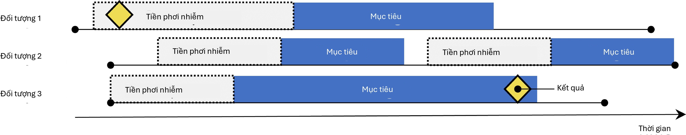{width="4.649166666666667in"
height="0.9158333333333334in"}

Hình 12.2: Thiết kế nhóm thuần tập tự kiểm soát. Tỷ lệ kết cục trong
thời gian phơi nhiễm với mục tiêu được so sánh với tỷ lệ kết cục trong
thời gian trước phơi nhiễm.

Thiết kế nhóm thuần tập tự kiểm soát (SCC) (Ryan et al., 2013a) so
sánh tỷ lệ kết cục trong thời gian phơi nhiễm với tỷ lệ kết cục trong
thời gian ngay trước khi phơi nhiễm. Bốn lựa chọn được hiển thị trong
Bảng 12.2 xác định một câu hỏi nhóm thuần tập tự kiểm soát.

Vì cùng một đối tượng tạo nên nhóm phơi nhiễm cũng được sử dụng làm
nhóm kiểm soát, nên không cần thực hiện điều chỉnh cho các khác biệt
giữa các cá nhân. Tuy nhiên, phương pháp này dễ bị ảnh hưởng bởi những
khác biệt khác, chẳng hạn như sự khác biệt về nguy cơ cơ bản của kết
cục giữa các khoảng thời gian khác nhau.

## Thiết kế bệnh chứng (Case-Control)

Các nghiên cứu bệnh chứng (Vandenbroucke và Pearce, 2012) xem xét câu
hỏi "liệu những người có kết cục bệnh cụ thể có bị phơi nhiễm thường
xuyên hơn với một tác nhân cụ thể so với những người không mắc bệnh
không?". Do đó, ý tưởng trung tâm là so sánh các "ca bệnh", tức là các
đối tượng

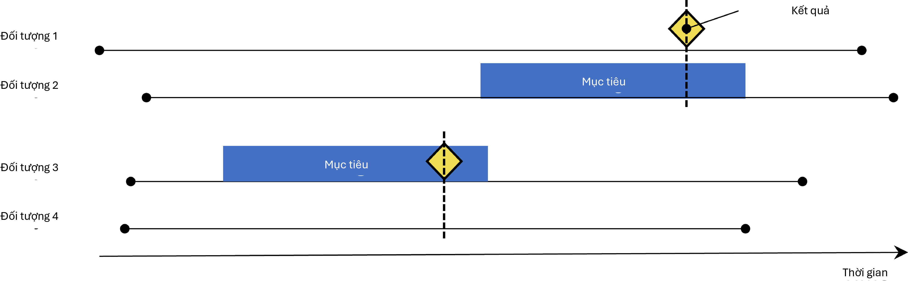{width="4.649165573053368in"
height="1.4408333333333334in"}

Hình 12.3: Thiết kế bệnh chứng. Các đối tượng có kết cục ('ca bệnh')
được so sánh với các đối tượng không có kết cục ('nhóm chứng') về tình
trạng phơi nhiễm của họ. Thông thường, các ca bệnh và nhóm chứng được
khớp dựa trên các đặc điểm khác nhau như tuổi và giới tính.

Bảng 12.3: Các lựa chọn thiết kế chính trong thiết kế bệnh chứng.

Lựa chọn Mô tả

Nhóm thuần tập kết cục Một nhóm thuần tập đại diện cho các ca bệnh
(kết cục quan tâm) Nhóm thuần tập kiểm soát Một nhóm thuần tập đại
diện cho nhóm chứng. Thông thường nhóm thuần tập kiểm soát được tự
động trích xuất từ nhóm thuần tập kết cục

sử dụng một số logic lựa chọn

Nhóm thuần tập mục tiêu Một nhóm thuần tập đại diện cho phương pháp
điều trị

Nhóm thuần tập lồng ghép Tùy chọn, một nhóm thuần tập xác định phân
nhóm mà từ đó các ca bệnh và nhóm chứng được rút ra

Thời gian có nguy cơ Tại thời điểm nào (thường so với ngày chỉ mục)
chúng ta xem xét tình trạng phơi nhiễm?

trải qua kết cục quan tâm, với các "nhóm chứng", tức là các đối tượng
không trải qua kết cục quan tâm. Các lựa chọn trong Bảng 12.3 xác định
một câu hỏi bệnh chứng.

Thông thường, người ta chọn nhóm chứng để khớp với các ca bệnh dựa
trên các đặc điểm như tuổi và giới tính để làm cho chúng có thể so
sánh được hơn. Một thực hành phổ biến khác là lồng ghép phân tích
trong một phân nhóm người cụ thể, ví dụ những người đều đã được chẩn
đoán mắc một trong các chỉ định của phơi nhiễm quan
tâm.

## Thiết kế Case-Crossover (Chéo bệnh-phơi nhiễm)

Thiết kế case-crossover (Maclure, 1991) đánh giá liệu tỷ lệ phơi nhiễm
có khác biệt tại thời điểm xảy ra kết cục so với một số ngày xác định
trước đó hay không. Nó đang cố gắng xác định liệu có điều gì đặc biệt
về ngày xảy ra kết cục hay không. Bảng 12.4 hiển thị các lựa chọn xác
định một câu hỏi case-crossover.

Các ca bệnh đóng vai trò là nhóm chứng của chính họ. Là các thiết kế
tự kiểm soát, chúng sẽ vững chắc trước sự gây nhiễu do khác biệt giữa
các cá nhân. Một mối lo ngại là, vì ngày kết-

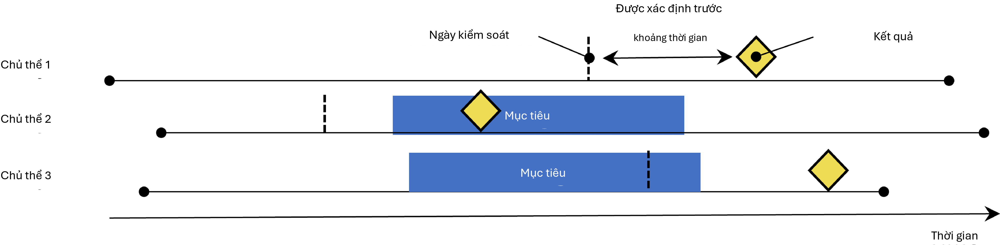{width="4.649166666666667in"
height="1.1389577865266842in"}

Hình 12.4: Thiết kế case-crossover. Thời gian xung quanh kết cục được
so sánh với một ngày kiểm soát được đặt tại một khoảng thời gian xác
định trước ngày kết cục.

Bảng 12.4: Các lựa chọn thiết kế chính trong thiết kế case-crossover.

Lựa chọn Mô tả

Nhóm thuần tập kết cục Một nhóm thuần tập đại diện cho các ca bệnh
(kết cục quan tâm) Nhóm thuần tập mục tiêu Một nhóm thuần tập đại diện
cho phương pháp điều trị

Thời gian có nguy cơ Tại thời điểm nào (thường so với ngày chỉ mục)
chúng ta xem xét tình trạng phơi nhiễm?

Thời gian kiểm soát Khoảng thời gian được sử dụng làm thời gian kiểm
soát

cục luôn diễn ra sau ngày kiểm soát, phương pháp này sẽ bị sai lệch
dương tính nếu tần suất phơi nhiễm tổng thể tăng theo thời gian (hoặc
sai lệch âm tính nếu có sự sụt giảm). Để giải quyết vấn đề này, thiết
kế case-time-control (Suissa, 1995) đã được phát triển, bổ sung thêm
nhóm chứng, ví dụ được khớp về tuổi và giới tính, vào thiết kế
case-crossover để điều chỉnh cho các xu hướng phơi
nhiễm.

## Thiết kế chuỗi ca bệnh tự kiểm soát (Self-Controlled Case Series)

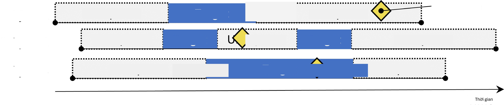{width="4.649166666666667in"
height="0.9756244531933508in"}

Hình 12.5: Thiết kế chuỗi ca bệnh tự kiểm soát. Tỷ lệ kết cục trong
thời gian phơi nhiễm được so sánh với tỷ lệ kết cục khi không phơi
nhiễm.

Thiết kế Chuỗi ca bệnh tự kiểm soát (SCCS) (Farrington, 1995; Whitaker
et al., 2006) so sánh tỷ lệ kết cục trong thời gian phơi nhiễm với tỷ
lệ kết cục trong tất cả thời gian không phơi nhiễm, bao gồm trước,
giữa và sau khi phơi nhiễm. Đây là một hồi quy Poisson được điều kiện
hóa trên từng cá nhân. Do đó, nó tìm cách trả lời câu hỏi: "Với việc
một bệnh nhân có kết cục, liệu kết cục có khả năng xảy ra cao hơn
trong thời gian phơi nhiễm so với

Bảng 12.5: Các lựa chọn thiết kế chính trong thiết kế chuỗi ca bệnh tự
kiểm soát.

Lựa chọn Mô tả

Nhóm thuần tập mục tiêu Một nhóm thuần tập đại diện cho phương pháp
điều trị

Nhóm thuần tập kết cục Một nhóm thuần tập đại diện cho kết cục quan
tâm

Thời gian có nguy cơ Tại thời điểm nào (thường so với ngày bắt đầu và
ngày kết thúc của nhóm thuần tập mục tiêu) chúng ta xem xét nguy cơ
xảy ra kết cục?

Mô hình Mô hình để ước tính hiệu quả, bao gồm bất kỳ điều chỉnh nào
cho các yếu tố gây nhiễu thay đổi theo thời gian

thời gian không phơi nhiễm?". Các lựa chọn trong Bảng 12.5 xác định
một câu hỏi SCCS.

Giống như các thiết kế tự kiểm soát khác, SCCS vững chắc trước sự gây
nhiễu do khác biệt giữa các cá nhân, nhưng dễ bị tổn thương trước sự
gây nhiễu do các tác động thay đổi theo thời gian. Một số điều chỉnh
có thể thực hiện để cố gắng giải quyết các vấn đề này, ví dụ bằng cách
đưa vào tuổi và mùa. Một biến thể đặc biệt của SCCS bao gồm không chỉ
phơi nhiễm quan tâm, mà tất cả các phơi nhiễm khác với thuốc được ghi
lại trong cơ sở dữ liệu (Simpson et al., 2013), có khả năng bổ sung
hàng ngàn biến bổ sung vào mô hình. Chuẩn hóa L1 sử dụng kiểm chứng
chéo để chọn siêu tham số chuẩn hóa được áp dụng cho các hệ số của tất
cả các phơi nhiễm ngoại trừ phơi nhiễm quan tâm.

Một giả định quan trọng làm nền tảng cho SCCS là thời điểm kết thúc
giai đoạn quan sát độc lập với ngày xảy ra kết cục. Đối với một số kết
cục, đặc biệt là những kết cục có thể gây tử vong như đột quỵ, giả
định này có thể bị vi phạm. Một phần mở rộng cho SCCS đã được phát
triển để hiệu chỉnh cho bất kỳ sự phụ thuộc nào như vậy. (Farrington
et al., 2011)

## Thiết kế một nghiên cứu về tăng huyết áp

### Định nghĩa vấn đề

Thuốc ức chế men chuyển (ACEi) được sử dụng rộng rãi ở bệnh nhân tăng
huyết áp hoặc bệnh tim thiếu máu cục bộ, đặc biệt là những người có
các bệnh đồng mắc khác như suy tim sung huyết, đái tháo đường hoặc
bệnh thận mãn tính. (Zaman et al., 2002) Phù mạch, một biến cố bất lợi
nghiêm trọng và đôi khi đe dọa tính mạng thường biểu hiện dưới dạng
sưng môi, lưỡi, miệng, thanh quản, hầu hoặc vùng quanh hốc mắt, đã
được liên kết với việc sử dụng các loại thuốc này. (Sabroe và Black,
1997) Tuy nhiên, thông tin hạn chế về các nguy cơ tuyệt đối và tương
đối đối với phù mạch liên quan đến việc sử dụng các loại thuốc này.
Bằng chứng hiện có chủ yếu dựa trên các cuộc điều tra về các nhóm
thuần tập cụ thể (ví dụ: cựu chiến binh nam giới hoặc những người thụ
hưởng Medicaid) mà các phát hiện của họ có thể không tổng quát hóa
được cho các quần thể khác, hoặc dựa trên các cuộc điều tra với ít
biến cố, cung cấp các ước tính nguy cơ không ổn định. (Powers et al.,
2012) Một số nghiên cứu quan sát so sánh ACEi với thuốc chẹn beta về
nguy cơ phù mạch, (Magid et al., 2010; Toh et al., 2012) nhưng thuốc
chẹn beta không còn được khuyến nghị là phương pháp điều trị đầu tay
cho tăng huyết áp. (Whelton et al., 2018) Một phương pháp điều trị
thay thế khả thi có thể là thiazide hoặc thuốc lợi tiểu giống thiazide

(THZ), có thể hiệu quả như nhau trong việc kiểm soát tăng huyết áp và
các nguy cơ liên quan như nhồi máu cơ tim cấp (AMI), nhưng không làm
tăng nguy cơ phù mạch.

Phần sau đây sẽ chứng minh cách áp dụng khung ước tính cấp độ quần thể
của chúng tôi vào dữ liệu chăm sóc sức khỏe quan sát để giải quyết các
câu hỏi ước tính so sánh sau:

Nguy cơ phù mạch ở những người mới sử dụng thuốc ức chế men chuyển so
với những người mới sử dụng thuốc thiazide và thuốc lợi tiểu giống
thiazide là gì?

Nguy cơ nhồi máu cơ tim cấp ở những người mới sử dụng thuốc ức chế men
chuyển so với những người mới sử dụng thuốc thiazide và thuốc lợi tiểu
giống thiazide là gì?

Vì đây là các câu hỏi ước tính hiệu quả so sánh, chúng tôi sẽ áp dụng
phương pháp nhóm thuần tập như được mô tả trong Phần 12.1.

### Mục tiêu và Đối tượng so sánh

Chúng tôi coi bệnh nhân là người mới sử dụng nếu lần điều trị tăng
huyết áp đầu tiên được quan sát của họ là đơn trị liệu với bất kỳ hoạt
chất nào trong nhóm ACEi hoặc THZ. Chúng tôi định nghĩa đơn trị liệu
là không bắt đầu sử dụng bất kỳ loại thuốc chống tăng huyết áp nào
khác trong bảy ngày sau khi bắt đầu điều trị. Chúng tôi yêu cầu bệnh
nhân phải có ít nhất một năm quan sát liên tục trước đó trong cơ sở dữ
liệu trước khi phơi nhiễm lần đầu và có chẩn đoán tăng huyết áp được
ghi lại tại thời điểm hoặc trong năm trước khi bắt đầu điều trị.

### Kết cục

Chúng tôi định nghĩa phù mạch là bất kỳ sự xuất hiện nào của khái niệm
tình trạng phù mạch trong chuyến thăm nội trú hoặc phòng cấp cứu (ER),
và yêu cầu không có chẩn đoán phù mạch nào được ghi lại trong bảy ngày
trước đó. Chúng tôi định nghĩa AMI là bất kỳ sự xuất hiện nào của khái
niệm tình trạng AMI trong chuyến thăm nội trú hoặc ER, và yêu cầu
không có hồ sơ chẩn đoán AMI nào trong 180 ngày trước đó.

### Thời gian có nguy cơ

Chúng tôi định nghĩa thời gian có nguy cơ bắt đầu vào ngày sau khi bắt
đầu điều trị, và dừng lại khi kết thúc phơi nhiễm, cho phép khoảng
cách 30 ngày giữa các lần phơi nhiễm thuốc tiếp theo.

### Mô hình

Chúng tôi khớp mô hình PS bằng cách sử dụng tập hợp các đồng biến mặc
định, bao gồm nhân khẩu học, tình trạng bệnh, thuốc, thủ thuật, đo
lường, quan sát và một số điểm số bệnh đồng mắc. Chúng tôi loại trừ
ACEi và THZ khỏi các đồng biến. Chúng tôi thực hiện khớp tỷ lệ biến
đổi và điều kiện hóa hồi quy Cox trên các tập hợp đã khớp.

### Tóm tắt nghiên cứu

###

Bảng 12.6: Các lựa chọn thiết kế chính cho nghiên cứu nhóm thuần tập
so sánh của chúng tôi.

Lựa chọn Giá trị

Nhóm thuần tập mục tiêu Người mới sử dụng thuốc ức chế men chuyển làm
đơn trị liệu đầu tay cho tăng huyết áp.

Nhóm thuần tập so sánh Người mới sử dụng thuốc thiazide hoặc thuốc lợi
tiểu giống thiazide làm đơn trị liệu đầu tay cho tăng huyết áp.

Nhóm thuần tập kết cục Phù mạch hoặc nhồi máu cơ tim cấp.

Thời gian có nguy cơ Bắt đầu ngày sau khi bắt đầu điều trị, dừng lại
khi kết thúc phơi nhiễm.

Mô hình Mô hình nguy cơ tỷ lệ Cox sử dụng khớp tỷ lệ biến đổi.

### Các câu hỏi kiểm soát

Để đánh giá liệu thiết kế nghiên cứu của chúng tôi có tạo ra các ước
tính phù hợp với sự thật hay không, chúng tôi bổ sung thêm một tập hợp
các câu hỏi kiểm soát nơi biết rõ kích thước hiệu quả thực sự. Các câu
hỏi kiểm soát có thể được chia thành các kiểm soát âm tính, có tỷ số
nguy cơ bằng 1, và kiểm soát dương tính, có tỷ số nguy cơ đã biết lớn
hơn 1. Vì nhiều lý do, chúng tôi sử dụng các kiểm soát âm tính thực tế
và tổng hợp các kiểm soát dương tính dựa trên các kiểm soát âm tính
này. Cách xác định và sử dụng các câu hỏi kiểm soát được thảo luận chi
tiết trong Chương 18.

## Triển khai nghiên cứu bằng ATLAS

Tại đây, chúng tôi chứng minh cách nghiên cứu này có thể được triển
khai bằng hàm Estimation (Ước tính) trong ATLAS. Nhấp vào trong thanh
bên trái của ATLAS và tạo một nghiên cứu ước tính mới. Hãy chắc chắn
đặt cho nghiên cứu một cái tên dễ nhận biết. Thiết kế nghiên cứu có
thể được lưu bất cứ lúc nào bằng cách nhấp vào nút
.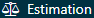{width="0.9790430883639545in"
height="0.18747594050743657in"}{width="0.18747594050743657in"
height="0.18747594050743657in"}

Trong hàm thiết kế Ước tính, có ba phần: So sánh, Cài đặt phân tích và
Cài đặt đánh giá. Chúng ta có thể chỉ định nhiều so sánh và nhiều cài
đặt phân tích, và ATLAS sẽ thực hiện tất cả các kết hợp này dưới dạng
các phân tích riêng biệt. Tại đây, chúng tôi thảo luận từng phần:

### Cài đặt nhóm thuần tập so sánh

Một nghiên cứu có thể có một hoặc nhiều so sánh. Nhấp vào "Add
Comparison" (Thêm so sánh), thao tác này sẽ mở ra một hộp thoại mới.
Nhấp vào để chọn các nhóm thuần tập mục tiêu và so sánh. Bằng cách
nhấp vào "Add Outcome" (Thêm kết cục), chúng ta có thể thêm hai nhóm
thuần tập kết cục của mình. Chúng tôi giả định rằng các nhóm thuần tập
đã được tạo trong ATLAS như được mô tả trong Chương 10. Phụ lục cung
cấp các định nghĩa đầy đủ về các nhóm thuần tập mục tiêu (Phụ lục
B.2), so sánh (Phụ lục B.5) và kết cục (Phụ lục B.4 và Phụ lục B.3).
Khi hoàn tất, hộp thoại sẽ trông giống như Hình
12.6.{width="0.20830599300087488in"
height="0.18747594050743657in"}

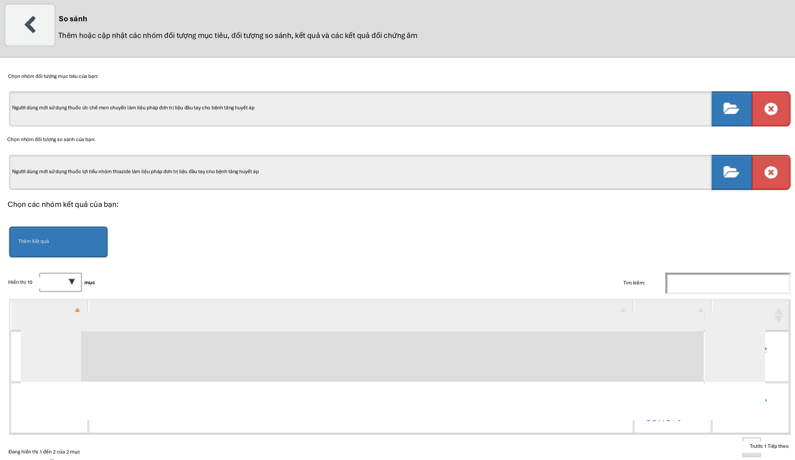{width="5.330416666666666in"
height="3.0891655730533683in"}

Hình 12.6: Hộp thoại so sánh

Lưu ý rằng chúng ta có thể chọn nhiều kết cục cho một cặp mục tiêu-so
sánh. Mỗi kết cục sẽ được xử lý độc lập và sẽ dẫn đến một phân tích
riêng biệt.

#### Các kết cục kiểm soát âm tính

Các kết cục kiểm soát âm tính là những kết cục được cho là không gây
ra bởi mục tiêu hoặc đối tượng so sánh, và do đó tỷ số nguy cơ thực sự
bằng 1. Lý tưởng nhất là chúng ta nên có các định nghĩa nhóm thuần tập
phù hợp cho từng nhóm thuần tập kết cục. Tuy nhiên, thông thường,
chúng ta chỉ có một tập hợp khái niệm, với một khái niệm cho mỗi kết
cục kiểm soát âm tính, và một số logic chuẩn để biến chúng thành các
nhóm thuần tập kết cục. Tại đây, chúng tôi giả định rằng tập hợp khái
niệm đã được tạo như được mô tả trong Chương 18 và có thể được chọn
đơn giản. Tập hợp khái niệm kiểm soát âm tính nên chứa một khái niệm
cho mỗi kiểm soát âm tính và không bao gồm các hậu duệ. Hình 12.7 hiển
thị tập hợp khái niệm kiểm soát âm tính được sử dụng cho nghiên cứu
này.

#### Các khái niệm cần đưa vào

Khi chọn khái niệm để đưa vào, chúng ta có thể chỉ định những đồng
biến nào chúng ta muốn tạo, ví dụ để sử dụng trong mô hình điểm xu
hướng. Khi chỉ định các đồng biến ở đây, tất cả các đồng biến khác
(ngoài những đồng biến bạn đã chỉ định) sẽ bị loại bỏ. Chúng tôi
thường muốn đưa vào tất cả các đồng biến cơ bản, để hồi quy chuẩn hóa
xây dựng một mô hình cân bằng tất cả các đồng biến. Lý do duy nhất
chúng ta có thể muốn chỉ định các đồng biến cụ thể là để tái lập một
nghiên cứu hiện có đã chọn thủ công các đồng biến. Những bao hàm này
có thể được chỉ định trong phần so sánh này hoặc trong phần phân tích,
vì đôi khi chúng liên quan đến một so sánh cụ thể (ví dụ: các yếu tố
gây nhiễu đã biết trong một so sánh), hoặc đôi khi chúng liên quan đến
một phân tích (ví dụ: khi đánh giá một chiến lược lựa chọn đồng biến
cụ thể).

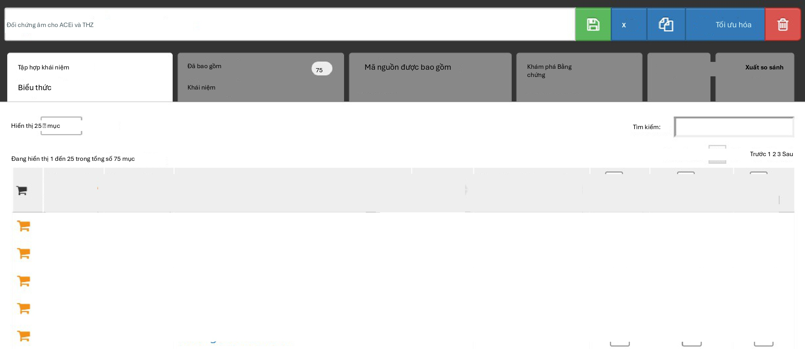{width="5.363748906386702in"
height="2.331874453193351in"}

Hình 12.7: Tập hợp khái niệm Kiểm soát âm tính.

#### Các khái niệm cần loại trừ

Thay vì chỉ định những khái niệm nào cần đưa vào, chúng ta có thể chỉ
định các khái niệm cần loại trừ. Khi chúng ta gửi một tập hợp khái
niệm trong trường này, chúng ta sử dụng mọi đồng biến ngoại trừ những
đồng biến mà chúng ta đã gửi. Khi sử dụng tập hợp các đồng biến mặc
định, bao gồm tất cả các loại thuốc và thủ thuật xảy ra vào ngày bắt
đầu điều trị, chúng ta phải loại trừ phương pháp điều trị mục tiêu và
so sánh, cũng như bất kỳ khái niệm nào liên quan trực tiếp đến chúng.
Ví dụ, nếu phơi nhiễm mục tiêu là thuốc tiêm, chúng ta không chỉ nên
loại trừ thuốc mà còn cả thủ thuật tiêm khỏi mô hình điểm xu hướng.
Trong ví dụ này, các đồng biến chúng ta muốn loại trừ là ACEi và THZ.
Hình 12.8 cho thấy chúng ta chọn một tập hợp khái niệm bao gồm tất cả
các khái niệm này, bao gồm cả các hậu duệ của chúng.

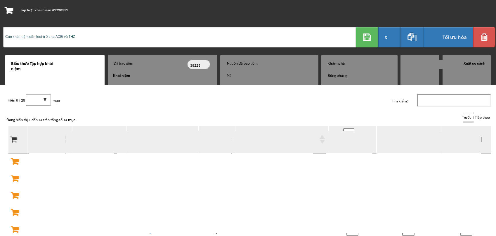{width="5.348437226596675in"
height="2.552811679790026in"}

Hình 12.8: Tập hợp khái niệm xác định các khái niệm cần loại trừ.

Sau khi chọn các kiểm soát âm tính và các đồng biến cần loại trừ, nửa
dưới của hộp thoại so

sánh sẽ trông giống như Hình 12.9.

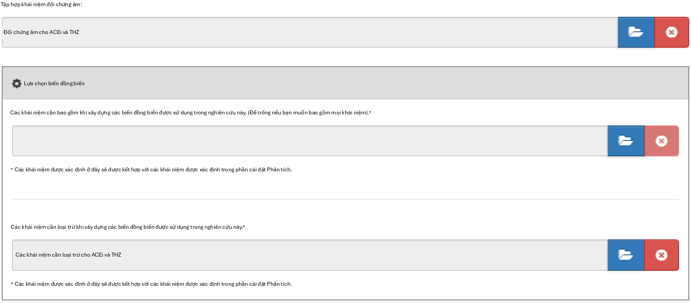{width="5.22739501312336in"
height="2.2961450131233594in"}

Hình 12.9: Cửa sổ so sánh hiển thị các tập hợp khái niệm cho các kiểm
soát âm tính và các khái niệm cần loại trừ.

### Cài đặt phân tích ước tính hiệu quả

Sau khi đóng hộp thoại so sánh, chúng ta có thể nhấp vào "Add Analysis
Settings" (Thêm cài đặt phân tích). Trong hộp có nhãn "Analysis Name"
(Tên phân tích), chúng ta có thể đặt cho phân tích một cái tên duy
nhất dễ nhớ và dễ tìm trong tương lai. Ví dụ, chúng ta có thể đặt tên
là "Propensity score matching" (Khớp điểm xu hướng).

#### Quần thể nghiên cứu

Có rất nhiều tùy chọn để chỉ định quần thể nghiên cứu, là tập hợp các
đối tượng sẽ tham gia vào phân tích. Nhiều tùy chọn trong số này trùng
lặp với các tùy chọn có sẵn khi thiết kế các nhóm thuần tập mục tiêu
và so sánh trong công cụ định nghĩa nhóm thuần tập. Một lý do để sử
dụng các tùy chọn trong Estimation (Ước tính) thay vì trong định nghĩa
nhóm thuần tập là khả năng tái sử dụng; chúng ta có thể định nghĩa các
nhóm thuần tập mục tiêu, so sánh và kết cục hoàn toàn độc lập và thêm
các phụ thuộc giữa chúng tại một thời điểm sau đó. Ví dụ, nếu chúng ta
muốn loại bỏ những người đã có kết cục trước khi bắt đầu điều trị,
chúng ta có thể làm như vậy trong các định nghĩa của nhóm thuần tập
mục tiêu và so sánh, nhưng sau đó chúng ta sẽ cần tạo các nhóm thuần
tập riêng biệt cho mọi kết cục! Thay vào đó, chúng ta có thể chọn loại
bỏ những người có kết cục trước đó trong cài đặt phân tích, và bây giờ
chúng ta có thể tái sử dụng các nhóm thuần tập mục tiêu và so sánh cho
hai kết cục quan tâm của mình (cũng như các kết cục kiểm soát âm tính
của chúng ta).

Ngày bắt đầu và ngày kết thúc nghiên cứu có thể được sử dụng để giới
hạn các phân tích trong một khoảng thời gian cụ thể. Ngày kết thúc
nghiên cứu cũng cắt ngắn các cửa sổ nguy cơ, nghĩa là không có kết cục
nào sau ngày kết thúc nghiên cứu được xem xét. Một lý do để chọn ngày
bắt đầu nghiên cứu có thể là một trong những loại thuốc đang được
nghiên cứu là thuốc mới và không tồn tại trong thời gian trước đó.
Việc tự động điều chỉnh cho điều này có thể được thực hiện bằng cách
trả lời "yes" (có) cho câu hỏi "Restrict the analysis to the period
when both exposures are present in the data?" (Giới hạn phân tích
trong khoảng thời gian khi cả hai phơi nhiễm đều có mặt trong dữ
liệu?). Một lý do khác để điều chỉnh ngày

bắt đầu và kết thúc nghiên cứu có thể là thực hành y tế đã thay đổi
theo thời gian (ví dụ: do cảnh báo về thuốc) và chúng ta chỉ quan tâm
đến thời gian mà y học được thực hành theo một cách cụ thể.

Tùy chọn "Should only the first exposure per subject be included?"
(Chỉ nên bao gồm phơi nhiễm đầu tiên cho mỗi đối tượng?) có thể được
sử dụng để giới hạn ở phơi nhiễm đầu tiên cho mỗi bệnh nhân. Thông
thường, điều này đã được thực hiện trong định nghĩa nhóm thuần tập,
như trường hợp trong ví dụ này. Tương tự, tùy chọn "The minimum
required continuous observation time prior to index date for a person
to be included in the cohort" (Thời gian quan sát liên tục tối thiểu
cần thiết trước ngày chỉ mục để một người được đưa vào nhóm thuần tập)
thường đã được đặt trong định nghĩa nhóm thuần tập, và do đó có thể để
ở mức 0 ở đây. Việc có thời gian quan sát (như được định nghĩa trong
bảng OBSERVATION_PERIOD) trước ngày chỉ mục đảm bảo rằng có đủ thông
tin về bệnh nhân để tính điểm xu hướng, và cũng thường được sử dụng để
đảm bảo bệnh nhân thực sự là người mới sử dụng, và do đó chưa từng
phơi nhiễm trước đó.

"Remove subjects that are in both the target and comparator cohort?"
(Loại bỏ các đối tượng có trong cả nhóm thuần tập mục tiêu và so
sánh?) xác định, cùng với tùy chọn "If a subject is in multiple
cohorts, should time-at-risk be censored when the new time-at-risk
starts to prevent overlap?" (Nếu một đối tượng có trong nhiều nhóm
thuần tập, liệu thời gian có nguy cơ có nên bị kiểm duyệt khi thời
gian có nguy cơ mới bắt đầu để ngăn chặn sự chồng lấp?) điều gì xảy ra
khi một đối tượng có trong cả nhóm thuần tập mục tiêu và so sánh. Cài
đặt đầu tiên có ba lựa chọn:

- "Keep All" (Giữ tất cả) cho biết giữ các đối tượng trong cả hai nhóm
thuần tập. Với tùy chọn này, có thể xảy ra tình trạng đếm trùng các
đối tượng và kết cục.

- "Keep First" (Giữ cái đầu tiên) cho biết giữ đối tượng trong nhóm
thuần tập đầu tiên xuất hiện.

- "Remove All" (Loại bỏ tất cả) cho biết loại bỏ đối tượng khỏi cả hai
nhóm thuần tập.

Nếu các tùy chọn "keep all" hoặc "keep first" được chọn, chúng ta có
thể muốn kiểm duyệt thời gian khi một người có trong cả hai nhóm thuần
tập. Điều này được minh họa trong Hình 12.10. Theo mặc định, thời gian
có nguy cơ được định nghĩa tương đối so với ngày bắt đầu và ngày kết
thúc nhóm thuần tập. Trong ví dụ này, thời gian có nguy cơ bắt đầu một
ngày sau khi nhập nhóm thuần tập và dừng lại khi kết thúc nhóm thuần
tập. Nếu không kiểm duyệt, thời gian có nguy cơ cho hai nhóm thuần tập
có thể chồng lấp. Điều này đặc biệt có vấn đề nếu chúng ta chọn giữ
tất cả, vì bất kỳ kết cục nào xảy ra trong sự chồng lấp này (như được
hiển thị) sẽ được tính hai lần. Nếu chúng ta chọn kiểm duyệt, thời
gian có nguy cơ của nhóm thuần tập đầu tiên sẽ kết thúc khi thời gian
có nguy cơ của nhóm thuần tập thứ hai bắt đầu.

Chúng ta có thể chọn loại bỏ những đối tượng có kết cục trước khi bắt
đầu cửa sổ nguy cơ, vì thông thường sự xuất hiện kết cục lần thứ hai
là sự tiếp nối của lần thứ nhất. Ví dụ, khi ai đó bị suy tim, lần xuất
hiện thứ hai là có khả năng xảy ra, điều đó có nghĩa là suy tim có lẽ
chưa bao giờ hoàn toàn giải quyết được trong khoảng thời gian đó. Mặt
khác, một số kết cục là từng đợt, và bệnh nhân có thể có nhiều hơn một
lần xuất hiện độc lập, như nhiễm trùng đường hô hấp trên. Nếu chúng ta
chọn loại bỏ những người đã có kết cục trước đó, chúng ta có thể chọn
xem chúng ta nên nhìn lại bao nhiêu ngày khi xác định các kết cục
trước đó.

Các lựa chọn của chúng tôi cho nghiên cứu ví dụ được hiển thị trong
Hình 12.11. Vì các định nghĩa nhóm thuần tập mục tiêu và so sánh của
chúng tôi đã giới hạn ở phơi nhiễm đầu tiên và yêu cầu thời gian quan
sát trước khi bắt đầu điều trị, chúng tôi không áp dụng các tiêu chí
này ở đây.

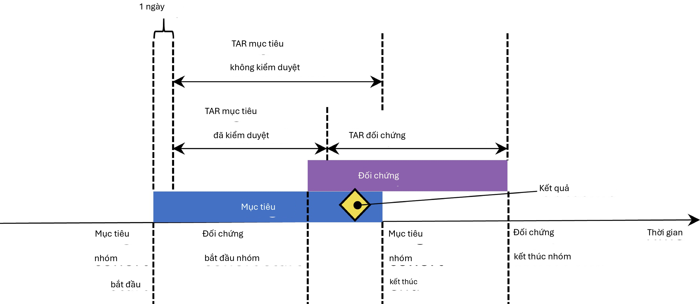{width="4.7316666666666665in"
height="2.0533333333333332in"}

Hình 12.10: Thời gian có nguy cơ (TAR) cho các đối tượng có trong cả
hai nhóm thuần tập, giả định thời gian có nguy cơ bắt đầu vào ngày sau
khi bắt đầu điều trị và dừng lại khi kết thúc phơi nhiễm.

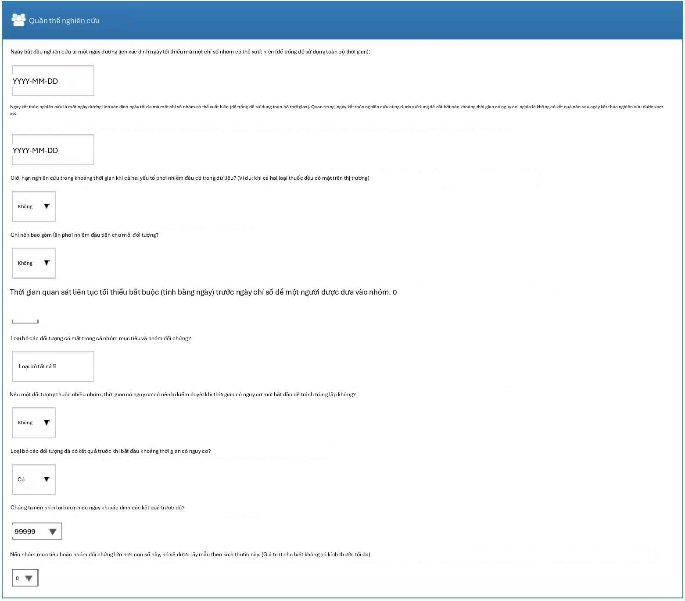{width="5.305416666666667in"
height="4.660833333333334in"}

Hình 12.11: Cài đặt quần thể nghiên cứu.

#### Cài đặt đồng biến

Tại đây, chúng tôi chỉ định các đồng biến cần xây dựng. Các đồng biến
này thường được sử dụng trong mô hình điểm xu hướng, nhưng cũng có thể
được đưa vào mô hình kết cục (mô hình nguy cơ tỷ lệ Cox trong trường
hợp này). Nếu chúng ta nhấp để xem chi tiết cài đặt đồng biến của
mình, chúng ta có thể chọn tập hợp đồng biến nào cần xây dựng. Tuy
nhiên, khuyến nghị là sử dụng tập hợp mặc định, xây dựng các đồng biến
cho nhân khẩu học, tất cả các tình trạng bệnh, thuốc, thủ thuật, đo
lường, v.v.

Chúng ta có thể sửa đổi tập hợp đồng biến bằng cách chỉ định các khái
niệm cần đưa vào và/hoặc loại trừ. Các cài đặt này giống như các cài
đặt được tìm thấy trong Phần 12.7.1 về cài đặt so sánh. Lý do tại sao
chúng có thể được tìm thấy ở hai nơi là vì đôi khi các cài đặt này
liên quan đến một so sánh cụ thể, như trường hợp ở đây vì chúng tôi
muốn loại trừ các loại thuốc mà chúng tôi đang so sánh, và đôi khi các
cài đặt liên quan đến một phân tích cụ thể. Khi thực hiện một phân
tích cho một so sánh cụ thể bằng cách sử dụng các cài đặt phân tích cụ
thể, các công cụ OHDSI sẽ lấy hợp của các tập hợp này.

Hình 12.12 hiển thị các lựa chọn của chúng tôi cho nghiên cứu này. Lưu
ý rằng chúng tôi đã chọn thêm các hậu duệ vào khái niệm cần loại trừ,
mà chúng tôi đã định nghĩa trong cài đặt so sánh trong Hình 12.9.

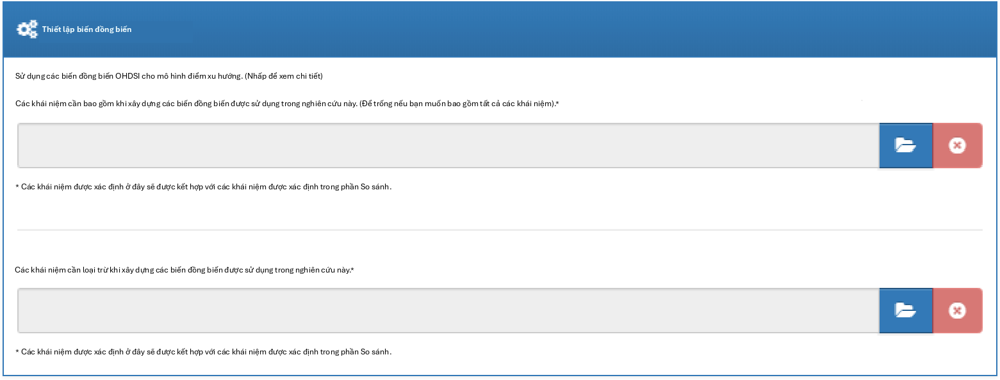{width="5.305416666666667in"
height="2.01875in"}

Hình 12.12: Cài đặt đồng biến.

#### Thời gian có nguy cơ

Thời gian có nguy cơ được định nghĩa tương đối so với ngày bắt đầu và
ngày kết thúc của các nhóm thuần tập mục tiêu và so sánh của chúng
tôi. Trong ví dụ của chúng tôi, chúng tôi đã đặt ngày bắt đầu nhóm
thuần tập là bắt đầu khi bắt đầu điều trị và ngày kết thúc nhóm thuần
tập là khi phơi nhiễm dừng lại (trong ít nhất 30 ngày). Chúng tôi đặt
thời gian bắt đầu có nguy cơ là một ngày sau khi bắt đầu nhóm thuần
tập, vì vậy một ngày sau khi bắt đầu điều trị. Một lý do để đặt thời
gian bắt đầu có nguy cơ muộn hơn ngày bắt đầu nhóm thuần tập là vì
chúng tôi có thể muốn loại trừ các biến cố kết cục xảy ra vào ngày bắt
đầu điều trị nếu chúng tôi không tin rằng chúng có khả năng sinh học
do thuốc gây ra.

Chúng tôi đặt thời điểm kết thúc thời gian có nguy cơ là khi kết thúc
nhóm thuần tập, vì vậy khi phơi nhiễm dừng lại. Chúng tôi có thể chọn
đặt ngày kết thúc muộn hơn nếu ví dụ chúng tôi tin rằng các biến cố
theo sau ngay khi điều trị

kết thúc vẫn có thể được quy cho phơi nhiễm. Trong trường hợp cực
đoan, chúng tôi có thể đặt thời điểm kết thúc thời gian có nguy cơ là
một số ngày lớn (ví dụ: 99999) sau ngày kết thúc nhóm thuần tập, nghĩa
là chúng tôi sẽ theo dõi hiệu quả các đối tượng cho đến khi kết thúc
quan sát. Một thiết kế như vậy đôi khi được gọi là thiết kế theo ý
định điều trị (intent-to-treat).

Một bệnh nhân có không ngày có nguy cơ không thêm thông tin gì, vì vậy
số ngày có nguy cơ tối thiểu thường được đặt là một ngày. Nếu có một
thời gian ủ bệnh đã biết cho tác dụng phụ, thì điều này có thể được
tăng lên để có được tỷ lệ thông tin hơn. Nó cũng có thể được sử dụng
để tạo ra một nhóm thuần tập tương tự hơn với nhóm thuần tập của một
thử nghiệm ngẫu nhiên mà nó đang được so sánh (ví dụ: tất cả các bệnh
nhân trong thử nghiệm ngẫu nhiên đã được quan sát trong ít nhất N
ngày).

{width="0.455in"
height="0.45499890638670165in"}

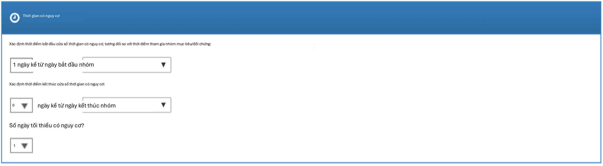{width="5.385936132983377in"
height="1.4859372265966755in"}

Hình 12.13: Cài đặt thời gian có nguy cơ.

#### Điều chỉnh điểm xu hướng

Chúng ta có thể chọn cắt tỉa quần thể nghiên cứu, loại bỏ những người
có giá trị PS cực đoan. Chúng ta có thể chọn loại bỏ phần trăm cao
nhất và thấp nhất, hoặc chúng ta có thể loại bỏ các đối tượng có điểm
ưu tiên nằm ngoài phạm vi chúng ta chỉ định. Việc cắt tỉa các nhóm
thuần tập thường không được khuyến nghị vì nó đòi hỏi phải loại bỏ các
quan sát, điều này làm giảm sức mạnh thống kê. Có thể mong muốn cắt
tỉa trong một số trường hợp, ví dụ khi sử dụng IPTW.

Ngoài ra, hoặc thay vì cắt tỉa, chúng ta có thể chọn phân tầng hoặc
khớp trên điểm xu hướng. Khi phân tầng, chúng ta cần chỉ định số lượng
tầng và liệu có chọn các tầng dựa trên mục tiêu, đối tượng so sánh hay
toàn bộ quần thể nghiên cứu hay không. Khi khớp, chúng ta cần chỉ định
số lượng người tối đa từ nhóm so sánh để khớp với mỗi người trong nhóm
mục tiêu. Các giá trị điển hình là 1 cho khớp một-một, hoặc một số
lượng lớn (ví dụ: 100) cho khớp tỷ lệ biến đổi. Chúng ta cũng cần chỉ
định caliper: sự khác biệt tối đa cho phép giữa các điểm xu hướng để
cho phép khớp. Caliper có thể được định nghĩa trên các thang đo
caliper khác biệt:

- **Thang đo điểm xu hướng&#58; chính PS**

- **Thang đo chuẩn hóa&#58; theo độ lệch chuẩn của các phân bố PS**

- **Thang đo logit chuẩn hóa&#58; theo độ lệch chuẩn của các phân bố PS sau
khi biến đổi logit để làm cho PS phân bố bình thường hơn.**

Trong trường hợp nghi ngờ, chúng tôi khuyên bạn nên sử dụng các giá
trị mặc định, hoặc tham khảo công trình về chủ đề này của Austin
(2011).

Việc khớp các mô hình điểm xu hướng quy mô lớn có thể tốn kém về mặt
tính toán, vì vậy chúng ta có thể muốn giới hạn dữ liệu được sử dụng
để khớp mô hình chỉ trong một mẫu dữ liệu. Theo mặc định, kích thước
tối đa của nhóm thuần tập mục tiêu và so sánh được đặt là 250.000.
Trong hầu hết các nghiên cứu, giới hạn này sẽ không đạt được. Cũng khó
có khả năng là nhiều dữ liệu hơn sẽ dẫn đến một mô hình tốt hơn. Lưu ý
rằng mặc dù một mẫu dữ liệu có thể được sử dụng để khớp mô hình, mô
hình sẽ được sử dụng để tính PS cho toàn bộ quần thể.

**Kiểm tra từng đồng biến về mối tương quan với việc phân bổ mục tiêu?
Nếu bất kỳ đồng biến nào có mối tương quan cao bất thường (dương hoặc
âm), điều này sẽ đưa ra lỗi. Điều này tránh việc tính toán kéo dài của
mô hình điểm xu hướng chỉ để phát hiện sự tách biệt hoàn toàn. Việc
tìm thấy mối tương quan đơn biến rất cao cho phép bạn xem xét đồng
biến để xác định lý do tại sao nó có mối tương quan cao và liệu nó có
nên bị loại bỏ hay không.**

**Sử dụng chuẩn hóa khi khớp mô hình? Quy trình chuẩn là đưa nhiều
đồng biến (thường là hơn 10.000) vào mô hình điểm xu hướng. Để khớp
các mô hình như vậy, cần có một số chuẩn hóa. Nếu chỉ có một vài đồng
biến được chọn thủ công được đưa vào, cũng có thể khớp mô hình mà
không cần chuẩn hóa.**

Hình 12.14 hiển thị các lựa chọn của chúng tôi cho nghiên cứu này. Lưu
ý rằng chúng tôi chọn khớp tỷ lệ biến đổi bằng cách đặt số lượng người
tối đa để khớp là 100.

#### Cài đặt mô hình kết cục

Đầu tiên, chúng ta cần chỉ định mô hình thống kê mà chúng ta sẽ sử
dụng để ước tính nguy cơ tương đối của kết cục giữa các nhóm thuần tập
mục tiêu và so sánh. Chúng ta có thể chọn giữa hồi quy Cox, Poisson và
logistic, như đã thảo luận ngắn gọn trong Phần 12.1. Đối với ví dụ của
mình, chúng tôi chọn mô hình nguy cơ tỷ lệ Cox, xem xét thời gian đến
biến cố đầu tiên với khả năng kiểm duyệt. Tiếp theo, chúng ta cần chỉ
định liệu hồi quy có nên được điều kiện hóa trên các tầng hay không.
Một cách để hiểu về điều kiện hóa là tưởng tượng một ước tính riêng
biệt được tạo ra ở mỗi tầng, và sau đó được kết hợp trên các tầng. Đối
với khớp một-một, điều này có khả năng không cần thiết và sẽ chỉ làm
mất sức mạnh. Đối với phân tầng hoặc khớp tỷ lệ biến đổi, điều này là
cần thiết.

Chúng ta cũng có thể chọn thêm các đồng biến vào mô hình kết cục để
điều chỉnh phân tích. Điều này có thể được thực hiện bổ sung hoặc thay
vì sử dụng mô hình điểm xu hướng. Tuy nhiên, trong khi thường có đủ dữ
liệu để khớp mô hình điểm xu hướng, với nhiều người trong cả hai nhóm
điều trị, thường có rất ít dữ liệu để khớp mô hình kết cục, với chỉ
một vài người có kết cục. Do đó, chúng tôi khuyên bạn nên giữ mô hình
kết cục đơn giản nhất có thể và không đưa thêm các đồng biến bổ sung.

Thay vì phân tầng hoặc khớp trên điểm xu hướng, chúng ta cũng có thể
chọn sử dụng trọng số

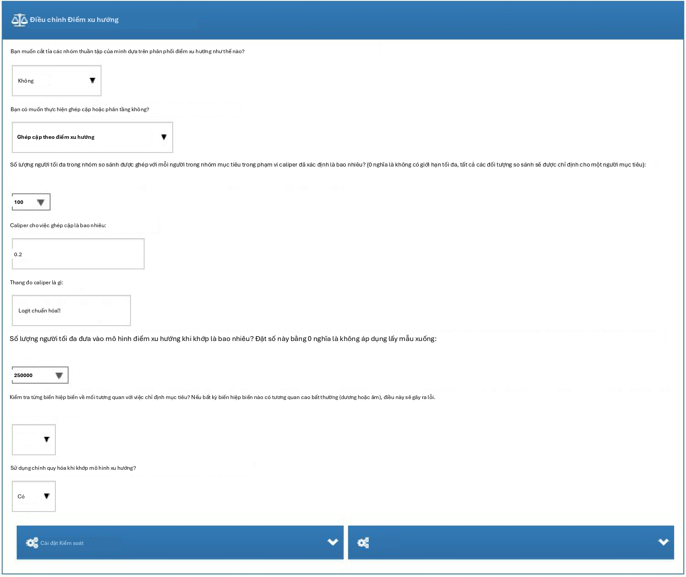{width="5.305415573053368in"
height="4.4625in"}

Hình 12.14: Cài đặt điều chỉnh điểm xu hướng.

#### xác suất phơi nhiễm nghịch đảo (IPTW).

Nếu chúng ta chọn đưa tất cả các đồng biến vào mô hình kết cục, có thể
hợp lý khi sử dụng chuẩn hóa khi khớp mô hình nếu có nhiều đồng biến.
Lưu ý rằng không có chuẩn hóa nào sẽ được áp dụng cho biến điều trị để
cho phép ước tính không chệch.

Hình 12.15 hiển thị các lựa chọn của chúng tôi cho nghiên cứu này. Vì
chúng tôi sử dụng khớp tỷ lệ biến đổi, chúng tôi phải điều kiện hóa
hồi quy trên các tầng (tức là các tập hợp đã khớp).

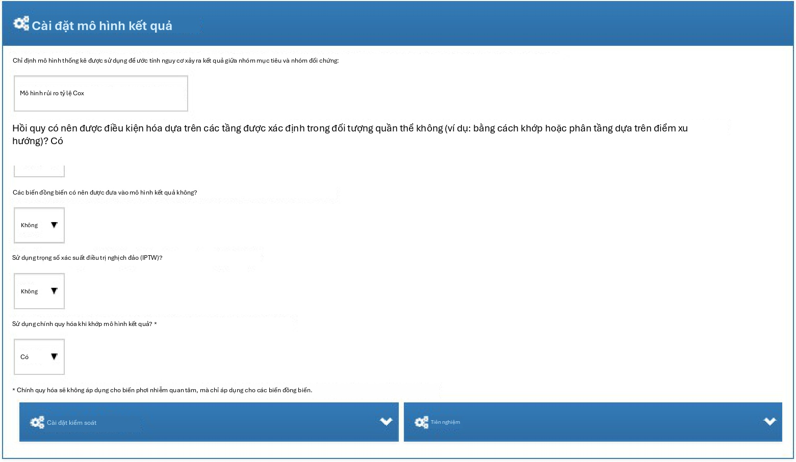{width="5.305416666666667in"
height="3.08125in"}

Hình 12.15: Cài đặt mô hình kết cục.

### Cài đặt đánh giá

Như được mô tả trong Chương 18, các kiểm soát âm tính và dương tính
nên được đưa vào nghiên cứu của chúng tôi để đánh giá các đặc điểm vận
hành và thực hiện hiệu chuẩn thực nghiệm.

#### Định nghĩa nhóm thuần tập kết cục kiểm soát âm tính

Trong Phần 12.7.1, chúng tôi đã chọn một tập hợp khái niệm đại diện
cho các kết cục kiểm soát âm tính. Tuy nhiên, chúng ta cần logic để
chuyển đổi các khái niệm thành các nhóm thuần tập để sử dụng làm kết
cục trong phân tích của mình. ATLAS cung cấp logic chuẩn với ba lựa
chọn. Lựa chọn đầu tiên là liệu có sử dụng tất cả các lần xuất hiện
hay chỉ lần xuất hiện đầu tiên của khái niệm. Lựa chọn thứ hai xác
định liệu các lần xuất hiện của các khái niệm hậu duệ có nên được xem
xét hay không. Ví dụ, các lần xuất hiện của hậu duệ "ingrown nail of
foot" (móng chọc thịt ở chân) cũng có thể được tính là một lần xuất
hiện của tổ tiên "ingrown nail" (móng chọc thịt). Lựa chọn thứ ba chỉ
định những miền nào nên được xem xét khi tìm kiếm các khái niệm.

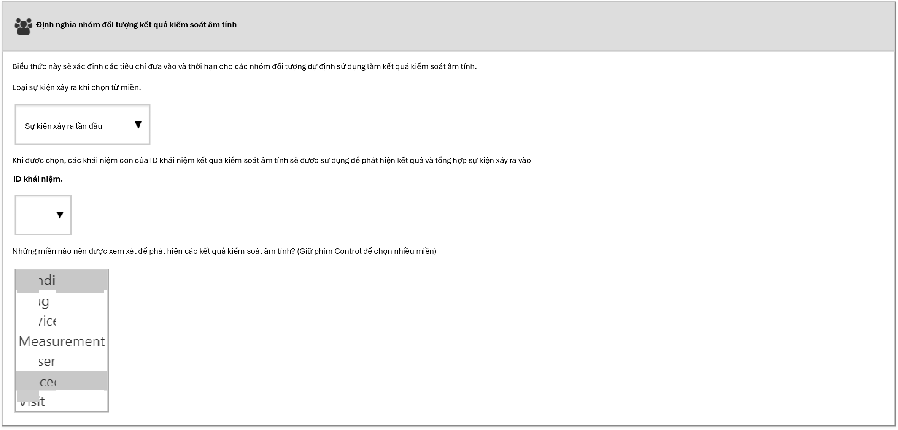{width="5.310937226596676in"
height="2.5453116797900264in"}

Hình 12.16: Cài đặt định nghĩa nhóm thuần tập kết cục kiểm soát âm
tính.

#### Tổng hợp kiểm soát dương tính

Ngoài các kiểm soát âm tính, chúng ta cũng có thể đưa vào các kiểm
soát dương tính, là các cặp phơi nhiễm-kết cục nơi một hiệu quả nhân
quả được cho là tồn tại với kích thước hiệu quả đã biết. Vì nhiều lý
do, các kiểm soát dương tính thực tế có vấn đề, vì vậy thay vào đó
chúng ta dựa vào các kiểm soát dương tính tổng hợp, bắt nguồn từ các
kiểm soát âm tính như được mô tả trong Chương 18. Chúng ta có thể chọn
thực hiện tổng hợp kiểm soát dương tính. Nếu "yes" (có), chúng ta phải
chọn loại mô hình, hiện tại là "Poisson" và "survival" (sống sót). Vì
chúng tôi sử dụng mô hình sống sót (Cox) trong nghiên cứu ước tính của
mình, chúng tôi nên chọn "survival". Chúng tôi định nghĩa mô hình thời
gian có nguy cơ cho tổng hợp kiểm soát dương tính giống như trong cài
đặt ước tính của mình, và tương tự bắt chước các lựa chọn cho thời
gian quan sát liên tục tối thiểu cần thiết trước khi phơi nhiễm, liệu
chỉ nên bao gồm phơi nhiễm đầu tiên, liệu chỉ nên bao gồm kết cục đầu
tiên, cũng như loại bỏ những người có kết cục trước đó. Hình 12.15
hiển thị các cài đặt cho tổng hợp kiểm soát dương tính.

### Chạy gói nghiên cứu

Bây giờ chúng ta đã định nghĩa đầy đủ nghiên cứu của mình, chúng ta có
thể xuất nó dưới dạng một gói R thực thi được. Gói này chứa mọi thứ
cần thiết để thực hiện nghiên cứu tại một cơ sở có dữ liệu trong CDM.
Điều này bao gồm các định nghĩa nhóm thuần tập có thể được sử dụng để
khởi tạo các nhóm thuần tập mục tiêu, so sánh và kết cục, tập hợp khái
niệm kiểm soát âm tính và logic để tạo các nhóm thuần tập kết cục kiểm
soát âm tính, cũng như mã R để thực hiện phân tích. Trước khi tạo gói,
hãy đảm bảo lưu nghiên cứu của bạn, sau đó nhấp vào tab Utilities
(Tiện ích). Tại đây, chúng ta có thể xem lại tập hợp các phân tích sẽ
được thực hiện. Như đã đề cập trước đó, mỗi kết hợp của một so sánh và
một cài đặt phân tích sẽ dẫn đến một phân tích riêng biệt. Trong ví dụ
của mình, chúng tôi đã chỉ định hai phân tích: ACEi so với THZ cho
AMI, và ACEi so với THZ cho phù mạch, cả hai đều sử dụng khớp điểm xu
hướng.

Chúng ta phải cung cấp tên cho gói của mình, sau đó chúng ta có thể
nhấp vào "Download" (Tải xuống) để

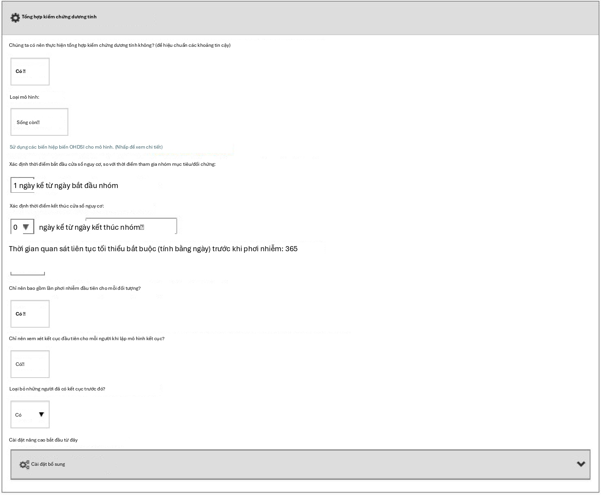{width="5.311561679790026in"
height="4.377187226596676in"}

Hình 12.17: Cài đặt định nghĩa nhóm thuần tập kết cục kiểm soát âm
tính.

tải xuống tệp zip. Tệp zip chứa một gói R, với cấu trúc thư mục bắt
buộc thông thường cho các gói R. (Wickham, 2015) Để sử dụng gói này,
chúng tôi khuyên bạn nên sử dụng R Studio. Nếu bạn đang chạy R Studio
cục bộ, hãy giải nén tệp và nhấp đúp vào tệp .Rproj để mở nó trong R
Studio. Nếu bạn đang chạy R Studio trên một máy chủ R studio, hãy nhấp
vào để tải lên và giải nén tệp, sau đó nhấp vào tệp .Rproj để mở dự
án.{width="0.6771981627296588in"
height="0.1979494750656168in"}

Sau khi bạn đã mở dự án trong R Studio, bạn có thể mở tệp README và
làm theo hướng dẫn. Hãy chắc chắn thay đổi tất cả các đường dẫn tệp
thành các đường dẫn hiện có trên hệ thống của bạn.

Một thông báo lỗi phổ biến có thể xuất hiện khi chạy nghiên cứu là
"High correlation between covariate(s) and treatment detected." (Phát
hiện mối tương quan cao giữa (các) đồng biến và điều trị). Điều này
cho thấy rằng khi khớp mô hình điểm xu hướng, một số đồng biến được
quan sát thấy có mối tương quan cao với phơi nhiễm. Vui lòng xem xét
các đồng biến được đề cập trong thông báo lỗi và loại trừ chúng khỏi
tập hợp các đồng biến nếu thích hợp (xem Phần 12.1.2).[]{#_bookmark352
.anchor}

## Triển khai nghiên cứu bằng R

Thay vì sử dụng ATLAS để viết mã R thực thi nghiên cứu, chúng ta cũng
có thể tự viết mã R. Một lý do chúng ta có thể muốn làm điều này là vì
R cung cấp sự linh hoạt lớn hơn nhiều so với những gì được hiển thị
trong ATLAS. Nếu chúng ta ví dụ muốn sử dụng các đồng biến tùy chỉnh,
hoặc một mô hình kết cục tuyến tính, chúng ta sẽ cần viết một số mã R
tùy chỉnh và kết hợp nó với chức năng được cung cấp bởi các gói R của
OHDSI.

Đối với nghiên cứu ví dụ của mình, chúng tôi sẽ dựa vào gói
CohortMethod để thực hiện nghiên cứu. CohortMethod trích xuất dữ liệu
cần thiết từ một cơ sở dữ liệu trong CDM và có thể sử dụng một tập hợp
lớn các đồng biến cho mô hình điểm xu hướng. Trong ví dụ sau, trước
tiên chúng tôi chỉ xem xét phù mạch là kết cục. Trong Phần 12.8.6, sau
đó chúng tôi mô tả cách điều này có thể được mở rộng để bao gồm AMI và
các kết cục kiểm soát âm tính.

### Khởi tạo nhóm thuần tập

Trước tiên, chúng ta cần khởi tạo các nhóm thuần tập mục tiêu và kết
cục. Việc khởi tạo các nhóm thuần tập được mô tả trong Chương 10. Phụ
lục cung cấp các định nghĩa đầy đủ về các nhóm thuần tập mục tiêu (Phụ
lục B.2), so sánh (Phụ lục B.5) và kết cục (Phụ lục B.4). Chúng tôi sẽ
giả định rằng các nhóm thuần tập ACEi, THZ và phù mạch đã được khởi
tạo trong một bảng có tên scratch.my_cohorts với các ID định nghĩa
nhóm thuần tập lần lượt là 1, 2 và 3.

### Trích xuất dữ liệu

Trước tiên, chúng ta cần cho R biết cách kết nối với máy chủ.
CohortMethod sử dụng gói DatabaseConnector, cung cấp một hàm có tên là
createConnectionDetails. Gõ

?createConnectionDetails cho các cài đặt cụ thể cần thiết cho các hệ
thống quản lý cơ sở dữ liệu (DBMS) khác nhau.

Ví dụ, người ta có thể kết nối với cơ sở dữ liệu PostgreSQL bằng mã
này:

**library**(CohortMethod)

connDetails \<- **createConnectionDetails**(dbms = \"postgresql\",

server = \"localhost/ohdsi\", user = \"joe\",

password = \"supersecret\")

cdmDbSchema \<- \"my_cdm_data\" cohortDbSchema \<- \"scratch\"
cohortTable \<- \"my_cohorts\" cdmVersion \<- \"5\"

Bốn dòng cuối cùng định nghĩa các biến cdmDbSchema, cohortDbSchema và
cohortTable, cũng như phiên bản CDM. Chúng tôi sẽ sử dụng những biến
này sau để cho R biết dữ liệu ở định dạng CDM nằm ở đâu, nơi các nhóm
thuần tập quan tâm đã được tạo và phiên bản CDM nào được sử dụng. Lưu
ý rằng đối với Microsoft SQL Server, các lược đồ cơ sở dữ liệu cần chỉ
định cả cơ sở dữ liệu và lược đồ, vì vậy ví dụ cdmDbSchema \<-
\"my_cdm_data.dbo\".

Bây giờ chúng ta có thể yêu cầu CohortMethod trích xuất các nhóm thuần
tập, xây dựng các đồng biến và trích xuất tất cả dữ liệu cần thiết cho
phân tích của mình:

*\# các khái niệm hoạt chất mục tiêu và so sánh:*

aceI \<-
**c**(1335471,1340128,1341927,1363749,1308216,1310756,1373225,
1331235,1334456,1342439)

thz \<- **c**(1395058,974166,978555,907013)

*\# Xác định loại đồng biến nào phải được xây dựng:*

cs \<- **createDefaultCovariateSettings**(excludedCovariateConceptIds =
**c**(aceI,

thz),

addDescendantsToExclude = TRUE)

*#Tải dữ liệu:*

cmData \<- **getDbCohortMethodData**(connectionDetails =
connectionDetails,

cdmDatabaseSchema = cdmDatabaseSchema, oracleTempSchema = NULL,

targetId = 1,

comparatorId = 2,

resultIds = 3, StudyStartDate = \"\", StudyEndDate = \"\",

phơi sángDatabaseSchema = đoàn hệDbSchema, bảng hiển thị = đoàn
hệBảng, kết quảDatabaseSchema = đoàn hệDbSchema, resultTable = đoàn
hệBảng,

cdmVersion = cdmVersion, firstExposureOnly = FALSE,
RemoveDuplicateSubjects = FALSE, limitToCommonPeriod = FALSE,
washoutPeriod = 0,

covariateSettings = cs)

cmData

\## Đối tượng CohortMethodData \##

\## ID khái niệm điều trị: 1 \## ID khái niệm so sánh: 2 \## ID khái
niệm kết cục: 3

Có rất nhiều tham số, nhưng tất cả chúng đều được ghi lại trong hướng
dẫn sử dụng CohortMethod. Hàm createDefaultCovariateSettings được mô
tả trong gói FeatureExtraction. Tóm lại, chúng ta đang trỏ hàm đến
bảng chứa các nhóm thuần tập của mình và chỉ định ID định nghĩa nhóm
thuần tập nào trong bảng đó xác định mục tiêu, đối tượng so sánh và
kết cục. Chúng tôi hướng dẫn rằng tập hợp các đồng biến mặc định nên
được xây dựng, bao gồm các đồng biến cho tất cả các tình trạng bệnh,
phơi nhiễm thuốc và thủ thuật được tìm thấy vào hoặc trước ngày chỉ
mục. Như đã đề cập trong Phần 12.1, chúng ta phải loại trừ các phương
pháp điều trị mục tiêu và so sánh khỏi tập hợp các đồng biến, và ở đây
chúng ta đạt được điều này bằng cách liệt kê tất cả các hoạt chất
trong hai nhóm, và yêu cầu FeatureExtraction cũng loại trừ tất cả các
hậu duệ, do đó loại trừ tất cả các loại thuốc chứa các hoạt chất này.

Tất cả dữ liệu về các nhóm thuần tập, kết cục và đồng biến được trích
xuất từ máy chủ và lưu trữ trong đối tượng cohortMethodData. Đối tượng
này sử dụng gói ff để lưu trữ thông tin theo cách đảm bảo R không bị
hết bộ nhớ, ngay cả khi dữ liệu lớn, như đã đề cập trong Phần 8.4.2.

Chúng ta có thể sử dụng hàm generic summary() để xem thêm thông tin về
dữ liệu chúng ta đã trích xuất:

**summary**(cmData)

\## Tóm tắt đối tượng CohortMethodData \##

\## ID khái niệm điều trị: 1 \## ID khái niệm so sánh: 2 \## ID khái
niệm kết cục: 3 \##

\## Số người được điều trị: 67166

\## Số người so sánh: 35333 \##

\## Số lượng kết cục:

\## Số lượng biến cố Số lượng người \## 3 980 891

\##

\## Các biến hiệp biến:

\## Số lượng biến hiệp biến: 58349

\## Số lượng giá trị biến hiệp biến khác không: 24484665

Việc tạo tệp cohortMethodData có thể tốn khá nhiều thời gian tính
toán, và có lẽ bạn nên lưu lại tệp này cho các phiên làm việc trong
tương lai. Vì cohortMethodData sử dụng ff, chúng ta không thể sử dụng
hàm lưu (save) thông thường của R. Thay vào đó, chúng ta sẽ phải sử
dụng hàm saveCohortMethodData():

**saveCohortMethodData**(cmData, \"AceiVsThzForAngioedema\")

Chúng ta có thể sử dụng hàm loadCohortMethodData() để tải dữ liệu
trong một phiên làm việc tương lai.

#### Định nghĩa người dùng mới

Thông thường, một người dùng mới được định nghĩa là người sử dụng
thuốc lần đầu (thuốc mục tiêu hoặc thuốc so sánh), và thường sử dụng
một khoảng thời gian rửa trôi (washout period) (một số ngày tối thiểu
trước khi sử dụng lần đầu) để tăng xác suất đó thực sự là lần sử dụng
đầu tiên. Khi sử dụng gói CohortMethod, bạn có thể thực thi các yêu
cầu cần thiết cho việc sử dụng mới theo ba cách:

1.  Khi định nghĩa các nhóm thuần tập.

2.  Khi tải các nhóm thuần tập sử dụng hàm getDbCohortMethodData, bạn có
thể

sử dụng các đối số firstExposureOnly, removeDuplicateSubjects,
restrictToCommonPeriod và washoutPeriod.

3.  Khi định nghĩa quần thể nghiên cứu sử dụng hàm createStudyPopulation
(xem bên dưới).

Ưu điểm của tùy chọn 1 là các nhóm thuần tập đầu vào đã được định
nghĩa đầy đủ bên ngoài gói CohortMethod, và các công cụ đặc điểm hóa
nhóm thuần tập bên ngoài có thể được sử dụng trên cùng các nhóm thuần
tập được dùng trong phân tích này. Ưu điểm của tùy chọn 2 và 3 là giúp
bạn tiết kiệm công sức tự giới hạn việc sử dụng lần đầu, ví dụ như cho
phép bạn sử dụng trực tiếp bảng DRUG_ERA trong CDM. Tùy chọn 2 hiệu
quả hơn tùy chọn 3, vì chỉ dữ liệu cho lần sử dụng đầu tiên mới được
tìm nạp, trong khi tùy chọn 3 kém hiệu quả hơn nhưng cho phép bạn so
sánh các nhóm thuần tập gốc với quần thể nghiên cứu.

### Định nghĩa quần thể nghiên cứu

Thông thường, các nhóm thuần tập phơi nhiễm và nhóm thuần tập kết cục
sẽ được định nghĩa độc lập với nhau. Khi chúng ta muốn tạo ra một ước
tính quy mô hiệu quả, chúng ta cần hạn chế thêm các nhóm thuần tập này
và kết hợp chúng lại với nhau, ví dụ như bằng cách loại bỏ các đối
tượng đã phơi nhiễm có kết cục trước khi phơi nhiễm, và chỉ giữ lại
các kết cục nằm trong một khoảng thời gian nguy cơ xác định. Đối với
việc này, chúng ta có thể sử dụng hàm createStudyPopulation:

studyPop \<- **createStudyPopulation**(cohortMethodData = cmData,

outcomeId = 3, firstExposureOnly = FALSE, restrictToCommonPeriod =
FALSE, washoutPeriod = 0,

removeDuplicateSubjects = \"remove all\",
removeSubjectsWithPriorOutcome = TRUE, minDaysAtRisk = 1,

riskWindowStart = 1, startAnchor = \"cohort start\", riskWindowEnd =
0,

endAnchor = \"cohort end\")

Lưu ý rằng chúng ta đã đặt firstExposureOnly và
removeDuplicateSubjects thành FALSE, và washoutPeriod thành 0 vì chúng
ta đã áp dụng các tiêu chí đó trong định nghĩa nhóm thuần tập. Chúng
ta chỉ định ID kết cục sẽ sử dụng, và những người có kết cục trước
ngày bắt đầu khoảng thời gian nguy cơ sẽ bị loại bỏ. Khoảng thời gian
nguy cơ được định nghĩa là bắt đầu vào ngày sau ngày bắt đầu nhóm
thuần tập (riskWindowStart = 1 và startAnchor = \"cohort start\"), và
khoảng thời gian nguy cơ kết thúc khi phơi nhiễm nhóm thuần tập kết
thúc (riskWindowEnd

= 0 và endAnchor = \"cohort end\"), điều này đã được định nghĩa là kết
thúc phơi nhiễm trong định nghĩa nhóm thuần tập. Lưu ý rằng các khoảng
thời gian nguy cơ được tự động cắt ngắn tại thời điểm kết thúc quan
sát hoặc ngày kết thúc nghiên cứu. Chúng ta cũng loại bỏ các đối tượng
không có thời gian nguy cơ. Để xem còn bao nhiêu người trong quần thể
nghiên cứu, chúng ta luôn có thể sử dụng hàm getAttritionTable:

**getAttritionTable**(studyPop)

***
\##                       mô tả    Đối tượng    Đối tượng so  \...
mục tiêu            sánh
----- ------------------------- ------------ --------------- ------
\## 1    Các nhóm thuần tập gốc        67212           35379  \...

\## 2  Đã loại bỏ các đối tượng        67166           35333  \...
trong cả hai nhóm thuần
tập

\## 3 Không có biến cố trước đó        67061           35238  \...

\## 4 Có ít nhất 1 ngày nguy cơ        66780           35086  \...
***

### Điểm xu hướng

Chúng ta có thể khớp một mô hình điểm xu hướng sử dụng các biến hiệp
biến được xây dựng bởi getDbcohortMethodData(), và tính toán PS cho
mỗi người:

ps \<- **createPs**(cohortMethodData = cmData, population = studyPop)

Hàm createPs sử dụng gói Cyclops để khớp một hồi quy logistic có điều
chỉnh quy mô lớn. Để khớp mô hình điểm xu hướng, Cyclops cần biết giá
trị siêu tham số chỉ định phương sai của phân phối tiên nghiệm
(prior). Theo mặc định, Cyclops sẽ sử dụng kiểm chứng chéo để ước tính
siêu tham số tối ưu. Tuy nhiên, hãy lưu ý rằng việc này có thể mất rất
nhiều thời gian. Bạn có thể sử dụng các tham số prior và control của
hàm createPs để chỉ định hành vi của Cyclops, bao gồm việc sử dụng
nhiều CPU để tăng tốc quá trình kiểm chứng chéo.

Ở đây chúng ta sử dụng PS để thực hiện ghép cặp theo tỷ lệ biến đổi:

Ngoài ra, chúng ta có thể sử dụng PS trong các hàm trimByPs,
trimByPsToEquipoise, hoặc

stratifyByPs.

### Các mô hình kết cục

Mô hình kết cục là một mô hình mô tả các biến nào liên quan đến kết
cục. Dưới các giả định nghiêm ngặt, hệ số cho biến điều trị có thể
được giải thích là hiệu quả nhân quả. Trong trường hợp này, chúng ta
khớp một mô hình rủi ro tỷ lệ Cox, được điều kiện hóa (phân tầng) trên
các tập hợp đã ghép cặp:

outcomeModel \<- **fitOutcomeModel**(population = matchedPop,

modelType = \"cox\", stratified = TRUE)

outcomeModel

\## Loại mô hình: cox \## Đã phân tầng: TRUE

\## Sử dụng biến hiệp biến: FALSE

\## Sử dụng trọng số xác suất nghịch đảo của điều trị: FALSE \## Trạng
thái: OK

\##

\## Ước tính thấp hơn .95 cao hơn .95 logRr seLogRr \## điều trị
4.3203 2.4531 8.0771 1.4633 0.304

### Chạy nhiều phân tích

Thông thường, chúng ta muốn thực hiện nhiều hơn một phân tích, ví dụ
như cho nhiều kết cục bao gồm các đối chứng âm tính. CohortMethod cung
cấp các hàm để thực hiện các nghiên cứu như vậy một cách hiệu quả.
Điều này được mô tả chi tiết trong tài liệu tóm tắt của gói về việc
chạy nhiều phân tích. Tóm lại, giả sử kết cục quan tâm và các nhóm
thuần tập đối chứng âm tính đã được tạo, chúng ta có thể chỉ định tất
cả các kết hợp mục tiêu-đối chứng-kết cục mà chúng ta muốn phân tích:

*\# Outcomes of interest:*

ois \<- **c**(3, 4) *\# Angioedema, AMI*

*\# Negative controls:*

ncs \<-
**c**(434165,436409,199192,4088290,4092879,44783954,75911,137951,77965,
376707,4103640,73241,133655,73560,434327,4213540,140842,81378,

432303,4201390,46269889,134438,78619,201606,76786,4115402,

45757370,433111,433527,4170770,4092896,259995,40481632,4166231,

433577,4231770,440329,4012570,4012934,441788,4201717,374375,

4344500,139099,444132,196168,432593,434203,438329,195873,4083487,

4103703,4209423,377572,40480893,136368,140648,438130,4091513,

4202045,373478,46286594,439790,81634,380706,141932,36713918,

443172,81151,72748,378427,437264,194083,140641,440193,4115367)

tcos \<- **createTargetComparatorOutcomes**(targetId = 1,

comparatorId = 2, outcomeIds = **c**(ois, ncs))

tcosList \<- **list**(tcos)

Tiếp theo, chúng ta chỉ định các tham số nào nên được sử dụng khi gọi
các hàm khác nhau đã được mô tả trước đó trong ví dụ của chúng ta với
một kết cục:

aceI \<-
**c**(1335471,1340128,1341927,1363749,1308216,1310756,1373225,
1331235,1334456,1342439)

thz \<- **c**(1395058,974166,978555,907013)

cs \<- **createDefaultCovariateSettings**(excludedCovariateConceptIds =
**c**(aceI,

thz),

addDescendantsToExclude = TRUE)

cmdArgs \<- **createGetDbCohortMethodDataArgs**( studyStartDate =
\"\",

StudyEndDate = \"\", firstExposureOnly = FALSE,
RemoveDuplicateSubjects = FALSE, limitToCommonPeriod = FALSE,
washoutPeriod = 0, covariateSettings = cs)

spArgs \<- createCreateStudyPopulationArgs( firstExposureOnly = FALSE,
limitToCommonPeriod = FALSE, washoutPeriod = 0,
RemoveDuplicateSubjects = \"xóa tất cả\",
RemoveSubjectsWithPriorOutcome = TRUE, minDaysAtRisk = 1,

startAnchor = \"bắt đầu nhóm\", addExposureDaysToStart = FALSE,
endAnchor = \"kết thúc nhóm\", addExposureDaysToEnd = TRUE)

psArgs \<- **createCreatePsArgs**()

matchArgs \<- **createMatchOnPsArgs**( caliper = 0.2,

caliperScale = \"standardized logit\", maxRatio = 100)

fomArgs \<- **createFitOutcomeModelArgs**( modelType = \"cox\",

stratified = TRUE)

Sau đó, chúng ta kết hợp các tham số này thành một đối tượng cài đặt
phân tích duy nhất, mà chúng ta cung cấp một ID phân tích duy nhất và
một số mô tả. Chúng ta có thể kết hợp một hoặc nhiều đối tượng cài đặt
phân tích thành một danh sách:

cmAnalysis \<- **createCmAnalysis**( analysisId = 1,

description = \"Propensity score matching\", getDbCohortMethodDataArgs
= cmdArgs, createStudyPopArgs = spArgs,

createPs = TRUE, createPsArgs = psArgs, matchOnPs = TRUE,
matchOnPsArgs = matchArgs fitOutcomeModel = TRUE,

fitOutcomeModelArgs = fomArgs)

cmAnalysisList \<- **list**(cmAnalysis)

Bây giờ chúng ta có thể chạy nghiên cứu bao gồm tất cả các so sánh và
cài đặt phân tích:

result \<- **runCmAnalyses**(connectionDetails = connectionDetails,

cdmDatabaseSchema = cdmDatabaseSchema, exposureDatabaseSchema =
cohortDbSchema, exposureTable = cohortTable, outcomeDatabaseSchema =
cohortDbSchema, outcomeTable = cohortTable,

cdmVersion = cdmVersion, outputFolder = outputFolder, cmAnalysisList =
cmAnalysisList,

targetComparatorOutcomesList = tcosList)

Đối tượng kết quả chứa các tham chiếu đến tất cả các tạo tác đã được
tạo. Ví dụ, chúng ta có thể truy xuất mô hình kết cục cho AMI:

omFile \<- result**\$**outcomeModelFile\[result**\$**targetId **==** 1
**&**

result**\$**comparatorId **==** 2 **&** result**\$**outcomeId **==** 4
**&** result**\$**analysisId **==** 1\]

outcomeModel \<- **readRDS**(**file.path**(outputFolder, omFile))
outcomeModel

\## Loại mô hình: cox \## Đã phân tầng: TRUE

\## Sử dụng biến hiệp biến: FALSE

\## Sử dụng trọng số xác suất nghịch đảo của điều trị: FALSE \## Trạng
thái: OK

\##

\## Ước tính thấp hơn .95 cao hơn .95 logRr seLogRr \## điều trị
1.1338 0.5921 2.1765 0.1256 0.332

Chúng ta cũng có thể truy xuất các ước tính quy mô hiệu quả cho tất cả
các kết cục bằng một lệnh:

summ \<- **summarizeAnalyses**(result, outputFolder = outputFolder)
**head**(summ)

\## phân tíchId targetId so sánhId kết quảId rr \...

+------------------+---------------+-----+-------+------------------+
| \## 1            | 1             | 1   | 2     | 72748 0.9734698  |
|                  |               |     |       | \...             |
+==================+==============:+=====+======:+=================:+
| \## 2            | 1             | 1   | 2     | 73241 0.7067981  |
|                  |               |     |       | \...             |
+------------------+---------------+-----+-------+------------------+
| \## 3            | 1             | 1   | 2     | 73560 1.0623951  |
|                  |               |     |       | \...             |
+------------------+---------------+-----+-------+------------------+
| \## 4            | 1             | 1   | 2     | 75911 0.9952184  |
|                  |               |     |       | \...             |
+------------------+---------------+-----+-------+------------------+
| \## 5            | 1             | 1   | 2     | 76786 1.0861746  |
|                  |               |     |       | \...             |
+------------------+---------------+-----+-------+------------------+
| []{#_bookmark355 | > 1           | 1   | 2     | 77965 1.1439772  |
| .anchor}\## 6    | >             |     |       | \...             |
|                  | > Kết quả     |     |       |                  |
| 12.9             | > nghiên cứu  |     |       |                  |
+------------------+---------------+-----+-------+------------------+

Các ước tính của chúng ta chỉ hợp lệ nếu đáp ứng được một số giả định.
Chúng ta sử dụng một bộ chẩn đoán rộng để đánh giá xem điều này có
đúng không. Các chẩn đoán này có sẵn trong các kết quả được tạo ra bởi
gói R do ATLAS tạo, hoặc có thể được tạo nhanh chóng bằng các hàm R cụ
thể.

### .1 Điểm xu hướng và mô hình

Trước tiên, chúng ta cần đánh giá xem nhóm thuần tập mục tiêu và đối
chứng có thể so sánh được ở mức độ nào hay không. Đối với điều này,
chúng ta có thể tính toán thống kê Diện tích dưới đường cong ROC (AUC)
cho mô hình điểm xu hướng. AUC bằng 1 cho thấy việc chỉ định điều trị
hoàn toàn có thể dự đoán được dựa trên các biến hiệp biến cơ bản, và
do đó hai nhóm không thể so sánh được. Chúng ta có thể sử dụng hàm
computePsAuc để tính toán AUC, trong ví dụ của chúng ta là 0.79. Sử
dụng hàm plotPs, chúng ta cũng có thể tạo phân phối điểm ưu tiên như
trong Hình 12.18. Ở đây chúng ta thấy rằng đối với nhiều người, việc
điều trị họ nhận được là có thể dự đoán được, nhưng cũng có một lượng
lớn sự chồng lấp, cho thấy rằng việc điều chỉnh có thể được sử dụng để
chọn các nhóm có thể so sánh.

{width="4.237187226596675in"
height="2.8328116797900265in"}

Hình 12.18: Phân phối điểm ưu tiên.

Nhìn chung, việc kiểm tra chính mô hình điểm xu hướng cũng là một ý
tưởng hay, đặc biệt là nếu mô hình có khả năng dự đoán rất cao. Bằng
cách đó, chúng ta có thể khám phá các biến nào có khả năng dự đoán cao
nhất. Bảng 12.7 hiển thị các biến dự báo hàng đầu trong mô hình điểm
xu hướng của chúng ta. Lưu ý rằng nếu một biến có khả năng dự đoán quá
cao, gói CohortMethod sẽ đưa ra một lỗi thông báo thay vì cố gắng khớp
một mô hình đã được biết là có khả năng dự đoán hoàn hảo.

Bảng 12.7: 10 biến dự báo hàng đầu trong mô hình điểm xu hướng cho
ACEi và THZ. Các giá trị dương có nghĩa là các đối tượng có biến hiệp
biến đó có nhiều khả năng nhận được điều trị mục tiêu hơn.
"(Intercept)" chỉ ra hệ số chặn của mô hình hồi quy logistic này.

Hệ số Beta Biến hiệp biến

-1.42 nhóm condition_era trong ngày -30 đến 0 ngày so với chỉ số: Phù
(Edema)

-1.11 nhóm drug_era trong ngày 0 đến 0 ngày so với chỉ số: Kali Clorua

0.68 nhóm tuổi: 05-09

0.64 đo lường trong ngày -365 đến 0 ngày so với chỉ số: Renin

0.63 nhóm condition_era trong ngày -30 đến 0 ngày so với chỉ số: Mày
đay (Urticaria)

0.57 nhóm condition_era trong ngày -30 đến 0 ngày so với chỉ số:
Protein niệu (Proteinuria)

0.55 nhóm drug_era trong ngày -365 đến 0 ngày so với chỉ số: INSULINS
VÀ CÁC CHẤT TƯƠNG TỰ

-0.54 chủng tộc = Da đen hoặc Người Mỹ gốc Phi

0.52 (Hệ số chặn)

Hệ số Beta Biến hiệp biến

0.50 giới tính = NAM

{width="0.45499890638670165in"
height="0.45499890638670165in"}

### Cân bằng biến hiệp biến

Mục tiêu của việc sử dụng PS là làm cho hai nhóm có thể so sánh được
(hoặc ít nhất là chọn các nhóm có thể so sánh). Chúng ta phải xác minh
xem điều này có đạt được hay không, ví dụ bằng cách kiểm tra xem các
biến hiệp biến cơ bản có thực sự cân bằng sau khi điều chỉnh hay
không. Chúng ta có thể sử dụng các hàm computeCovariateBalance và
plotCovariateBalanceScatterPlot để tạo Hình 12.19. Một quy tắc ngón
tay cái cần sử dụng là không biến hiệp biến nào được có sự khác biệt
chuẩn hóa tuyệt đối về giá trị trung bình lớn hơn 0.1 sau khi điều
chỉnh điểm xu hướng. Ở đây chúng ta thấy rằng mặc dù có sự mất cân
bằng đáng kể trước khi ghép cặp, sau khi ghép cặp, chúng ta đáp ứng
tiêu chí này.

{width="3.524583333333333in"
height="3.5222911198600175in"}

Hình 12.19: Cân bằng biến hiệp biến, hiển thị sự khác biệt chuẩn hóa
tuyệt đối về giá trị trung bình trước và sau khi ghép cặp điểm xu
hướng. Mỗi dấu chấm đại diện cho một biến hiệp biến.

### Theo dõi và Sức mạnh thống kê

Trước khi khớp một mô hình kết cục, chúng ta có thể quan tâm đến việc
biết liệu chúng ta có đủ sức mạnh thống kê để phát hiện một quy mô
hiệu quả cụ thể hay không. Việc thực hiện các tính toán sức mạnh thống
kê này một khi quần thể nghiên cứu đã được định nghĩa đầy đủ là hợp
lý, vì vậy cần tính đến việc mất mát đối tượng do các tiêu chí bao gồm
và loại trừ khác nhau (chẳng hạn như không có kết cục trước đó), và
mất mát do ghép cặp và/hoặc cắt tỉa. Chúng ta có thể xem sự tiêu hao
của các đối tượng trong nghiên cứu của mình bằng cách sử dụng hàm
drawAttritionDiagram như hiển thị trong Hình 12.20.

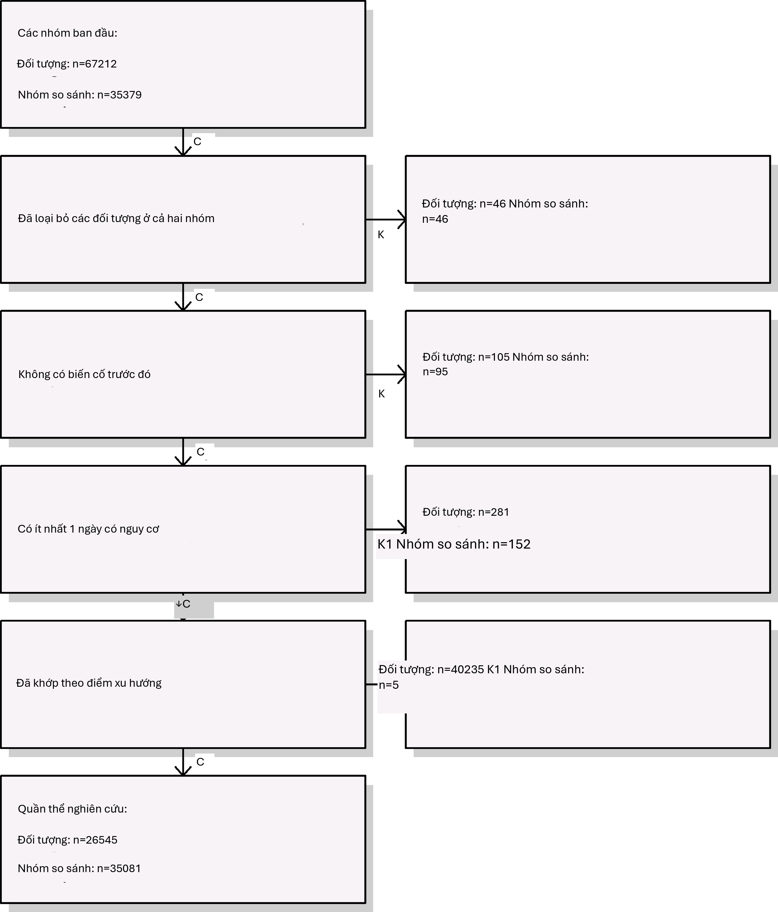{width="3.303124453193351in"
height="3.871874453193351in"}

Hình 12.20: Biểu đồ tiêu hao. Các số lượng hiển thị ở trên cùng là
những người đáp ứng định nghĩa nhóm thuần tập mục tiêu và đối chứng
của chúng ta. Các số lượng ở dưới cùng là những người tham gia vào mô
hình kết cục của chúng ta, trong trường hợp này là hồi quy Cox.

Vì kích thước mẫu là cố định trong các nghiên cứu hồi cứu (dữ liệu đã
được thu thập), và quy mô hiệu quả thực sự là chưa biết, do đó việc
tính toán sức mạnh thống kê dựa trên một quy mô hiệu quả kỳ vọng là ít
có ý nghĩa hơn. Thay vào đó, gói CohortMethod cung cấp hàm computeMdrr
để tính toán rủi ro tương đối tối thiểu có thể phát hiện (MDRR). Trong
nghiên cứu ví dụ của chúng ta, MDRR là 1.69.

Để hiểu rõ hơn về lượng thời gian theo dõi có sẵn, chúng ta cũng có
thể kiểm tra phân phối của thời gian theo dõi. Chúng ta định nghĩa
thời gian theo dõi là thời gian nguy cơ, vì vậy không bị kiểm duyệt
bởi sự xuất hiện của kết cục. Hàm getFollowUpDistribution có thể cung
cấp

một cái nhìn tổng quan đơn giản như hiển thị trong Hình 12.21, cho
thấy thời gian theo dõi cho cả hai nhóm thuần tập là có thể so sánh
được.

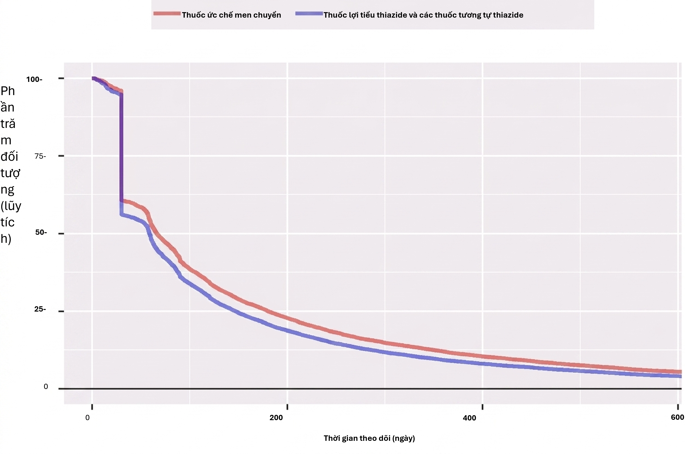{width="4.30062445319335in"
height="2.8546872265966754in"}

Hình 12.21: Phân phối thời gian theo dõi cho các nhóm thuần tập mục
tiêu và đối chứng.

### Kaplan-Meier

Một kiểm tra cuối cùng là xem xét biểu đồ Kaplan-Meier, hiển thị sự
sống sót theo thời gian ở cả hai nhóm thuần tập. Sử dụng hàm
plotKaplanMeier, chúng ta có thể tạo Hình 12.22, mà chúng ta có thể
kiểm tra, ví dụ, liệu giả định về tỷ lệ rủi ro tỷ lệ của chúng ta có
giữ nguyên hay không. Biểu đồ Kaplan-Meier tự động điều chỉnh cho sự
phân tầng hoặc trọng số theo PS. Trong trường hợp này, vì ghép cặp
theo tỷ lệ biến đổi được sử dụng, đường cong sống sót cho các nhóm đối
chứng được điều chỉnh để bắt chước đường cong trông như thế nào đối
với nhóm mục tiêu nếu họ được phơi nhiễm với đối chứng thay thế.

### Ước tính quy mô hiệu quả

Chúng ta quan sát thấy tỷ lệ rủi ro là 4.32 (khoảng tin cậy 95%:
2.45 - 8.08) đối với phù mạch, cho chúng ta biết rằng ACEi dường như
làm tăng nguy cơ phù mạch so với THZ. Tương tự, chúng ta quan sát thấy
tỷ lệ rủi ro là 1.13 (khoảng tin cậy 95%: 0.59 - 2.18) đối với AMI,
cho thấy ít hoặc không có ảnh hưởng đối với AMI. Các chẩn đoán của
chúng ta, như đã xem xét trước đó, không đưa ra lý do để nghi ngờ. Tuy
nhiên, cuối cùng thì chất lượng của bằng chứng này, và liệu chúng ta
có chọn tin tưởng nó hay không, phụ thuộc vào nhiều yếu tố không được
đề cập bởi các chẩn đoán nghiên cứu như được mô tả trong Chương
14.

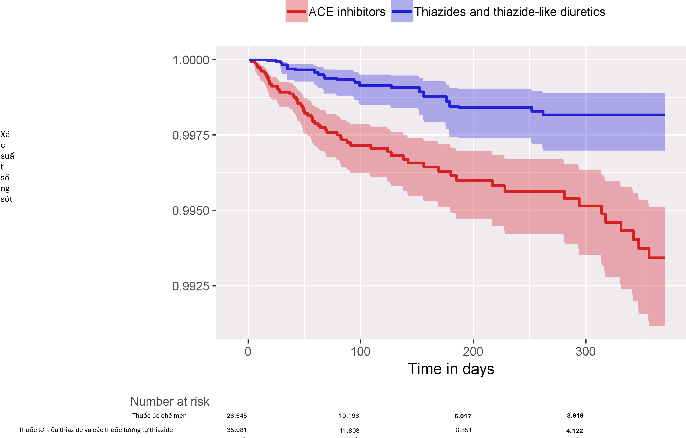{width="5.2316262029746285in"
height="3.345718503937008in"}*12.10. Tóm tắt 237*

## Tóm tắt

Hình 12.22: Biểu đồ Kaplan-Meier.

{width="0.4455205599300088in"
height="0.4644783464566929in"}

- Population-level estimation aims to infer causal effects from
observational data.

- The **counterfactual**, what would have happened if the subject had
received an alternative exposure or no exposure, cannot be observed.

- Different designs aim to construct the counterfactual in different
ways.

- The various designs as implemented in the OHDSI Methods Library
provide diagnostics to evaluate whether the assumptions for creating
an appropriate counterfactual have been met.

## Bài tập

#### Điều kiện tiên quyết

Đối với các bài tập này, chúng tôi giả định rằng R, R-Studio và Java
đã được cài đặt như mô tả trong Mục 8.4.5. Ngoài ra, các gói
SqlRender, DatabaseConnector, Eunomia và CohortMethod cũng được yêu
cầu, có thể được cài đặt bằng cách sử dụng:

**install.packages**(**c**(\"SqlRender\", \"DatabaseConnector\",
\"remotes\")) remotes**::install_github**(\"ohdsi/Eunomia\", ref =
\"v1.0.0\") remotes**::install_github**(\"ohdsi/CohortMethod\")

Gói Eunomia cung cấp một tập dữ liệu mô phỏng trong CDM sẽ chạy bên
trong phiên R cục bộ của bạn. Chi tiết kết nối có thể được lấy bằng
cách sử dụng:

connectionDetails \<- Eunomia**::getEunomiaConnectionDetails**()

Lược đồ cơ sở dữ liệu CDM là "main". Các bài tập này cũng sử dụng một
vài nhóm thuần tập. Hàm createCohorts trong gói Eunomia sẽ tạo các
nhóm này trong bảng COHORT:

Eunomia**::createCohorts**(connectionDetails)

#### Định nghĩa bài toán

Nguy cơ xuất huyết tiêu hóa (GI) ở những người dùng mới sử dụng
celecoxib so với những người dùng mới sử dụng diclofenac là bao nhiêu?

Nhóm thuần tập người dùng mới sử dụng celecoxib có
COHORT_DEFINITION_ID = 1. Nhóm thuần tập người dùng mới sử dụng
diclofenac có COHORT_DEFINITION_ID = 2. Nhóm thuần tập xuất huyết tiêu
hóa có COHORT_DEFINITION_ID = 3. Các ID khái niệm thành phần cho
celecoxib và diclofenac lần lượt là 1118084 và 1124300. Thời gian nguy
cơ bắt đầu vào ngày bắt đầu điều trị, và dừng lại ở cuối quá trình
quan sát (một phân tích gọi là intent-to-treat).

**Bài tập 12.1. Sử dụng gói CohortMethod R, sử dụng tập hợp các biến
hiệp biến mặc định và trích xuất CohortMethodData từ CDM. Tạo tóm tắt
của CohortMethodData.**

**Bài tập 12.2. Tạo một quần thể nghiên cứu bằng hàm
createStudyPopulation, yêu cầu thời gian rửa trôi 180 ngày, loại trừ
những người đã có kết cục trước đó, và loại bỏ những người xuất hiện
trong cả hai nhóm thuần tập. Chúng ta có mất người không?**

**Bài tập 12.3. Khớp một mô hình rủi ro tỷ lệ Cox mà không sử dụng bất
kỳ sự điều chỉnh nào. Điều gì có thể xảy ra nếu bạn làm điều này?**

**Bài tập 12.4. Khớp một mô hình điểm xu hướng. Hai nhóm có thể so
sánh được không?**

**Bài tập 12.5. Thực hiện phân tầng PS sử dụng 5 tầng. Sự cân bằng
biến hiệp biến có đạt được không?**

**Bài tập 12.6. Khớp một mô hình rủi ro tỷ lệ Cox sử dụng các tầng PS.
Tại sao kết quả lại khác với mô hình chưa điều chỉnh?**

Các câu trả lời gợi ý có thể được tìm thấy trong Phụ lục E.8.

