# Dự đoán cấp độ bệnh nhân

*Người phụ trách chương&#58; Peter Rijnbeek & Jenna Reps*

Ra quyết định lâm sàng là một nhiệm vụ phức tạp, trong đó bác sĩ lâm
sàng phải suy luận một chẩn đoán hoặc lộ trình điều trị dựa trên bệnh
sử có sẵn của bệnh nhân và các hướng dẫn lâm sàng hiện tại. Các mô
hình dự đoán lâm sàng đã được phát triển để hỗ trợ quá trình ra quyết
định này và được sử dụng trong thực hành lâm sàng trong một phạm vi
rộng các chuyên khoa. Các mô hình này dự đoán một kết cục chẩn đoán
hoặc tiên lượng dựa trên sự kết hợp các đặc điểm của bệnh nhân, ví dụ:
thông tin nhân khẩu học, bệnh sử và lịch sử điều trị.

Số lượng các ấn phẩm mô tả các mô hình dự đoán lâm sàng đã tăng mạnh
trong 10 năm qua. Hầu hết các mô hình được sử dụng hiện nay được ước
tính bằng cách sử dụng các tập dữ liệu nhỏ và chỉ xem xét một tập hợp
nhỏ các đặc điểm của bệnh nhân. Kích thước mẫu nhỏ này, và do đó sức
mạnh thống kê thấp, buộc nhà phân tích dữ liệu phải đưa ra các giả
định mô hình hóa mạnh mẽ. Việc lựa chọn tập hợp hạn chế các đặc điểm
của bệnh nhân được hướng dẫn mạnh mẽ bởi kiến thức chuyên môn sẵn có.
Điều này tương phản rõ rệt với thực tế của y học hiện đại, nơi bệnh
nhân tạo ra một dấu vết kỹ thuật số phong phú, vượt xa khả năng của
bất kỳ bác sĩ y khoa nào để có thể đồng hóa hoàn toàn. Hiện nay, chăm
sóc sức khỏe đang tạo ra một lượng lớn thông tin cụ thể về bệnh nhân
được lưu trữ trong Hồ sơ sức khỏe điện tử (EHR). Điều này bao gồm dữ
liệu có cấu trúc dưới dạng chẩn đoán, thuốc, kết quả xét nghiệm trong
phòng thí nghiệm, và dữ liệu phi cấu trúc chứa trong các tường thuật
lâm sàng. Chưa biết được bao nhiêu độ chính xác dự đoán có thể đạt
được bằng cách tận dụng lượng dữ liệu lớn bắt nguồn từ toàn bộ EHR của
một bệnh nhân.

Những tiến bộ trong học máy để phân tích tập dữ liệu lớn đã dẫn đến sự
quan tâm ngày càng tăng trong việc áp dụng dự đoán cấp độ bệnh nhân
trên loại dữ liệu này. Tuy nhiên, nhiều nỗ lực được công bố trong dự
đoán cấp độ bệnh nhân không tuân theo các hướng dẫn phát triển mô
hình, không thực hiện xác thực bên ngoài rộng rãi, hoặc cung cấp chi
tiết mô hình không đầy đủ, điều này hạn chế khả năng của các nhà
nghiên cứu độc lập trong việc tái tạo các mô hình và thực hiện xác
thực bên ngoài. Điều này gây khó khăn cho việc đánh giá công bằng hiệu
suất dự đoán của các mô hình và làm giảm khả năng mô hình được sử dụng
một cách thích hợp trong thực hành lâm sàng. Để cải thiện các tiêu
chuẩn, một số bài báo đã được viết chi tiết các hướng dẫn về thực tiễn
tốt nhất trong

phát triển và báo cáo các mô hình dự đoán. Ví dụ, tuyên bố Báo cáo
minh bạch về một mô hình dự đoán đa biến cho tiên lượng hoặc chẩn đoán
cá nhân (TRIPOD)1 cung cấp các khuyến nghị rõ ràng để báo cáo việc
phát triển và xác thực mô hình dự đoán và giải quyết một số mối quan
ngại liên quan đến tính minh bạch.

Mô hình dự đoán cụ thể cho bệnh nhân ở quy mô lớn đã trở thành hiện
thực nhờ OHDSI, nơi Mô hình dữ liệu chung (CDM) cho phép phân tích
đồng nhất và minh bạch ở quy mô chưa từng có. Mạng lưới cơ sở dữ liệu
ngày càng phát triển được chuẩn hóa theo CDM cho phép xác thực bên
ngoài các mô hình trong các môi trường chăm sóc sức khỏe khác nhau
trên quy mô toàn cầu. Chúng tôi tin rằng điều này mang lại cơ hội ngay
lập tức để phục vụ các cộng đồng bệnh nhân lớn, những người cần nhất
việc cải thiện chất lượng chăm sóc. Các mô hình như vậy có thể thông
tin cho việc chăm sóc y tế được cá nhân hóa thực sự, hy vọng dẫn đến
kết quả cải thiện mạnh mẽ cho bệnh nhân.

Trong chương này, chúng tôi mô tả khuôn khổ chuẩn hóa của OHDSI cho dự
đoán cấp độ bệnh nhân, (Reps et al., 2018) và thảo luận về gói
PatientLevelPrediction R thực hiện các thực tiễn tốt nhất đã được
thiết lập cho việc phát triển và xác thực. Chúng tôi bắt đầu bằng việc
cung cấp lý thuyết cần thiết đằng sau việc phát triển và đánh giá dự
đoán cấp độ bệnh nhân và cung cấp cái nhìn tổng quan cấp cao về các
thuật toán học máy được triển khai. Sau đó, chúng tôi thảo luận về một
bài toán dự đoán ví dụ và cung cấp hướng dẫn từng bước về định nghĩa
và triển khai của nó bằng cách sử dụng ATLAS hoặc mã R tùy chỉnh. Cuối
cùng, chúng tôi thảo luận về việc sử dụng các ứng dụng Shiny để phổ
biến kết quả nghiên cứu.

## Bài toán dự đoán

Hình 13.1 minh họa bài toán dự đoán mà chúng tôi giải quyết. Trong một
quần thể có nguy cơ, chúng tôi nhằm mục đích dự đoán những bệnh nhân
nào tại một thời điểm xác định (t = 0) sẽ gặp phải một kết cục nào đó
trong thời gian có nguy cơ. Dự đoán được thực hiện chỉ sử dụng thông
tin về các bệnh nhân trong một cửa sổ quan sát trước thời điểm đó.

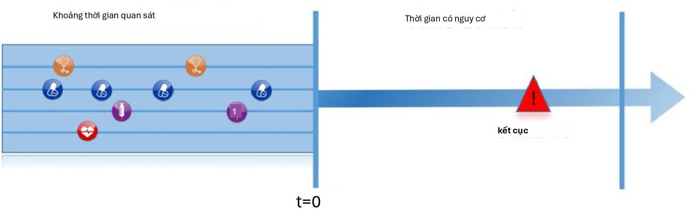{width="4.9459372265966755in"
height="1.5034372265966753in"}

Hình 13.1&#58; Bài toán dự đoán.

Như hiển thị trong Bảng 13.1, để định nghĩa một bài toán dự đoán,
chúng ta phải định nghĩa t=0 bằng một nhóm thuần tập mục tiêu, kết cục
mà chúng ta muốn dự đoán bằng một nhóm thuần tập kết cục, và thời gian
có nguy cơ. Chúng ta

^1^<https://www.equator-network.org/reporting-guidelines/tripod-statement/>

định nghĩa câu hỏi dự đoán tiêu chuẩn là:

Trong số \[định nghĩa nhóm thuần tập mục tiêu\], ai sẽ tiếp tục có
\[định nghĩa nhóm thuần tập kết cục\] trong \[thời gian có nguy cơ\]?

Hơn nữa, chúng ta phải đưa ra các lựa chọn thiết kế cho mô hình mà
chúng ta muốn phát triển, và xác định các tập dữ liệu quan sát để thực
hiện xác thực nội bộ và bên ngoài.

Bảng 13.1: Các lựa chọn thiết kế chính trong một thiết kế dự đoán.

Lựa chọn Mô tả

Nhóm thuần tập mục tiêu Làm thế nào chúng ta định nghĩa nhóm người mà
chúng ta muốn dự đoán?

Nhóm thuần tập kết cục Làm thế nào chúng ta định nghĩa kết cục mà
chúng ta muốn dự đoán?

Thời gian có nguy cơ Trong cửa sổ thời gian nào so với t=0 chúng ta
muốn thực hiện dự đoán?

Mô hình Chúng ta muốn sử dụng các thuật toán nào, và chúng ta bao gồm
các biến dự báo tiềm năng nào?

Khuôn khổ khái niệm này hoạt động cho tất cả các loại bài toán dự
đoán, ví dụ:

- Khởi phát và tiến triển bệnh

- **Cấu trúc&#58; Trong số các bệnh nhân mới được chẩn đoán mắc \[một
bệnh\], ai sẽ tiếp tục mắc \[một bệnh hoặc biến chứng khác\] trong
\[thời gian từ khi chẩn đoán\]?**

- **Ví dụ: Trong số các bệnh nhân mới được chẩn đoán rung nhĩ, ai sẽ
tiếp tục bị đột quỵ do thiếu máu cục bộ trong ba năm tới?**

- Lựa chọn điều trị

- **Cấu trúc&#58; Trong số các bệnh nhân mắc \[bệnh chỉ định\] được điều
trị bằng \[điều trị 1\] hoặc \[điều trị 2\], những bệnh nhân nào đã
được điều trị bằng \[điều trị 1\]?**

- **Ví dụ: Trong số các bệnh nhân mắc rung nhĩ đã dùng warfarin hoặc
rivaroxaban, những bệnh nhân nào dùng warfarin? (ví dụ cho một mô
hình điểm xu hướng)**

- Đáp ứng điều trị

- **Cấu trúc&#58; Trong số những người dùng mới của \[một điều trị\], ai
sẽ gặp \[một hiệu ứng nào đó\] trong \[cửa sổ thời gian\]?**

- **Ví dụ: Những bệnh nhân mắc tiểu đường bắt đầu dùng metformin nào
tiếp tục dùng metformin trong ba năm?**

- An toàn điều trị

- **Cấu trúc&#58; Trong số những người dùng mới của \[một điều trị\], ai
sẽ gặp \[biến cố bất lợi\] trong \[cửa sổ thời gian\]?**

- **Ví dụ: Trong số những người dùng mới warfarin, ai sẽ bị xuất huyết
tiêu hóa trong một năm?**

- Tuân thủ điều trị

<!-- -->

- **Cấu trúc&#58; Trong số những người dùng mới của \[một điều trị\], ai sẽ
đạt được \[chỉ số tuân thủ\] tại \[cửa sổ thời gian\]?**

- **Ví dụ: Những bệnh nhân tiểu đường nào bắt đầu dùng metformin đạt
được**

\>=80% tỷ lệ số ngày được bao phủ trong một
năm?

## Trích xuất dữ liệu

Khi tạo một mô hình dự đoán, chúng ta sử dụng một quá trình được gọi
là học có giám sát --- một hình thức học máy --- suy luận mối quan hệ
giữa các biến hiệp biến và tình trạng kết cục dựa trên một tập hợp các
ví dụ đã được dán nhãn. Do đó, chúng ta cần các phương pháp để trích
xuất các biến hiệp biến từ CDM cho những người trong nhóm thuần tập
mục tiêu và chúng ta cần lấy các nhãn kết cục của họ.

Các biến hiệp biến (còn được gọi là "biến dự báo", "đặc trưng" hoặc
"biến độc lập") mô tả các đặc điểm của bệnh nhân. Các biến hiệp biến
có thể bao gồm tuổi, giới tính, sự hiện diện của các tình trạng cụ thể
và mã phơi nhiễm trong hồ sơ của bệnh nhân, v.v. Các biến hiệp biến
thường được xây dựng bằng gói FeatureExtraction, được mô tả chi tiết
hơn trong Chương 11. Đối với dự đoán, chúng ta chỉ có thể sử dụng dữ
liệu trước (và vào) ngày người đó tham gia nhóm thuần tập mục tiêu.
Ngày này chúng ta gọi là ngày chỉ số.

Chúng ta cũng cần lấy tình trạng kết cục (còn được gọi là "nhãn" hoặc
"lớp") của tất cả bệnh nhân trong thời gian có nguy cơ. Nếu kết cục
xảy ra trong thời gian có nguy cơ, tình trạng kết cục được định nghĩa
là "dương tính".

### Ví dụ về trích xuất dữ liệu

Bảng 13.2 hiển thị một bảng COHORT ví dụ với hai nhóm thuần tập. Nhóm
thuần tập có ID định nghĩa nhóm thuần tập 1 là nhóm thuần tập mục tiêu
(ví dụ: "những người mới được chẩn đoán rung nhĩ"). ID định nghĩa nhóm
thuần tập 2 định nghĩa nhóm thuần tập kết cục (ví dụ: "đột quỵ").

Bảng 13.2: Bảng COHORT ví dụ. Để đơn giản, COHORT_END_DATE đã bị lược
bỏ.

+----------------------+------------+---------------------+
| COHORT_DEFINITION_ID | SUBJECT_ID | > COHORT_START_DATE |
+:====================:+:==========:+:===================:+
| 1                    | 1          | > 2000-06-01        |
+----------------------+------------+---------------------+
| 1                    | 2          | > 2001-06-01        |
+----------------------+------------+---------------------+
| 2                    | 2          | > 2001-07-01        |
+----------------------+------------+---------------------+

Bảng 13.3 cung cấp một bảng CONDITION_OCCURRENCE ví dụ. ID khái niệm
320128 đề cập đến "Tăng huyết áp vô căn."

Bảng 13.3: Bảng CONDITION_OCCURRENCE ví dụ. Để đơn giản, chỉ có ba cột
được hiển thị.

+-----------+----------------------+----------------------+
| PERSON_ID | CONDITION_CONCEPT_ID | CONDITION_START_DATE |
+:=========:+:====================:+:====================:+
| 1         | 320128               | > 2000-10-01         |
+-----------+----------------------+----------------------+
| 2         | 320128               | > 2001-05-01         |
+-----------+----------------------+----------------------+

Dựa trên dữ liệu ví dụ này, và giả định thời gian có nguy cơ là một
năm sau ngày chỉ số (ngày bắt đầu nhóm thuần tập mục tiêu), chúng ta
có thể xây dựng các biến hiệp biến và tình trạng kết cục. Một biến
hiệp biến chỉ ra "Tăng huyết áp vô căn trong năm trước đó" sẽ có giá
trị 0 (không hiện diện) cho ID người 1 (tình trạng xảy ra sau ngày chỉ
số), và giá trị 1 (hiện diện) cho ID người 2. Tương tự, tình trạng kết
cục sẽ là 0 cho ID người 1 (người này không có mục nhập trong nhóm
thuần tập kết cục), và 1 cho ID người 2 (kết cục xảy ra trong vòng một
năm sau ngày chỉ số).

### Âm tính vs Thiếu

Dữ liệu chăm sóc sức khỏe quan sát hiếm khi phản ánh liệu một giá trị
là âm tính hay thiếu. Trong ví dụ trước, chúng ta chỉ quan sát người
có ID 1 không có trường hợp tăng huyết áp vô căn nào trước ngày chỉ
số. Điều này có thể là do tình trạng không hiện diện (âm tính) tại
thời điểm đó, hoặc do nó không được ghi lại (thiếu). Điều quan trọng
là phải nhận ra rằng thuật toán học máy không thể phân biệt giữa âm
tính và thiếu và sẽ chỉ đơn giản đánh giá giá trị dự đoán trong dữ
liệu có sẵn.

## Khớp mô hình

Khi khớp một mô hình dự đoán, chúng ta đang cố gắng tìm hiểu mối quan
hệ giữa các biến hiệp biến và tình trạng kết cục quan sát được từ các
ví dụ đã được dán nhãn. Giả sử chúng ta chỉ có hai biến hiệp biến,
huyết áp tâm thu và tâm trương, thì chúng ta có thể biểu diễn mỗi bệnh
nhân như một biểu đồ trong không gian hai chiều như hiển thị trong
Hình 13.2. Trong hình này, hình dạng của điểm dữ liệu tương ứng với
tình trạng kết cục của bệnh nhân (ví dụ: đột quỵ).

Một mô hình học có giám sát sẽ cố gắng tìm một ranh giới quyết định
phân tách tối ưu hai lớp kết cục. Các kỹ thuật học có giám sát khác
nhau dẫn đến các ranh giới quyết định khác nhau và thường có các siêu
tham số có thể tác động đến độ phức tạp của ranh giới quyết định.

Trong Hình 13.2, chúng ta có thể thấy ba ranh giới quyết định khác
nhau. Các ranh giới được sử dụng để suy luận tình trạng kết cục của
bất kỳ điểm dữ liệu mới nào. Nếu một điểm dữ liệu mới rơi vào vùng
được tô bóng thì mô hình sẽ dự đoán "có kết cục", nếu không, nó sẽ dự
đoán "không có kết cục". Lý tưởng nhất, một ranh giới quyết định nên
phân chia hoàn hảo hai lớp. Tuy nhiên, có một rủi ro là các mô hình
quá phức tạp sẽ "quá khớp" (overfit) với dữ liệu. Điều này có thể ảnh
hưởng tiêu cực đến khả năng tổng quát hóa của mô hình đối với dữ liệu
chưa nhìn thấy. Ví dụ, nếu dữ liệu chứa nhiễu, với các điểm dữ liệu bị
dán nhãn sai hoặc đặt không chính xác, chúng ta sẽ không muốn khớp mô
hình của mình với

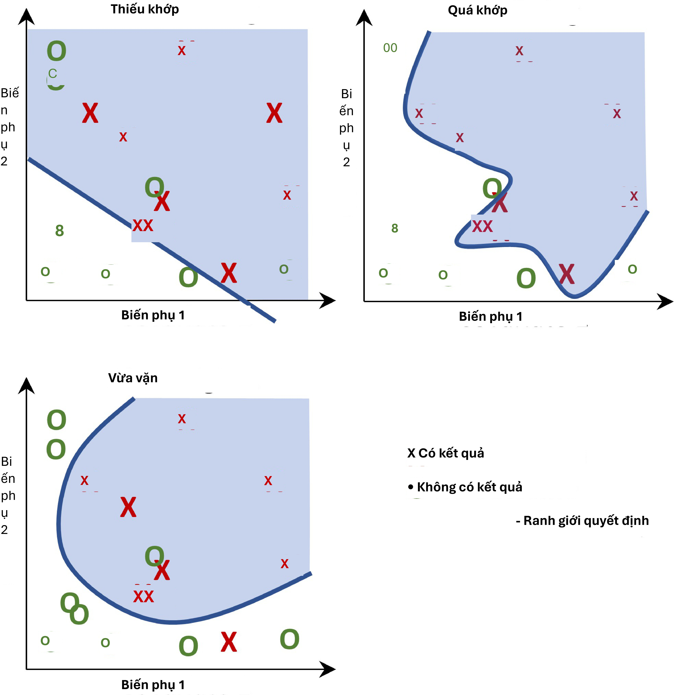{width="3.2766655730533683in"
height="3.3766666666666665in"}

Hình 13.2: Ranh giới quyết định.

nhiễu đó. Do đó, chúng ta có thể thích định nghĩa một ranh giới quyết
định không phân biệt hoàn hảo trong dữ liệu huấn luyện của mình nhưng
nắm bắt được độ phức tạp "thực". Các kỹ thuật như chuẩn hóa nhằm tối
đa hóa hiệu suất mô hình trong khi giảm thiểu độ phức tạp.

Mỗi thuật toán học có giám sát có một cách khác nhau để tìm hiểu ranh
giới quyết định và không dễ dàng để biết thuật toán nào sẽ hoạt động
tốt nhất trên dữ liệu của bạn. Như định lý No Free Lunch đã nêu, không
một thuật toán nào luôn vượt trội hơn các thuật toán khác trên tất cả
các bài toán dự đoán. Do đó, chúng tôi khuyên bạn nên thử nhiều thuật
toán học có giám sát với các cài đặt siêu tham số khác nhau khi phát
triển các mô hình dự đoán cấp độ bệnh nhân.

Các thuật toán sau đây có sẵn trong gói PatientLevelPrediction:

### Hồi quy Logistic có điều chỉnh

Hồi quy logistic LASSO (toán tử thu hẹp và lựa chọn tuyệt đối tối
thiểu) thuộc họ các mô hình tuyến tính tổng quát, nơi một tổ hợp tuyến
tính của các biến được học và cuối cùng một hàm logistic ánh xạ tổ hợp
tuyến tính đó sang một giá trị từ 0 đến 1. Việc chuẩn hóa LASSO thêm
một chi phí dựa trên độ phức tạp của mô hình vào hàm mục tiêu khi huấn
luyện mô hình. Chi phí này là tổng các giá trị tuyệt đối của tổ hợp
tuyến tính của các hệ số. Mô hình tự động thực hiện lựa chọn đặc trưng
bằng cách giảm thiểu chi phí này. Chúng tôi sử dụng gói Cyclops (giảm
tọa độ vòng cho hồi quy logistic, Poisson và phân tích rủi ro) để thực
hiện hồi quy logistic có điều chỉnh quy mô lớn.

Bảng 13.4: Siêu tham số cho hồi quy logistic
có điều chỉnh.

Tham số Mô tả Các giá trị điển hình Phương sai bắt đầu Phương sai bắt
đầu của phân phối tiên nghiệm. 0.1

Lưu ý rằng phương sai được tối ưu hóa bằng cách tối đa hóa khả năng
xảy ra ngoài mẫu trong kiểm chứng chéo, vì vậy phương sai bắt đầu có
ít tác động đến hiệu suất của mô hình kết quả. Tuy nhiên, việc chọn
một phương sai bắt đầu quá xa so với giá trị tối ưu có thể dẫn đến
thời gian khớp lâu.

### Máy tăng cường Gradient

Máy tăng cường gradient là một kỹ thuật ensemble tăng cường và trong
khuôn khổ của chúng tôi, nó kết hợp nhiều cây quyết định. Tăng cường
hoạt động bằng cách lặp đi lặp lại việc thêm các cây quyết định nhưng
thêm nhiều trọng số hơn vào các điểm dữ liệu bị phân loại sai bởi các
cây quyết định trước đó trong hàm chi phí khi huấn luyện cây tiếp
theo. Chúng tôi sử dụng Extreme Gradient Boosting, là một triển khai
hiệu quả của khuôn khổ tăng cường gradient được triển khai trong gói
xgboost R có sẵn từ CRAN.

Bảng 13.5: Siêu tham số cho máy tăng cường gradient.

***
Tham số     Mô tả                          Các giá trị điển
hình
----------- ------------------------------ ----------------
Vòng dừng   Dừng sau các vòng không cải    25
sớm         thiện

Tốc độ học  Tốc độ học (learning rate) của 0.005,0.01,0.1
boosting

Độ sâu tối  Số tầng tối đa trong một cây   4,6,17
đa

Số hàng tối Số điểm dữ liệu tối thiểu      2
thiểu       trong một nút

Số cây      Số lượng cây                   100,1000
***

### Random Forest

Rừng ngẫu nhiên là một kỹ thuật ensemble đóng gói kết hợp nhiều cây
quyết định. Ý tưởng đằng sau việc đóng gói là giảm khả năng quá khớp
bằng cách sử dụng các bộ phân loại yếu và kết hợp chúng thành một bộ
phân loại mạnh. Rừng ngẫu nhiên thực hiện điều này bằng cách huấn
luyện nhiều cây quyết định nhưng chỉ sử dụng một tập hợp con các biến
trong mỗi cây và tập hợp con các biến khác nhau giữa các cây. Gói của
chúng tôi sử dụng triển khai sklearn của Rừng ngẫu nhiên trong Python.

Bảng 13.6: Siêu tham số cho rừng ngẫu nhiên.

+----------+-------------------+------------------------+
| Tham số  | > Mô tả           | > Các giá trị điển     |
|          |                   | > hình                 |
+==========+===================+========================+
| Độ sâu   | > Số tầng tối đa  | > 4,10,17              |
| tối đa   | > trong một cây   |                        |
+----------+-------------------+------------------------+

Tham số Mô tả Các giá trị điển hình

mtries Số lượng đặc trưng trong mỗi cây

-1 = căn bậc hai của tổng số đặc trưng,5,20

ntrees Số lượng cây 500

### K-Hàng xóm gần nhất

K-láng giềng gần nhất (KNN) là một thuật toán sử dụng một số thước đo
khoảng cách để tìm K điểm dữ liệu đã dán nhãn gần nhất với một điểm dữ
liệu mới chưa dán nhãn. Dự đoán của các điểm dữ liệu mới sau đó là lớp
phổ biến nhất của K điểm dữ liệu đã dán nhãn gần nhất. Có một hạn chế
về chia sẻ của KNN, vì mô hình yêu cầu dữ liệu đã dán nhãn để thực
hiện dự đoán trên dữ liệu mới, và thường không thể chia sẻ dữ liệu này
giữa các trang web dữ liệu. Chúng tôi đã bao gồm gói BigKnn được phát
triển trong OHDSI, đây là một bộ phân loại KNN quy mô lớn.

Bảng 13.7: Siêu tham số cho K-láng giềng gần nhất.

Tham số Mô tả Các giá trị điển hình k Số lượng láng giềng 1000

### Naive Bayes

Thuật toán Naive Bayes áp dụng định lý Bayes với giả định ngây thơ về
sự độc lập có điều kiện giữa mọi cặp đặc trưng với giá trị của biến
lớp. Dựa trên khả năng dữ liệu thuộc về một lớp và phân phối tiên
nghiệm của lớp, một phân phối hậu nghiệm được thu được. Naive Bayes
không có siêu tham số.

### AdaBoost

AdaBoost là một kỹ thuật ensemble tăng cường. Tăng cường hoạt động
bằng cách lặp đi lặp lại việc thêm các bộ phân loại nhưng thêm nhiều
trọng số hơn vào các điểm dữ liệu bị phân loại sai bởi các bộ phân
loại trước đó trong hàm chi phí khi huấn luyện bộ phân loại tiếp theo.
Chúng tôi sử dụng triển khai sklearn AdaboostClassifier trong Python.

Bảng 13.8: Siêu tham số cho AdaBoost.

Tham số Mô tả Các giá trị điển hình

nEstimators Số lượng tối đa các 4 bộ ước tính tại đó

tăng cường bị chấm dứt

Tham số Mô tả Các giá trị điển hình

learningRate Tốc độ học làm giảm 1

sự đóng góp của mỗi bộ phân loại theo learning_rate. Có một sự đánh
đổi giữa learningRate và nEstimators

### Cây quyết định

Cây quyết định là một bộ phân loại phân vùng không gian biến sử dụng
các kiểm tra riêng lẻ được chọn bằng cách tiếp cận tham lam. Nó nhằm
mục đích tìm các phân vùng có độ lợi thông tin cao nhất để phân tách
các lớp. Cây quyết định có thể dễ dàng bị quá khớp bằng cách cho phép
một số lượng lớn các phân vùng (độ sâu cây) và thường cần một số sự
chuẩn hóa (ví dụ: tỉa cành hoặc chỉ định các siêu tham số giới hạn độ
phức tạp của mô hình). Chúng tôi sử dụng triển khai sklearn
DecisionTreeClassifier trong Python.

Bảng 13.9: Siêu tham số cho cây quyết định.

Tham số Mô tả Các giá trị điển hình classWeight "Balance" hoặc "None"
None

maxDepth Độ sâu tối đa của cây

minImpuritySplit Ngưỡng cho việc sớm

dừng trong sự phát triển của cây. Một nút sẽ phân tách nếu độ không
tinh khiết của nó nằm trên ngưỡng, nếu không nó là một lá

minSamplesLeaf Số lượng tối thiểu

các mẫu trên mỗi lá minSamplesSplit Số lượng mẫu tối thiểu

trên mỗi lần phân tách

10\^-7

### Mạng nơ-ron truyền thẳng đa lớp (Multilayer Perceptron)

Perceptron đa lớp là các mạng thần kinh chứa nhiều lớp nút có trọng số
đầu vào bằng một hàm phi tuyến tính. Lớp đầu tiên là lớp đầu vào, lớp
cuối cùng là lớp đầu ra, và ở giữa là các lớp ẩn. Các mạng thần kinh
thường được huấn luyện bằng phương pháp lan truyền ngược
(back-propagation), nghĩa là dữ liệu đầu vào huấn luyện được truyền về
phía trước qua mạng để tạo ra đầu ra, sai số giữa đầu ra và trạng thái
kết quả được tính toán, và sai số này được truyền ngược qua mạng để
cập nhật trọng số hàm tuyến tính.

Bảng 13.10: Các siêu tham số cho Perceptron đa lớp.

***
Tham số Mô tả                Các giá
trị điển
hình
------- -------------------- ----------
alpha   Quy chuẩn hóa l2     0.00001

Kích    Số lượng nút ẩn      4
thước
***

### Học sâu (Deep Learning)

Học sâu như mạng sâu, mạng thần kinh tích chập hoặc mạng thần kinh tái
phát tương tự như Perceptron đa lớp nhưng có nhiều lớp ẩn nhằm mục
đích học các biểu diễn tiềm ẩn hữu ích cho việc dự đoán. Trong một tài
liệu phụ trợ riêng biệt trong gói PatientLevelPrediction, chúng tôi mô
tả chi tiết hơn về các mô hình và siêu tham số này.

### Các thuật toán khác

Các thuật toán khác có thể được thêm vào khung dự đoán cấp độ bệnh
nhân. Điều này nằm ngoài phạm vi của chương này. Chi tiết có thể được
tìm thấy trong tài liệu phụ trợ "Thêm các thuật toán dự đoán cấp độ
bệnh nhân tùy chỉnh" trong gói PatientLevelPrediction.[]{#_bookmark394
.anchor}

## Đánh giá các mô hình dự đoán

### Các loại đánh giá

Chúng ta có thể đánh giá một mô hình dự đoán bằng cách đo lường sự
tương đồng giữa dự đoán của mô hình và trạng thái kết quả quan sát
được, điều này có nghĩa là chúng ta cần dữ liệu mà trạng thái kết quả
đã được biết.

) and may not perform well
for new
patients.](media/image6.png){width="0.455in"
height="0.45499890638670165in"}

Chúng ta phân biệt giữa

- **Đánh giá nội bộ: Sử dụng các tập dữ liệu khác nhau được trích xuất
từ cùng một cơ sở dữ liệu để phát triển và đánh giá mô hình.**

- **Đánh giá bên ngoài&#58; Phát triển mô hình trong một cơ sở dữ liệu và
đánh giá trong một cơ sở dữ liệu khác.**

Có hai cách để thực hiện đánh giá nội bộ:

- Cách tiếp cận tập dữ liệu giữ lại (holdout set) chia dữ liệu đã gắn
nhãn thành hai tập độc lập&#58; tập huấn luyện và tập kiểm tra (tập giữ
lại). Tập huấn luyện được sử dụng để học mô hình và tập kiểm tra được
sử dụng để đánh giá mô hình đó. Chúng ta có thể chia bệnh nhân một
cách ngẫu nhiên thành tập huấn luyện và tập kiểm tra, hoặc chúng ta có
thể chọn&#58;

- Chia dữ liệu dựa trên thời gian (đánh giá theo thời gian), ví dụ&#58;
huấn luyện trên dữ liệu trước một ngày cụ thể và đánh giá trên dữ
liệu sau ngày đó. Điều này có thể cho chúng ta biết liệu mô hình của
mình có khả năng tổng quát hóa sang các khoảng thời gian khác nhau
hay không.

- Chia dữ liệu dựa trên vị trí địa lý (đánh giá không gian).

<!-- -->

- **Đánh giá chéo (cross validation) rất hữu ích khi dữ liệu bị hạn chế.
Dữ liệu được chia thành 𝑛 tập có kích thước bằng nhau, trong đó 𝑛 cần
được xác định trước (ví dụ: 𝑛 = 10). Đối với mỗi tập này, một mô hình
được huấn luyện trên tất cả dữ liệu ngoại trừ dữ liệu trong tập đó và
được sử dụng để tạo dự đoán cho tập giữ lại. Theo cách này, tất cả dữ
liệu được sử dụng một lần để đánh giá thuật toán xây dựng mô hình.
Trong khung dự đoán cấp độ bệnh nhân, chúng tôi sử dụng đánh giá chéo
để chọn các siêu tham số tối ưu.**

Đánh giá bên ngoài nhằm mục đích đánh giá hiệu suất mô hình trên dữ
liệu từ một cơ sở dữ liệu khác,

tức là bên ngoài các thiết lập mà nó được phát triển. Phép đo khả năng
vận chuyển mô hình này rất quan trọng vì chúng ta muốn áp dụng các mô
hình của mình không chỉ trên cơ sở dữ liệu mà nó đã được huấn luyện.
Các cơ sở dữ liệu khác nhau có thể đại diện cho các quần thể bệnh nhân
khác nhau, các hệ thống chăm sóc sức khỏe khác nhau và các quy trình
thu thập dữ liệu khác nhau. Chúng tôi tin rằng việc đánh giá bên ngoài
các mô hình dự đoán trên một tập hợp lớn các cơ sở dữ liệu là một bước
quan trọng trong việc chấp nhận và triển khai mô hình vào thực hành
lâm sàng.

### Các chỉ số hiệu suất

#### Các biện pháp ngưỡng

Một mô hình dự đoán gán một giá trị từ 0 đến 1 cho mỗi bệnh nhân tương
ứng với nguy cơ bệnh nhân gặp phải kết quả trong thời gian có nguy cơ.
Giá trị 0 nghĩa là 0% nguy cơ, giá trị 0,5 nghĩa là 50% nguy cơ và giá
trị 1 nghĩa là 100% nguy cơ. Các chỉ số phổ biến như độ chính xác, độ
nhạy, độ đặc hiệu, giá trị dự đoán dương tính có thể được tính toán
bằng cách trước tiên chỉ định một ngưỡng được sử dụng để phân loại
bệnh nhân có gặp kết quả hay không trong thời gian có nguy cơ. Ví dụ,
với Bảng 13.11, nếu chúng ta đặt ngưỡng là 0,5, bệnh nhân 1, 3, 7 và
10 có nguy cơ dự đoán lớn hơn hoặc bằng ngưỡng 0,5, vì vậy họ sẽ được
dự đoán là gặp kết quả. Tất cả các bệnh nhân khác có nguy cơ dự đoán
dưới 0,5, vì vậy họ sẽ được dự đoán là không gặp kết quả.

Bảng 13.11: Ví dụ về việc sử dụng ngưỡng trên xác suất dự đoán.

+--------+-----------+------------+------------+-------+
| ID     | Nguy cơ   | > Lớp dự   | > Có biến  | Loại  |
| bệnh   | dự đoán   | > đoán tại | > cố trong |       |
| nhân   |           | > ngưỡng   | >          |       |
|        |           | > 0,5      | > thời     |       |
|        |           |            | > gian     |       |
|        |           |            | > nguy cơ  |       |
+:======:+:=========:+:==========:+============+:=====:+
| 1      | 0.8       | 1          | > 1        | TP    |
+--------+-----------+------------+------------+-------+
| 2      | 0.1       | 0          | > 0        | TN    |
+--------+-----------+------------+------------+-------+
| 3      | 0.7       | 1          | > 0        | FP    |
+--------+-----------+------------+------------+-------+
| 4      | 0         | 0          | > 0        | TN    |
+--------+-----------+------------+------------+-------+
| 5      | 0.05      | 0          | > 0        | TN    |
+--------+-----------+------------+------------+-------+
| 6      | 0.1       | 0          | > 0        | TN    |
+--------+-----------+------------+------------+-------+
| 7      | 0.9       | 1          | > 1        | TP    |
+--------+-----------+------------+------------+-------+

+------------------+-----------+------------+------------+-------+
| []{#_bookmark398 | Nguy cơ   | > Lớp dự   | > Có biến  | Loại  |
| .anchor}ID bệnh  | dự đoán   | > đoán tại | > cố trong |       |
| nhân             |           | > ngưỡng   | >          |       |
|                  |           | > 0,5      | > thời     |       |
|                  |           |            | > gian     |       |
|                  |           |            | > nguy cơ  |       |
+:================:+:=========:+:==========:+============+:=====:+
| 8                | 0.2       | 0          | > 1        | FN    |
+------------------+-----------+------------+------------+-------+
| 9                | 0.3       | 0          | > 0        | TN    |
+------------------+-----------+------------+------------+-------+
| 10               | 0.5       | 1          | > 0        | FP    |
+------------------+-----------+------------+------------+-------+

Nếu một bệnh nhân được dự đoán là sẽ gặp kết quả và thực sự gặp kết
quả (trong thời gian có nguy cơ) thì đây được gọi là dương tính thật
(TP). Nếu một bệnh nhân được dự đoán là sẽ gặp kết quả nhưng không gặp
kết quả thì đây được gọi là dương tính giả (FP). Nếu một bệnh nhân
được dự đoán là không gặp kết quả và không gặp kết quả thì đây được
gọi là âm tính thật (TN). Cuối cùng, nếu một bệnh nhân được dự đoán là
không gặp kết quả nhưng thực sự gặp kết quả thì đây được gọi là âm
tính giả (FN).

Các chỉ số dựa trên ngưỡng sau đây có thể được tính toán:

- độ chính xác&#58; (𝑇 𝑃 + 𝑇 𝑁)/(𝑇 𝑃 + 𝑇 𝑁 + 𝐹 𝑃 + 𝐹 𝑁)

- độ nhạy&#58; 𝑇 𝑃 /(𝑇 𝑃 + 𝐹 𝑁)

- độ đặc hiệu&#58; 𝑇 𝑁/(𝑇 𝑁 + 𝜞 𝑃 )

- giá trị dự đoán dương tính&#58; 𝑇 𝑃 /(𝑇 𝑃 + 𝐹 𝑃 )

Lưu ý rằng các giá trị này có thể giảm hoặc tăng nếu ngưỡng được hạ
thấp. Việc hạ thấp ngưỡng của một bộ phân loại có thể làm tăng mẫu số
bằng cách tăng số lượng kết quả trả về. Nếu ngưỡng trước đó được đặt
quá cao, các kết quả mới đều có thể là dương tính thật, điều này sẽ
làm tăng giá trị dự đoán dương tính. Nếu ngưỡng trước đó là khoảng
đúng hoặc quá thấp, việc hạ thấp ngưỡng hơn nữa sẽ đưa vào các kết quả
dương tính giả, làm giảm giá trị dự đoán dương tính. Đối với độ nhạy,
mẫu số không phụ thuộc vào ngưỡng bộ phân loại (𝑇 𝑃 + 𝐹 𝑁 là một hằng
số). Điều này có nghĩa là việc hạ thấp ngưỡng bộ phân loại có thể làm
tăng độ nhạy bằng cách tăng số lượng kết quả dương tính thật. Cũng có
khả năng là việc hạ thấp ngưỡng có thể khiến độ nhạy không thay đổi,
trong khi giá trị dự đoán dương tính dao động.

#### Khả năng phân biệt

Khả năng phân biệt là khả năng gán nguy cơ cao hơn cho các bệnh nhân
sẽ gặp kết quả trong thời gian có nguy cơ. Đường cong Đặc tính vận
hành của thiết bị thu (ROC) được tạo bằng cách vẽ 1 -- độ đặc hiệu
trên trục x và độ nhạy trên trục y tại tất cả các ngưỡng có thể. Một
ví dụ về biểu đồ ROC được trình bày sau trong chương này ở Hình 13.17.
Diện tích dưới đường cong ROC (AUC) đưa ra một thước đo tổng thể về
khả năng phân biệt, trong đó giá trị 0,5 tương ứng với việc gán nguy
cơ ngẫu nhiên và giá trị 1 nghĩa là phân biệt hoàn hảo. Hầu hết các mô
hình dự đoán được công bố đều đạt được AUC từ 0,6-0,8.

AUC cung cấp một cách để xác định sự khác biệt giữa các phân phối nguy
cơ dự đoán giữa những bệnh nhân gặp kết quả trong thời gian có nguy cơ
và những người

không gặp. Nếu AUC cao, thì các phân phối sẽ hầu như tách biệt, trong
khi khi có nhiều sự chồng chéo, AUC sẽ gần bằng 0,5, như được hiển thị
trong Hình 13.3.

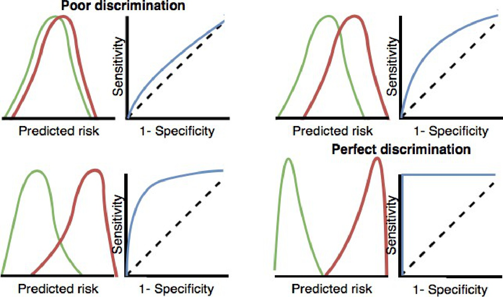{width="4.889479440069992in"
height="2.8895833333333334in"}

Hình 13.3: Cách các biểu đồ ROC được liên kết với khả năng phân biệt.
Nếu hai nhóm có phân phối nguy cơ dự đoán tương tự nhau, ROC sẽ gần
với đường chéo, với AUC gần bằng 0,5.

Đối với các kết quả hiếm gặp, ngay cả một mô hình có AUC cao cũng có
thể không thực tế, vì với mỗi kết quả dương tính trên một ngưỡng nhất
định, cũng có thể có nhiều kết quả âm tính (tức là giá trị dự đoán
dương tính sẽ thấp). Tùy thuộc vào mức độ nghiêm trọng của kết quả và
chi phí (rủi ro sức khỏe và/hoặc tiền bạc) của một số can thiệp, tỷ lệ
dương tính giả cao có thể là không mong muốn. Khi kết quả hiếm gặp,
một thước đo khác được gọi là diện tích dưới đường cong chính xác-thu
hồi (AUPRC) do đó được khuyến nghị. AUPRC là diện tích dưới đường
thẳng được tạo ra bằng cách vẽ độ nhạy trên trục x (còn được gọi là
thu hồi) và giá trị dự đoán dương tính trên trục y (còn được gọi là độ
chính xác).

#### Hiệu chuẩn (Calibration)

Hiệu chuẩn là khả năng của mô hình trong việc gán nguy cơ chính xác.
Ví dụ, nếu mô hình gán cho một trăm bệnh nhân nguy cơ 10% thì mười
bệnh nhân trong số đó sẽ gặp kết quả trong thời gian có nguy cơ. Nếu
mô hình gán cho 100 bệnh nhân nguy cơ 80% thì tám mươi bệnh nhân trong
số đó sẽ gặp kết quả trong thời gian có nguy cơ. Hiệu chuẩn thường
được tính bằng cách phân chia bệnh nhân thành các phân vị (deciles)
dựa trên nguy cơ dự đoán và trong mỗi nhóm tính toán nguy cơ dự đoán
trung bình và tỷ lệ bệnh nhân gặp kết quả trong thời gian có nguy cơ.
Sau đó, chúng ta vẽ mười điểm này (nguy cơ dự đoán trên trục y và nguy
cơ quan sát được trên trục x) và xem liệu chúng có rơi vào đường x = y
hay không, cho thấy mô hình đã được hiệu chuẩn tốt. Một ví dụ về biểu
đồ hiệu chuẩn

được trình bày sau trong chương này ở Hình 13.18. Chúng tôi cũng khớp
một mô hình tuyến tính bằng cách sử dụng các điểm để tính toán giao
điểm (nên gần bằng 0) và độ dốc (nên gần bằng 1). Nếu độ dốc lớn hơn 1
thì mô hình đang gán nguy cơ cao hơn nguy cơ thực tế và nếu độ dốc nhỏ
hơn 1 thì mô hình đang gán nguy cơ thấp hơn nguy cơ thực tế. Lưu ý
rằng chúng tôi cũng đã triển khai các Đường cong hiệu chuẩn mượt
(Smooth Calibration Curves) trong gói R của chúng tôi để nắm bắt tốt
hơn mối quan hệ phi tuyến tính giữa nguy cơ dự đoán và quan sát
được.

## Thiết kế một nghiên cứu dự đoán cấp độ bệnh nhân

Trong phần này, chúng tôi sẽ trình bày cách thiết kế một nghiên cứu dự
đoán. Bước đầu tiên là xác định rõ vấn đề dự đoán. Thú vị là, trong
nhiều bài báo được công bố, vấn đề dự đoán được xác định kém, ví dụ
như không rõ ngày chỉ số (ngày bắt đầu của nhóm thuần tập mục tiêu)
được xác định như thế nào. Một vấn đề dự đoán được xác định kém không
cho phép đánh giá bên ngoài bởi người khác, chưa nói đến việc triển
khai trong thực hành lâm sàng. Trong khung dự đoán cấp độ bệnh nhân,
chúng tôi thực thi việc xác định đúng vấn đề dự đoán bằng cách yêu cầu
các lựa chọn chính được xác định trong Bảng 13.1 phải được xác định rõ
ràng. Ở đây, chúng tôi sẽ thực hiện quy trình này bằng cách sử dụng
vấn đề dự đoán kiểu "an toàn điều trị" làm ví dụ.

### Xác định vấn đề

Phù mạch (angioedema) là một tác dụng phụ nổi tiếng của thuốc ức chế
ACE, và tỷ lệ phù mạch được báo cáo trong nhãn của thuốc ức chế ACE
nằm trong khoảng từ 0,1% đến 0,7%. (Byrd và cộng sự, 2006) Theo dõi
bệnh nhân về tác dụng phụ này là rất quan trọng, vì mặc dù phù mạch
hiếm gặp, nó có thể đe dọa tính mạng, dẫn đến ngừng hô hấp và tử vong.
(Norman và cộng sự, 2013) Hơn nữa, nếu phù mạch không được nhận biết
ban đầu, nó có thể dẫn đến các xét nghiệm tốn kém và mở rộng trước khi
nó được xác định là nguyên nhân. (Norman và cộng sự, 2013; Thompson và
Frable, 1993) Ngoài nguy cơ cao hơn ở bệnh nhân người Mỹ gốc Phi,
không có yếu tố nguy cơ nào được biết đến đối với sự phát triển của
phù mạch liên quan đến thuốc ức chế ACE. (Byrd và cộng sự, 2006) Hầu
hết các phản ứng xảy ra trong tuần hoặc tháng đầu tiên của liệu pháp
ban đầu và thường trong vòng vài giờ sau liều đầu tiên. (Cicardi và
cộng sự, 2004) Tuy nhiên, một số trường hợp có thể xảy ra nhiều năm
sau khi liệu pháp đã bắt đầu. (O'Mara và O'Mara, 1996) Không có xét
nghiệm chẩn đoán nào có sẵn để xác định cụ thể những người có nguy cơ.
Nếu chúng ta có thể xác định những người có nguy cơ, các bác sĩ có thể
hành động, ví dụ như ngừng thuốc ức chế ACE để chuyển sang một loại
thuốc tăng huyết áp khác.

Chúng tôi sẽ áp dụng khung dự đoán cấp độ bệnh nhân vào dữ liệu chăm
sóc sức khỏe quan sát để giải quyết câu hỏi dự đoán cấp độ bệnh nhân
sau đây:

Trong số các bệnh nhân vừa mới bắt đầu sử dụng thuốc ức chế ACE lần
đầu tiên, ai sẽ gặp tình trạng phù mạch trong năm tiếp theo?

### Xác định quần thể nghiên cứu

Quần thể nghiên cứu cuối cùng mà chúng tôi sẽ phát triển mô hình của
mình thường là một tập con của nhóm thuần tập mục tiêu, vì chúng tôi
có thể ví dụ như áp dụng các tiêu chí phụ thuộc vào kết quả,

hoặc chúng tôi muốn thực hiện các phân tích độ nhạy với các nhóm con
của nhóm thuần tập mục tiêu. Đối với điều này, chúng tôi phải trả lời
các câu hỏi sau:

- *Lượng thời gian quan sát tối thiểu chúng tôi yêu cầu trước khi bắt
đầu nhóm thuần tập mục tiêu là bao nhiêu? Lựa chọn này có thể phụ
thuộc vào thời gian bệnh nhân có sẵn trong dữ liệu huấn luyện, nhưng
cũng phụ thuộc vào thời gian chúng tôi dự kiến có sẵn trong các nguồn
dữ liệu mà chúng tôi muốn áp dụng mô hình trong tương lai. Thời gian
quan sát tối thiểu càng dài, càng có nhiều thời gian lịch sử cơ bản
cho mỗi người để sử dụng cho việc trích xuất đặc trưng, nhưng càng ít
bệnh nhân đủ điều kiện để phân tích. Hơn nữa, có thể có những lý do
lâm sàng để chọn thời gian xem xét lại ngắn hơn hoặc dài hơn. Đối với
ví dụ của chúng tôi, chúng tôi sẽ sử dụng lịch sử 365 ngày trước đó
làm thời gian xem xét lại (thời gian rửa trôi - washout period).*

- *Bệnh nhân có thể tham gia nhóm thuần tập mục tiêu nhiều lần không?
Trong định nghĩa nhóm thuần tập mục tiêu, một người có thể đủ điều
kiện cho nhóm nhiều lần trong các khoảng thời gian khác nhau, ví dụ
nếu họ có các đợt bệnh khác nhau hoặc các khoảng thời gian tiếp xúc
riêng biệt với một sản phẩm y tế. Định nghĩa nhóm thuần tập không nhất
thiết áp dụng hạn chế chỉ cho phép bệnh nhân tham gia một lần, nhưng
trong bối cảnh của một vấn đề dự đoán cấp độ bệnh nhân cụ thể, chúng
tôi có thể muốn hạn chế nhóm thuần tập vào đợt đủ điều kiện đầu tiên.
Trong ví dụ của chúng tôi, một người chỉ có thể tham gia nhóm thuần
tập mục tiêu một lần vì tiêu chí của chúng tôi dựa trên việc sử dụng
lần đầu thuốc ức chế ACE.*

- *Chúng tôi có cho phép những người tham gia nhóm nếu họ đã gặp kết quả
trước đó không? Chúng tôi có cho phép những người tham gia nhóm thuần
tập mục tiêu nếu họ đã gặp kết quả trước khi đủ điều kiện cho nhóm
thuần tập mục tiêu không? Tùy thuộc vào vấn đề dự đoán cấp độ bệnh
nhân cụ thể, có thể có mong muốn dự đoán sự xuất hiện lần đầu của một
kết quả, trong trường hợp đó, những bệnh nhân đã từng gặp kết quả
trước đó không có nguy cơ gặp lần đầu và do đó nên bị loại khỏi nhóm
thuần tập mục tiêu. Trong các trường hợp khác, có thể có mong muốn dự
đoán các đợt phổ biến, theo đó bệnh nhân có kết quả trước đó có thể
được đưa vào phân tích và bản thân kết quả trước đó có thể là một yếu
tố dự đoán các kết quả trong tương lai. Đối với ví dụ dự đoán của
chúng tôi, chúng tôi sẽ chọn không bao gồm những người đã bị phù mạch
trước đó.*

- *Làm thế nào để xác định khoảng thời gian mà chúng ta sẽ dự đoán kết
quả của mình so với thời điểm bắt đầu nhóm thuần tập mục tiêu? Chúng
ta phải đưa ra hai quyết định để trả lời câu hỏi này. Thứ nhất, cửa sổ
thời gian có nguy cơ có bắt đầu vào ngày bắt đầu của nhóm thuần tập
mục tiêu hay muộn hơn không? Các lập luận để nó bắt đầu muộn hơn có
thể là chúng ta muốn tránh các kết quả được nhập muộn trong hồ sơ mà
thực tế đã xảy ra trước khi bắt đầu nhóm thuần tập mục tiêu hoặc chúng
ta muốn để lại một khoảng trống nơi các can thiệp để ngăn ngừa kết quả
về mặt lý thuyết có thể được thực hiện. Thứ hai, chúng ta cần xác định
thời gian có nguy cơ bằng cách đặt kết thúc cửa sổ nguy cơ, như một số
quy định về số ngày bù so với ngày bắt đầu hoặc kết thúc của nhóm
thuần tập mục tiêu. Đối với vấn đề của chúng tôi, chúng tôi sẽ dự đoán
trong cửa sổ thời gian có nguy cơ bắt đầu 1 ngày sau khi bắt đầu nhóm
thuần tập mục tiêu cho đến 365 ngày sau đó.*

- *Chúng tôi có yêu cầu một lượng thời gian có nguy cơ tối thiểu không?
Chúng ta phải quyết định xem chúng ta có muốn đưa vào những bệnh nhân
không gặp kết quả nhưng đã rời khỏi cơ sở dữ liệu sớm hơn ngày kết
thúc của khoảng thời gian có nguy cơ của chúng ta hay không. Những
bệnh nhân này có thể gặp kết quả khi chúng ta không còn quan sát họ
nữa. Đối với vấn đề dự đoán của chúng tôi, chúng tôi quyết định*

trả lời câu hỏi này là "có", vì lý do đó yêu
cầu một thời gian có nguy cơ tối thiểu. Hơn nữa, chúng ta phải quyết
định xem ràng buộc này có áp dụng cho những người đã gặp kết quả hay
chúng ta sẽ bao gồm tất cả những người có kết quả bất kể tổng thời
gian có nguy cơ của họ. Ví dụ, nếu kết quả là tử vong, thì những người
có kết quả có khả năng bị kiểm duyệt trước khi toàn bộ khoảng thời
gian có nguy cơ hoàn tất.

### Các thiết lập phát triển mô hình

Để phát triển mô hình dự đoán, chúng ta phải quyết định thuật toán nào
chúng ta muốn huấn luyện. Chúng tôi coi việc lựa chọn thuật toán tốt
nhất cho một vấn đề dự đoán nhất định là một câu hỏi thực nghiệm, tức
là chúng tôi ưu tiên để dữ liệu tự nói lên điều đó và thử các cách
tiếp cận khác nhau để tìm ra thuật toán tốt nhất. Do đó, trong khung
của mình, chúng tôi đã triển khai nhiều thuật toán như được mô tả
trong Phần 13.3 và cho phép thêm các thuật toán khác. Trong ví dụ này,
để mọi thứ đơn giản, chúng tôi chỉ chọn một thuật toán: Máy tăng cường
độ dốc (Gradient Boosting Machines).

Hơn nữa, chúng ta phải quyết định các biến đồng biến (covariates) mà
chúng ta sẽ sử dụng để huấn luyện mô hình của mình. Trong ví dụ của
chúng tôi, chúng tôi muốn thêm giới tính, tuổi, tất cả các tình trạng,
thuốc và nhóm thuốc, và số lần khám. Chúng tôi sẽ tìm kiếm các sự kiện
lâm sàng này trong năm trước và bất kỳ thời điểm nào trước ngày chỉ
số.

### Đánh giá mô hình

Cuối cùng, chúng ta phải xác định cách chúng ta sẽ đánh giá mô hình
của mình. Để đơn giản, ở đây chúng tôi chọn đánh giá nội bộ. Chúng ta
phải quyết định cách chia tập dữ liệu của mình thành tập dữ liệu huấn
luyện và kiểm tra và cách gán bệnh nhân vào hai tập này. Ở đây, chúng
tôi sẽ sử dụng tỷ lệ phân chia điển hình 75% - 25%. Lưu ý rằng đối với
các tập dữ liệu rất lớn, chúng ta có thể sử dụng nhiều dữ liệu hơn để
huấn luyện.

### Tóm tắt nghiên cứu

Bây giờ chúng tôi đã xác định hoàn toàn nghiên cứu của mình như được
hiển thị trong Bảng 13.12. Bảng 13.12: Các lựa chọn thiết kế chính cho
nghiên cứu của chúng tôi.

Lựa chọn Giá trị

Nhóm thuần tập mục tiêu Bệnh nhân vừa mới bắt đầu sử dụng thuốc ức chế
ACE lần đầu tiên. Bệnh nhân bị loại trừ nếu họ có ít hơn 365 ngày thời
gian quan sát trước đó hoặc đã bị phù mạch trước đó.

Nhóm thuần tập kết quả Phù mạch.

Thời gian có nguy cơ 1 ngày cho đến 365 ngày kể từ khi bắt đầu nhóm
thuần tập. Chúng tôi sẽ yêu cầu ít nhất 364 ngày có nguy cơ.

Mô hình Máy tăng cường độ dốc với các siêu tham số ntree: 5000, độ sâu
tối đa: 4 hoặc 7 hoặc 10 và tốc độ học: 0,001 hoặc 0,01 hoặc 0,1 hoặc
0,9. Các biến đồng biến sẽ bao gồm giới tính, tuổi, tình trạng, thuốc,
nhóm thuốc và số lần khám. Phân chia dữ liệu: 75% huấn luyện - 25%
kiểm tra, được gán ngẫu nhiên theo người.

## Triển khai nghiên cứu trong ATLAS

Giao diện để thiết kế một nghiên cứu dự đoán có thể được mở bằng cách
nhấp vào nút trong menu ATLAS bên trái. Tạo một nghiên cứu dự đoán
mới. Đảm bảo đặt cho nghiên cứu một cái tên dễ nhận biết. Thiết kế
nghiên cứu có thể được lưu bất cứ lúc nào bằng cách nhấp vào nút
.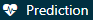{width="0.9689140419947506in"
height="0.20836832895888013in"}{width="0.18747594050743657in"
height="0.18747594050743657in"}

Trong chức năng thiết kế Dự đoán, có bốn phần: Thiết lập vấn đề dự
đoán, Thiết lập phân tích, Thiết lập thực thi và Thiết lập huấn luyện.
Ở đây chúng tôi thảo luận về từng phần:

### Thiết lập vấn đề dự đoán

Tại đây, chúng tôi chọn các nhóm thuần tập quần thể mục tiêu và các
nhóm thuần tập kết quả cho phân tích. Một mô hình dự đoán sẽ được phát
triển cho tất cả các kết hợp của các nhóm thuần tập quần thể mục tiêu
và các nhóm thuần tập kết quả. Ví dụ, nếu chúng tôi chỉ định hai quần
thể mục tiêu và hai kết quả, chúng tôi đã xác định bốn vấn đề dự đoán.

Để chọn một nhóm thuần tập quần thể mục tiêu, chúng ta cần phải xác
định nó trước đó trong ATLAS. Việc khởi tạo nhóm thuần tập được mô tả
trong Chương 10. Phụ lục cung cấp định nghĩa đầy đủ về các nhóm thuần
tập mục tiêu (Phụ lục B.1) và kết quả (Phụ lục B.4) được sử dụng trong
ví dụ này. Để thêm một quần thể mục tiêu vào nhóm thuần tập, hãy nhấp
vào nút "Add Target Cohort". Việc thêm các nhóm thuần tập kết quả cũng
hoạt động tương tự bằng cách nhấp vào nút "Add Outcome Cohort". Khi
hoàn tất, hộp thoại sẽ trông giống như Hình 13.4.

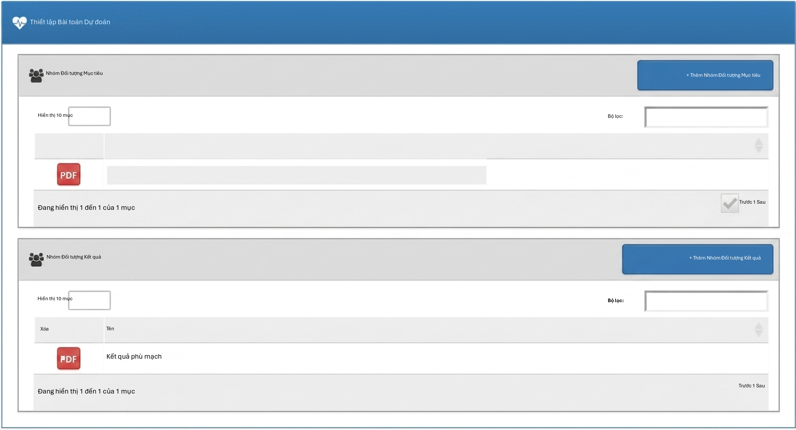{width="5.28989501312336in"
height="2.8621872265966752in"}

Hình 13.4: Thiết lập vấn đề dự đoán.

### Thiết lập phân tích

Các thiết lập phân tích cho phép lựa chọn thuật toán học có giám sát,
các biến đồng biến và các thiết lập quần thể.

#### Thiết lập mô hình

Chúng ta có thể chọn một hoặc nhiều thuật toán học có giám sát để phát
triển mô hình. Để thêm một thuật toán học có giám sát, hãy nhấp vào
nút "Add Model Settings". Một menu thả xuống chứa tất cả các mô hình
hiện được hỗ trợ trong giao diện ATLAS sẽ xuất hiện. Chúng ta có thể
chọn mô hình học có giám sát mà chúng ta muốn đưa vào nghiên cứu bằng
cách nhấp vào tên trong menu thả xuống. Điều này sau đó sẽ hiển thị
một chế độ xem cho mô hình cụ thể đó, cho phép lựa chọn các giá trị
siêu tham số. Nếu nhiều giá trị được cung cấp, một lưới tìm kiếm (grid
search) sẽ được thực hiện trên tất cả các kết hợp giá trị có thể để
chọn kết hợp tối ưu bằng cách sử dụng đánh giá chéo.

Đối với ví dụ của chúng tôi, chúng tôi chọn máy tăng cường độ dốc và
đặt các siêu tham số như được chỉ định trong Hình 13.5.

#### Thiết lập biến đồng biến

Chúng tôi đã xác định một tập hợp các biến đồng biến chuẩn có thể được
trích xuất từ dữ liệu quan sát ở định dạng CDM. Trong chế độ xem thiết
lập biến đồng biến, có thể chọn biến đồng biến chuẩn nào để bao gồm.
Chúng ta có thể xác định các loại thiết lập biến đồng biến khác nhau
và mỗi mô hình sẽ được tạo riêng biệt với từng thiết lập biến đồng
biến được chỉ định.

Để thêm một thiết lập biến đồng biến vào nghiên cứu, hãy nhấp vào "Add
Covariate Settings". Điều này sẽ mở chế độ xem thiết lập biến đồng
biến.

Phần đầu tiên của chế độ xem thiết lập biến đồng biến là tùy chọn loại
trừ/bao gồm. Các biến đồng biến thường được xây dựng cho bất kỳ khái
niệm nào. Tuy nhiên, chúng ta có thể muốn bao gồm hoặc loại trừ các
khái niệm cụ thể, ví dụ nếu một khái niệm được liên kết với định nghĩa
nhóm thuần tập mục tiêu. Để chỉ bao gồm các khái niệm nhất định, hãy
tạo một tập hợp khái niệm trong ATLAS và sau đó trong phần "Những khái
niệm nào bạn muốn bao gồm trong các biến đồng biến cơ bản trong mô
hình dự đoán cấp độ bệnh nhân? (Để trống nếu bạn muốn bao gồm tất cả)"
chọn tập hợp khái niệm bằng cách nhấp vào . Chúng ta có thể tự động
thêm tất cả các khái niệm con vào các khái niệm trong tập hợp khái
niệm bằng cách trả lời "có" cho câu hỏi "Các khái niệm con có nên được
thêm vào danh sách các khái niệm được bao gồm không?". Quy trình tương
tự có thể được lặp lại cho câu hỏi "Những khái niệm nào bạn muốn loại
trừ trong các biến đồng biến cơ bản trong mô hình dự đoán cấp độ bệnh
nhân? (Để trống nếu bạn muốn bao gồm tất cả)", cho phép loại bỏ các
biến đồng biến tương ứng với các khái niệm đã chọn. Tùy chọn cuối cùng
"Một danh sách các ID biến đồng biến được phân tách bằng dấu phẩy mà
cần bị giới hạn" cho phép chúng ta thêm một tập hợp các ID biến đồng
biến (thay vì ID khái niệm) được phân tách bằng dấu phẩy mà chỉ những
ID này mới được đưa vào mô hình. Tùy chọn này chỉ dành cho người dùng
nâng cao. Khi hoàn tất, các thiết lập bao gồm và loại trừ sẽ trông
giống như Hình
13.6.{width="0.20830599300087488in"
height="0.18747594050743657in"}

Phần tiếp theo cho phép lựa chọn các biến không bị ràng buộc theo thời
gian.

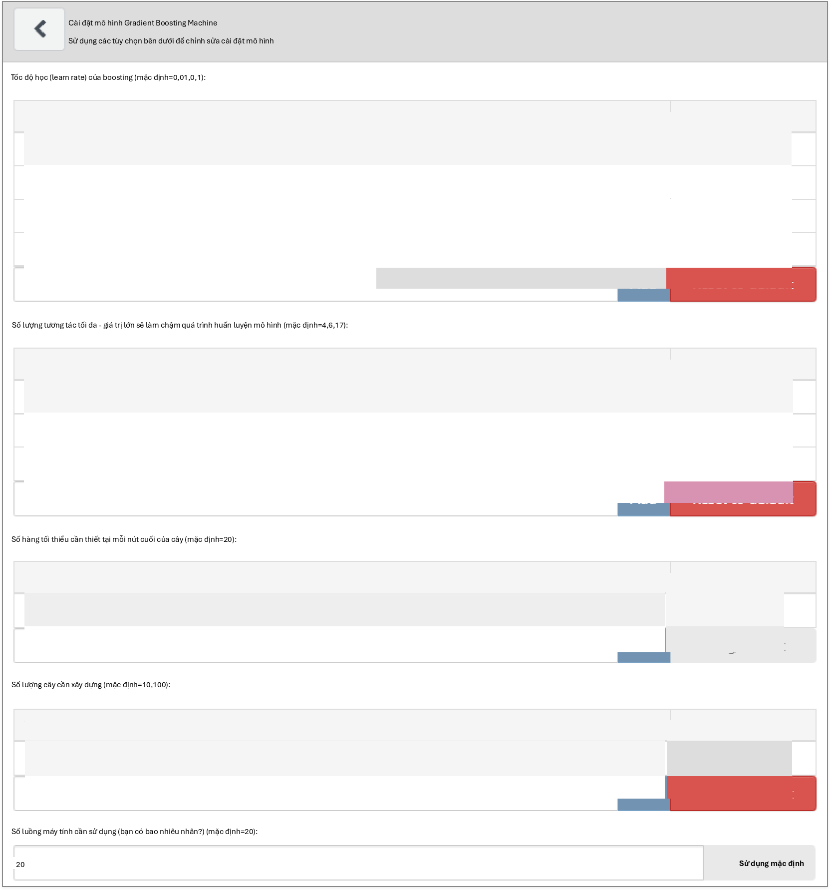{width="5.32in"
height="5.7in"}

Hình 13.5: Thiết lập máy tăng cường độ dốc

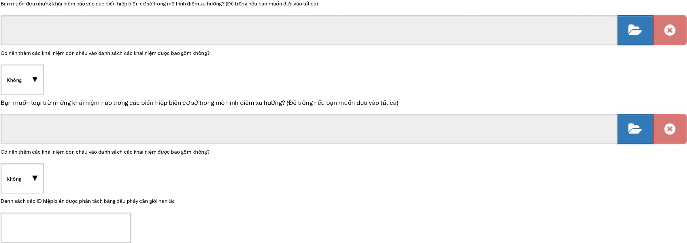{width="5.243333333333333in"
height="1.8608333333333333in"}

Hình 13.6: Thiết lập bao gồm và loại trừ biến đồng biến.

- Giới tính&#58; một biến nhị phân cho biết giới tính nam hoặc nữ

- Tuổi&#58; một biến liên tục tương ứng với tuổi tính theo năm

- Nhóm tuổi&#58; các biến nhị phân cho mỗi 5 năm tuổi (0-4, 5-9, 10-14, ...,
95+)

- Chủng tộc&#58; một biến nhị phân cho mỗi chủng tộc, 1 nghĩa là bệnh nhân
có chủng tộc đó được ghi lại, 0 nếu không

- Sắc tộc&#58; một biến nhị phân cho mỗi sắc tộc, 1 nghĩa là bệnh nhân có
sắc tộc đó được ghi lại, 0 nếu không

- Năm chỉ số: một biến nhị phân cho mỗi năm ngày bắt đầu nhóm thuần tập,
1 nghĩa là đó là năm ngày bắt đầu nhóm thuần tập của bệnh nhân, 0 nếu
không. Thường không có ý nghĩa khi bao gồm năm chỉ số, vì chúng ta
muốn áp dụng mô hình của mình cho tương lai.

- Tháng chỉ số - một biến nhị phân cho mỗi tháng ngày bắt đầu nhóm thuần
tập, 1 nghĩa là đó là tháng ngày bắt đầu nhóm thuần tập của bệnh nhân,
0 nếu không

- Thời gian quan sát trước đó: \[Không khuyến nghị cho dự đoán\] một
biến liên tục tương ứng với thời gian tính bằng ngày bệnh nhân đã ở
trong cơ sở dữ liệu trước ngày bắt đầu nhóm thuần tập

- Thời gian quan sát sau đó: \[Không khuyến nghị cho dự đoán\] một biến
liên tục tương ứng với thời gian tính bằng ngày bệnh nhân đã ở trong
cơ sở dữ liệu sau ngày bắt đầu nhóm thuần tập

- Thời gian trong nhóm thuần tập&#58; một biến liên tục tương ứng với thời
gian tính bằng ngày bệnh nhân đã ở trong nhóm thuần tập (ngày kết thúc
nhóm thuần tập trừ ngày bắt đầu nhóm thuần tập)

- Năm và tháng chỉ số: \[Không khuyến nghị cho dự đoán\] một biến nhị
phân cho mỗi kết hợp năm và tháng ngày bắt đầu nhóm thuần tập, 1 nghĩa
là đó là năm và tháng ngày bắt đầu nhóm thuần tập của bệnh nhân, 0 nếu
không

Khi hoàn tất, phần này sẽ trông giống như Hình 13.7.

Các biến đồng biến chuẩn cho phép ba khoảng thời gian linh hoạt cho
các biến đồng biến:

- ngày kết thúc&#58; khi nào kết thúc các khoảng thời gian so với ngày bắt
đầu nhóm thuần tập \[mặc định là 0\]

- dài hạn \[mặc định -365 ngày đến ngày kết thúc trước ngày bắt đầu nhóm
thuần tập\]

- trung hạn \[mặc định -180 ngày đến ngày kết thúc trước ngày bắt đầu
nhóm thuần tập\]

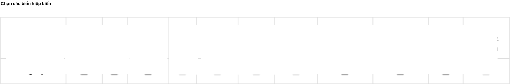{width="5.312082239720035in"
height="0.88in"}

Hình 13.7: Chọn biến đồng biến.

- ngắn hạn \[mặc định -30 ngày đến ngày kết thúc trước ngày bắt đầu nhóm
thuần tập\] Khi hoàn tất, phần này sẽ trông giống như Hình 13.8.

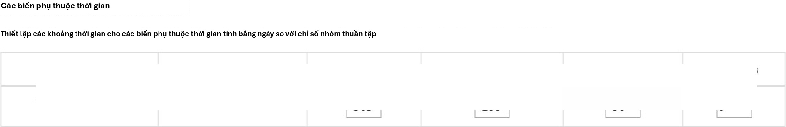{width="5.312083333333334in"
height="0.8616666666666667in"}

Hình 13.8: Các biến đồng biến bị ràng buộc theo thời gian. Tùy chọn
tiếp theo là các biến đồng biến được trích xuất từ các bảng kỷ nguyên
(era tables):

- Tình trạng&#58; Xây dựng các biến đồng biến cho mỗi ID khái niệm tình
trạng và khoảng thời gian được chọn và nếu một bệnh nhân có ID khái
niệm với một kỷ nguyên (tức là, tình trạng bắt đầu hoặc kết thúc trong
khoảng thời gian hoặc bắt đầu trước và kết thúc sau khoảng thời gian)
trong khoảng thời gian được chỉ định trước ngày bắt đầu nhóm thuần tập
trong bảng kỷ nguyên tình trạng, giá trị biến đồng biến là 1, nếu
không thì là 0.

- Nhóm tình trạng&#58; Xây dựng các biến đồng biến cho mỗi ID khái niệm tình
trạng và khoảng thời gian được chọn và nếu một bệnh nhân có ID khái
niệm hoặc bất kỳ ID khái niệm con nào với một kỷ nguyên trong khoảng
thời gian được chỉ định trước ngày bắt đầu nhóm thuần tập trong bảng
kỷ nguyên tình trạng, giá trị biến đồng biến là 1, nếu không thì là 0.

- Thuốc&#58; Xây dựng các biến đồng biến cho mỗi ID khái niệm thuốc và
khoảng thời gian được chọn và nếu một bệnh nhân có ID khái niệm với
một kỷ nguyên trong khoảng thời gian được chỉ định trước ngày bắt đầu
nhóm thuần tập trong bảng kỷ nguyên thuốc, giá trị biến đồng biến là
1, nếu không thì là 0.

- Nhóm thuốc&#58; Xây dựng các biến đồng biến cho mỗi ID khái niệm thuốc và
khoảng thời gian được chọn và nếu một bệnh nhân có ID khái niệm hoặc
bất kỳ ID khái niệm con nào với một kỷ nguyên trong khoảng thời gian
được chỉ định trước ngày bắt đầu nhóm thuần tập trong bảng kỷ nguyên
thuốc, giá trị biến đồng biến là 1, nếu không thì là 0.

Thiết lập khoảng thời gian chồng chéo nghĩa là kỷ nguyên thuốc hoặc
tình trạng nên bắt đầu trước ngày bắt đầu nhóm thuần tập và kết thúc
sau ngày bắt đầu nhóm thuần tập, vì vậy nó chồng chéo với ngày bắt đầu
nhóm thuần tập. Tùy chọn bắt đầu kỷ nguyên giới hạn việc tìm kiếm các
kỷ nguyên tình trạng hoặc thuốc bắt đầu trong khoảng thời gian được
chọn.

Khi hoàn tất, phần này sẽ trông giống như Hình 13.9.

Tùy chọn tiếp theo chọn các biến đồng biến tương ứng với các ID khái
niệm trong mỗi miền cho

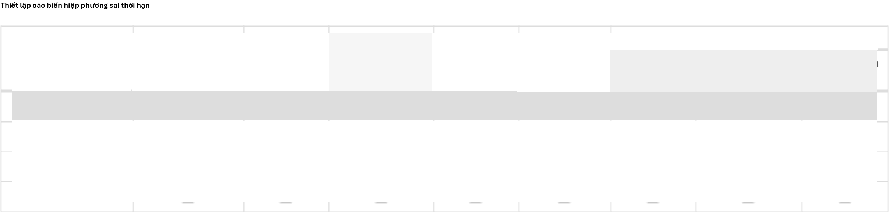{width="5.312083333333334in"
height="1.269582239720035in"}

Hình 13.9: Các biến đồng biến kỷ nguyên bị ràng buộc theo thời gian.

các khoảng thời gian khác nhau:

- Tình trạng&#58; Xây dựng các biến đồng biến cho mỗi ID khái niệm tình
trạng và khoảng thời gian được chọn và nếu một bệnh nhân có ID khái
niệm được ghi lại trong khoảng thời gian được chỉ định trước ngày bắt
đầu nhóm thuần tập trong bảng sự kiện tình trạng, giá trị biến đồng
biến là 1, nếu không thì là 0.

- Tình trạng nội trú chính&#58; Một biến đồng biến nhị phân cho mỗi tình
trạng được quan sát là chẩn đoán chính trong môi trường nội trú trong
bảng condition_occurrence.

- Thuốc&#58; Xây dựng các biến đồng biến cho mỗi ID khái niệm thuốc và
khoảng thời gian được chọn và nếu một bệnh nhân có ID khái niệm được
ghi lại trong khoảng thời gian được chỉ định trước ngày bắt đầu nhóm
thuần tập trong bảng tiếp xúc thuốc, giá trị biến đồng biến là 1, nếu
không thì là 0.

- Thủ thuật&#58; Xây dựng các biến đồng biến cho mỗi ID khái niệm thủ thuật
và khoảng thời gian được chọn và nếu một bệnh nhân có ID khái niệm
được ghi lại trong khoảng thời gian được chỉ định trước ngày bắt đầu
nhóm thuần tập trong bảng sự kiện thủ thuật, giá trị biến đồng biến là
1, nếu không thì là 0.

- Đo lường&#58; Xây dựng các biến đồng biến cho mỗi ID khái niệm đo lường và
khoảng thời gian được chọn và nếu một bệnh nhân có ID khái niệm được
ghi lại trong khoảng thời gian được chỉ định trước ngày bắt đầu nhóm
thuần tập trong bảng đo lường, giá trị biến đồng biến là 1, nếu không
thì là 0.

- Giá trị đo lường&#58; Xây dựng các biến đồng biến cho mỗi ID khái niệm đo
lường với một giá trị và khoảng thời gian được chọn và nếu một bệnh
nhân có ID khái niệm được ghi lại trong khoảng thời gian được chỉ định
trước ngày bắt đầu nhóm thuần tập trong bảng đo lường, giá trị biến
đồng biến là giá trị đo lường, nếu không thì là 0.

- Nhóm phạm vi đo lường&#58; Các biến đồng biến nhị phân cho biết liệu các
phép đo có nằm dưới, trong hoặc trên phạm vi bình thường hay không.

- Quan sát&#58; Xây dựng các biến đồng biến cho mỗi ID khái niệm quan sát và
khoảng thời gian được chọn và nếu một bệnh nhân có ID khái niệm được
ghi lại trong khoảng thời gian được chỉ định trước ngày bắt đầu nhóm
thuần tập trong bảng quan sát, giá trị biến đồng biến là 1, nếu không
thì là 0.

- Thiết bị: Xây dựng các biến đồng biến cho mỗi ID khái niệm thiết bị và
khoảng thời gian được chọn và nếu một bệnh nhân có ID khái niệm được
ghi lại trong khoảng thời gian được chỉ định trước ngày bắt đầu nhóm
thuần tập trong bảng thiết bị, giá trị biến đồng biến là 1, nếu không
thì là 0.

- Số lần khám&#58; Xây dựng các biến đồng biến cho mỗi lần khám và khoảng
thời gian được chọn và đếm

số lần khám được ghi lại trong khoảng thời gian làm giá trị biến đồng
biến.

- Số lần khám theo khái niệm&#58; Xây dựng các biến đồng biến cho mỗi lần
khám, miền và khoảng thời gian được chọn và đếm số lượng hồ sơ trên
mỗi miền được ghi lại trong loại lần khám và khoảng thời gian làm giá
trị biến đồng biến.

Tùy chọn đếm riêng biệt đếm số lượng các ID khái niệm riêng biệt trên
mỗi miền và khoảng thời gian.

Khi hoàn tất, phần này sẽ trông giống như Hình 13.10.

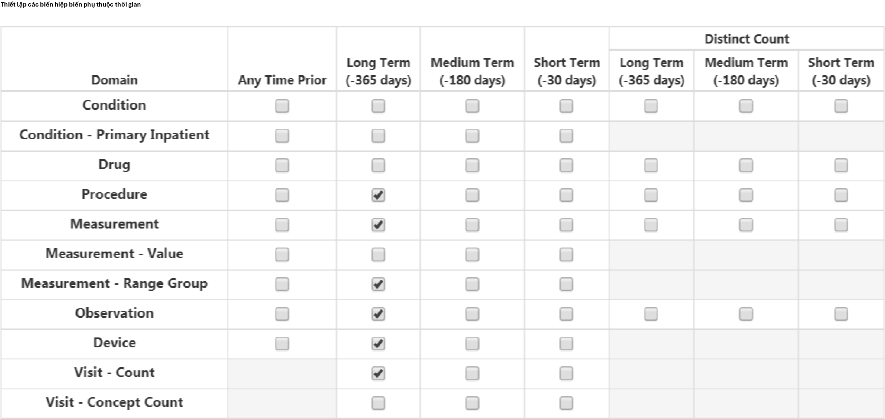{width="5.312082239720035in"
height="2.5208333333333335in"}

Hình 13.10: Các biến đồng biến bị ràng buộc theo thời gian.

Tùy chọn cuối cùng là liệu có bao gồm các điểm số nguy cơ thường được
sử dụng làm biến đồng biến hay không. Khi hoàn tất, các thiết lập điểm
số nguy cơ sẽ trông giống như Hình 13.11.

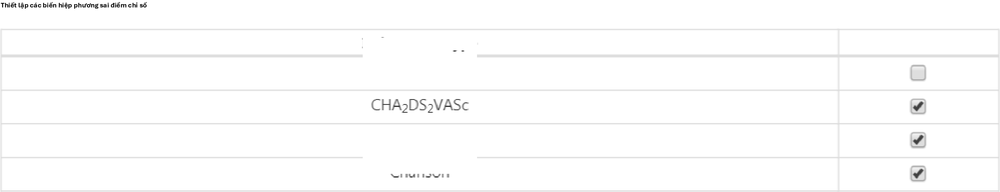{width="5.312083333333334in"
height="1.0220833333333332in"}

Hình 13.11: Thiết lập biến đồng biến điểm số nguy cơ.

#### Thiết lập quần thể

Thiết lập quần thể là nơi các tiêu chí bao gồm bổ sung có thể được áp
dụng cho quần thể mục tiêu và cũng là nơi thời gian có nguy cơ được
xác định. Để thêm một thiết lập quần thể vào nghiên cứu, hãy nhấp vào
nút "Add Population Settings". Điều này sẽ mở ra chế độ xem thiết lập
quần thể.

Tập hợp tùy chọn đầu tiên cho phép người dùng chỉ định khoảng thời
gian có nguy cơ. Đây là thời gian

khoảng thời gian mà chúng ta xem xét để biết liệu kết quả quan tâm có
xảy ra hay không. Nếu một bệnh nhân gặp kết quả trong khoảng thời gian
có nguy cơ thì chúng ta sẽ phân loại họ là "Có kết quả", nếu không thì
họ được phân loại là "Không có kết quả". "Xác định thời điểm bắt đầu
cửa sổ thời gian có nguy cơ, so với thời điểm nhập nhóm thuần tập mục
tiêu:" xác định thời điểm bắt đầu của thời gian có nguy cơ, so với
ngày bắt đầu hoặc ngày kết thúc của nhóm thuần tập mục tiêu. Tương tự,
"Xác định thời điểm kết thúc cửa sổ thời gian có nguy cơ:" xác định
thời điểm kết thúc của thời gian có nguy cơ.

"Thời gian xem xét lại tối thiểu áp dụng cho nhóm thuần tập mục tiêu"
chỉ định khoảng thời gian cơ sở tối thiểu, số ngày tối thiểu trước
ngày bắt đầu nhóm thuần tập mà một bệnh nhân được quan sát liên tục.
Mặc định là 365 ngày. Mở rộng thời gian xem xét lại tối thiểu sẽ mang
lại bức tranh đầy đủ hơn về một bệnh nhân (vì họ phải được quan sát
lâu hơn) nhưng sẽ lọc những bệnh nhân không có số ngày quan sát trước
đó tối thiểu.

Nếu "Có nên loại bỏ các đối tượng không có thời gian có nguy cơ
không?" được đặt thành có, thì giá trị cho "Thời gian có nguy cơ tối
thiểu:" cũng được yêu cầu. Điều này cho phép loại bỏ những người bị
mất dấu (tức là đã rời khỏi cơ sở dữ liệu trong khoảng thời gian có
nguy cơ). Ví dụ, nếu khoảng thời gian có nguy cơ là 1 ngày kể từ khi
bắt đầu nhóm thuần tập cho đến 365 ngày kể từ khi bắt đầu nhóm thuần
tập, thì toàn bộ khoảng thời gian có nguy cơ là 364 ngày (365-1). Nếu
chúng ta chỉ muốn bao gồm những bệnh nhân được quan sát trong toàn bộ
khoảng thời gian, thì chúng ta đặt thời gian có nguy cơ tối thiểu là
364. Nếu chúng ta hài lòng miễn là mọi người ở trong thời gian có nguy
cơ trong 100 ngày đầu tiên, thì chúng ta chọn thời gian có nguy cơ tối
thiểu là 100. Trong trường hợp này, vì thời điểm bắt đầu thời gian có
nguy cơ là 1 ngày kể từ khi bắt đầu nhóm thuần tập, một bệnh nhân sẽ
được bao gồm nếu họ vẫn ở trong cơ sở dữ liệu ít nhất 101 ngày kể từ
ngày bắt đầu nhóm thuần tập. Nếu chúng ta đặt "Có nên loại bỏ các đối
tượng không có thời gian có nguy cơ không?" thành 'Không', thì điều
này sẽ giữ lại tất cả bệnh nhân, ngay cả những người bỏ cuộc khỏi cơ
sở dữ liệu trong thời gian có nguy cơ.

Tùy chọn "Có bao gồm những người có kết quả không được quan sát trong
toàn bộ khoảng thời gian có nguy cơ không?" liên quan đến tùy chọn
trước đó. Nếu được đặt thành "có", thì những người gặp kết quả trong
thời gian có nguy cơ luôn được giữ lại, ngay cả khi họ không được quan
sát trong khoảng thời gian tối thiểu được chỉ định.

Tùy chọn "Có nên chỉ bao gồm lần tiếp xúc đầu tiên cho mỗi đối tượng
không?" chỉ hữu ích nếu nhóm thuần tập mục tiêu của chúng ta chứa bệnh
nhân nhiều lần với các ngày bắt đầu nhóm thuần tập khác nhau. Trong
tình huống này, chọn "có" sẽ dẫn đến việc chỉ giữ lại ngày nhóm thuần
tập mục tiêu sớm nhất cho mỗi bệnh nhân trong phân tích. Nếu không,
một bệnh nhân có thể có trong tập dữ liệu nhiều lần.

Việc đặt "Loại bỏ những bệnh nhân đã quan sát kết quả trước khi nhập
nhóm thuần tập?" thành "có" sẽ loại bỏ những bệnh nhân đã gặp kết quả
trước ngày bắt đầu thời gian có nguy cơ, vì vậy mô hình dành cho những
bệnh nhân chưa từng gặp kết quả trước đó. Nếu "không" được chọn, thì
bệnh nhân có thể đã gặp kết quả trước đó. Thông thường, việc đã gặp
kết quả trước đó là yếu tố dự đoán rất tốt cho việc gặp kết quả trong
thời gian có nguy cơ.

Khi hoàn tất, hộp thoại thiết lập quần thể sẽ trông giống như Hình
13.12.

Bây giờ chúng ta đã hoàn thành các Thiết lập phân tích, toàn bộ hộp
thoại sẽ trông giống như Hình 13.13.

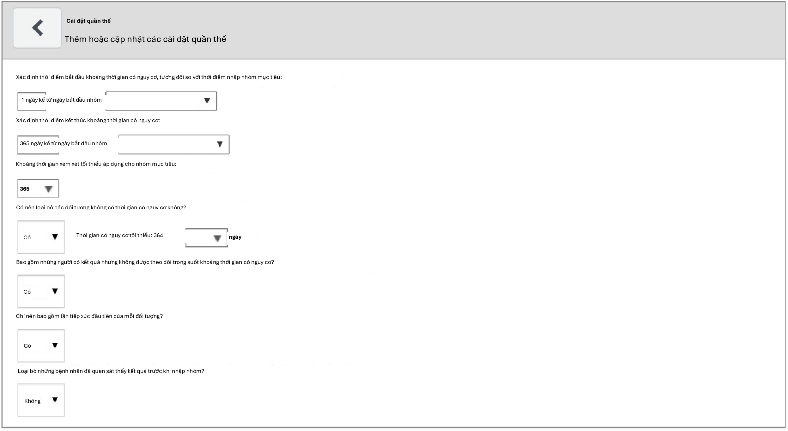{width="5.361561679790026in"
height="2.933853893263342in"}

Hình 13.12: Thiết lập quần thể.

### Thiết lập thực thi

Có ba tùy chọn:

- "Thực hiện lấy mẫu": tại đây chúng ta chọn liệu có thực hiện lấy mẫu
hay không (mặc định = "không"). Nếu đặt thành "có", một tùy chọn khác
sẽ xuất hiện&#58; "Có bao nhiêu bệnh nhân để sử dụng cho một tập con?",
nơi kích thước mẫu có thể được chỉ định. Lấy mẫu có thể là một phương
tiện hiệu quả để xác định liệu một mô hình cho một quần thể lớn (ví
dụ: 10 triệu bệnh nhân) có khả năng dự đoán hay không bằng cách tạo và
kiểm tra mô hình với một mẫu bệnh nhân. Ví dụ, nếu AUC gần bằng 0,5
trong mẫu, chúng ta có thể từ bỏ mô hình.

- "Số lần xuất hiện biến đồng biến tối thiểu&#58; Nếu một biến đồng biến
xuất hiện trong một phần của quần thể mục tiêu nhỏ hơn giá trị này, nó
sẽ bị loại bỏ:": tại đây chúng ta chọn số lần xuất hiện biến đồng biến
tối thiểu (mặc định = 0,001). Một giá trị ngưỡng tối thiểu cho sự xuất
hiện biến đồng biến là cần thiết để loại bỏ các sự kiện hiếm gặp không
đại diện cho toàn bộ quần thể.

- "Chuẩn hóa biến đồng biến": tại đây chúng ta chọn liệu có chuẩn hóa
các biến đồng biến hay không (mặc định

= "có"). Việc chuẩn hóa các biến đồng biến thường là cần thiết để
triển khai thành công mô hình LASSO.

Đối với ví dụ của chúng tôi, chúng tôi thực hiện các lựa chọn được
hiển thị trong Hình 13.14.

### Thiết lập huấn luyện

Có bốn tùy chọn:

- "Chỉ định cách chia tập kiểm tra/huấn luyện:" Chọn liệu có phân biệt
dữ liệu huấn luyện/kiểm tra theo người (phân tầng theo kết quả) hay
theo thời gian (dữ liệu cũ hơn để huấn luyện mô hình, dữ liệu sau này
để đánh giá mô hình).

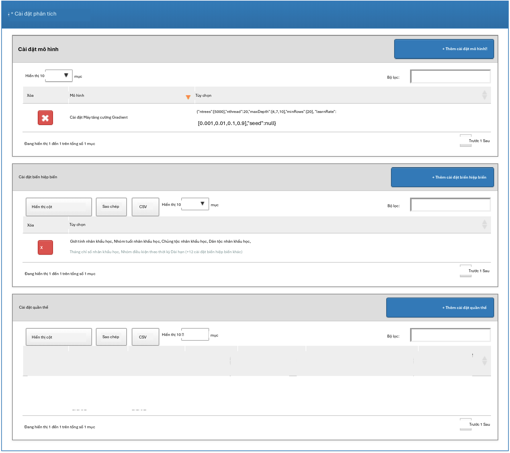{width="5.30062445319335in"
height="4.709374453193351in"}

Hình 13.13: Thiết lập phân tích.

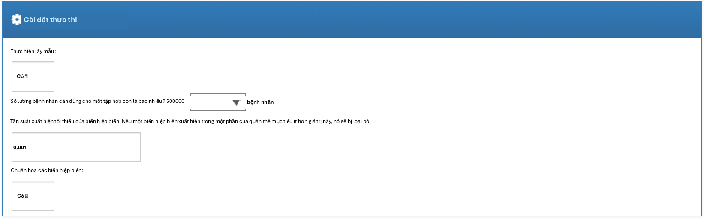{width="5.335416666666666in"
height="1.6656244531933508in"}

Hình 13.14: Thiết lập thực thi.

- "Tỷ lệ phần trăm dữ liệu được sử dụng làm tập kiểm tra (0-100%)": Chọn
tỷ lệ phần trăm dữ liệu được sử dụng làm dữ liệu kiểm tra (mặc định =
25%).

- "Số lượng nếp (folds) được sử dụng trong đánh giá chéo": Chọn số lượng
nếp cho đánh giá chéo được sử dụng để chọn siêu tham số tối ưu (mặc
định = 3).

- "Hạt giống (seed) được sử dụng để chia tập kiểm tra/huấn luyện khi sử
dụng testSplit loại người (tùy chọn):": Chọn hạt giống ngẫu nhiên được
sử dụng để chia tập huấn luyện/kiểm tra khi sử dụng phân chia kiểm tra
loại người.

Đối với ví dụ của chúng tôi, chúng tôi thực hiện các lựa chọn được
hiển thị trong Hình 13.15.

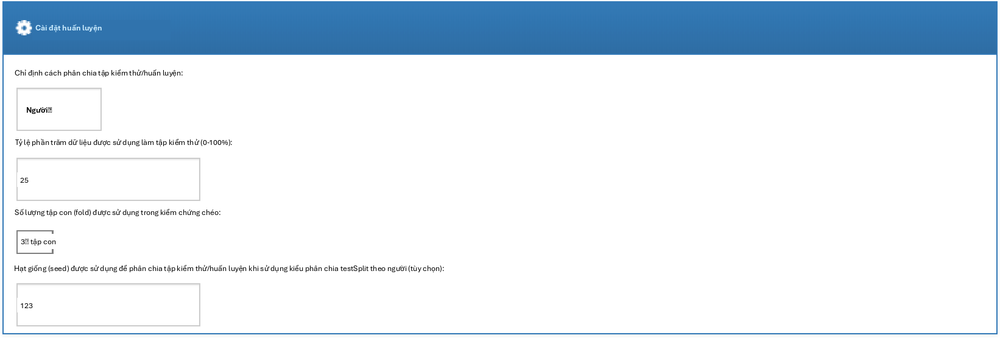{width="5.335416666666666in"
height="1.8010411198600176in"}

Hình 13.15: Thiết lập huấn luyện.

### Nhập và xuất nghiên cứu

Để xuất một nghiên cứu, hãy nhấp vào tab "Export" trong "Utilities".
ATLAS sẽ tạo ra JSON có thể được sao chép và dán trực tiếp vào một tệp
chứa tất cả dữ liệu, chẳng hạn như tên nghiên cứu, định nghĩa nhóm
thuần tập, các mô hình đã chọn, biến đồng biến, các thiết lập, cần
thiết để chạy nghiên cứu.

Để nhập một nghiên cứu, hãy nhấp vào tab "Import" trong "Utilities".
Dán nội dung của JSON nghiên cứu dự đoán cấp độ bệnh nhân vào cửa sổ
này, sau đó nhấp vào nút Import bên dưới các nút tab khác. Lưu ý rằng
điều này sẽ ghi đè lên tất cả các thiết lập trước đó cho nghiên cứu
đó, vì vậy việc này thường được thực hiện bằng cách sử dụng một thiết
kế nghiên cứu mới, trống.

### Tải xuống gói nghiên cứu

Nhấp vào tab "Review & Download" trong "Utilities". Trong phần
"Download Study Package", hãy nhập một tên mô tả cho gói R, lưu ý rằng
bất kỳ ký tự bất hợp pháp nào trong R sẽ tự động bị ATLAS xóa khỏi tên
tệp. Nhấp vào để tải xuống gói R vào một thư mục cục
bộ.{width="0.9064031058617673in"
height="0.21878608923884516in"}

### Chạy nghiên cứu

Để chạy gói R yêu cầu phải cài đặt R, RStudio và Java như được mô tả
trong Phần 8.4.5. Cũng cần có gói PatientLevelPrediction, gói này có
thể được cài đặt trong

R bằng cách sử dụng:

**install.packages**(\"drat\") drat**::addRepo**(\"OHDSI\")
**install.packages**(\"PatientLevelPrediction\")

Một số thuật toán học máy yêu cầu cài đặt phần mềm bổ sung. Để biết mô
tả đầy đủ về cách cài đặt gói PatientLevelPrediction, hãy xem tài liệu
phụ trợ "Hướng dẫn cài đặt dự đoán cấp độ bệnh nhân".

Để sử dụng gói R nghiên cứu, chúng tôi khuyên bạn nên sử dụng R
Studio. Nếu bạn đang chạy R Studio cục bộ, hãy giải nén tệp do ATLAS
tạo ra và nhấp đúp vào tệp .Rproj để mở nó trong R Studio. Nếu bạn
đang chạy R Studio trên máy chủ R studio, hãy nhấp để tải lên và giải
nén tệp, sau đó nhấp vào tệp .Rproj để mở dự
án.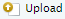{width="0.6771981627296588in"
height="0.1979494750656168in"}

Sau khi bạn đã mở dự án trong R Studio, bạn có thể mở tệp README và
làm theo các hướng dẫn. Đảm bảo thay đổi tất cả các đường dẫn tệp
thành các đường dẫn hiện có trên hệ thống của bạn.[]{#_bookmark418
.anchor}

## Triển khai nghiên cứu trong R

Một giải pháp thay thế cho việc triển khai thiết kế nghiên cứu của
chúng tôi bằng ATLAS là tự viết mã nghiên cứu bằng R. Chúng ta có thể
tận dụng các chức năng được cung cấp trong gói PatientLevelPrediction.
Gói này cho phép trích xuất dữ liệu, xây dựng mô hình và đánh giá mô
hình bằng cách sử dụng dữ liệu từ các cơ sở dữ liệu được dịch sang
OMOP CDM.

### Khởi tạo nhóm thuần tập

Trước tiên, chúng ta cần khởi tạo các nhóm thuần tập mục tiêu và kết
quả. Việc khởi tạo các nhóm thuần tập được mô tả trong Chương 10. Phụ
lục cung cấp các định nghĩa đầy đủ về các nhóm thuần tập mục tiêu (Phụ
lục B.1) và kết quả (Phụ lục B.4). Trong ví dụ này, chúng tôi sẽ giả
định nhóm thuần tập thuốc ức chế ACE có ID 1 và nhóm thuần tập phù
mạch có ID 2.

### Trích xuất dữ liệu

Trước tiên, chúng ta cần cho R biết cách kết nối với máy chủ.
PatientLevelPrediction sử dụng gói DatabaseConnector, gói này cung cấp
một hàm gọi là createConnectionDetails. Nhập ?createConnectionDetails
để biết các thiết lập cụ thể cần thiết cho các hệ quản trị cơ sở dữ
liệu (DBMS) khác nhau. Ví dụ, người ta có thể kết nối với cơ sở dữ
liệu PostgreSQL bằng mã này:

**library**(PatientLevelPrediction)

connDetails \<- **createConnectionDetails**(dbms = \"postgresql\",

server = \"localhost/ohdsi\", user = \"joe\",

password = \"supersecret\")

cdmDbSchema \<- \"my_cdm_data\" cohortsDbSchema \<- \"scratch\"
cohortsDbTable \<- \"my_cohorts\" cdmVersion \<- \"5\"

Bốn dòng cuối cùng xác định các biến cdmDbSchema, cohortsDbSchema và
cohortsDbTable, cũng như phiên bản CDM. Chúng tôi sẽ sử dụng những
biến này sau để cho R biết dữ liệu ở định dạng CDM nằm ở đâu, các nhóm
thuần tập quan tâm đã được tạo ở đâu và phiên bản CDM nào được sử
dụng. Lưu ý rằng đối với Microsoft SQL Server, các lược đồ cơ sở dữ
liệu cần chỉ định cả cơ sở dữ liệu và lược đồ, vì vậy ví dụ
cdmDbSchema \<- \"my_cdm_data.dbo\".

Trước tiên, việc xác minh rằng việc tạo nhóm thuần tập đã thành công
bằng cách đếm số lượng mục nhập nhóm thuần tập là hợp lý:

sql \<- **paste**(\"SELECT cohort_definition_id, COUNT(\*) AS count\",
\"FROM \@cohortsDbSchema.cohortsDbTable\",

\"GROUP BY cohort_definition_id\") conn \<- **connect**(connDetails)

**renderTranslateQuerySql**(connection = conn,

sql = sql,

cohortsDbSchema = cohortsDbSchema, cohortsDbTable = cohortsDbTable)

\## ID định nghĩa đoàn hệ số lượng \## 1 1.527.616

\## 2 2 3201

Bây giờ chúng ta có thể yêu cầu PatientLevelPrediction trích xuất tất
cả dữ liệu cần thiết cho phân tích của mình. Các biến đồng biến được
trích xuất bằng cách sử dụng gói FeatureExtraction. Để biết thêm thông
tin chi tiết về gói FeatureExtraction, hãy xem các tài liệu phụ trợ
của nó. Đối với nghiên cứu ví dụ của chúng tôi, chúng tôi quyết định
sử dụng các thiết lập này:

covariateSettings \<- **createCovariateSettings**(
useDemographicsGender = TRUE,

useDemographicsAge = TRUE, useConditionGroupEraLongTerm = TRUE,
useConditionGroupEraAnyTimePrior = TRUE, useDrugGroupEraLongTerm =
TRUE, useDrugGroupEraAnyTimePrior = TRUE, useVisitConceptCountLongTerm
= TRUE, longTermStartDays = -365,

endDays = -1)

Bước cuối cùng để trích xuất dữ liệu là chạy hàm getPlpData và nhập
các chi tiết kết nối, lược đồ cơ sở dữ liệu nơi các nhóm thuần tập
được lưu trữ, các ID định nghĩa nhóm thuần tập cho nhóm thuần tập và
kết quả, và thời gian rửa trôi (washout period) là số ngày tối thiểu

trước ngày chỉ số nhóm thuần tập mà người đó phải được quan sát để
được đưa vào dữ liệu, và cuối cùng nhập các thiết lập biến đồng biến
đã được xây dựng trước đó.

plpData \<- **getPlpData**(connectionDetails = connDetails,

cdmDatabaseSchema = cdmDbSchema, cohortDatabaseSchema =
cohortsDbSchema, cohortTable = cohortsDbSchema,

cohortId = 1,

covariateSettings = covariateSettings, outcomeDatabaseSchema =
cohortsDbSchema, outcomeTable = cohortsDbSchema, outcomeIds = 2,

sampleSize = 10000

)

Có nhiều tham số bổ sung cho hàm getPlpData, tất cả đều được ghi lại
trong hướng dẫn sử dụng PatientLevelPrediction. Đối tượng plpData kết
quả sử dụng gói ff để lưu trữ thông tin theo cách đảm bảo R không bị
hết bộ nhớ, ngay cả khi dữ liệu lớn.

Việc tạo đối tượng plpData có thể mất nhiều thời gian tính toán và có
lẽ là một ý tưởng hay khi lưu nó cho các phiên làm việc trong tương
lai. Vì plpData sử dụng ff, chúng ta không thể sử dụng hàm lưu thông
thường của R. Thay vào đó, chúng ta sẽ phải sử dụng hàm savePlpData:

**savePlpData**(plpData, \"angio_in_ace_data\")

Chúng ta có thể sử dụng hàm loadPlpData() để tải dữ liệu trong một
phiên làm việc trong tương lai.

### Các tiêu chí bao gồm bổ sung

Quần thể nghiên cứu cuối cùng thu được bằng cách áp dụng các ràng buộc
bổ sung trên hai nhóm thuần tập đã xác định trước đó, ví dụ: thời gian
có nguy cơ tối thiểu có thể được thực thi (requireTimeAtRisk,
minTimeAtRisk) và chúng ta có thể chỉ định nếu điều này cũng áp dụng
cho bệnh nhân có kết quả (includeAllOutcomes). Tại đây, chúng tôi cũng
chỉ định thời điểm bắt đầu và kết thúc của cửa sổ nguy cơ so với thời
điểm bắt đầu nhóm thuần tập mục tiêu. Ví dụ, nếu chúng ta muốn cửa sổ
nguy cơ bắt đầu 30 ngày sau khi bắt đầu nhóm thuần tập có nguy cơ và
kết thúc một năm sau đó, chúng ta có thể đặt riskWindowStart = 30 và
riskWindowEnd = 365. Trong một số trường hợp, cửa sổ nguy cơ cần bắt
đầu vào ngày kết thúc nhóm thuần tập. Điều này có thể đạt được bằng
cách đặt addExposureToStart = TRUE, việc này thêm thời gian nhóm thuần
tập (tiếp xúc) vào ngày bắt đầu.

Trong ví dụ dưới đây, tất cả các thiết lập chúng tôi đã xác định cho
nghiên cứu của mình được áp dụng:

population \<- **createStudyPopulation**(plpData = plpData,

outcomeId = 2,

washoutPeriod = 364, firstExposureOnly = FALSE,

removeSubjectsWithPriorOutcome = TRUE, priorOutcomeLookback = 9999,

riskWindowStart = 1,

riskWindowEnd = 365, addExposureDaysToStart = FALSE,
addExposureDaysToEnd = FALSE, minTimeAtRisk = 364, requireTimeAtRisk =
TRUE, includeAllOutcomes = TRUE, verbosity = \"DEBUG\"

)

### Phát triển mô hình

Trong hàm set của một thuật toán, người dùng có thể chỉ định một danh
sách các giá trị đủ điều kiện cho mỗi siêu tham số. Tất cả các kết hợp
có thể của các siêu tham số được đưa vào một cái gọi là lưới tìm kiếm
(grid search) sử dụng đánh giá chéo trên tập huấn luyện. Nếu người
dùng không chỉ định bất kỳ giá trị nào thì giá trị mặc định sẽ được sử
dụng thay thế.

Ví dụ, nếu chúng ta sử dụng các thiết lập sau cho máy tăng cường độ
dốc: ntrees

= c(100,200), maxDepth = 4 lưới tìm kiếm sẽ áp dụng thuật toán máy
tăng cường độ dốc với ntrees = 100 và maxDepth = 4 cộng với các thiết
lập mặc định cho các siêu tham số khác và ntrees = 200 và maxDepth = 4
cộng với các thiết lập mặc định cho các siêu tham số khác. Các siêu
tham số dẫn đến hiệu suất đánh giá chéo tốt nhất sau đó sẽ được chọn
cho mô hình cuối cùng. Đối với vấn đề của chúng tôi, chúng tôi chọn
xây dựng một máy tăng cường độ dốc với một số giá trị siêu tham số:

gbmModel \<- **setGradientBoostingMachine**(ntrees = 5000,

maxDepth = **c**(4,7,10),

learnRate = **c**(0.001,0.01,0.1,0.9))

Hàm runPlP sử dụng các thiết lập quần thể, plpData và mô hình để huấn
luyện và đánh giá mô hình. Chúng ta có thể sử dụng các tham số
testSplit (người/thời gian) và testFraction để chia dữ liệu thành tỷ
lệ 75%-25% và chạy quy trình dự đoán cấp độ bệnh nhân:

gbmResults \<- **runPlp**(population = population,

plpData = plpData, modelSettings = gbmModel, testSplit = \'person\',
testFraction = 0.25,

nfold = 2,

splitSeed = 1234)

Ẩn bên dưới, gói này bây giờ sẽ sử dụng gói R xgboost để khớp một mô
hình máy tăng cường độ dốc sử dụng 75% dữ liệu và sẽ đánh giá mô hình
trên phần còn lại

25%. Một cấu trúc dữ liệu kết quả được trả về bao gồm thông tin về mô
hình, hiệu suất của nó, v.v.

Trong hàm runPlp có một vài tham số để lưu các đối tượng plpData,
plpResults, plpPlots, evaluation, v.v. tất cả đều được đặt mặc định là
TRUE.

Chúng ta có thể lưu mô hình bằng cách sử dụng:

**savePlpModel**(gbmResults**\$**model, dirPath = \"model\")

Chúng ta có thể tải mô hình bằng cách sử dụng:

plpModel \<- **loadPlpModel**(\"model\")

Bạn cũng có thể lưu toàn bộ cấu trúc kết quả bằng cách sử dụng:

**savePlpResult**(gbmResults, location = \"gbmResults\")

Để tải toàn bộ cấu trúc kết quả, hãy sử dụng:

gbmResults \<- **loadPlpResult**(\"gbmResults\")

### Kiểm định nội bộ

Sau khi thực hiện nghiên cứu, hàm runPlp trả về mô hình đã huấn luyện
và đánh giá mô hình trên các tập huấn luyện/kiểm tra. Bạn có thể xem
kết quả một cách tương tác bằng cách chạy: viewPlp(runPlp =
gbmResults). Thao tác này sẽ mở một ứng dụng Shiny, trong đó chúng ta
có thể xem tất cả các chỉ số hiệu suất được tạo bởi khung làm việc,
bao gồm các biểu đồ tương tác (xem Hình 13.16 trong phần về Ứng dụng
Shiny).

Để tạo và lưu tất cả các biểu đồ đánh giá vào một thư mục, hãy chạy mã
sau:

**plotPlp**(gbmResults, \"plots\")

Các biểu đồ được mô tả chi tiết hơn trong Mục 13.4.2.

### Kiểm định ngoại bộ

Chúng tôi khuyến nghị luôn thực hiện kiểm định ngoại bộ, nghĩa là áp
dụng mô hình cuối cùng trên càng nhiều tập dữ liệu mới càng tốt và
đánh giá hiệu suất của nó. Ở đây, chúng tôi giả định rằng việc trích
xuất dữ liệu đã được thực hiện trên cơ sở dữ liệu thứ hai và được lưu
trữ trong thư mục newData. Chúng tôi tải mô hình đã khớp trước đó từ
thư mục model:

*\# tải mô hình đã huấn luyện*

plpModel \<- **loadPlpModel**(\"model\")

*#tải plpData mới và tạo quần thể*

plpData \<- **loadPlpData**(\"newData\")

dân số \<- createStudyPopulation(plpData = plpData,

outcomeId = 2,

washoutPeriod = 364, firstExposureOnly = FALSE,

loại bỏSubjectsWithPriorOutcome = TRUE, PriorOutcomeLookback = 9999,

rủi roWindowStart = 1,

riskWindowEnd = 365, addExposureDaysToStart = FALSE,
addExposureDaysToEnd = FALSE, minTimeAtRisk = 364, requireTimeAtRisk =
TRUE, includeAllOutcomes = TRUE

)

*\# áp dụng mô hình đã huấn luyện trên dữ liệu mới*

validationResults \<- **applyModel**(population, plpData, plpModel)

Để đơn giản hóa mọi việc, chúng tôi cũng cung cấp hàm
externalValidatePlp để thực hiện kiểm định ngoại bộ, hàm này cũng
trích xuất dữ liệu cần thiết. Giả sử chúng ta đã chạy result
\<-runPlp(\...) thì chúng ta có thể trích xuất dữ liệu cần thiết cho
mô hình và đánh giá nó trên dữ liệu mới. Giả sử các nhóm thuần tập
kiểm định nằm trong bảng mainschema.dob.cohort với ID là 1 và 2, và dữ
liệu CDM nằm trong lược đồ cdmschema.dob:

valResult \<- **externalValidatePlp**( plpResult = result,

connectionDetails = connectionDetails, validationSchemaTarget =
\'mainschema.dob\', validationSchemaOutcome = \'mainschema.dob\',
validationSchemaCdm = \'cdmschema.dbo\', databaseNames = \'new
database\', validationTableTarget = \'cohort\', validationTableOutcome
= \'cohort\', validationIdTarget = 1,

validationIdOutcome = 2

)

Nếu chúng ta có nhiều cơ sở dữ liệu để kiểm định mô hình, thì chúng ta
có thể chạy:

valResults \<- externalValidatePlp( plpResult = kết quả,

connectionDetails = connectionDetails, validationSchemaTarget =
**list**(\'mainschema.dob\',

\'difschema.dob\', \'anotherschema.dob\'),

validationSchemaOutcome = **list**(\'mainschema.dob\',

\'difschema.dob\', \'anotherschema.dob\'),

validationSchemaCdm = **list**(\'cdms1chema.dbo\',

\'cdm2schema.dbo\', \'cdm3schema.dbo\'),

cơ sở dữ liệuNames = list(\'cơ sở dữ liệu mới 1\',

\'new database 2\',

\'cơ sở dữ liệu mới 3\'), validationTableTarget = list(\'cohort1\',

\'cohort2\', \'cohort3\'),

validationTableOutcome = **list**(\'cohort1\',

\'cohort2\', \'cohort3\'),

validationIdTarget = **list**(1,3,5), validationIdOutcome =
**list**(2,4,6)

)

## Phổ biến kết quả

### Hiệu suất mô hình

Việc khám phá hiệu suất của một mô hình dự đoán là dễ dàng nhất với
hàm viewPlp. Hàm này yêu cầu một đối tượng kết quả làm đầu vào. Nếu
phát triển các mô hình trong R, chúng ta có thể sử dụng kết quả của
runPLp làm đầu vào. Nếu sử dụng gói nghiên cứu do ATLAS tạo ra, thì
chúng ta cần tải một trong các mô hình (trong ví dụ này, chúng ta sẽ
tải Analysis_1):

plpResult \<- **loadPlpResult**(**file.path**(outputFolder,

\'Analysis_1\', \'plpResult\'))

Ở đây "Analysis_1" tương ứng với phân tích mà chúng ta đã chỉ định
trước đó. Sau đó, chúng ta có thể khởi chạy ứng dụng Shiny bằng cách
chạy:

**viewPlp**(plpResult)

Ứng dụng Shiny mở ra với bản tóm tắt các chỉ số hiệu suất trên tập
kiểm tra và huấn luyện (xem Hình 13.16). Kết quả cho thấy AUC trên tập
huấn luyện là 0,78 và điều này

giảm xuống 0,74 trên tập kiểm tra. AUC tập kiểm tra là thước đo chính
xác hơn. Nhìn chung, mô hình dường như có khả năng phân biệt những
người sẽ phát triển kết cục ở những người dùng mới thuốc ức chế ACE
nhưng nó bị quá khớp (overfit) nhẹ vì hiệu suất trên tập huấn luyện
cao hơn tập kiểm tra. Biểu đồ ROC được trình bày trong Hình 13.17.

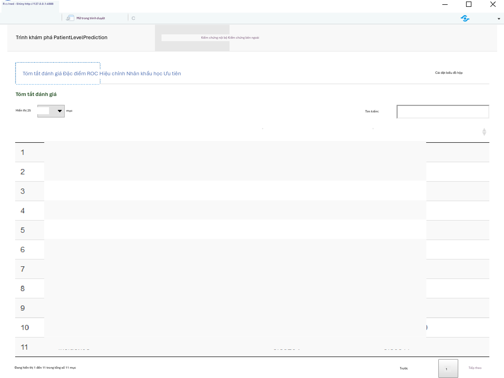{width="5.383124453193351in"
height="4.03875in"}

Hình 13.16: Tóm tắt các thống kê đánh giá trong ứng dụng Shiny.

Biểu đồ hiệu chỉnh trong Hình 13.18 cho thấy nhìn chung rủi ro quan
sát được khớp với rủi ro dự đoán vì các dấu chấm nằm xung quanh đường
chéo. Tuy nhiên, biểu đồ hiệu chỉnh nhân khẩu học trong Hình 13.19 cho
thấy mô hình không được hiệu chỉnh tốt cho các bệnh nhân trẻ tuổi, vì
đường màu xanh (rủi ro dự đoán) khác với đường màu đỏ (rủi ro quan
sát) đối với những người dưới 40 tuổi. Điều này có thể chỉ ra rằng
chúng ta cần loại bỏ nhóm dưới 40 tuổi khỏi quần thể mục tiêu (vì rủi
ro quan sát được đối với bệnh nhân trẻ tuổi gần như bằng không).

Cuối cùng, biểu đồ tiêu hao cho thấy sự mất mát bệnh nhân từ dữ liệu
được dán nhãn dựa trên các tiêu chí bao gồm/loại trừ (xem Hình 13.20).
Biểu đồ cho thấy chúng ta đã mất một phần lớn quần thể mục tiêu do họ
không được quan sát trong toàn bộ thời gian có nguy cơ (1 năm theo
dõi). Thú vị là, không có nhiều bệnh nhân có kết cục thiếu thời gian
theo dõi hoàn chỉnh.

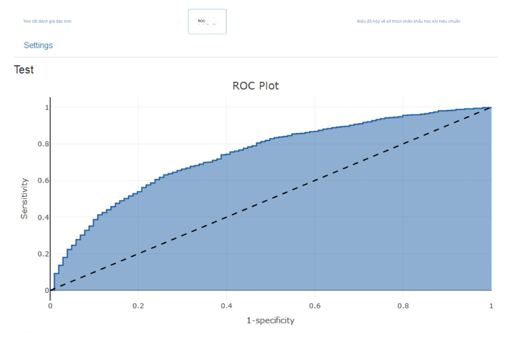{width="5.349166666666667in"
height="3.558333333333333in"}

Hình 13.17: Biểu đồ ROC.

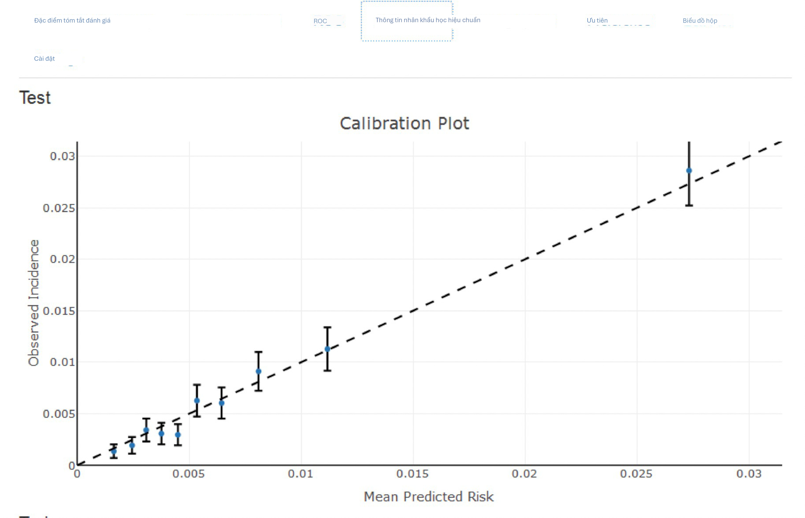{width="5.32875in"
height="3.4358333333333335in"}

Hình 13.18: Sự hiệu chỉnh của mô hình

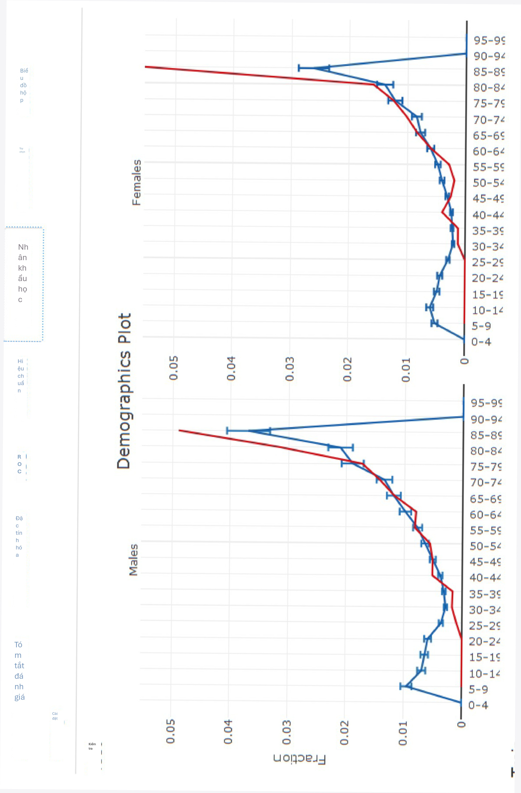{width="5.2675in"
height="3.4358333333333335in"}

Hình 13.19: Sự hiệu chỉnh nhân khẩu học của mô hình

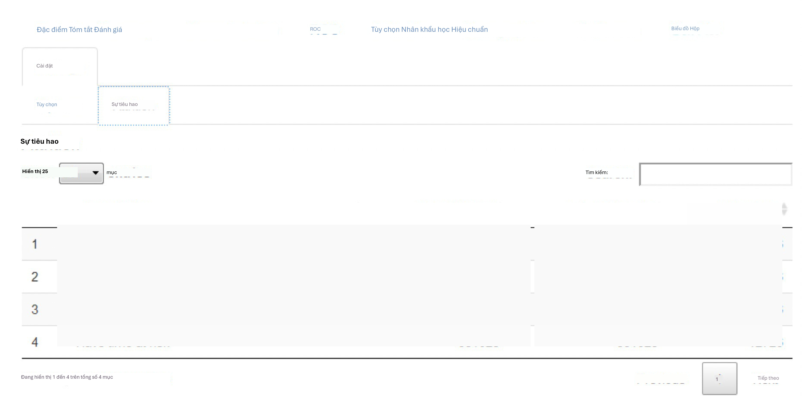{width="5.4279166666666665in"
height="2.8in"}

Hình 13.20: Biểu đồ tiêu hao cho bài toán dự đoán

### So sánh các mô hình

Gói nghiên cứu do ATLAS tạo ra cho phép tạo và đánh giá nhiều mô hình
dự đoán khác nhau cho các bài toán dự đoán khác nhau. Do đó, cụ thể
đối với đầu ra do gói nghiên cứu tạo ra, một ứng dụng Shiny bổ sung đã
được phát triển để xem nhiều mô hình. Để khởi động ứng dụng này, hãy
chạy viewMultiplePlp(outputFolder) trong đó outputFolder là đường dẫn
chứa kết quả phân tích như đã chỉ định khi chạy lệnh execute (và ví dụ
nên chứa một thư mục con có tên "Analysis_1").

#### Xem tóm tắt và cài đặt mô hình

Ứng dụng Shiny tương tác sẽ bắt đầu tại trang tóm tắt như được hiển
thị trong Hình 13.21.

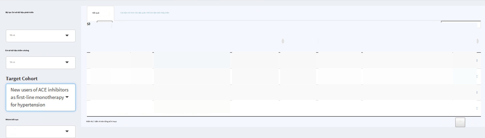{width="5.3175in"
height="1.5225in"}

Hình 13.21: Trang tóm tắt Shiny chứa các chỉ số hiệu suất tập hold-out
chính cho mỗi mô hình đã huấn luyện

Bảng trang tóm tắt này chứa:

- thông tin cơ bản về mô hình (ví dụ: thông tin cơ sở dữ liệu, loại bộ
phân loại, cài đặt thời gian có nguy cơ, tên quần thể mục tiêu và kết
cục)

- số lượng quần thể mục tiêu hold-out và tỷ lệ mắc kết cục

- các chỉ số phân biệt&#58; AUC, AUPRC

Ở bên trái bảng là tùy chọn bộ lọc, nơi chúng ta có thể chỉ định các
cơ sở dữ liệu phát triển/kiểm định để tập trung vào, loại mô hình, cài
đặt thời gian có nguy cơ quan tâm và/hoặc các nhóm thuần tập quan tâm.
Ví dụ, để chọn các mô hình tương ứng với quần thể mục tiêu "Người dùng
mới thuốc ức chế ACE làm liệu pháp đơn trị liệu đầu tay cho bệnh tăng
huyết áp", hãy chọn mục này trong tùy chọn Nhóm thuần tập mục tiêu
(Target Cohort).

Để khám phá một mô hình, hãy nhấp vào hàng tương ứng, một hàng được
chọn sẽ được làm nổi bật. Với một hàng đã chọn, chúng ta hiện có thể
khám phá các cài đặt mô hình được sử dụng khi phát triển mô hình bằng
cách nhấp vào tab Cài đặt mô hình (Model Settings):

Tương tự, chúng ta có thể khám phá các cài đặt quần thể và hiệp biến
được sử dụng để tạo mô hình trong các tab khác.

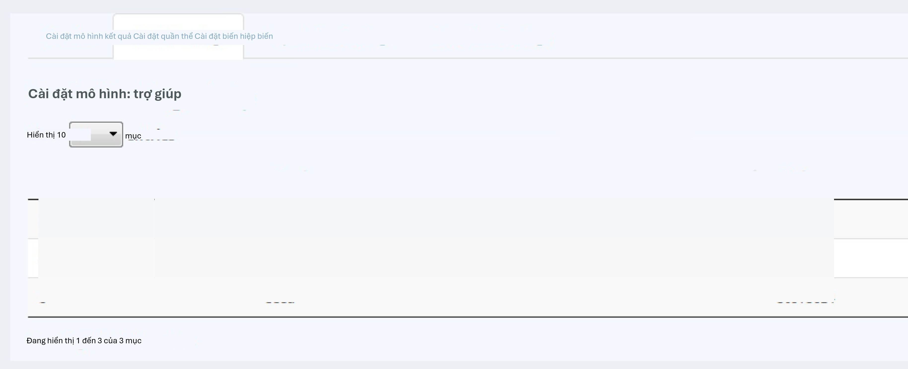{width="5.304583333333333in"
height="2.162916666666667in"}

Hình 13.22: Để xem các cài đặt mô hình được sử dụng khi phát triển mô
hình.

#### Xem hiệu suất mô hình

Sau khi một hàng mô hình đã được chọn, chúng ta cũng có thể xem hiệu
suất mô hình. Nhấp vào để mở tóm tắt hiệu suất ngưỡng được hiển thị
trong Hình
13.23.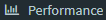{width="1.1043536745406823in"
height="0.20836832895888013in"}

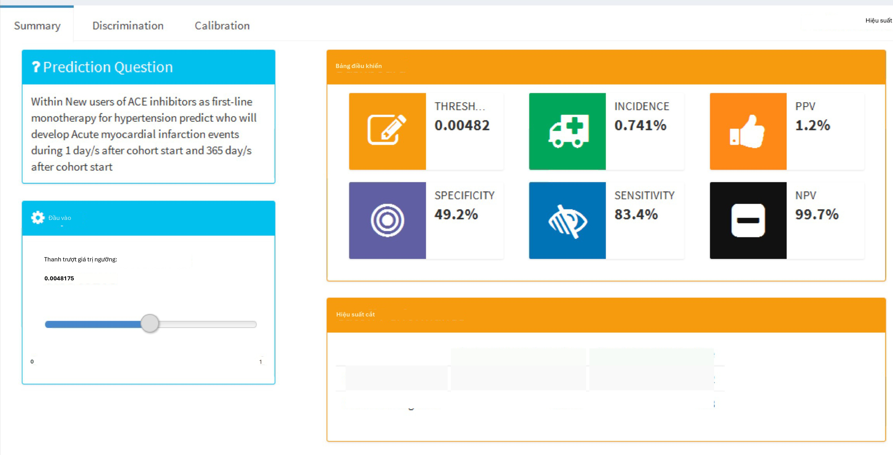{width="5.275416666666667in"
height="2.6904166666666667in"}

Hình 13.23: Các thước đo hiệu suất tóm tắt tại một ngưỡng thiết lập.

Chế độ xem tóm tắt này hiển thị câu hỏi dự đoán đã chọn ở định dạng
chuẩn, bộ chọn ngưỡng và bảng điều khiển chứa các chỉ số chính dựa
trên ngưỡng như giá trị dự đoán dương tính (PPV), giá trị dự đoán âm
tính (NPV), độ nhạy và độ đặc hiệu (xem Mục 13.4.2). Trong Hình 13.23,
chúng ta thấy rằng tại ngưỡng 0,00482, độ nhạy là 83,4% (83,4% bệnh
nhân có kết cục trong năm tiếp theo có rủi ro lớn hơn hoặc bằng
0,00482) và PPV là 1,2% (1,2% bệnh nhân có rủi ro lớn hơn hoặc bằng
0,00482 có kết cục trong năm tiếp theo). Vì tỷ lệ mắc kết cục trong
năm là 0,741%, việc xác định các bệnh nhân có rủi ro lớn hơn hoặc bằng

0,00482 sẽ tìm thấy một nhóm con các bệnh nhân có rủi ro gần gấp đôi
rủi ro trung bình của quần thể. Chúng ta có thể điều chỉnh ngưỡng bằng
cách sử dụng thanh trượt để xem hiệu suất tại các giá trị khác.

Để xem khả năng phân biệt tổng thể của mô hình, hãy nhấp vào tab "Phân
biệt" (Discrimination) để xem biểu đồ ROC, biểu đồ độ chính xác-thu
hồi (precision-recall) và các biểu đồ phân phối. Đường trên biểu đồ
tương ứng với điểm ngưỡng đã chọn. Hình 13.24 hiển thị các biểu đồ ROC
và độ chính xác-thu hồi. Biểu đồ ROC cho thấy mô hình có khả năng phân
biệt giữa những người sẽ có kết cục trong năm và những người sẽ không
có. Tuy nhiên, hiệu suất trông có vẻ ít ấn tượng hơn khi chúng ta xem
biểu đồ độ chính xác-thu hồi, vì tỷ lệ mắc kết cục thấp có nghĩa là có
tỷ lệ dương tính giả cao.

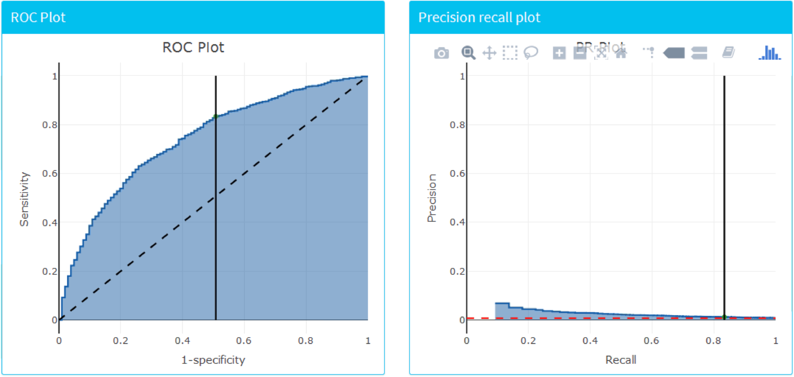{width="5.385in"
height="2.56in"}

Hình 13.24: Các biểu đồ ROC và độ chính xác-thu hồi được sử dụng để
đánh giá khả năng phân biệt tổng thể của mô hình.

Hình 13.25 hiển thị các phân phối điểm dự đoán và điểm ưu tiên.

Cuối cùng, chúng ta cũng có thể kiểm tra sự hiệu chỉnh của mô hình
bằng cách nhấp vào tab "Hiệu chỉnh" (Calibration). Tab này hiển thị
biểu đồ hiệu chỉnh và sự hiệu chỉnh nhân khẩu học được hiển thị trong
Hình 13.26.

Chúng ta thấy rằng rủi ro dự đoán trung bình dường như khớp với tỷ lệ
quan sát được những người đã trải qua kết cục trong vòng một năm, vì
vậy mô hình được hiệu chỉnh tốt. Thú vị là, sự hiệu chỉnh nhân khẩu
học cho thấy đường kỳ vọng cao hơn đường quan sát được đối với các
bệnh nhân trẻ tuổi, vì vậy chúng ta đang dự đoán rủi ro cao hơn cho
các nhóm tuổi trẻ. Ngược lại, đối với các bệnh nhân trên 80 tuổi, mô
hình đang dự đoán rủi ro thấp hơn rủi ro quan sát được. Điều này có
thể thúc đẩy chúng ta phát triển các mô hình riêng biệt cho các bệnh
nhân trẻ tuổi hoặc lớn tuổi hơn.

#### Xem mô hình

Để kiểm tra mô hình cuối cùng, hãy chọn tùy chọn từ menu bên trái.
Thao tác này sẽ mở một chế độ xem chứa các biểu đồ cho từng biến trong
mô hình, được hiển thị trong Hình
13.27,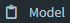{width="0.7292793088363955in"
height="0.23961942257217847in"}

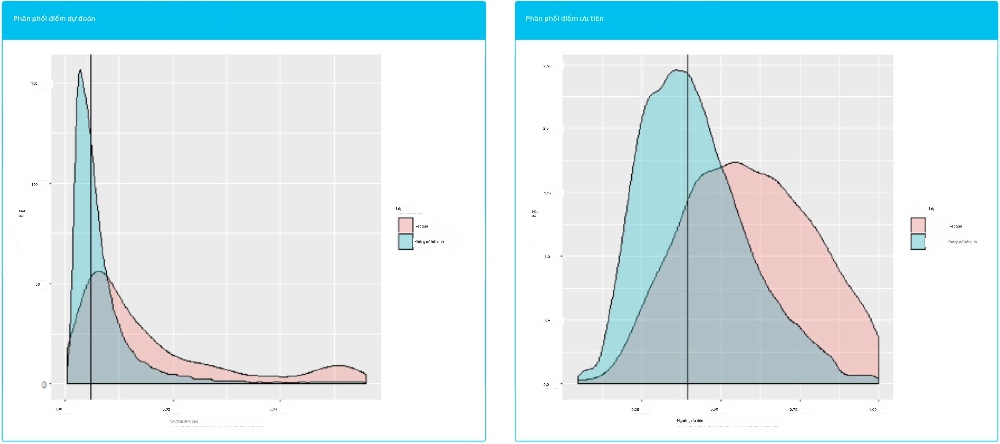{width="5.28in"
height="2.3466666666666667in"}

Hình 13.25: Phân phối rủi ro dự đoán cho những người có và không có
kết cục. Sự chồng lấp càng nhiều thì khả năng phân biệt càng kém

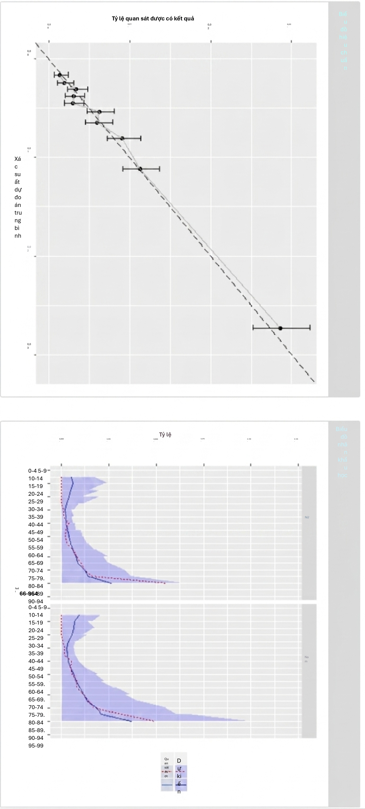{width="5.279998906386702in"
height="2.3879166666666665in"}

Hình 13.26: Sự hiệu chỉnh phân tầng rủi ro và hiệu chỉnh nhân khẩu học

và một bảng tóm tắt tất cả các hiệp biến ứng viên, được hiển thị trong
Hình 13.28. Các biểu đồ biến được tách thành các biến nhị phân và biến
liên tục. Trục x là tỷ lệ hiện mắc/giá trị trung bình ở những bệnh
nhân không có kết cục và trục y là tỷ lệ hiện mắc/giá trị trung bình ở
những bệnh nhân có kết cục. Do đó, bất kỳ dấu chấm nào của biến nằm
phía trên đường chéo đều phổ biến hơn ở những bệnh nhân có kết cục và
bất kỳ dấu chấm nào của biến nằm dưới đường chéo đều ít phổ biến hơn ở
những bệnh nhân có kết cục.

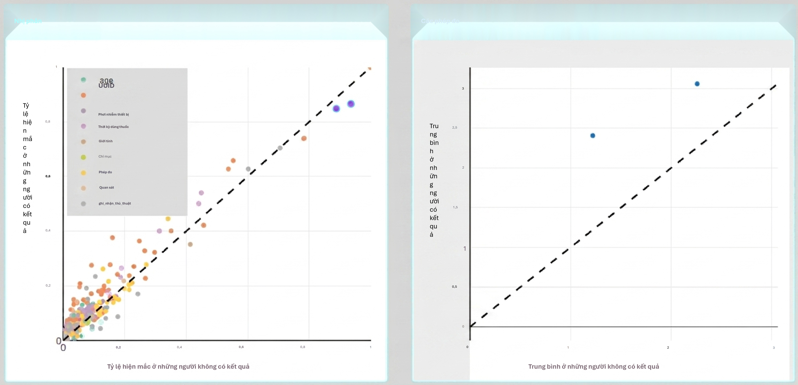{width="5.365in"
height="2.595in"}

Hình 13.27: Các biểu đồ tóm tắt mô hình. Mỗi dấu chấm tương ứng với
một biến được đưa vào mô hình.

Bảng trong Hình 13.28 hiển thị tên, giá trị (hệ số nếu sử dụng mô hình
tuyến tính tổng quát, hoặc tầm quan trọng của biến nếu không) cho tất
cả các hiệp biến ứng viên, giá trị trung bình kết cục (giá trị trung
bình cho những người có kết cục) và giá trị trung bình không kết cục
(giá trị trung bình cho những người không có kết cục).

 will have an effect on the
risk of the
outcome.](media/image6.png){width="0.455in"
height="0.45499890638670165in"}

## Các tính năng dự đoán cấp độ bệnh nhân bổ sung

### Tạo bài báo tạp chí

Chúng tôi đã thêm chức năng tự động tạo một tài liệu Word mà chúng ta
có thể sử dụng làm phần bắt đầu của một bài báo tạp chí. Nó chứa nhiều
chi tiết nghiên cứu và kết quả được tạo ra. Nếu chúng ta đã thực hiện
kiểm định ngoại bộ, các kết quả này cũng có thể được thêm vào. Tùy
chọn, chúng ta có thể thêm "Bảng 1" chứa dữ liệu về nhiều hiệp biến
cho quần thể mục tiêu. Chúng ta có thể tạo bản thảo bài báo tạp chí
bằng cách chạy hàm này:

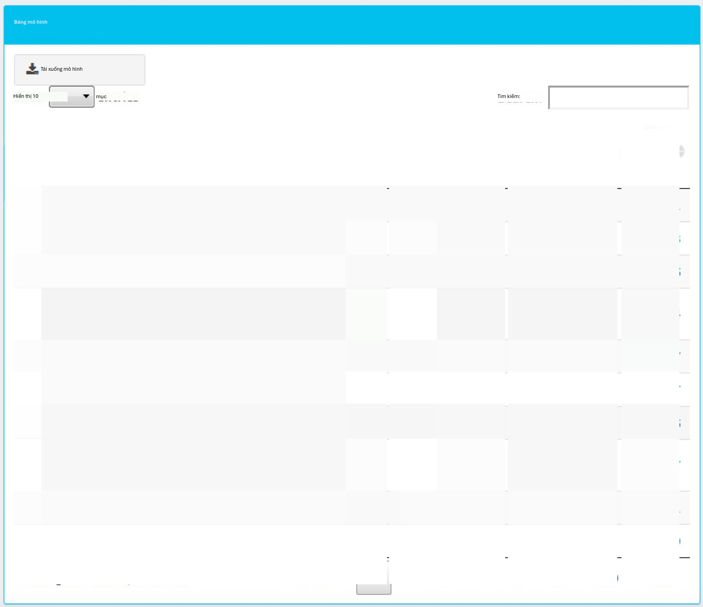{width="5.353332239720035in"
height="4.626666666666667in"}

Hình 13.28: Bảng chi tiết mô hình.

**createPlpJournalDocument**(plpResult = **\<**your plp results**\>**,
plpValidation = **\<**your validation results**\>**, plpData =
**\<**your plp data**\>**,

targetName = \"\<target population\>\", outcomeName = \"\<outcome\>\",

table1 = F, connectionDetails = NULL, includeTrain = FALSE,
includeTest = TRUE,

includePredictionPicture = TRUE, includeAttritionPlot = TRUE,
outputLocation = \"\<your location\>\")

Để biết thêm chi tiết, hãy xem trang trợ giúp
của hàm.

## Tóm tắt

{width="0.4455205599300088in"
height="0.4644783464566929in"}

- Patient-level prediction aims to develop a model that predicts future
events using data from the past.

- The selection of the best machine algorithm for model development is
an empirical question, i.e. it should be driven by the problem and
data at hand.

- The PatientLevelPrediction Package implements best practices for the
devel-opment and validation of prediction models using data stored in
the OMOP-CDM.

- The dissemination of the model and its performance measures is
implemented through interactive dashboards.

- OHDSI's prediction framework enables large-scale external validation
of pre-diction models which is a pre-requisite for clinical adoption.

## Bài tập

#### Điều kiện tiên quyết

Đối với các bài tập này, chúng tôi giả định R, R-Studio và Java đã
được cài đặt như mô tả trong Mục 8.4.5. Ngoài ra, các gói SqlRender,
DatabaseConnector, Eunomia và PatientLevelPrediction cũng được yêu
cầu, có thể được cài đặt bằng cách sử dụng:

**install.packages**(**c**(\"SqlRender\", \"DatabaseConnector\",
\"remotes\")) remotes**::install_github**(\"ohdsi/Eunomia\", ref =
\"v1.0.0\")
remotes**::install_github**(\"ohdsi/PatientLevelPrediction\")

Gói Eunomia cung cấp một tập dữ liệu mô phỏng trong CDM sẽ chạy bên
trong phiên R cục bộ của bạn. Các chi tiết kết nối có thể thu được
bằng cách sử dụng:

connectionDetails \<- Eunomia**::getEunomiaConnectionDetails**()

Lược đồ cơ sở dữ liệu CDM là "main". Các bài tập này cũng sử dụng một
vài nhóm thuần tập. Hàm createCohorts trong gói Eunomia sẽ tạo các
nhóm này trong bảng COHORT:

Eunomia**::createCohorts**(connectionDetails)

#### Định nghĩa vấn đề

Ở những bệnh nhân bắt đầu sử dụng NSAID lần đầu tiên, hãy dự đoán ai
sẽ bị xuất huyết tiêu hóa (GI) trong năm tới.

Nhóm thuần tập người dùng mới NSAID có COHORT_DEFINITION_ID = 4. Nhóm
thuần tập xuất huyết tiêu hóa có COHORT_DEFINITION_ID = 3.

**Bài tập 13.1. Sử dụng gói R PatientLevelPrediction, xác định các
hiệp biến bạn muốn sử dụng cho dự đoán và trích xuất dữ liệu PLP từ
CDM. Tạo bản tóm tắt dữ liệu PLP.**

**Bài tập 13.2. Xem xét lại các lựa chọn thiết kế bạn phải thực hiện
để xác định quần thể mục tiêu cuối cùng và chỉ định chúng bằng cách sử
dụng hàm createStudyPopulation. Ảnh hưởng của các lựa chọn của bạn đối
với quy mô cuối cùng của quần thể mục tiêu sẽ là gì?**

**Bài tập 13.3. Xây dựng một mô hình dự đoán bằng cách sử dụng LASSO
và đánh giá hiệu suất của nó bằng ứng dụng Shiny. Mô hình của bạn đang
hoạt động tốt như thế nào?**

Các câu trả lời gợi ý có thể được tìm thấy
trong Phụ lục E.9.

