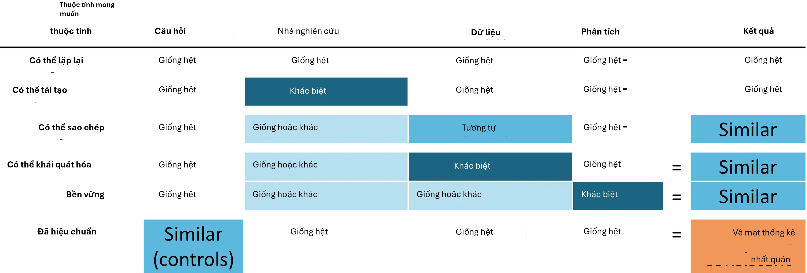
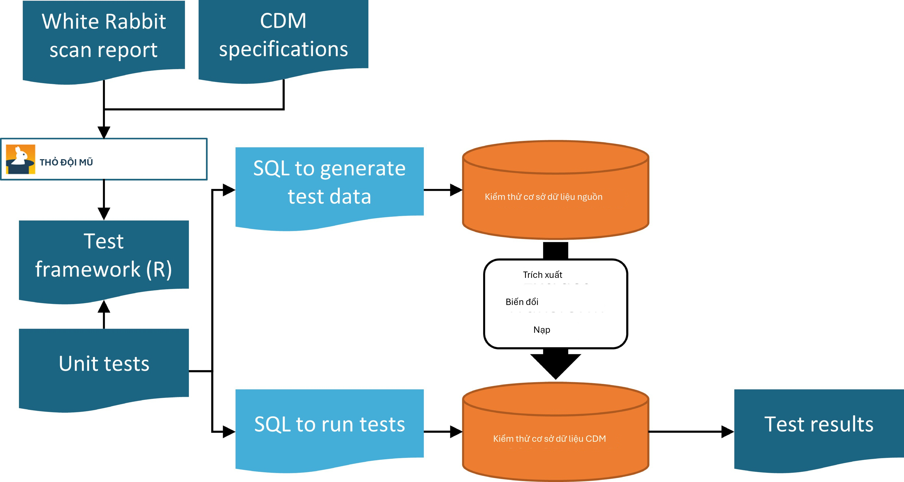
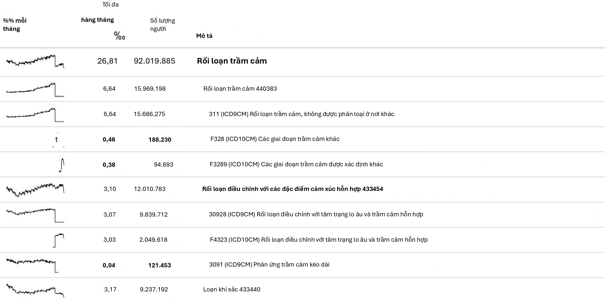
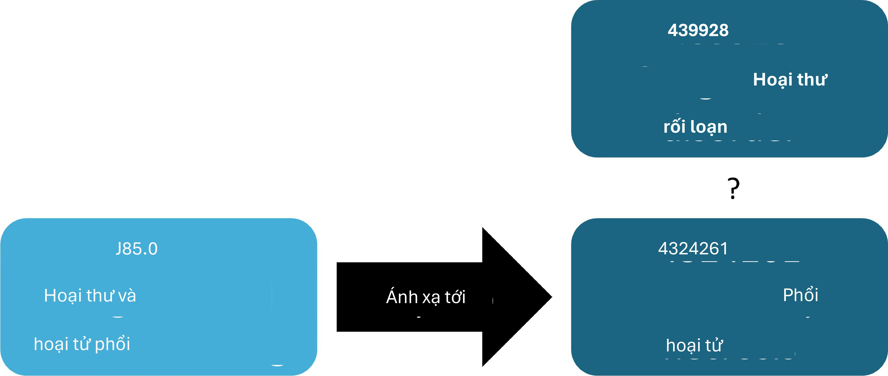
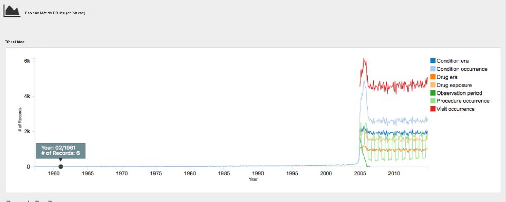
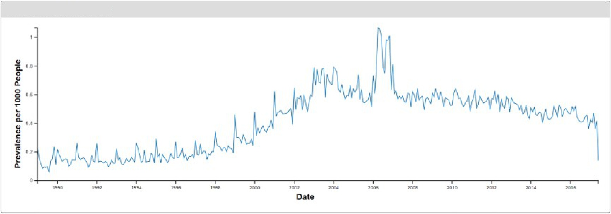
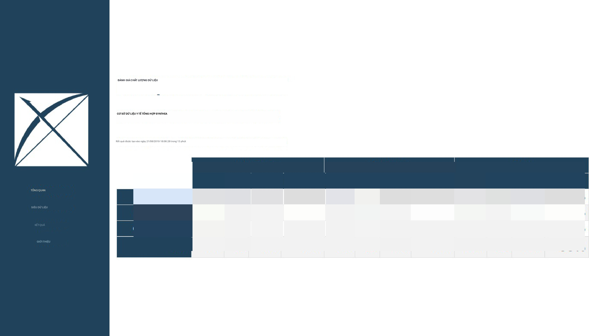
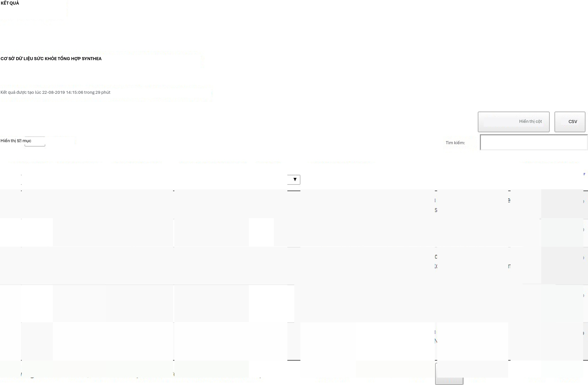
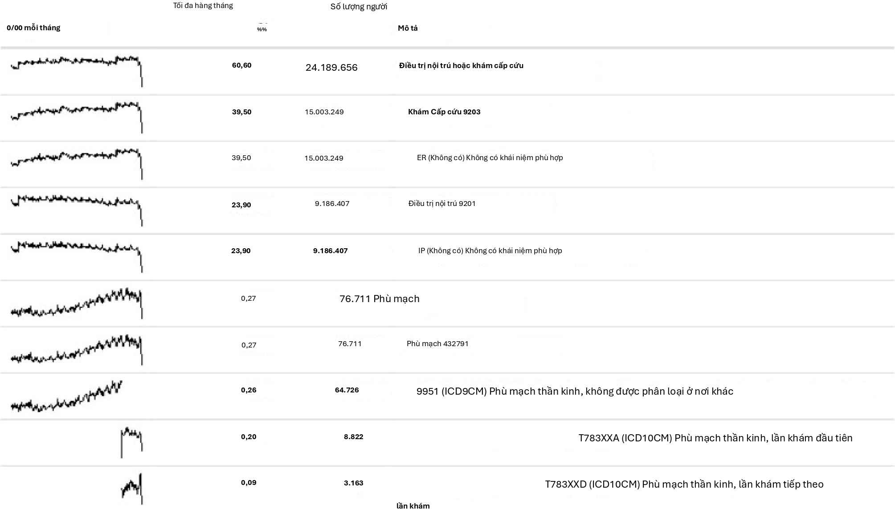

# Chất lượng bằng chứng

*Người dẫn dắt chương: Patrick Ryan & Jon
Duke*

## Các thuộc tính của bằng chứng đáng tin cậy

Trước khi bắt đầu bất kỳ hành trình nào, việc hình dung điểm đến lý
tưởng có thể trông như thế nào sẽ rất hữu ích. Để hỗ trợ hành trình
của chúng ta từ dữ liệu đến bằng chứng, chúng tôi làm nổi bật các
thuộc tính mong muốn có thể làm cơ sở cho những gì tạo nên chất lượng
bằng chứng đáng tin cậy.

{width="5.134479440069991in"
height="1.7359372265966755in"}

Hình 14.1: Các thuộc tính mong muốn của bằng chứng đáng tin cậy

Bằng chứng đáng tin cậy phải có khả năng lặp lại (repeatable), nghĩa
là các nhà nghiên cứu nên kỳ vọng tạo ra kết quả giống hệt nhau khi áp
dụng cùng một phân tích cho cùng một dữ liệu cho bất kỳ câu hỏi nào.
Ngụ ý trong yêu cầu tối thiểu này là quan điểm rằng bằng chứng là kết
quả của việc thực hiện một quy trình đã xác định với đầu vào cụ thể,
và nên không có sự can thiệp thủ công hay ra quyết định hậu kiểm
(post-hoc) trong suốt quá trình. Lý tưởng hơn, bằng chứng đáng tin cậy
phải có khả năng tái lập (reproducible) sao cho một nhà nghiên cứu
khác có thể thực hiện cùng một nhiệm vụ thực thi một phân tích nhất
định trên một cơ sở dữ liệu nhất định và kỳ vọng tạo ra kết quả giống
hệt như nhà nghiên cứu đầu tiên. Khả năng tái lập yêu cầu quy trình
phải được xác định đầy đủ, thường là ở cả dạng con người có thể đọc
được và máy tính có thể thực thi được sao cho không

có quyết định nghiên cứu nào được để lại cho sự tùy ý của điều tra
viên. Giải pháp hiệu quả nhất để đạt được khả năng lặp lại và khả năng
tái lập là sử dụng các quy trình phân tích chuẩn hóa đã xác định đầu
vào và đầu ra, và áp dụng các quy trình này đối với các cơ sở dữ liệu
được kiểm soát phiên bản.

Chúng ta có nhiều khả năng tin tưởng rằng bằng chứng của mình là đáng
tin cậy nếu nó có thể được chứng minh là có khả năng sao chép
(replicable), sao cho cùng một câu hỏi được giải quyết bằng cách sử
dụng phân tích giống hệt nhau đối với dữ liệu tương tự mang lại kết
quả tương tự. Ví dụ, bằng chứng được tạo ra từ một phân tích đối với
cơ sở dữ liệu yêu cầu thanh toán hành chính từ một công ty bảo hiểm tư
nhân lớn có thể được củng cố nếu được sao chép trên dữ liệu yêu cầu
thanh toán từ một công ty bảo hiểm khác. Trong bối cảnh ước tính hiệu
quả cấp độ quần thể, thuộc tính này phù hợp với quan điểm nhân quả của
Sir Austin Bradford Hill về tính nhất quán, "Nó đã được quan sát nhiều
lần bởi những người khác nhau, ở những nơi, hoàn cảnh và thời gian
khác nhau chưa?... liệu cơ hội có phải là lời giải thích hay liệu một
mối nguy hiểm thực sự đã được tiết lộ đôi khi chỉ có thể được trả lời
bằng cách lặp lại các hoàn cảnh và các quan sát." (Hill, 1965) Trong
bối cảnh dự đoán cấp độ bệnh nhân, khả năng sao chép làm nổi bật giá
trị của kiểm định ngoại bộ và khả năng đánh giá hiệu suất của một mô
hình đã được huấn luyện trên một cơ sở dữ liệu bằng cách quan sát độ
chính xác phân biệt và sự hiệu chỉnh của nó khi áp dụng cho một cơ sở
dữ liệu khác. Trong các trường hợp mà các phân tích giống hệt nhau
được thực hiện đối với các cơ sở dữ liệu khác nhau và vẫn cho thấy các
kết quả tương tự một cách nhất quán, chúng ta có thêm sự tin tưởng
rằng bằng chứng của mình có khả năng tổng quát hóa. Một giá trị chính
của mạng lưới nghiên cứu OHDSI là sự đa dạng được đại diện bởi các
quần thể, địa lý và quy trình thu thập dữ liệu khác nhau. Madigan và
cộng sự (2013b) cho thấy rằng các ước tính hiệu quả có thể nhạy cảm
với lựa chọn dữ liệu. Nhận thức được rằng mỗi nguồn dữ liệu mang theo
những hạn chế vốn có và những sai lệch độc đáo làm hạn chế sự tin
tưởng của chúng ta vào các phát hiện đơn lẻ, có một sức mạnh to lớn
trong việc quan sát các mô hình tương tự trên các tập dữ liệu không
đồng nhất vì nó làm giảm đáng kể khả năng các sai lệch đặc thù của
nguồn dữ liệu chỉ có thể giải thích các phát hiện. Khi các nghiên cứu
mạng lưới cho thấy các ước tính hiệu quả cấp độ quần thể nhất quán
trên nhiều cơ sở dữ liệu yêu cầu thanh toán và EHR trên khắp Hoa Kỳ,
Châu Âu và Châu Á, chúng nên được công nhận là bằng chứng mạnh mẽ hơn
về can thiệp y tế có thể có phạm vi rộng hơn để tác động đến việc ra
quyết định y tế.

Bằng chứng đáng tin cậy phải mạnh mẽ (robust), nghĩa là các phát hiện
không nên quá nhạy cảm với các lựa chọn chủ quan có thể được thực hiện
trong một phân tích. Nếu có các phương pháp thống kê thay thế có thể
được coi là hợp lý cho một nghiên cứu nhất định, thì việc thấy rằng
các phương pháp khác nhau mang lại kết quả tương tự có thể cung cấp sự
trấn an, hoặc ngược lại có thể gây thận trọng nếu các kết quả không
nhất quán được phát hiện. (Madigan và cộng sự, 2013a) Đối với ước tính
hiệu quả cấp độ quần thể, các phân tích độ nhạy có thể bao gồm lựa
chọn thiết kế nghiên cứu cấp cao, chẳng hạn như liệu có áp dụng thiết
kế nhóm thuần tập so sánh hay chuỗi ca bệnh tự kiểm soát, hoặc có thể
tập trung vào các cân nhắc phân tích được nhúng trong một thiết kế,
chẳng hạn như liệu có thực hiện khớp điểm xu hướng, phân tầng hoặc
trọng số như một chiến lược điều chỉnh nhiễu trong khung nhóm thuần
tập so sánh hay không.

Cuối cùng, nhưng có khả năng quan trọng nhất, bằng chứng nên được hiệu
chỉnh. Không đủ để có một hệ thống tạo bằng chứng tạo ra câu trả lời
cho các câu hỏi chưa biết nếu hiệu suất của hệ thống đó không thể được
xác minh. Một hệ thống đóng nên được kỳ vọng có các đặc tính vận hành
đã biết, mà nên có thể đo lường và truyền

2.  *Hiểu về chất lượng bằng chứng 289*

đạt như bối cảnh để diễn giải bất kỳ kết quả nào mà hệ thống tạo ra.
Các tạo tác thống kê nên có thể được chứng minh theo kinh nghiệm là có
các đặc tính được xác định rõ ràng, chẳng hạn như khoảng tin cậy 95%
có xác suất bao phủ 95% hoặc một nhóm thuần tập có xác suất dự đoán là
10% có tỷ lệ sự kiện quan sát được là 10% trong quần thể. Một nghiên
cứu quan sát luôn phải đi kèm với các chẩn đoán nghiên cứu kiểm tra
các giả định xung quanh thiết kế, phương pháp và dữ liệu. Các chẩn
đoán này nên tập trung vào việc đánh giá các mối đe dọa chính đối với
tính hợp lệ của nghiên cứu: sai lệch chọn mẫu, nhiễu và sai số đo
lường. Các đối chứng âm tính đã được chứng minh là một công cụ mạnh mẽ
để xác định và giảm thiểu sai số hệ thống trong các nghiên cứu quan
sát. (Schuemie và cộng sự, 2016, 2018a,b)

## Hiểu về chất lượng bằng chứng

Nhưng làm thế nào chúng ta biết kết quả của một nghiên cứu có đủ tin
cậy hay không? Chúng có thể được tin tưởng để sử dụng trong các cơ sở
lâm sàng không? Còn trong việc ra quyết định quy định thì sao? Chúng
có thể đóng vai trò là nền tảng cho nghiên cứu trong tương lai không?
Mỗi khi một nghiên cứu mới được công bố hoặc phổ biến, độc giả phải
cân nhắc những câu hỏi này, bất kể công trình đó là một thử nghiệm
ngẫu nhiên có đối chứng, một nghiên cứu quan sát hay một loại phân
tích khác.

Một trong những mối quan tâm thường được nêu ra xung quanh các nghiên
cứu quan sát và việc sử dụng "dữ liệu thế giới thực" là chủ đề về chất
lượng dữ liệu. (Botsis và cộng sự, 2010; Hersh và cộng sự, 2013;
Sherman và cộng sự, 2016) Thường được lưu ý là dữ liệu được sử dụng
trong nghiên cứu quan sát ban đầu không được thu thập cho mục đích
nghiên cứu và do đó có thể bị ảnh hưởng bởi việc thu thập dữ liệu
không đầy đủ hoặc không chính xác cũng như các sai lệch vốn có. Những
mối quan tâm này đã làm nảy sinh một khối lượng nghiên cứu ngày càng
tăng xung quanh cách đo lường, đặc điểm hóa và lý tưởng nhất là cải
thiện chất lượng dữ liệu. (Kahn và cộng sự, 2012; Liaw và cộng sự,
2013; Weiskopf và Weng, 2013) Cộng đồng OHDSI là một người ủng hộ mạnh
mẽ cho nghiên cứu như vậy và các thành viên cộng đồng đã dẫn dắt và
tham gia vào nhiều nghiên cứu xem xét chất lượng dữ liệu trong OMOP
CDM và mạng lưới OHDSI. (Huser và cộng sự, 2016; Kahn và cộng sự,
2015; Callahan và cộng sự, 2017; Yoon và cộng sự, 2016)

Với những phát hiện trong thập kỷ qua trong lĩnh vực này, rõ ràng là
chất lượng dữ liệu không hoàn hảo và sẽ không bao giờ như vậy. Khái
niệm này được phản ánh một cách tốt đẹp trong câu trích dẫn này từ
Tiến sĩ Clem McDonald, một người tiên phong trong lĩnh vực tin học y
tế:

Sự mất độ trung thực bắt đầu với sự di chuyển của dữ liệu từ não của
bác sĩ vào hồ sơ y tế.

Vì vậy, với tư cách là một cộng đồng, chúng ta phải đặt câu hỏi -- với
dữ liệu không hoàn hảo, làm thế nào chúng ta có thể đạt được bằng
chứng đáng tin cậy?

Câu trả lời nằm ở việc nhìn nhận một cách toàn diện về "chất lượng
bằng chứng": xem xét toàn bộ hành trình từ dữ liệu đến bằng chứng, xác
định từng thành phần tạo nên quy trình tạo bằng chứng, xác định cách
xây dựng niềm tin vào chất lượng của từng thành phần và truyền đạt một
cách minh bạch những gì đã học được qua từng bước. Chất lượng bằng
chứng không chỉ xem xét chất lượng của dữ liệu quan sát mà còn cả tính
hợp lệ của các phương pháp, phần mềm và định nghĩa lâm sàng được sử
dụng trong các phân tích quan sát của chúng ta.

Trong các chương tiếp theo, chúng ta sẽ khám phá bốn thành phần của
chất lượng bằng chứng được liệt kê trong

Bảng 14.1.

Bảng 14.1: Bốn thành phần của chất lượng bằng chứng.

Thành phần của

Chất lượng bằng chứng Nó đo lường điều gì

Chất lượng dữ liệu Dữ liệu có được thu thập đầy đủ với các giá trị hợp
lý theo cách phù hợp với cấu trúc và quy ước đã thỏa thuận không?

Tính hợp lệ lâm sàng Phân tích được thực hiện có phù hợp với ý định
lâm sàng đến mức độ nào?

Tính hợp lệ phần mềm Chúng ta có thể tin tưởng rằng quy trình chuyển
đổi và phân tích dữ liệu thực hiện những gì nó được cho là phải làm
không?

Tính hợp lệ phương pháp Phương pháp luận có phù hợp với câu hỏi không,
xét đến những điểm mạnh và điểm yếu của dữ liệu?

## Truyền đạt chất lượng bằng chứng

Một khía cạnh quan trọng của chất lượng bằng chứng là khả năng thể
hiện sự không chắc chắn nảy sinh dọc theo hành trình từ dữ liệu đến
bằng chứng. Mục tiêu bao trùm của công việc của OHDSI xung quanh chất
lượng bằng chứng là tạo ra niềm tin ở những người ra quyết định chăm
sóc sức khỏe rằng bằng chứng do OHDSI tạo ra -- mặc dù chắc chắn không
hoàn hảo theo nhiều cách -- đã được đo lường một cách nhất quán về
điểm yếu và điểm mạnh của nó và thông tin này đã được truyền đạt một
cách nghiêm ngặt và cởi mở.

## Tóm tắt

{width="0.4455205599300088in"
height="0.4644783464566929in" .book-icon}

- The evidence we generate should be **repeatable**, **reproducible**,
**replicable**, **generalizable**, **robust**, and **calibrated**.

- Evidence quality considers more than just data quality when answering
whether evidence is reliable&#58;

- Data Quality

- Clinical Validity

- Software Validity

- Method Validity

- When communicating evidence, we should express the uncertainty arising
from the various challenges to evidence quality.

# Chất lượng dữ liệu

*Người dẫn dắt chương: Martijn Schuemie, Vojtech Huser & Clair
Blacketer*

Hầu hết các dữ liệu được sử dụng cho nghiên cứu chăm sóc sức khỏe quan
sát không được thu thập cho mục đích nghiên cứu. Ví dụ, hồ sơ sức khỏe
điện tử (EHR) nhằm mục đích thu thập thông tin cần thiết để hỗ trợ
chăm sóc bệnh nhân, và các yêu cầu thanh toán hành chính được thu thập
để cung cấp cơ sở cho việc phân bổ chi phí cho người trả tiền. Nhiều
người đã đặt câu hỏi liệu có phù hợp để sử dụng dữ liệu như vậy cho
nghiên cứu lâm sàng hay không, với van der Lei (1991) thậm chí còn
tuyên bố rằng "Dữ liệu chỉ được sử dụng cho mục đích mà chúng được thu
thập." Mối quan tâm là vì dữ liệu không được thu thập cho nghiên cứu
mà chúng ta muốn thực hiện, nên nó không được đảm bảo có đủ chất
lượng. Nếu chất lượng dữ liệu kém (rác vào), thì chất lượng kết quả
của nghiên cứu sử dụng dữ liệu đó cũng phải kém (rác ra). Do đó, một
khía cạnh quan trọng của nghiên cứu chăm sóc sức khỏe quan sát liên
quan đến việc đánh giá chất lượng dữ liệu, nhằm mục đích trả lời câu
hỏi:

Dữ liệu có đủ chất lượng cho mục đích nghiên cứu của chúng ta không?

Chúng ta có thể định nghĩa chất lượng dữ liệu (DQ) là (Roebuck, 2012):

Trạng thái của tính đầy đủ, tính hợp lệ, tính nhất quán, tính kịp thời
và tính chính xác làm cho dữ liệu phù hợp với một mục đích sử dụng cụ
thể.

Lưu ý rằng không chắc là dữ liệu của chúng ta hoàn hảo, nhưng chúng có
thể đủ tốt cho mục đích của chúng ta.

DQ không thể được quan sát trực tiếp, nhưng phương pháp luận đã được
phát triển để đánh giá nó. Hai loại đánh giá DQ có thể được phân biệt
(Weiskopf và Weng, 2013): các đánh giá để đánh giá DQ nói chung, và
các đánh giá để đánh giá DQ trong bối cảnh của một nghiên cứu cụ thể.

Trong chương này, trước tiên chúng ta sẽ xem xét các nguồn có thể gây
ra vấn đề DQ, sau đó chúng ta sẽ thảo luận về lý thuyết của các đánh
giá DQ chung và cụ thể theo nghiên cứu, theo sau là mô tả từng bước về
cách các đánh giá này có thể được thực hiện bằng cách sử dụng các công
cụ OHDSI.

## Các nguồn gây ra vấn đề chất lượng dữ liệu

Có nhiều mối đe dọa đối với chất lượng dữ liệu, bắt đầu như đã lưu ý
trong Chương 14 khi bác sĩ ghi lại suy nghĩ của cô ấy hoặc anh ấy.
Dasu và Johnson (2003) phân biệt các bước sau trong vòng đời của dữ
liệu, khuyến nghị DQ được tích hợp trong từng bước. Họ gọi đây là liên
tục DQ (DQ continuum):

1.  **Thu thập và tích hợp dữ liệu. Các vấn đề có thể xảy ra bao gồm
nhập thủ công sai sót, sai lệch (ví dụ: upcoding trong yêu cầu thanh
toán), kết nối bảng sai trong EHR và thay thế các giá trị bị thiếu
bằng các giá trị mặc định.**

2.  **Lưu trữ dữ liệu và chia sẻ kiến thức. Các vấn đề tiềm ẩn là thiếu
tài liệu về mô hình dữ liệu và thiếu siêu dữ liệu.**

3.  **Phân tích dữ liệu. Các vấn đề có thể bao gồm chuyển đổi dữ liệu
không chính xác, diễn giải dữ liệu không chính xác và sử dụng phương
pháp luận không phù hợp.**

4.  **Xuất bản dữ liệu. Khi xuất bản dữ liệu để sử dụng ở hạ nguồn.**

Thông thường dữ liệu chúng ta sử dụng đã được thu thập và tích hợp, vì
vậy chúng ta ít có khả năng cải thiện bước 1. Chúng ta có các cách để
kiểm tra DQ do bước này tạo ra như sẽ được thảo luận trong các phần
tiếp theo của chương này.

Tương tự, chúng ta thường nhận dữ liệu ở một dạng cụ thể, vì vậy chúng
ta có rất ít ảnh hưởng đến một phần của bước 2. Tuy nhiên, trong
OHDSI, chúng ta chuyển đổi tất cả dữ liệu quan sát của mình sang Mô
hình dữ liệu chung (CDM), và chúng ta có quyền sở hữu đối với quy
trình này. Một số người đã bày tỏ lo ngại rằng bước cụ thể này có thể
làm giảm DQ. Nhưng vì chúng ta kiểm soát quy trình này, chúng ta có
thể xây dựng các biện pháp bảo vệ nghiêm ngặt để bảo tồn DQ như được
thảo luận sau trong Mục 15.2.2. Một số cuộc điều tra (Defalco và cộng
sự, 2013; Makadia và Ryan, 2014; Matcho và cộng sự, 2014; Voss và cộng
sự, 2015a,b; Hripcsak và cộng sự, 2018) đã chỉ ra rằng khi được thực
hiện đúng cách, rất ít hoặc không có sai sót nào được đưa vào khi
chuyển đổi sang CDM. Trên thực tế, việc có một mô hình dữ liệu được
ghi chép đầy đủ và được chia sẻ bởi một cộng đồng lớn tạo điều kiện
lưu trữ dữ liệu theo cách rõ ràng và không mơ hồ.

Bước 3 (phân tích dữ liệu) cũng thuộc quyền kiểm soát của chúng ta.
Trong OHDSI, chúng ta có xu hướng không sử dụng thuật ngữ DQ cho các
vấn đề chất lượng trong bước này, mà thay vào đó là các thuật ngữ tính
hợp lệ lâm sàng, tính hợp lệ phần mềm và tính hợp lệ phương pháp, được
thảo luận chi tiết trong các Chương 16, 17 và 18.[]{#_bookmark451
.anchor}

## Chất lượng dữ liệu nói chung

Chúng ta có thể đặt câu hỏi liệu dữ liệu của chúng ta có phù hợp với
mục đích chung của nghiên cứu quan sát hay không. Kahn và cộng sự
(2016) định nghĩa DQ chung như vậy bao gồm ba thành phần:

1.  **Tính tuân thủ (Conformance): Các giá trị dữ liệu có tuân thủ các
tiêu chuẩn và định dạng được chỉ định không? Ba loại phụ được xác
định:**

- **Giá trị: Các phần tử dữ liệu được ghi lại có phù hợp với các
định dạng được chỉ định không? Ví dụ, tất cả các chuyên khoa y tế
của nhà cung cấp có phải là chuyên khoa hợp lệ không?**

- **Quan hệ: Dữ liệu được ghi lại có phù hợp với các ràng buộc quan
hệ được chỉ định không? Ví dụ, PROVIDER_ID trong một
DRUG_EXPOSURE**

dữ liệu có bản ghi tương ứng trong bảng
PROVIDER không?

- **Tính toán&#58; Các tính toán trên dữ liệu có mang lại kết quả dự định
không? Ví dụ, BMI được tính từ chiều cao và cân nặng có bằng với BMI
nguyên văn được ghi trong dữ liệu không?**

2.  **Tính đầy đủ: Đề cập đến việc liệu một biến cụ thể có hiện diện hay
không (ví dụ: cân nặng đo tại phòng khám bác sĩ có được ghi lại
không?) cũng như liệu các biến có chứa tất cả các giá trị được ghi
lại hay không (ví dụ: tất cả mọi người có biết giới tính không?)**

3.  **Tính hợp lý (Plausibility): Các giá trị dữ liệu có đáng tin không?
Ba loại phụ được xác định:**

- **Tính duy nhất&#58; Ví dụ, mỗi PERSON_ID có xuất hiện chỉ một lần
trong bảng PERSON không?**

- **Phi thời gian (Atemporal): Các giá trị, phân phối hoặc mật độ có
đồng ý với các giá trị kỳ vọng không? Ví dụ, tỷ lệ hiện mắc bệnh
tiểu đường được ngụ ý bởi dữ liệu có phù hợp với tỷ lệ hiện mắc đã
biết không?**

- **Thời gian (Temporal): Các thay đổi về giá trị có phù hợp với kỳ
vọng không? Ví dụ, các chuỗi tiêm chủng có phù hợp với các khuyến
nghị không?**

Mỗi thành phần có thể được đánh giá theo hai cách:

- **Xác minh (Verification) tập trung vào các ràng buộc dữ liệu mô hình
và siêu dữ liệu, các giả định hệ thống và kiến thức địa phương. Nó
không dựa vào tham chiếu bên ngoài. Đặc điểm chính của xác minh là khả
năng xác định các giá trị và phân phối kỳ vọng bằng cách sử dụng các
tài nguyên trong môi trường cục bộ.**

- **Kiểm định (Validation) tập trung vào sự căn chỉnh của các giá trị dữ
liệu liên quan đến các chuẩn đối chiếu bên ngoài phù hợp. Một nguồn
chuẩn đối chiếu bên ngoài có thể là kết hợp các kết quả trên nhiều địa
điểm dữ liệu.**

### Kiểm tra chất lượng dữ liệu

Kahn giới thiệu thuật ngữ kiểm tra chất lượng dữ liệu (đôi khi được
gọi là quy tắc chất lượng dữ liệu) kiểm tra xem dữ liệu có tuân thủ
một yêu cầu nhất định hay không (ví dụ: gắn cờ một độ tuổi không hợp
lý là 141 của một bệnh nhân, có khả năng do năm sinh không chính xác
hoặc thiếu sự kiện tử vong). Chúng ta có thể thực hiện các kiểm tra
như vậy trong phần mềm bằng cách tạo các công cụ DQ tự động. Một công
cụ như vậy là ACHILLES (Automated Characterization of Health
Information at Large-scale Longitudinal Evidence Systems). (Huser và
cộng sự, 2018) ACHILLES là một công cụ phần mềm cung cấp đặc điểm hóa
và trực quan hóa cơ sở dữ liệu tuân thủ CDM. Do đó, nó có thể được sử
dụng để đánh giá DQ trong một mạng lưới các cơ sở dữ liệu. (Huser và
cộng sự, 2016) ACHILLES có sẵn dưới dạng một công cụ độc lập, và nó
cũng được tích hợp vào ATLAS dưới dạng hàm "Data Sources".

ACHILLES tính toán trước hơn 170 phân tích đặc điểm hóa dữ liệu, với
mỗi phân tích có một ID phân tích và một mô tả ngắn về phân tích đó;
hai ví dụ như vậy là "715: Phân phối DAYS_SUPPLY theo DRUG_CONCEPT_ID"
và "506: Phân phối tuổi khi chết theo giới tính." Kết quả của các phân
tích này được lưu trữ trong cơ sở dữ liệu và có thể được truy cập bằng
trình xem web hoặc bởi ATLAS.

Một công cụ khác do cộng đồng tạo ra để đánh giá DQ là Bảng điều khiển
chất lượng dữ liệu (Data Quality Dashboard - DQD). Trong khi ACHILLES
chạy các phân tích đặc điểm hóa để cung cấp một cái nhìn trực quan
tổng thể

về một phiên bản CDM, DQD đi từng bảng và từng trường để định lượng số
lượng bản ghi trong CDM không tuân thủ các thông số kỹ thuật đã cho.
Tổng cộng, hơn 1.500 kiểm tra được thực hiện, mỗi kiểm tra được tổ
chức vào khung Kahn. Đối với mỗi kiểm tra, kết quả được so sánh với
một ngưỡng mà tại đó FAIL được coi là bất kỳ tỷ lệ phần trăm nào của
các hàng vi phạm nằm trên giá trị đó. Bảng 15.1 hiển thị một số kiểm
tra ví dụ.

+------+---------------------------------------------+-------+
|      | Bảng 15.1&#58; Ví dụ về các quy tắc chất lượng  |       |
|      | dữ liệu trong Bảng điều khiển Chất lượng Dữ |       |
|      | liệu.                                       |       |
+======+=============================================+=======+
| Tỷ   |                                             |       |
| lệ   |                                             |       |
+------+---------------------------------------------+-------+
| vi   |                                             |       |
| phạm |                                             |       |
+------+---------------------------------------------+-------+
| hàng | > Kiểm tra mô tả Ngưỡng                     | Trạng |
|      |                                             | thái  |
+------+---------------------------------------------+-------+
| 0.34 | > Giá trị có hoặc không cho biết liệu       | THẤT  |
|      | > provider_id trong 0,05                    | BẠI   |
+------+---------------------------------------------+-------+
|      | > bảng VISIT_OCCURRENCE có phải là dữ liệu  |       |
|      | > mong đợi                                  |       |
+------+---------------------------------------------+-------+
|      | > hay không dựa trên đặc tả kỹ thuật.       |       |
+------+---------------------------------------------+-------+
| 0.99 | > Số lượng và tỷ lệ phần trăm các giá trị   | THẤT  |
|      | > nguồn riêng biệt 0,30                     | BẠI   |
+------+---------------------------------------------+-------+
|      | > trong trường measurement_source_value của |       |
+------+---------------------------------------------+-------+
|      | > bảng MEASUREMENT được ánh xạ về 0.        |       |
+------+---------------------------------------------+-------+
| 0.09 | > Số lượng và tỷ lệ phần trăm các bản ghi   | ĐẠT   |
|      | > có một 0,10                               |       |
+------+---------------------------------------------+-------+
|      | > giá trị trong trường drug_concept_id của  |       |
+------+---------------------------------------------+-------+
|      | > bảng DRUG_ERA không tuân thủ theo         |       |
+------+---------------------------------------------+-------+
|      | > nhóm thành phần.                          |       |
+------+---------------------------------------------+-------+
| 0.02 | > Số lượng và tỷ lệ phần trăm các bản ghi   | ĐẠT   |
|      | > có giá trị 0,05                           |       |
+------+---------------------------------------------+-------+
|      | > trong trường verbatim_end_date của        |       |
+------+---------------------------------------------+-------+
|      | > bảng DRUG_EXPOSURE xảy ra trước ngày      |       |
+------+---------------------------------------------+-------+
|      | > trong trường DRUG_EXPOSURE_START_DATE     |       |
+------+---------------------------------------------+-------+
|      | > của bảng DRUG_EXPOSURE.                   |       |
+------+---------------------------------------------+-------+
| 0.00 | > Số lượng và tỷ lệ phần trăm các bản ghi   | ĐẠT   |
|      | > có một 0,00                               |       |
+------+---------------------------------------------+-------+
|      | > giá trị trùng lặp trong trường            |       |
|      | > procedure_occurrence_id                   |       |
+------+---------------------------------------------+-------+
|      | > trường của PROCEDURE_OCCURRENCE.          |       |
+------+---------------------------------------------+-------+

Trong công cụ, các kiểm tra được tổ chức theo nhiều cách, một cách là
thành các kiểm tra cấp bảng, trường và khái niệm. Các kiểm tra bảng là
những kiểm tra được thực hiện ở cấp độ cao trong CDM, ví dụ như xác
định xem tất cả các bảng bắt buộc có hiện diện hay không. Các kiểm tra
cấp trường được thực hiện theo cách đánh giá mọi trường trong mọi bảng
để tuân thủ các thông số kỹ thuật CDM. Các kiểm tra này bao gồm đảm
bảo tất cả các khóa chính thực sự là duy nhất và tất cả các trường
khái niệm chuẩn chứa các id khái niệm trong miền phù hợp, cùng nhiều
kiểm tra khác. Các kiểm tra cấp khái niệm đi sâu hơn một chút để kiểm
tra các id khái niệm cá nhân. Nhiều kiểm tra trong số này thuộc loại
tính hợp lý của khung Kahn như đảm bảo rằng các khái niệm dành riêng
cho giới tính không được gán cho những người có giới tính không chính
xác (ví dụ: ung thư tuyến tiền liệt ở một bệnh nhân nữ).

{width="0.45499890638670165in"
height="0.45499890638670165in" .book-icon}

ACHILLES and DQD are executed against the data in the CDM. DQ issues
iden-tified this way may be due to the conversion to the CDM, but may
also reflect DQ issues already present in the source data. If the
conversion is at fault, it is usually within our control to remedy the
problem, but if the underlying data are at fault the only course of
action may be to delete the offending records.

### Kiểm tra đơn vị ETL

Ngoài các kiểm tra chất lượng dữ liệu cấp cao, các kiểm tra dữ liệu
cấp cá nhân cũng nên được thực hiện. Quy trình ETL (Trích xuất -
Chuyển đổi - Nạp) mà theo đó dữ liệu được chuyển đổi sang CDM thường
khá phức tạp, và cùng với sự phức tạp đó là nguy cơ mắc sai lầm có thể
không được chú ý. Hơn nữa, theo thời gian, mô hình dữ liệu nguồn có
thể thay đổi, hoặc CDM có thể được cập nhật, khiến việc sửa đổi quy
trình ETL trở nên cần thiết. Các thay đổi đối với một quy trình phức
tạp như ETL có thể dẫn đến những hậu quả không mong muốn, đòi hỏi tất
cả các khía cạnh của ETL phải được xem xét lại và đánh giá.

Để đảm bảo ETL thực hiện những gì nó được cho là phải làm, và tiếp tục
làm như vậy, chúng tôi đặc biệt khuyến nghị xây dựng một tập hợp các
kiểm tra đơn vị (unit tests). Một kiểm tra đơn vị là một đoạn mã nhỏ
tự động kiểm tra một khía cạnh duy nhất. Công cụ Rabbit-in-a-Hat được
mô tả trong Chương 6 có thể tạo ra một khung kiểm tra đơn vị giúp việc
viết các kiểm tra đơn vị như vậy trở nên dễ dàng hơn. Khung này là một
tập hợp các hàm R được tạo đặc biệt cho cơ sở dữ liệu nguồn và phiên
bản CDM mục tiêu của ETL. Một số hàm trong số này là để tạo các mục dữ
liệu giả tuân thủ lược đồ dữ liệu nguồn, trong khi các hàm khác có thể
được sử dụng để chỉ định các kỳ vọng trên dữ liệu ở định dạng CDM. Đây
là một ví dụ về kiểm tra đơn vị:

**source**(\"Framework.R\")

**declareTest**(101, \"Person gender mappings\")

**add_enrollment**(member_id = \"M000000102\", gender_of_member =
\"male\") **add_enrollment**(member_id = \"M000000103\",
gender_of_member = \"female\") **expect_person**(PERSON_ID = 102,
GENDER_CONCEPT_ID = 8507

**expect_person**(PERSON_ID = 103, GENDER_CONCEPT_ID = 8532)

Trong ví dụ này, khung được tạo bởi Rabbit-in-a-Hat được gọi, tải các
hàm được sử dụng trong phần còn lại của mã. Sau đó, chúng ta tuyên bố
sẽ bắt đầu kiểm tra các ánh xạ giới tính người. Lược đồ nguồn có bảng
ENROLLMENT, và chúng ta sử dụng hàm add_enrollment được tạo bởi
Rabbit-in-a-Hat để tạo hai mục với các giá trị khác nhau cho các
trường MEMBER_ID và GENDER_OF_MEMBER. Cuối cùng, chúng ta chỉ định kỳ
vọng rằng sau khi ETL, hai mục sẽ tồn tại trong bảng PERSON với các
giá trị kỳ vọng khác nhau.

Lưu ý rằng bảng ENROLLMENT có nhiều trường khác, nhưng chúng ta không
quan tâm nhiều đến giá trị của các trường khác này trong bối cảnh của
kiểm tra này. Tuy nhiên, để trống các giá trị đó (ví dụ: ngày sinh) có
thể khiến ETL loại bỏ bản ghi hoặc đưa ra lỗi. Để vượt qua vấn đề này
trong khi vẫn giữ cho mã kiểm tra dễ đọc, hàm add_enrollment

sẽ gán các giá trị mặc định (các giá trị phổ biến nhất như được quan
sát trong báo cáo quét White Rabbit) cho các giá trị trường không được
người dùng chỉ định rõ ràng.

Các kiểm tra đơn vị tương tự có thể được tạo cho tất cả các logic khác
trong ETL, thường dẫn đến hàng trăm kiểm tra. Khi chúng ta hoàn thành
việc xác định kiểm tra, chúng ta có thể sử dụng khung để tạo hai tập
hợp các câu lệnh SQL, một để tạo dữ liệu nguồn giả và một để tạo các
kiểm tra trên dữ liệu đã ETL:

insertSql \<- **generateInsertSql**(databaseSchema =
\"source_schema\") testSql \<- **generateTestSql**(databaseSchema =
\"cdm_test_schema\")

Quy trình tổng thể được mô tả trong Hình 15.1.

{width="4.772083333333334in"
height="2.543124453193351in"}

Hình 15.1: Kiểm tra đơn vị một quy trình ETL (Trích xuất - Chuyển
đổi - Nạp) sử dụng khung kiểm tra Rabbit-in-a-Hat.

SQL kiểm tra trả về một bảng trông giống như Bảng 15.2. Trong bảng
này, chúng ta thấy rằng chúng ta đã vượt qua hai kiểm tra mà chúng ta
đã xác định trước đó.

Bảng 15.2: Kết quả kiểm tra đơn vị ETL ví dụ.

***
ID    Mô tả               Trạng
thái
----- ------------------ -------
101   Ánh xạ giới tính     ĐẠT
người bệnh

101   Ánh xạ giới tính     ĐẠT
người bệnh
***

Sức mạnh của các kiểm tra đơn vị này là chúng ta có thể dễ dàng chạy
lại chúng bất cứ khi nào quy trình ETL bị thay đổi.[]{#_bookmark459
.anchor}

3.  *Các kiểm tra cụ thể theo nghiên cứu 297*

## Các kiểm tra cụ thể theo nghiên cứu

Chương này cho đến nay đã tập trung vào các kiểm tra DQ chung. Các
kiểm tra như vậy nên được thực hiện trước khi sử dụng dữ liệu cho
nghiên cứu. Vì các kiểm tra này được thực hiện bất kể các câu hỏi
nghiên cứu, chúng tôi khuyến nghị thực hiện các đánh giá DQ cụ thể
theo nghiên cứu.

Một số đánh giá này có thể ở dạng các quy tắc DQ đặc biệt liên quan
đến nghiên cứu. Ví dụ, chúng ta có thể muốn áp đặt một quy tắc rằng ít
nhất 90% các bản ghi cho phơi nhiễm mà chúng ta quan tâm phải chỉ định
thời lượng phơi nhiễm.

Một đánh giá tiêu chuẩn là xem xét các khái niệm liên quan nhất đến
nghiên cứu trong ACHILLES, ví dụ như những khái niệm được chỉ định
trong các định nghĩa nhóm thuần tập nghiên cứu. Những thay đổi đột
ngột theo thời gian trong tỷ lệ quan sát được một mã có thể gợi ý các
vấn đề DQ. Một số ví dụ sẽ được thảo luận sau trong chương này.

Một đánh giá khác là xem xét tỷ lệ hiện mắc và những thay đổi về tỷ lệ
hiện mắc theo thời gian của các nhóm thuần tập kết quả được tạo ra
bằng cách sử dụng các định nghĩa nhóm thuần tập được phát triển cho
nghiên cứu, và xem liệu chúng có đồng ý với kỳ vọng dựa trên kiến thức
lâm sàng bên ngoài hay không. Ví dụ, phơi nhiễm với một loại thuốc mới
nên vắng mặt trước khi giới thiệu ra thị trường, và có khả năng sẽ
tăng theo thời gian sau khi giới thiệu. Tương tự, tỷ lệ hiện mắc của
các kết cục nên phù hợp với những gì đã biết về tỷ lệ hiện mắc của
tình trạng bệnh trong quần thể. Nếu một nghiên cứu được thực hiện trên
một mạng lưới các cơ sở dữ liệu, chúng ta có thể so sánh tỷ lệ hiện
mắc của các nhóm thuần tập trên các cơ sở dữ liệu. Nếu một nhóm thuần
tập có tỷ lệ hiện mắc cao ở một cơ sở dữ liệu, nhưng lại thiếu ở cơ sở
dữ liệu khác, có thể có vấn đề về DQ. Lưu ý rằng đánh giá như vậy
chồng lấp với khái niệm về tính hợp lệ lâm sàng, như được thảo luận
trong Chương 16; chúng ta có thể tìm thấy tỷ lệ hiện mắc không mong
đợi ở một số cơ sở dữ liệu không phải vì các vấn đề DQ, mà vì định
nghĩa nhóm thuần tập của chúng ta không thực sự nắm bắt được các trạng
thái sức khỏe mà chúng ta quan tâm, hoặc vì các trạng thái sức khỏe
này thay đổi một cách chính đáng trên các cơ sở dữ liệu thu thập các
quần thể bệnh nhân khác nhau.

### Kiểm tra ánh xạ

Một nguồn lỗi có thể xảy ra nằm chắc chắn dưới sự kiểm soát của chúng
ta là việc ánh xạ các mã nguồn sang các Khái niệm chuẩn (Standard
Concepts). Các ánh xạ trong Từ vựng được chế tạo một cách tỉ mỉ, và
các lỗi trong ánh xạ được các thành viên cộng đồng lưu ý sẽ được báo
cáo trong trình theo dõi vấn đề Từ vựng1 và được sửa trong các bản
phát hành tương lai. Tuy nhiên, việc kiểm tra thủ công tất cả các ánh
xạ là không thể, và các lỗi có khả năng vẫn tồn tại. Do đó, khi thực
hiện một nghiên cứu, chúng tôi khuyến nghị xem xét các ánh xạ cho
những khái niệm liên quan nhất đến nghiên cứu. May mắn thay, điều này
có thể đạt được khá dễ dàng vì trong CDM, chúng ta lưu trữ không chỉ
các Khái niệm chuẩn mà còn cả các mã nguồn. Chúng ta có thể xem xét cả
các mã nguồn ánh xạ đến các khái niệm được sử dụng trong nghiên cứu,
cũng như những mã không ánh xạ.

Một cách để xem xét các mã nguồn ánh xạ là sử dụng hàm
checkCohortSourceCodes trong gói R MethodEvaluation. Hàm này sử dụng
một định nghĩa nhóm thuần tập do ATLAS tạo ra làm đầu vào, và đối với
mỗi tập khái niệm được sử dụng trong định nghĩa nhóm thuần tập, nó
kiểm tra mã nguồn nào ánh xạ đến các khái niệm trong tập đó. Nó cũng
tính toán tỷ lệ hiện mắc của

^1^<https://github.com/OHDSI/Vocabulary-v5.0/issues>

các mã này theo thời gian để giúp xác định các vấn đề về thời gian
liên quan đến các mã nguồn cụ thể. Kết quả đầu ra ví dụ trong Hình
15.2 cho thấy một sự phân tích (một phần) của một tập khái niệm gọi là
"Rối loạn trầm cảm." Khái niệm phổ biến nhất trong tập khái niệm này
trong cơ sở dữ liệu quan tâm là khái niệm 440383 ("Rối loạn trầm
cảm"). Chúng ta thấy rằng ba mã nguồn trong cơ sở dữ liệu ánh xạ đến
khái niệm này: mã ICD-9 3.11, và các mã ICD-10 F32.8 và F32.89. Ở bên
trái, chúng ta thấy rằng khái niệm này nói chung ban đầu cho thấy sự
gia tăng dần dần theo thời gian, nhưng sau đó cho thấy một sự sụt giảm
mạnh. Nếu chúng ta nhìn vào các mã cá nhân, chúng ta thấy rằng sự sụt
giảm này có thể được giải thích bởi thực tế là mã ICD-9 ngừng được sử
dụng vào thời điểm sụt giảm. Mặc dù đây cũng là thời điểm các mã
ICD-10 bắt đầu được sử dụng, tỷ lệ hiện mắc kết hợp của các mã ICD-10
nhỏ hơn nhiều so với mã ICD-9. Ví dụ cụ thể này là do thực tế là mã
ICD-10 F32.9 ("Rối loạn trầm cảm chủ yếu, đơn cực, không xác định")
đáng lẽ cũng phải ánh xạ đến khái niệm này. Vấn đề này kể từ đó đã
được giải quyết trong Từ vựng.

{width="5.298333333333333in"
height="2.6079166666666667in"}

Hình 15.2: Ví dụ đầu ra của hàm checkCohortSourceCodes.

Mặc dù ví dụ trước minh họa việc tình cờ tìm thấy một mã nguồn chưa
được ánh xạ, nhưng nhìn chung, việc xác định các ánh xạ bị thiếu khó
hơn so với việc kiểm tra các ánh xạ hiện có. Điều này đòi hỏi phải
biết mã nguồn nào cần được ánh xạ nhưng chưa được thực hiện. Một
phương pháp bán tự động để thực hiện đánh giá này là sử dụng hàm
findOrphanSourceCodes trong gói R MethodEvaluation. Hàm này cho phép
tìm kiếm từ vựng để tìm các mã nguồn bằng cách tìm kiếm văn bản đơn
giản và kiểm tra xem các mã nguồn này có ánh xạ tới một khái niệm cụ
thể hay một trong các khái niệm con của khái niệm đó hay không. Tập
hợp các mã nguồn thu được sau đó được giới hạn chỉ trong những mã xuất
hiện trong cơ sở dữ liệu CDM đang xét. Ví dụ, trong một nghiên cứu,
khái niệm "Rối loạn hoại tử" (439928) và tất cả các khái niệm con của
nó đã được sử dụng để tìm tất cả các trường hợp hoại tử. Để đánh giá
liệu điều này có thực sự bao gồm tất cả các mã nguồn chỉ ra tình trạng
hoại tử hay không, một số thuật ngữ (ví dụ: "hoại tử") đã được sử dụng
để tìm kiếm các mô tả trong bảng CONCEPT và SOURCE_TO_CONCEPT_MAP nhằm
xác định các mã nguồn. Một tìm kiếm tự động sau đó được sử dụng để
đánh giá xem liệu mỗi mã nguồn hoại tử xuất hiện trong

4.  *ACHILLES trong thực tiễn 299*

dữ liệu có thực sự ánh xạ trực tiếp hoặc gián tiếp (thông qua tổ tiên)
tới khái niệm "Rối loạn hoại tử" hay không. Kết quả của đánh giá này
được hiển thị trong Hình 15.3, cho thấy rằng mã ICD-10 J85.0 ("Hoại tử
và chết mô phổi") chỉ được ánh xạ tới khái niệm 4324261 ("Hoại tử
phổi"), không phải là một khái niệm con của "Rối loạn hoại tử".

{width="3.7274989063867014in"
height="1.5808333333333333in"}

Hình 15.3: Ví dụ về mã nguồn mồ côi.

## ACHILLES trong thực tiễn

Tại đây chúng tôi sẽ minh họa cách chạy ACHILLES trên một cơ sở dữ
liệu ở định dạng CDM.

Trước hết, chúng ta cần hướng dẫn R cách kết nối với máy chủ. ACHILLES
sử dụng gói DatabaseConnector, gói này cung cấp một hàm gọi là
createConnectionDetails. Hãy nhập

?createConnectionDetails để biết các cài đặt cụ thể cần thiết cho các
hệ thống

quản trị cơ sở dữ liệu (DBMS) khác nhau. Ví dụ, người dùng có thể kết
nối với cơ sở dữ liệu PostgreSQL bằng đoạn mã này:

**library**(Achilles)

connDetails \<- **createConnectionDetails**(dbms = \"postgresql\",

server = \"localhost/ohdsi\", user = \"joe\",

password = \"supersecret\")

cdmDbSchema \<- \"my_cdm_data\" cdmVersion \<- \"5.3.0\"

Hai dòng cuối cùng xác định biến cdmDbSchema, cũng như phiên bản CDM.
Chúng ta sẽ sử dụng các biến này sau đó để chỉ cho R biết dữ liệu ở
định dạng CDM nằm ở đâu và phiên bản CDM nào đang được sử dụng. Lưu ý
rằng đối với Microsoft SQL Server, các lược đồ cơ sở dữ liệu cần chỉ
định cả cơ sở dữ liệu và lược đồ, ví dụ như cdmDbSchema \<-
\"my_cdm_data.dbo\".

Tiếp theo, chúng ta chạy ACHILLES:

result \<- **achilles**(connectionDetails,

cdmDatabaseSchema = cdmDbSchema,

resultsDatabaseSchema = cdmDbSchema, sourceName = \"My database\",
cdmVersion = cdmVersion)

Hàm này sẽ tạo một số bảng trong resultsDatabaseSchema, mà ở đây chúng
ta đã đặt cùng một lược đồ cơ sở dữ liệu với dữ liệu CDM.

Chúng ta có thể xem đặc điểm cơ sở dữ liệu của ACHILLES. Việc này có
thể được thực hiện bằng cách trỏ ATLAS tới các cơ sở dữ liệu kết quả
của ACHILLES, hoặc bằng cách xuất kết quả ACHILLES ra một tập hợp các
tệp JSON:

**exportToJson**(connectionDetails,

cdmDatabaseSchema = cdmDatabaseSchema, resultsDatabaseSchema =
cdmDatabaseSchema, outputPath = \"achillesOut\")

Các tệp JSON sẽ được ghi vào thư mục con achillesOut và có thể được sử
dụng cùng với ứng dụng web AchillesWeb để khám phá kết quả. Ví dụ,
Hình 15.4 hiển thị biểu đồ mật độ dữ liệu của ACHILLES. Biểu đồ này
cho thấy phần lớn dữ liệu bắt đầu từ năm 2005. Tuy nhiên, cũng xuất
hiện một vài bản ghi từ khoảng năm 1961, đây có khả năng là một lỗi
trong dữ liệu.

{width="5.4in"
height="2.1656244531933506in"}

Hình 15.4: Biểu đồ mật độ dữ liệu trong trình xem web ACHILLES.

Một ví dụ khác được hiển thị trong Hình 15.5, cho thấy sự thay đổi đột
ngột về tỷ lệ phổ biến của mã chẩn đoán bệnh tiểu đường. Sự thay đổi
này trùng với những thay đổi trong quy định hoàn trả tại quốc gia cụ
thể này, dẫn đến nhiều chẩn đoán hơn nhưng có lẽ không phải là sự gia
tăng thực sự về tỷ lệ phổ biến trong quần thể cơ bản.[]{#_bookmark466
.anchor}

5.  *Bảng điều khiển chất lượng dữ liệu trong thực tiễn 301*

{width="5.3161461067366576in"
height="1.8621872265966755in"}

Hình 15.5: Tỷ lệ bệnh tiểu đường hàng tháng được mã hóa trong trình
xem web ACHILLES.

## Bảng điều khiển chất lượng dữ liệu trong thực tiễn

Tại đây chúng tôi sẽ minh họa cách chạy Bảng điều khiển chất lượng dữ
liệu (Data Quality Dashboard) trên một cơ sở dữ liệu ở định dạng CDM.
Chúng tôi thực hiện việc này bằng cách chạy một tập hợp lớn các kiểm
tra trên kết nối CDM được mô tả trong Mục 15.4. Hiện tại, DQD chỉ hỗ
trợ CDM v5.3.1, vì vậy trước khi kết nối, hãy đảm bảo cơ sở dữ liệu
của bạn ở đúng phiên bản. Giống như với ACHILLES, chúng ta cần tạo
biến cdmDbSchema để hướng dẫn R tìm kiếm dữ liệu ở đâu.

cdmDbSchema \<- \"my_cdm_data.dbo\"

Tiếp theo, chúng ta chạy Bảng điều khiển...

Hàm trên sẽ thực hiện tất cả các kiểm tra chất lượng dữ liệu khả dụng
trên lược đồ được chỉ định. Sau đó, nó sẽ ghi một bảng vào
resultsDatabaseSchema mà ở đây chúng ta đã đặt cùng lược đồ với CDM.
Bảng này sẽ bao gồm tất cả thông tin về mỗi lần kiểm tra đã chạy, bao
gồm bảng CDM, trường CDM, tên kiểm tra, mô tả kiểm tra, danh mục và
tiểu danh mục Kahn, số lượng hàng vi phạm, mức ngưỡng và liệu kiểm tra
đó đạt hay không đạt, cùng các thông tin khác. Ngoài một bảng, hàm này
còn ghi một tệp JSON vào vị trí được chỉ định là outputFolder. Sử dụng
tệp JSON này, chúng ta có thể khởi chạy trình xem web để kiểm tra kết
quả.

**viewDqDashboard**(jsonPath)

Biến jsonPath phải là đường dẫn đến tệp JSON chứa kết quả của

Bảng điều khiển, nằm trong outputFolder được chỉ định khi gọi hàm
executeDqChecks

ở trên.

Khi bạn mở Bảng điều khiển lần đầu, bạn sẽ thấy bảng tổng quan như
trong Hình 15.6. Bảng này sẽ hiển thị tổng số các kiểm tra đã chạy
trong mỗi danh mục Kahn được chia theo ngữ cảnh, số lượng và phần trăm
đạt trong mỗi danh mục, cũng như tỷ lệ đạt tổng thể.

{width="5.16in"
height="2.94375in"}

Hình 15.6: Tổng quan về các kiểm tra chất lượng dữ liệu trong Bảng
điều khiển chất lượng dữ liệu.

Nhấp vào Kết quả (Results) trong menu bên trái sẽ đưa bạn đến các kết
quả chi tiết cho từng kiểm tra đã chạy (Hình 15.7). Trong ví dụ này,
bảng hiển thị một kiểm tra được chạy để xác định tính đầy đủ của các
bảng CDM riêng lẻ, hoặc số lượng và phần trăm người trong CDM có ít
nhất một bản ghi trong bảng được chỉ định. Trong trường hợp này, năm
bảng được liệt kê đều trống, điều mà Bảng điều khiển tính là không
đạt. Nhấp vào biểu tượng sẽ mở một cửa sổ hiển thị truy vấn chính xác
đã được chạy trên dữ liệu của bạn để tạo ra các kết quả được liệt kê.
Điều này cho phép dễ dàng xác định các hàng được Bảng điều khiển coi
là không
đạt.{width="0.1666447944006999in"
height="0.1666447944006999in" .book-icon}

## Các kiểm tra cụ thể cho nghiên cứu trong thực tiễn

Tiếp theo, chúng ta sẽ thực hiện một số kiểm tra cụ thể cho định nghĩa
nhóm thuần tập phù mạch (angioedema) được cung cấp trong Phụ lục B.4.
Chúng tôi giả định rằng các chi tiết kết nối đã được thiết lập như mô
tả trong Mục 15.4 và tệp JSON cũng như SQL của định nghĩa nhóm thuần
tập đã được lưu lần lượt trong các tệp "cohort.json" và "cohort.sql".
Tệp JSON và SQL có thể được lấy từ tab Xuất (Export) trong chức năng
định nghĩa nhóm thuần tập ATLAS.

6.  *Các kiểm tra cụ thể cho nghiên cứu trong thực tiễn 303*

{width="5.29in"
height="3.473957786526684in"}

Hình 15.7: Chi tiết về các kiểm tra chất lượng dữ liệu trong Bảng điều
khiển chất lượng dữ liệu.

**library**(MethodEvaluation)

json \<- **readChar**(\"cohort.json\",
**file.info**(\"cohort.json\")**\$**size) sql \<-
**readChar**(\"cohort.sql\", **file.info**(\"cohort.sql\")**\$**size)
**checkCohortSourceCodes**(connectionDetails,

cdmDatabaseSchema = cdmDbSchema, cohortJson = json,

cohortSql = sql,

outputFile = \"output.html\")

Chúng ta có thể mở tệp đầu ra trong trình duyệt web như trong Hình
15.8. Tại đây, chúng ta thấy định nghĩa nhóm thuần tập phù mạch có hai
tập hợp khái niệm: "Inpatient or ER visit" (Khám nội trú hoặc cấp cứu)
và "Angioedema" (Phù mạch). Trong cơ sở dữ liệu ví dụ này, các lần
khám được tìm thấy thông qua các mã nguồn cụ thể của cơ sở dữ liệu là
"ER" và "IP", vốn không có trong Từ vựng, mặc dù chúng đã được ánh xạ
trong quá trình ETL tới các khái niệm chuẩn. Chúng ta cũng thấy rằng
phù mạch được tìm thấy thông qua một mã ICD-9 và hai mã ICD-10. Chúng
ta thấy rõ thời điểm chuyển đổi giữa hai hệ thống mã hóa khi nhìn vào
các biểu đồ đường nhỏ (spark-lines) cho từng mã riêng lẻ, nhưng đối
với tập hợp khái niệm nói chung thì không có sự gián đoạn nào tại thời
điểm đó.

Tiếp theo, chúng ta có thể tìm kiếm các mã nguồn mồ côi, là các mã
nguồn không ánh xạ tới các mã khái niệm chuẩn. Tại đây, chúng ta tìm
kiếm Khái niệm chuẩn "Phù mạch" (Angioedema), sau đó tìm kiếm bất kỳ
mã và khái niệm nào có "Phù mạch" hoặc bất kỳ từ đồng nghĩa nào chúng
ta cung cấp trong tên của chúng:

{width="5.3220833333333335in"
height="3.0530205599300086in"}

Hình 15.8: Các mã nguồn được sử dụng trong định nghĩa nhóm thuần tập
phù mạch.

orphans \<- **findOrphanSourceCodes**(connectionDetails,

cdmDatabaseSchema = cdmDbSchema, conceptName = \"Angioedema\",
conceptSynonyms = **c**(\"Angioneurotic edema\",

\"Giant hives\", \"Giant urticaria\", \"Periodic edema\"))

**View**(orphans)

***
mã          mô tả                            vocabularyId     tổng số
lượng
----------- -------------------------------- -------------- ---------
T78.3XXS    Phù mạch thần kinh, di chứng     ICD10CM              508

10002425    Phù mạch                         MedDRA                 0

148774      Phù mạch thần kinh thanh quản    CIEL                   0

402383003   Mày đay và/hoặc phù mạch vô căn  SNOMED                 0

232437009   Phù mạch thần kinh thanh quản    SNOMED                 0

10002472    Phù mạch thần kinh, không phân   MedDRA                 0
loại nơi khác
***

Mã nguồn mồ côi tiềm năng duy nhất được tìm thấy thực sự được sử dụng
trong dữ liệu là "Angioneurotic edema, sequela" (Phù mạch thần kinh,
di chứng), mã này không nên được ánh xạ tới phù mạch. Do đó, phân tích
này không phát hiện bất kỳ mã nào bị thiếu.

7.  *Tóm tắt 305*

## Tóm tắt

{width="0.4455205599300088in"
height="0.4644783464566929in" .book-icon}

- Most observational healthcare data were not collected for research.

- Data quality checks are an integral part of research. Data quality
must be assessed to determine whether the data are of sufficient
quality for research purposes.

- We should assess data quality for the purpose of research in general,
and crit-ically in the context of a specific study.

- Some aspects of data quality can be assessed automatically through
large sets of predefined rules, for example those in the Data Quality
Dashboard.

- Other tools exist to evaluate the mapping of codes relevant for a
particular study.

## Bài tập

#### Điều kiện tiên quyết

Đối với các bài tập này, chúng tôi giả định rằng R, R-Studio và Java
đã được cài đặt như mô tả trong Mục 8.4.5. Ngoài ra, các gói
SqlRender, DatabaseConnector, ACHILLES và Eunomia cũng được yêu cầu và
có thể cài đặt bằng cách:

**install.packages**(**c**(\"SqlRender\", \"DatabaseConnector\",
\"remotes\")) remotes**::install_github**(\"ohdsi/Achilles\")
remotes**::install_github**(\"ohdsi/DataQualityDashboard\")
remotes**::install_github**(\"ohdsi/Eunomia\", ref = \"v1.0.0\")

Gói Eunomia cung cấp một tập dữ liệu mô phỏng trong CDM sẽ chạy bên
trong phiên R cục bộ của bạn. Chi tiết kết nối có thể được lấy bằng
cách:

connectionDetails \<- Eunomia**::getEunomiaConnectionDetails**()

Lược đồ cơ sở dữ liệu CDM là "main".

**Bài tập 15.1. Chạy ACHILLES trên cơ sở dữ liệu Eunomia.**

**Bài tập 15.2. Chạy DataQualityDashboard trên cơ sở dữ liệu
Eunomia.**

**Bài tập 15.3. Trích xuất danh sách các kiểm tra của DQD. Các câu trả
lời gợi ý có thể được tìm thấy trong Phụ lục E.10.**

