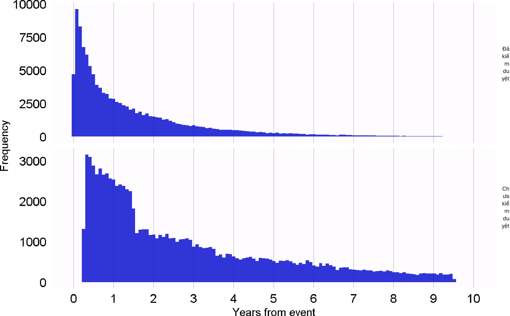
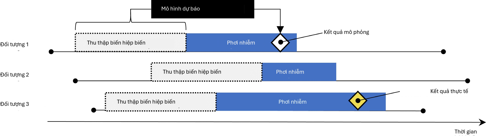
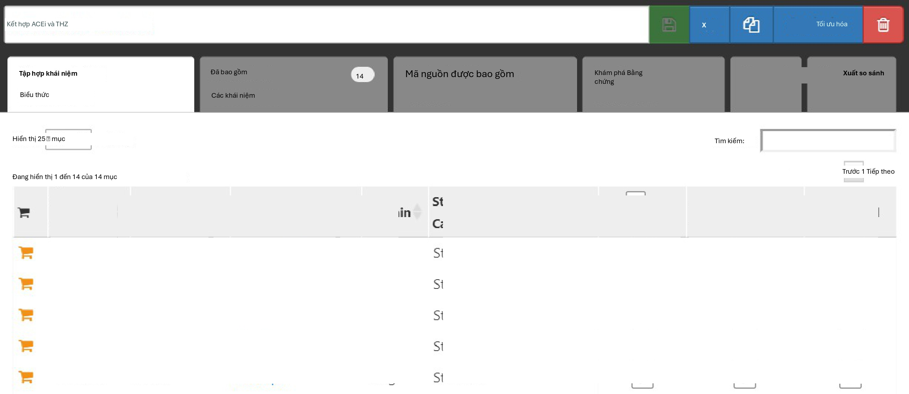
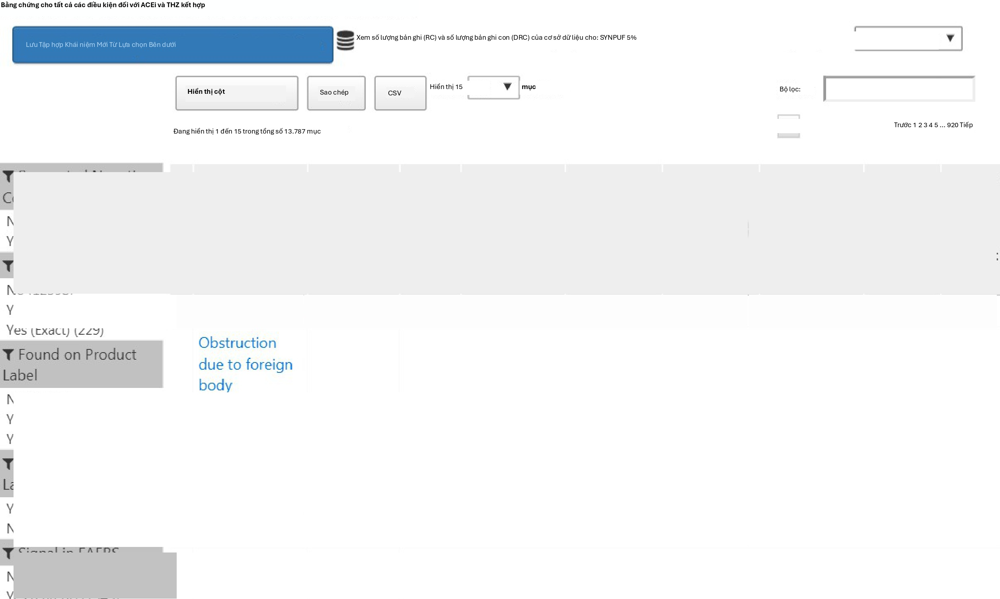
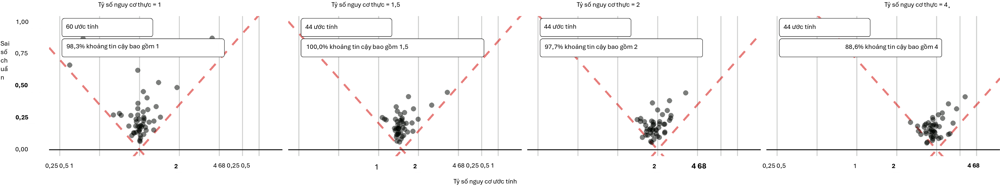
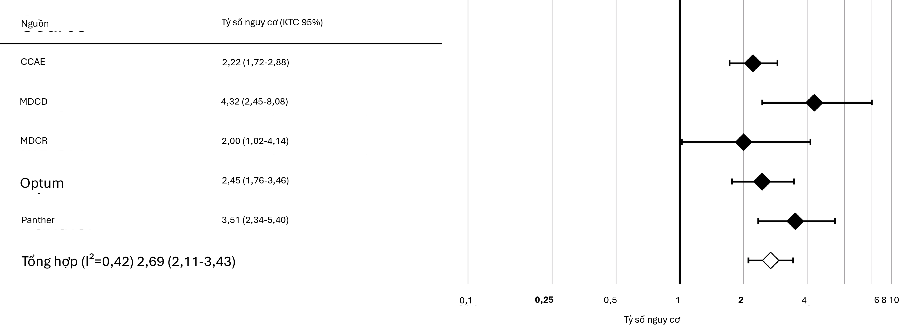
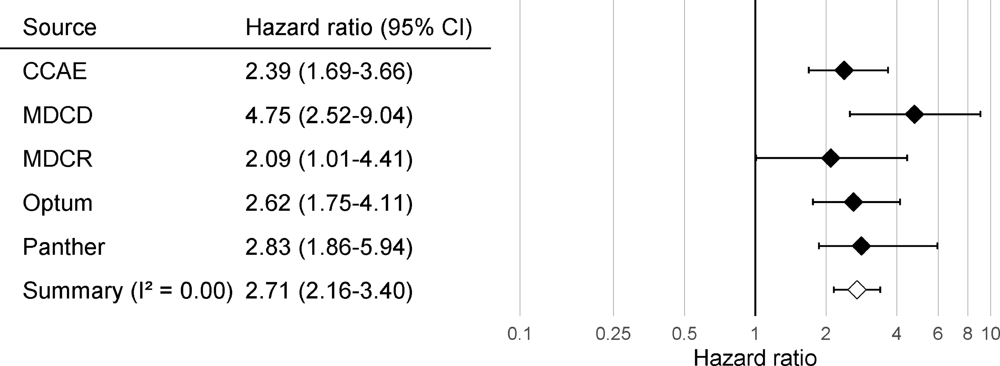
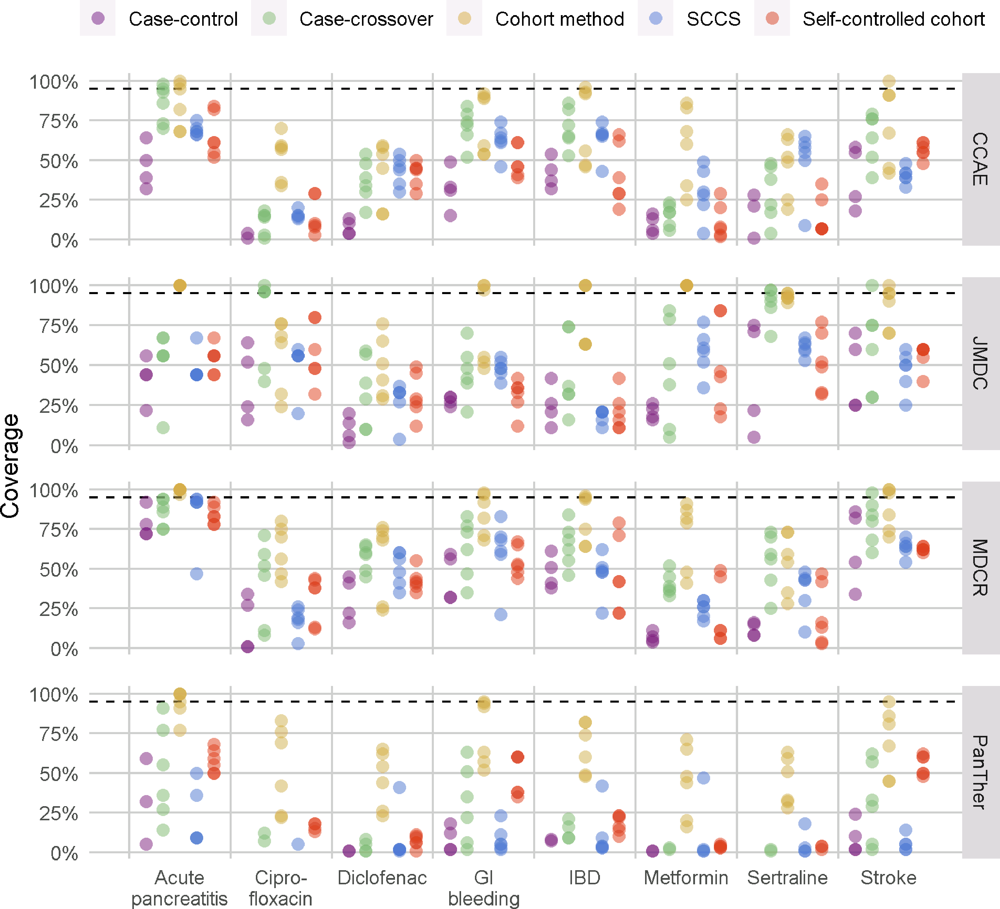

# Tính hợp lệ của phương pháp

*Người phụ trách chương: Martijn Schuemie*

Khi xem xét tính hợp lệ của phương pháp, chúng tôi nhằm mục đích trả
lời câu hỏi: Phương pháp này có hợp lệ để trả lời câu hỏi này không?

"Phương pháp" không chỉ bao gồm thiết kế nghiên cứu mà còn cả dữ liệu
và việc triển khai thiết kế đó. Do đó, tính hợp lệ của phương pháp là
một khái niệm bao quát; thường không thể quan sát được tính hợp lệ tốt
của phương pháp nếu không có chất lượng dữ liệu tốt, tính hợp lệ lâm
sàng và tính hợp lệ phần mềm. Những khía cạnh về chất lượng bằng chứng
đó nên được giải quyết riêng biệt trước khi chúng ta xem xét tính hợp
lệ của phương pháp.

Hoạt động cốt lõi khi thiết lập tính hợp lệ của phương pháp là đánh
giá xem các giả định quan trọng trong phân tích đã được đáp ứng hay
chưa. Ví dụ, chúng ta giả định rằng việc ghép cặp điểm xu hướng làm
cho hai quần thể có thể so sánh được, nhưng chúng ta cần đánh giá xem
điều này có đúng hay không. Nếu có thể, các kiểm thử thực nghiệm nên
được thực hiện để xác minh các giả định này. Ví dụ, chúng ta có thể
tạo các chẩn đoán để chỉ ra rằng hai quần thể của chúng ta thực sự có
thể so sánh được trên một loạt các đặc điểm sau khi ghép cặp. Trong
OHDSI, chúng tôi đã phát triển nhiều chẩn đoán chuẩn hóa cần được tạo
và đánh giá bất cứ khi nào thực hiện phân tích.

Trong chương này, chúng tôi sẽ tập trung vào tính hợp lệ của các
phương pháp được sử dụng trong ước tính cấp độ quần thể. Trước tiên,
chúng tôi sẽ nêu bật một số chẩn đoán cụ thể cho thiết kế nghiên cứu,
sau đó sẽ thảo luận về các chẩn đoán áp dụng cho hầu hết nếu không
muốn nói là tất cả các nghiên cứu ước tính cấp độ quần thể. Tiếp theo
là mô tả từng bước về cách thực hiện các chẩn đoán này bằng cách sử
dụng các công cụ OHDSI. Chúng tôi kết thúc chương này với một chủ đề
nâng cao, đánh giá Chuẩn mực Phương pháp OHDSI và ứng dụng của nó đối
với Thư viện Phương pháp OHDSI.

## Chẩn đoán cụ thể cho thiết kế

Đối với mỗi thiết kế nghiên cứu, có các chẩn đoán cụ thể cho thiết kế
đó. Nhiều chẩn đoán trong số này được triển khai và có sẵn trong các
gói R của Thư viện Phương pháp OHDSI.

[335](https://ohdsi.github.io/MethodsLibrary/)

Ví dụ, Mục 12.9 liệt kê một loạt các chẩn đoán được tạo bởi gói
CohortMethod, bao gồm:

- **Phân phối điểm xu hướng để đánh giá khả năng so sánh ban đầu của các
nhóm thuần tập.**

- **Mô hình xu hướng để xác định các biến tiềm năng cần được loại trừ
khỏi mô hình.**

- **Sự cân bằng hiệp biến để đánh giá liệu việc điều chỉnh điểm xu hướng
có làm cho các nhóm thuần tập có thể so sánh được hay không (được đo
lường thông qua các hiệp biến cơ bản).**

- **Sự tiêu hao (Attrition) để quan sát xem có bao nhiêu đối tượng bị
loại trừ trong các bước phân tích khác nhau, điều này có thể cung cấp
thông tin về khả năng khái quát hóa kết quả cho các nhóm thuần tập
quan tâm ban đầu.**

- **Công suất (Power) để đánh giá xem có đủ dữ liệu để trả lời câu hỏi
hay không.**

- **Đường cong Kaplan Meier để đánh giá thời gian khởi phát điển hình và
liệu giả định về tính tỷ lệ làm cơ sở cho các mô hình Cox có được đáp
ứng hay không.**

Các thiết kế nghiên cứu khác yêu cầu các chẩn đoán khác nhau để kiểm
tra các giả định khác nhau trong các thiết kế đó. Ví dụ, đối với thiết
kế chuỗi ca tự kiểm soát (SCCS), chúng ta có thể kiểm tra giả định cần
thiết rằng thời điểm kết thúc quan sát là độc lập với kết quả. Giả
định này thường bị vi phạm trong trường hợp các biến cố nghiêm trọng,
có khả năng gây tử vong như nhồi máu cơ tim. Chúng ta có thể đánh giá
xem giả định có đúng hay không bằng cách tạo biểu đồ hiển thị trong
Hình 18.1, hiển thị biểu đồ tần suất của thời gian đến thời điểm kết
thúc quan sát cho những người bị kiểm duyệt (censored) và những người
không bị kiểm duyệt. Trong dữ liệu của chúng tôi, chúng tôi coi những
người có thời gian quan sát kết thúc tại ngày kết thúc thu thập dữ
liệu (ngày mà quan sát dừng lại cho toàn bộ cơ sở dữ liệu, ví dụ: ngày
trích xuất hoặc ngày kết thúc nghiên cứu) là không bị kiểm duyệt, và
tất cả những người khác là bị kiểm duyệt. Trong Hình 18.1, chúng ta
chỉ thấy sự khác biệt nhỏ giữa hai phân phối, cho thấy giả định của
chúng tôi là đúng.

## Chẩn đoán cho tất cả các ước tính

Bên cạnh các chẩn đoán cụ thể cho thiết kế, còn có một số chẩn đoán áp
dụng cho tất cả các phương pháp ước tính hiệu ứng nhân quả. Nhiều chẩn
đoán trong số này dựa vào việc sử dụng các giả thuyết kiểm soát, các
câu hỏi nghiên cứu mà câu trả lời đã được biết trước. Sử dụng các giả
thuyết kiểm soát, chúng ta có thể đánh giá xem thiết kế của mình có
tạo ra kết quả phù hợp với sự thật hay không. Các kiểm soát có thể
được chia thành kiểm soát âm tính và kiểm soát dương tính.

### Kiểm soát âm tính

Kiểm soát âm tính là các cặp phơi nhiễm-kết quả mà người ta tin rằng
không có hiệu ứng nhân quả nào tồn tại, và nó bao gồm các kiểm soát âm
tính hoặc "điểm cuối làm sai lệch" (Prasad và Jena, 2013) đã được
khuyến nghị như một phương tiện để phát hiện nhiễu, (Lipsitch et al.,
2010) sai lệch lựa chọn và sai số đo lường. (Arnold et al., 2016) Ví
dụ, trong một nghiên cứu (Zaadstra et al., 2008) điều tra mối quan hệ
giữa các bệnh thời thơ ấu và bệnh đa xơ cứng (MS) sau này, các tác giả
đã bao gồm ba kiểm soát âm tính không được cho là gây ra MS: gãy tay,
chấn động và cắt amidan. Hai trong số ba kiểm soát này tạo ra các mối
liên quan có ý nghĩa thống kê với MS, cho thấy nghiên cứu có thể bị

{width="5.210832239720035in"
height="3.2297911198600175in"}

Hình 18.1: Thời gian đến thời điểm kết thúc quan sát cho những người
bị kiểm duyệt và những người không bị kiểm duyệt.

sai lệch.

Chúng ta nên chọn các kiểm soát âm tính có thể so sánh được với giả
thuyết quan tâm của chúng ta, nghĩa là chúng ta thường chọn các cặp
phơi nhiễm-kết quả có cùng phơi nhiễm với giả thuyết quan tâm (được
gọi là "kiểm soát kết quả") hoặc cùng kết quả ("kiểm soát phơi
nhiễm"). Các kiểm soát âm tính của chúng ta cũng nên đáp ứng các tiêu
chí sau:

- Phơi nhiễm không nên gây ra kết quả. Một cách để suy nghĩ về nguyên
nhân là suy nghĩ về phản thực tế: liệu kết quả có thể được gây ra
(hoặc ngăn ngừa) nếu một bệnh nhân không bị phơi nhiễm, so với việc
nếu bệnh nhân đó đã bị phơi nhiễm không? Đôi khi điều này rất rõ ràng,
ví dụ: ACEi được biết là gây ra phù mạch. Những lần khác, điều này ít
rõ ràng hơn nhiều. Ví dụ, một loại thuốc có thể gây tăng huyết áp do
đó có thể gián tiếp gây ra các bệnh tim mạch là hậu quả của tăng huyết
áp.

- Phơi nhiễm cũng không nên ngăn ngừa hoặc điều trị kết quả. Đây chỉ là
một mối quan hệ nhân quả khác cần phải vắng mặt nếu chúng ta tin rằng
kích thước hiệu ứng thực (ví dụ: tỷ số nguy cơ) là 1.

- Kiểm soát âm tính nên tồn tại trong dữ liệu, lý tưởng nhất là với số
lượng đủ lớn. Chúng tôi cố gắng đạt được điều này bằng cách ưu tiên
các ứng viên kiểm soát âm tính dựa trên tỷ lệ hiện mắc.

- Các kiểm soát âm tính lý tưởng nhất nên độc lập. Ví dụ, chúng ta nên
tránh có các kiểm soát âm tính là tổ tiên của nhau (ví dụ: "móng chọc
thịt" và "móng chọc thịt bàn chân") hoặc anh em (ví dụ: "gãy xương đùi
trái" và "gãy xương đùi phải").

- Các kiểm soát âm tính lý tưởng nhất nên có một số tiềm năng gây sai
lệch. Ví dụ, chữ số cuối cùng trong số an sinh xã hội của một người về
cơ bản là một số ngẫu nhiên, và

không có khả năng cho thấy sự gây nhiễu. Do đó, nó không nên được sử
dụng làm kiểm soát âm tính.

Một số người lập luận rằng các kiểm soát âm tính cũng nên có cấu trúc
gây nhiễu giống như cặp phơi nhiễm-kết quả quan tâm. (Lipsitch et al.,
2010) Tuy nhiên, chúng tôi tin rằng cấu trúc gây nhiễu này là không
thể biết được; các mối quan hệ giữa các biến được tìm thấy trong thực
tế thường phức tạp hơn nhiều so với những gì mọi người tưởng tượng.
Ngoài ra, ngay cả khi cấu trúc biến nhiễu đã được biết, thì cũng khó
có khả năng tồn tại một kiểm soát âm tính có cấu trúc biến nhiễu chính
xác như vậy nhưng lại thiếu hiệu ứng nhân quả trực tiếp. Vì lý do này,
trong OHDSI, chúng tôi dựa vào một số lượng lớn các kiểm soát âm tính,
giả định rằng một tập hợp như vậy đại diện cho nhiều loại sai lệch
khác nhau, bao gồm cả những loại sai lệch có trong giả thuyết quan
tâm.

Sự vắng mặt của mối quan hệ nhân quả giữa phơi nhiễm và kết quả hiếm
khi được ghi lại. Thay vào đó, chúng ta thường đưa ra giả định rằng
việc thiếu bằng chứng về một mối quan hệ ngụ ý sự thiếu hụt mối quan
hệ đó. Giả định này có nhiều khả năng đúng hơn nếu cả phơi nhiễm và
kết quả đều đã được nghiên cứu rộng rãi, vì vậy một mối quan hệ có thể
đã được phát hiện. Ví dụ, việc thiếu bằng chứng cho một loại thuốc
hoàn toàn mới có khả năng ngụ ý sự thiếu hiểu biết, không phải là sự
thiếu hụt mối quan hệ. Với nguyên tắc này, chúng tôi đã phát triển một
quy trình bán tự động để lựa chọn các kiểm soát âm tính. (Voss et al.,
2016) Tóm lại, thông tin từ tài liệu, nhãn sản phẩm và báo cáo tự
nguyện được tự động trích xuất và tổng hợp để tạo ra một danh sách ứng
viên kiểm soát âm tính. Danh sách này sau đó phải trải qua quá trình
đánh giá thủ công, không chỉ để xác minh rằng việc trích xuất tự động
là chính xác mà còn để áp đặt các tiêu chí bổ sung như tính hợp lý về
mặt sinh học.

### Kiểm soát dương tính

Để hiểu hành vi của một phương pháp khi rủi ro tương đối thực nhỏ hơn
hoặc lớn hơn một đòi hỏi phải sử dụng các kiểm soát dương tính nơi giả
thuyết không (null) được tin là không đúng. Thật không may, các kiểm
soát dương tính thực tế cho nghiên cứu quan sát có xu hướng gây rắc
rối vì ba lý do. Thứ nhất, trong hầu hết các bối cảnh nghiên cứu, ví
dụ khi so sánh hiệu quả của hai phương pháp điều trị, có sự khan hiếm
các kiểm soát dương tính liên quan đến bối cảnh cụ thể đó. Thứ hai,
ngay cả khi có các kiểm soát dương tính, kích thước hiệu ứng có thể
không được biết với độ chính xác cao và thường phụ thuộc vào quần thể
mà người ta đo lường nó. Thứ ba, khi các phương pháp điều trị được
biết rộng rãi là gây ra một kết quả cụ thể, điều này định hình hành vi
của các bác sĩ kê đơn thuốc, ví dụ bằng cách thực hiện các hành động
để giảm thiểu rủi ro của các kết quả không mong muốn, từ đó làm cho
các kiểm soát dương tính trở nên vô dụng như một phương tiện để đánh
giá. (Noren et al., 2014)

Trong OHDSI, do đó chúng tôi sử dụng các kiểm soát dương tính tổng
hợp, (Schuemie et al., 2018a) được tạo ra bằng cách sửa đổi một kiểm
soát âm tính thông qua việc tiêm thêm các trường hợp kết quả mô phỏng
trong thời gian có nguy cơ phơi nhiễm. Ví dụ, giả sử rằng, trong quá
trình phơi nhiễm với ACEi, n trường hợp kết quả kiểm soát âm tính của
chúng ta là "móng chọc thịt" đã được quan sát. Nếu bây giờ chúng ta
thêm n trường hợp mô phỏng bổ sung trong quá trình phơi nhiễm, chúng
ta đã tăng gấp đôi rủi ro. Vì đây là một kiểm soát âm tính, rủi ro
tương đối so với phản thực tế là một, nhưng sau khi tiêm, nó trở thành
hai.

Một vấn đề quan trọng là việc bảo tồn sự gây nhiễu. Các kiểm soát âm
tính có thể cho thấy sự gây nhiễu mạnh, nhưng nếu chúng ta tiêm thêm
các kết quả một cách ngẫu nhiên, những kết quả mới này

sẽ không bị gây nhiễu, và do đó chúng ta có thể lạc quan trong việc
đánh giá khả năng xử lý sự gây nhiễu đối với các kiểm soát dương tính.
Để bảo tồn sự gây nhiễu, chúng ta muốn các kết quả mới cho thấy các
mối liên quan tương tự với các hiệp biến cụ thể của đối tượng cơ bản
như các kết quả ban đầu. Để đạt được điều này, đối với mỗi kết quả,
chúng tôi huấn luyện một mô hình để dự đoán tỷ lệ sống sót đối với kết
quả trong quá trình phơi nhiễm bằng cách sử dụng các hiệp biến được
ghi lại trước khi phơi nhiễm. Các hiệp biến này bao gồm nhân khẩu học,
cũng như tất cả các chẩn đoán, phơi nhiễm thuốc, phép đo và thủ thuật
y tế đã được ghi lại. Một mô hình hồi quy Poisson được chuẩn hóa L1
(Suchard et al., 2013) sử dụng kiểm chứng chéo 10 lần để chọn siêu
tham số chuẩn hóa phù hợp với mô hình dự đoán. Sau đó, chúng tôi sử
dụng các tỷ lệ dự đoán để lấy mẫu các kết quả mô phỏng trong quá trình
phơi nhiễm để tăng kích thước hiệu ứng thực lên mức mong muốn. Do đó,
kiểm soát dương tính thu được chứa cả kết quả thực và kết quả mô
phỏng.

Hình 18.2 mô tả quy trình này. Lưu ý rằng mặc dù quy trình này mô
phỏng một số nguồn sai lệch quan trọng, nhưng nó không nắm bắt được
tất cả. Ví dụ, một số hiệu ứng của sai số đo lường không có mặt. Các
kiểm soát dương tính tổng hợp ngụ ý giá trị dự đoán dương tính và độ
nhạy không đổi, điều này có thể không đúng trong thực tế.

{width="4.835833333333333in"
height="1.3620833333333333in"}

Hình 18.2: Tổng hợp các kiểm soát dương tính từ các kiểm soát âm tính.

Mặc dù chúng tôi đề cập đến một "kích thước hiệu ứng" thực duy nhất
cho mỗi kiểm soát, các phương pháp khác nhau ước tính các thống kê
khác nhau về hiệu ứng điều trị. Đối với các kiểm soát âm tính, nơi
chúng tôi tin rằng không có hiệu ứng nhân quả nào tồn tại, tất cả các
thống kê như vậy, bao gồm rủi ro tương đối, tỷ số nguy cơ, tỷ số
chênh, tỷ số tỷ lệ hiện mắc, cả có điều kiện và biên, cũng như hiệu
ứng điều trị trung bình ở người được điều trị (ATT) và hiệu ứng điều
trị trung bình tổng thể (ATE) sẽ giống hệt 1. Quy trình của chúng tôi
để tạo ra các kiểm soát dương tính tổng hợp các kết quả với tỷ lệ tỷ
lệ hiện mắc không đổi theo thời gian và giữa các bệnh nhân, sử dụng
một mô hình có điều kiện trên bệnh nhân nơi tỷ lệ này được giữ không
đổi, cho đến điểm mà hiệu ứng biên đạt được. Do đó, kích thước hiệu
ứng thực được đảm bảo giữ nguyên là tỷ lệ tỷ lệ hiện mắc biên ở người
được điều trị. Theo giả định rằng mô hình kết quả của chúng tôi được
sử dụng trong quá trình tổng hợp là đúng, điều này cũng đúng đối với
kích thước hiệu ứng có điều kiện và ATE. Vì tất cả các kết quả đều
hiếm gặp, các tỷ số chênh gần như giống hệt với rủi ro tương đối.

### Đánh giá thực nghiệm

Dựa trên các ước tính của một phương pháp cụ thể cho các kiểm soát âm
tính và dương tính, chúng ta có thể hiểu các đặc tính vận hành bằng
cách tính toán một loạt các số liệu, ví dụ:

- **Diện tích dưới đường cong đặc tính vận hành của thiết bị (AUC): khả
năng phân biệt giữa các kiểm soát dương tính và âm tính.**

- **Độ bao phủ (Coverage): tần suất kích thước hiệu ứng thực nằm trong
khoảng tin cậy 95%.**

- **Độ chính xác trung bình&#58; độ chính xác được tính bằng 1/(𝑠𝑡𝑎𝑛𝑑𝑎𝜏𝑑
𝑒𝜏𝜏𝑜𝜏)2, độ chính xác cao hơn nghĩa là các khoảng tin cậy hẹp hơn.
Chúng tôi sử dụng trung bình nhân để tính đến phân phối lệch của độ
chính xác.**

- **Sai số bình phương trung bình (MSE): Sai số bình phương trung bình
giữa log của kích thước hiệu ứng**

ước tính điểm và log của kích thước hiệu ứng thực.

- **Sai lầm loại 1&#58; Đối với các kiểm soát âm tính, tần suất giả thuyết
không bị bác bỏ (tại 𝛼 = 0,05). Điều này tương đương với tỷ lệ dương
tính giả và 1 − 𝑠𝑝𝑒𝑐𝑖𝑓𝑖𝑐𝑖𝑡𝑦.**

- **Sai lầm loại 2&#58; Đối với các kiểm soát dương tính, tần suất giả
thuyết không bị bác bỏ (tại 𝛼 = 0,05). Điều này tương đương với tỷ lệ
âm tính giả và 1 − 𝑠𝑒𝑛𝑠𝑖𝑡𝑖𝑣𝑖𝑡𝑦.**

- **Không thể ước tính&#58; Đối với bao nhiêu kiểm soát mà phương pháp không
thể tạo ra ước tính? Có thể có nhiều lý do khiến một ước tính không
thể được tạo ra, ví dụ vì không còn đối tượng nào sau khi ghép cặp
điểm xu hướng, hoặc vì không còn đối tượng nào mắc kết quả.**

Tùy thuộc vào trường hợp sử dụng của chúng ta, chúng ta có thể đánh
giá xem các đặc tính vận hành này có phù hợp với mục tiêu của chúng ta
hay không. Ví dụ, nếu chúng ta muốn thực hiện phát hiện tín hiệu,
chúng ta có thể quan tâm đến sai lầm loại 1 và loại 2, hoặc nếu chúng
ta sẵn sàng sửa đổi ngưỡng 𝛼 của mình, chúng ta có thể kiểm tra AUC
thay thế.

### Hiệu chỉnh giá trị P

Thông thường, sai lầm loại 1 (tại 𝛼 = 0,05) lớn hơn 5%. Nói cách khác,
chúng ta thường có khả năng bác bỏ giả thuyết không cao hơn 5% khi
trên thực tế giả thuyết không là đúng. Lý do là giá trị p chỉ phản ánh
sai số ngẫu nhiên, sai số do có kích thước mẫu hạn chế. Nó không phản
ánh sai số hệ thống, ví dụ sai số do gây nhiễu. OHDSI đã phát triển
một quy trình để hiệu chỉnh giá trị p nhằm khôi phục sai lầm loại 1 về
mức danh nghĩa. (Schuemie et al., 2014) Chúng tôi rút ra một phân phối
null thực nghiệm từ các ước tính hiệu ứng thực tế cho các kiểm soát âm
tính. Các ước tính kiểm soát âm tính này cho chúng tôi biết những gì
có thể mong đợi khi giả thuyết không là đúng, và chúng tôi sử dụng
chúng để ước tính một phân phối null thực nghiệm.

Về mặt hình thức, chúng tôi khớp một phân phối xác suất Gaussian với
các ước tính, có tính đến

sai số lấy mẫu của mỗi ước tính. Gọi 𝜃̂𝑖 ký hiệu ước tính hiệu ứng log
ước tính (tỷ số rủi ro tương đối, chênh hoặc tỷ lệ hiện mắc) từ cặp
thuốc-kết quả kiểm soát âm tính thứ 𝑖, và gọi 𝜏̂𝑖 ký hiệu sai số chuẩn
ước tính tương ứng, 𝑖 = 1, ... , 𝑛. Gọi 𝜃𝑖 ký hiệu kích thước hiệu ứng
log thực (giả định bằng 0 cho các kiểm soát âm tính), và gọi 𝛽𝑖 ký
hiệu sai lệch thực (nhưng chưa biết) liên quan đến cặp 𝑖, đó là sự
khác biệt giữa log của kích thước hiệu ứng thực và log của ước tính mà
nghiên cứu sẽ trả về cho kiểm soát 𝑖

nếu nó vô cùng lớn. Như trong tính toán giá trị p tiêu chuẩn, chúng
tôi giả định rằng 𝜃̂𝑖 được phân phối bình thường với trung bình 𝜃𝑖 + 𝛽𝑖
và độ lệch chuẩn 𝜏̂𝑖2. Lưu ý rằng trong tính toán giá trị p truyền
thống, 𝛽𝑖 luôn được giả định bằng 0, nhưng chúng tôi giả định rằng 𝛽𝑖
phát sinh từ một phân phối bình thường với trung bình 𝜇 và phương sai
𝜎2. Điều này đại diện cho phân phối null (sai lệch). Chúng tôi ước
tính 𝜇 và 𝜎2 thông qua khả năng tối đa (maximum likelihood). Tóm lại,

chúng tôi giả định những điều sau:

𝛽𝑖 ∼ 𝑁(𝜇, 𝜎2) và 𝜃̂𝑖 ∼ 𝑁(𝜃𝑖 + 𝛽𝑖, 𝜏𝑖2)

trong đó 𝑁2(𝑎, 𝑏) ký hiệu một phân phối Gaussian với trung bình 𝑎 và
phương sai 𝑏, và ước tính

𝜇 và 𝜎 bằng cách tối đa hóa khả năng sau:

𝑖=1

𝐿(𝜇, 𝜎\|𝜃, 𝜏) 𝖺 ∏^𝑛^ ∫ 𝑝(𝜃̂~𝑖~\|𝛽~𝑖~, 𝜃~𝑖~, 𝜏̂~𝑖~)𝑝(𝛽~𝑖~\|𝜇, 𝜎)d𝛽~𝑖~

mang lại các ước tính khả năng tối đa 𝜇̂ và 𝜎̂. Chúng tôi tính toán một
giá trị p đã hiệu chỉnh

sử dụng phân phối null thực nghiệm. Gọi 𝜃̂𝑛+1 ký hiệu log của ước tính
hiệu ứng từ một cặp thuốc-kết quả mới, và gọi 𝜏̂𝑛+1 ký hiệu sai số
chuẩn ước tính tương ứng. Từ các giả định nêu trên và giả định 𝛽𝑛+1
phát sinh từ cùng một phân phối null, chúng ta có những điều sau:

𝜃̂~𝑛+1~ ∼ 𝑁(𝜇̂, 𝜎̂ + 𝜏̂~𝑛+1~)

Khi 𝜃̂𝑛+1 nhỏ hơn 𝜇̂, giá trị p đã hiệu chỉnh một phía cho cặp mới sau
đó là

𝜙 𝗅⎜ 𝜃~𝑛+1~ − 𝜇̂ ⎞⎟

⎝√𝜎̂2 + 𝜏̂~𝑛~2+1 𝖨

trong đó 𝜙(⋅) ký hiệu hàm phân phối tích lũy của phân phối chuẩn tiêu
chuẩn. Khi 𝜃̂𝑛+1 lớn hơn 𝜇̂, giá trị p đã hiệu chỉnh một phía sau đó là

1 − 𝜙 𝗅⎜ 𝜃~𝑛+1~ − 𝜇̂ ⎞⎟

⎝√𝜎̂2 + 𝜏̂~𝑛~2+1 𝖨

### Hiệu chỉnh khoảng tin cậy

Tương tự, chúng tôi thường quan sát thấy rằng độ bao phủ của khoảng
tin cậy 95% nhỏ hơn 95%: kích thước hiệu ứng thực nằm trong khoảng tin
cậy 95% ít hơn 95% thời gian. Đối với hiệu chỉnh khoảng tin cậy
(Schuemie et al., 2018a), chúng tôi mở rộng khung cho hiệu chỉnh giá
trị p bằng cách sử dụng thêm các kiểm soát dương tính của chúng tôi.
Thông thường, nhưng không nhất thiết, khoảng tin cậy đã hiệu chỉnh
rộng hơn khoảng tin cậy danh nghĩa, phản ánh các vấn đề chưa được tính
đến trong quy trình tiêu chuẩn (chẳng hạn như gây nhiễu chưa đo lường,
sai lệch lựa chọn và sai số đo lường) nhưng đã được tính đến trong quá
trình hiệu chỉnh.

Về mặt hình thức, chúng tôi giả định rằng 𝛽𝑖, sai lệch liên quan đến
cặp 𝑖, một lần nữa đến từ một phân phối Gaussian, nhưng lần này sử
dụng trung bình và độ lệch chuẩn có liên quan tuyến tính với 𝜃𝑖, kích
thước hiệu ứng thực:

trong đó

𝛽~𝑖~ ∼ 𝑁(𝜇(𝜃~𝑖~), 𝜎2(𝜃~𝑖~))

𝜇(𝜃𝑖) = 𝑎 + 𝑏 × 𝜃𝑖 và 𝜎(𝜃𝑖)2 = 𝑐 + 𝑑× ∣ 𝜃𝑖 ∣

Chúng tôi ước tính 𝑎, 𝑏, 𝑐 và 𝑑 bằng cách tối đa hóa khả năng biên
(marginalized likelihood) trong đó chúng tôi tích phân 𝛽𝑖 chưa quan
sát được:

𝑖=1

𝑙(𝑎, 𝑏, 𝑐, 𝑑\|𝜃, 𝜃̂, 𝜏̂) 𝖺 ∏^𝑛^ ∫ 𝑝(𝜃̂~𝑖~\|𝛽~𝑖~, 𝜃~𝑖~, 𝜏̂~𝑖~)𝑝(𝛽~𝑖~\|𝑎, 𝑏,
𝑐, 𝑑, 𝜃~𝑖~)d𝛽~𝑖~,

mang lại các ước tính khả năng tối đa (𝑎̂, 𝑏̂, 𝑐̂, 𝑑̂).

Chúng tôi tính toán một CI đã hiệu chỉnh sử dụng mô hình sai số hệ
thống. Gọi 𝜃̂𝑛+1 một lần nữa ký hiệu log của ước tính hiệu ứng cho một
kết quả mới quan tâm, và gọi 𝜏̂𝑛+1 ký hiệu sai số chuẩn ước tính tương
ứng. Từ các giả định trên, và giả định 𝛽𝑛+1 phát sinh từ cùng một mô
hình sai số hệ thống, chúng ta có:

𝜃̂~𝑛+1~ ∼ 𝑁(𝜃~𝑛+1~ + 𝑎̂ + 𝑏̂ × 𝜃~𝑛+1~, 𝑐̂ + 𝑑̂× ∣ 𝜃~𝑛+1~ ∣ +𝜏̂~𝑛~2+1).

Chúng tôi tìm giới hạn dưới của CI 95% đã hiệu chỉnh bằng cách giải
phương trình này cho 𝜃𝑛+1:

Φ ⎜ ⎟ = 0.025,

𝗅 𝜃~𝑛+1~ + 𝑎̂ + 𝑏̂ × 𝜃~𝑛+1~ − 𝜃̂~𝑛+1~ ⎞

⎝ √(𝑐̂ + 𝑑̂× ∣ 𝜃~𝑛+1~ ∣) + 𝜏̂~𝑛~2+1 𝖨

trong đó Φ(⋅) ký hiệu hàm phân phối tích lũy của phân phối chuẩn tiêu
chuẩn. Chúng tôi tìm giới hạn trên tương tự cho xác suất 0,975. Chúng
tôi xác định ước tính điểm đã hiệu chỉnh bằng cách sử dụng xác suất
0,5.

Cả hiệu chỉnh giá trị p và hiệu chỉnh khoảng tin cậy đều được triển
khai trong gói EmpiricalCalibration.

### Sao chép trên các địa điểm

Một hình thức xác thực phương pháp khác đến từ việc thực thi nghiên
cứu trên một số cơ sở dữ liệu khác nhau đại diện cho các quần thể khác
nhau, các hệ thống chăm sóc sức khỏe khác nhau và/hoặc các quy trình
thu thập dữ liệu khác nhau. Nghiên cứu trước đây đã chỉ ra rằng việc
thực thi cùng một thiết kế

nghiên cứu trên các cơ sở dữ liệu khác nhau có thể tạo ra các ước tính
kích thước hiệu ứng khác nhau rất nhiều, (Madigan et al., 2013b) cho
thấy rằng hoặc hiệu ứng khác biệt rất lớn đối với các quần thể khác
nhau, hoặc thiết kế không giải quyết thỏa đáng các sai lệch khác nhau
được tìm thấy trong các cơ sở dữ liệu khác nhau. Trên thực tế, chúng
tôi quan sát thấy rằng việc tính đến sai lệch còn lại trong một cơ sở
dữ liệu thông qua hiệu chỉnh thực nghiệm các khoảng tin cậy có thể làm
giảm đáng kể sự không đồng nhất giữa các nghiên cứu. (Schuemie et al.,
2018a)

Một cách để biểu thị sự không đồng nhất giữa các cơ sở dữ liệu là điểm
𝐼2, mô tả tỷ lệ phần trăm của tổng biến thiên giữa các nghiên cứu do
sự không đồng nhất thay vì do ngẫu nhiên. (Higgins et al., 2003) Việc
phân loại ngây thơ các giá trị cho 𝐼2 sẽ không phù hợp trong mọi hoàn
cảnh, mặc dù người ta có thể tạm thời gán các tính từ thấp, trung bình
và cao cho các giá trị 𝐼2 lần lượt là 25%, 50% và 75%. Trong một
nghiên cứu ước tính hiệu ứng cho nhiều phương pháp điều trị trầm cảm
bằng cách sử dụng thiết kế nhóm thuần tập người dùng mới với điều
chỉnh điểm xu hướng quy mô lớn, (Schuemie et al., 2018b) chỉ quan sát
thấy 58% các ước tính có 𝐼2 dưới 25%. Sau khi hiệu chỉnh thực nghiệm,
con số này tăng lên 83%.

{width="0.45499890638670165in"
height="0.45499890638670165in"}

### Phân tích độ nhạy

Khi thiết kế một nghiên cứu, thường có các lựa chọn thiết kế không
chắc chắn. Ví dụ, nên sử dụng ghép cặp điểm xu hướng hay phân tầng?
Nếu sử dụng phân tầng, bao nhiêu tầng? Thời gian có nguy cơ thích hợp
là bao nhiêu? Khi đối mặt với sự không chắc chắn như vậy, một giải
pháp là đánh giá các lựa chọn khác nhau và quan sát độ nhạy của kết
quả đối với lựa chọn thiết kế. Nếu ước tính vẫn giữ nguyên dưới nhiều
lựa chọn khác nhau, chúng ta có thể nói rằng nghiên cứu là mạnh mẽ đối
với sự không chắc chắn.

Định nghĩa về phân tích độ nhạy này không nên bị nhầm lẫn với các định
nghĩa được những người khác sử dụng như Rosenbaum (2005), người định
nghĩa phân tích độ nhạy là "đánh giá cách các kết luận của một nghiên
cứu có thể bị thay đổi bởi các sai lệch ẩn của các mức độ khác
nhau."

## Xác thực phương pháp trong thực tế

Ở đây chúng tôi xây dựng dựa trên ví dụ trong Chương 12, nơi chúng tôi
điều tra hiệu ứng của thuốc ức chế ACE (ACEi) đối với nguy cơ phù mạch
và nhồi máu cơ tim cấp tính (AMI), so với thuốc lợi tiểu thiazide và
tương tự thiazide (THZ). Trong chương đó, chúng tôi đã khám phá nhiều
chẩn đoán cụ thể cho thiết kế mà chúng tôi đã sử dụng, phương pháp
nhóm thuần tập. Ở đây, chúng tôi áp dụng các chẩn đoán bổ sung cũng có
thể đã được áp dụng nếu các thiết kế khác được sử dụng. Nếu nghiên cứu
được triển khai bằng cách sử dụng ATLAS như được mô tả trong Mục 12.7,
các chẩn đoán này có sẵn trong ứng dụng Shiny được bao gồm trong gói R
nghiên cứu do ATLAS tạo ra. Nếu nghiên cứu được triển khai bằng cách
sử dụng R thay thế, như được mô tả trong Mục 12.8, thì các hàm R

có sẵn trong các gói khác nhau nên được sử dụng, như được mô tả trong
các phần tiếp theo.

### Lựa chọn kiểm soát âm tính

Chúng ta phải chọn các kiểm soát âm tính, các cặp phơi nhiễm-kết quả
mà không có hiệu ứng nhân quả nào được tin là tồn tại. Đối với ước
tính hiệu ứng so sánh như nghiên cứu ví dụ của chúng tôi, chúng tôi
chọn các kết quả kiểm soát âm tính được tin là không bị gây ra bởi
phơi nhiễm mục tiêu cũng như phơi nhiễm so sánh. Chúng tôi muốn đủ các
kiểm soát âm tính để đảm bảo rằng chúng tôi có một sự kết hợp đa dạng
các sai lệch được thể hiện trong các kiểm soát, và cũng để cho phép
hiệu chỉnh thực nghiệm. Theo quy tắc ngón tay cái, chúng tôi thường
nhắm tới việc có 50-100 kiểm soát âm tính như vậy. Chúng ta có thể đưa
ra các kiểm soát này hoàn toàn thủ công, nhưng may mắn thay, ATLAS
cung cấp các tính năng để hỗ trợ việc lựa chọn các kiểm soát âm tính
bằng cách sử dụng dữ liệu từ tài liệu, nhãn sản phẩm và các báo cáo tự
nguyện.

Để tạo một danh sách ứng viên kiểm soát âm tính, trước tiên chúng ta
phải tạo một tập hợp khái niệm chứa tất cả các phơi nhiễm quan tâm.
Trong trường hợp này, chúng tôi chọn tất cả các thành phần trong các
lớp ACEi và THZ, như được hiển thị trong Hình 18.3.

{width="5.36375in"
height="2.3275in"}

Hình 18.3: Một tập hợp khái niệm chứa các khái niệm xác định các phơi
nhiễm mục tiêu và so sánh.

Tiếp theo, chúng ta đi tới tab "Explore Evidence" (Khám phá bằng
chứng) và nhấp vào nút . Việc tạo tổng quan bằng chứng sẽ mất vài
phút, sau đó bạn có thể nhấp vào nút . Thao tác này sẽ mở danh sách
các kết quả như được hiển thị trong Hình
18.4.{width="0.7813943569553806in"
height="0.1979527559055118in"}{width="1.0522615923009624in"
height="0.21878608923884516in"}

Danh sách này hiển thị các khái niệm tình trạng, cùng với tổng quan về
bằng chứng liên kết tình trạng đó với bất kỳ phơi nhiễm nào chúng ta
đã xác định. Ví dụ, chúng ta thấy số lượng ấn phẩm liên kết các phơi
nhiễm với các kết quả được tìm thấy trong PubMed bằng cách sử dụng
nhiều chiến lược khác nhau, số lượng nhãn sản phẩm của các phơi nhiễm
quan tâm của chúng ta liệt kê tình trạng đó là một tác dụng phụ có thể
xảy ra và số lượng báo cáo tự nguyện. Theo mặc định, danh sách được
sắp xếp để hiển thị các ứng viên kiểm soát âm tính trước. Sau đó, nó
được sắp xếp theo "Sort Order" (Thứ tự sắp xếp), đại diện cho tỷ lệ
hiện mắc của tình trạng trong một tập hợp các cơ sở dữ liệu quan sát.
Càng cao

{width="5.2762489063867015in"
height="3.1631244531933507in"}

Hình 18.4: Các kết quả kiểm soát ứng viên với tổng quan về bằng chứng
được tìm thấy trong tài liệu, nhãn sản phẩm và báo cáo tự nguyện.

Thứ tự sắp xếp, tỷ lệ hiện mắc càng cao. Mặc dù tỷ lệ hiện mắc trong
các cơ sở dữ liệu này có thể không tương ứng với tỷ lệ hiện mắc trong
cơ sở dữ liệu mà chúng ta muốn chạy nghiên cứu, nhưng nó có khả năng
là một sự xấp xỉ tốt.

Bước tiếp theo là đánh giá thủ công danh sách ứng viên, thường bắt đầu
từ trên cùng, tức là với tình trạng phổ biến nhất, và làm việc xuống
dưới cho đến khi chúng ta hài lòng rằng mình đã có đủ. Một cách điển
hình để thực hiện việc này là xuất danh sách sang tệp CSV (giá trị
phân tách bằng dấu phẩy) và để các bác sĩ lâm sàng đánh giá chúng, xem
xét các tiêu chí được đề cập trong Mục 18.2.1.

Đối với nghiên cứu ví dụ của chúng tôi, chúng tôi chọn 76 kiểm soát âm
tính được liệt kê trong Phụ lục C.1.

### Bao gồm các kiểm soát

Khi chúng ta đã xác định tập hợp các kiểm soát âm tính của mình, chúng
ta phải bao gồm chúng trong nghiên cứu của mình. Trước tiên, chúng ta
phải xác định một số logic để biến các khái niệm tình trạng kiểm soát
âm tính của chúng ta thành các nhóm thuần tập kết quả. Mục 12.7.3 thảo
luận về cách ATLAS cho phép tạo các nhóm thuần tập như vậy dựa trên
một vài lựa chọn mà người dùng phải thực hiện. Thông thường, chúng ta
chỉ đơn giản chọn tạo một nhóm thuần tập dựa trên bất kỳ lần xuất hiện
nào của một khái niệm kiểm soát âm tính hoặc bất kỳ hậu duệ nào của
nó. Nếu nghiên cứu được triển khai trong R, thì SQL (Ngôn ngữ truy vấn
cấu trúc) có thể được sử dụng để xây dựng các nhóm thuần tập kiểm soát
âm tính. Chương 9 mô tả cách các nhóm thuần tập có thể được tạo bằng
SQL và

R. Chúng tôi để lại cho độc giả bài tập viết SQL và R phù hợp.

Các công cụ OHDSI cũng cung cấp chức năng tự động tạo và bao gồm các
kiểm soát dương tính có nguồn gốc từ các kiểm soát âm tính. Chức năng
này có thể được tìm thấy trong phần Evaluation Settings (Cài đặt đánh
giá) trong ATLAS được mô tả trong Mục 12.7.3, và nó được thực-

hiện trong hàm synthesizePositiveControls trong gói MethodEvaluation.
Ở đây, chúng tôi tạo ba kiểm soát dương tính cho mỗi kiểm soát âm
tính, với kích thước hiệu ứng thực là 1,5, 2 và 4, sử dụng mô hình
sống sót:

**thư viện (Phương thức đánh giá)**

*\# Tạo một khung dữ liệu với tất cả các cặp phơi nhiễm-*

*\# kết quả kiểm soát âm tính, chỉ sử dụng phơi nhiễm mục tiêu (ACEi =
1).*

eoPairs \<- **data.frame**(exposureId = 1,

outcomeId = ncs)

chiếc \<- tổng hợpPositiveControls( ConnectionDetails =
ConnectionDetails, cdmDatabaseSchema = cdmDbSchema,
ExposureDatabaseSchema = thuần tậpDbSchema, ExposureTable = thuần
tậpBảng, resultDatabaseSchema = thuần tậpDbSchema, kết quảTable =
thuần tậpBảng, đầu raDatabaseSchema = thuần tậpDbSchema, đầu raBảng =
thuần tậpBảng, createOutputTable = FALSE,

modelType = \"survival\", firstExposureOnly = TRUE, firstOutcomeOnly =
TRUE, removePeopleWithPriorOutcomes = TRUE, washoutPeriod = 365,

rủi roWindowStart = 1,

riskWindowEnd = 0, endAnchor = \"kết thúc đoàn hệ\",

exposureOutcomePairs = eoPairs, effectSizes = **c**(1.5, 2, 4),
cdmVersion = cdmVersion,

WorkFolder = file.path(outputFolder, \"pcSynt tổng hợp\"))

Lưu ý rằng chúng ta phải bắt chước các cài đặt thời gian có nguy cơ
được sử dụng trong thiết kế nghiên cứu ước tính của mình. Hàm
synthesizePositiveControls sẽ trích xuất thông tin về các phơi nhiễm
và các kết quả kiểm soát âm tính, khớp các mô hình kết quả cho mỗi cặp
phơi nhiễm-kết quả và tổng hợp các kết quả. Các nhóm thuần tập kết quả
kiểm soát dương tính sẽ được thêm vào bảng nhóm thuần tập được chỉ
định bởi cohortDbSchema và cohortTable. Khung dữ liệu pcs thu được
chứa thông tin về các kiểm soát dương tính đã tổng hợp.

Tiếp theo, chúng ta phải thực thi cùng một nghiên cứu được sử dụng để
ước tính hiệu ứng quan tâm để cũng ước tính các hiệu ứng cho các kiểm
soát âm tính và dương tính. Việc thiết lập tập hợp các kiểm soát âm
tính trong hộp thoại so sánh trong ATLAS hướng dẫn ATLAS tính toán các
ước tính cho các kiểm soát này. Tương tự, việc chỉ định rằng các kiểm
soát dương tính được tạo trong Evaluation Settings sẽ bao gồm chúng
trong phân tích của chúng ta. Trong R, các kiểm soát âm tính và dương
tính nên được xử lý như bất kỳ kết quả nào khác. Tất cả các gói ước
tính trong Thư viện Phương pháp OHDSI đều cho phép ước tính nhiều hiệu
ứng một cách hiệu quả.

### Hiệu suất thực nghiệm

Hình 18.5 hiển thị các kích thước hiệu ứng ước tính cho các kiểm soát
âm tính và dương tính được bao gồm trong nghiên cứu ví dụ của chúng
tôi, phân tầng theo kích thước hiệu ứng thực. Biểu đồ này được bao gồm
trong ứng dụng Shiny đi kèm với gói R nghiên cứu do ATLAS tạo ra và có
thể được tạo bằng hàm plotControls trong gói MethodEvaluation. Lưu ý
rằng số lượng kiểm soát thường thấp hơn những gì đã được xác định vì
không có đủ dữ liệu để tạo ước tính hoặc để tổng hợp một kiểm soát
dương tính.

{width="5.042811679790026in"
height="0.9506244531933509in"}

Hình 18.5: Các ước tính cho các kiểm soát âm tính (tỷ số nguy cơ thực
= 1) và dương tính (tỷ số nguy cơ thực \> 1). Mỗi dấu chấm đại diện
cho một kiểm soát. Các ước tính dưới đường nét đứt có khoảng tin cậy
không bao gồm kích thước hiệu ứng thực.

Dựa trên các ước tính này, chúng ta có thể tính toán các số liệu được
hiển thị trong Bảng 18.1 bằng cách sử dụng

hàm tính toánMetrics trong gói MethodEvaluation.

Bảng 18.1: Các số liệu hiệu suất phương pháp được rút ra từ các ước
tính kiểm soát âm tính và dương tính.

+----------+---------+
| Số liệu  | Giá trị |
+==========+:=======:+
| AUC      | > 0.96  |
+----------+---------+
| Độ bao   | > 0.97  |
| phủ      |         |
+----------+---------+
| Độ chính | > 19.33 |
| xác      |         |
| trung    |         |
| bình     |         |
+----------+---------+
| MSE      | > 2.08  |
+----------+---------+
| Sai lầm  | > 0.00  |
| loại 1   |         |
+----------+---------+
| Sai lầm  | > 0.18  |
| loại 2   |         |
+----------+---------+
| Không    | > 0.08  |
| thể ước  |         |
| tính     |         |
+----------+---------+

Chúng ta thấy rằng độ bao phủ và sai lầm loại 1 rất gần với các giá
trị danh nghĩa lần lượt là 95% và 5%, và AUC rất cao. Điều này chắc
chắn không phải lúc nào cũng như vậy.

Lưu ý rằng mặc dù trong Hình 18.5 không phải tất cả các khoảng tin cậy
đều bao gồm một khi tỷ số nguy cơ thực là một, sai lầm loại 1 trong
Bảng 18.1 là 0%. Đây là một tình huống đặc biệt, do thực tế là các
khoảng tin cậy trong gói Cyclops được ước tính bằng cách lập hồ sơ khả
năng, chính xác hơn các phương pháp truyền thống nhưng có thể dẫn đến
các khoảng tin cậy không đối xứng. Thay vào đó, giá trị p được tính
toán giả định các khoảng tin cậy đối xứng, và đây là những gì được sử
dụng để tính sai lầm loại 1.

### Hiệu chỉnh giá trị P

Chúng ta có thể sử dụng các ước tính cho các kiểm soát âm tính của
mình để hiệu chỉnh các giá trị p. Điều này được thực hiện tự động
trong ứng dụng Shiny và có thể được thực hiện thủ công trong R. Giả sử
chúng ta đã tạo đối tượng tóm tắt summ như được mô tả trong Mục
12.8.6, chúng ta có thể vẽ biểu đồ hiệu ứng hiệu chỉnh thực nghiệm:

*\# Estimates for negative controls (ncs) and outcomes of interest
(ois):*

ncEstimates \<- summ\[summ**\$**outcomeId **%in%** ncs, \] oiEstimates
\<- summ\[summ**\$**outcomeId **%in%** ois, \]

**library**(EmpiricalCalibration)
**plotCalibrationEffect**(logRrNegatives = ncEstimates**\$**logRr,

{width="3.653124453193351in"
height="2.7015616797900264in"}

Hình 18.6: Hiệu chỉnh giá trị p: các ước tính dưới đường nét đứt có
giá trị p thông thường

\< 0,05. Các ước tính trong vùng bóng mờ có giá trị p đã hiệu chỉnh \<
0,05. Dải hẹp xung quanh mép của vùng bóng mờ biểu thị khoảng tin cậy
95%. Các dấu chấm chỉ ra các kiểm soát âm tính. Các viên kim cương chỉ
ra các kết quả quan tâm.

Trong Hình 18.6, chúng ta thấy rằng vùng bóng mờ gần như trùng khớp
chính xác với vùng được biểu thị bởi các đường nét đứt, cho thấy hầu
như không quan sát thấy sai lệch nào cho các kiểm soát âm tính. Một
trong những kết quả quan tâm (AMI) nằm trên đường nét đứt và vùng bóng
mờ, cho thấy chúng ta không thể bác bỏ giả thuyết không theo cả giá
trị p đã hiệu chỉnh và chưa hiệu chỉnh. Kết quả còn lại (phù mạch) nổi
bật rõ ràng so với kiểm soát âm tính và nằm gọn trong vùng mà cả giá
trị p đã hiệu chỉnh và chưa hiệu chỉnh đều nhỏ hơn 0,05.

Chúng ta có thể tính toán các giá trị p đã hiệu chỉnh:

null \<- **fitNull**(logRr = ncEstimates**\$**logRr,

seLogRr = ncEstimates**\$**seLogRr)

**calibrateP**(null,

logRr= oiEstimates**\$**logRr, seLogRr = oiEstimates**\$**seLogRr)

\## \[1\] 1.604351e-06 7.159506e-01

Và đối chiếu các giá trị này với các giá trị p chưa hiệu chỉnh:

oiEstimates**\$**p

\## \[1\] \[1\] 1.483652e-06 7.052822e-01

Như mong đợi, vì hầu như không có hoặc không có sai lệch nào được quan
sát thấy, các giá trị p chưa hiệu chỉnh và đã hiệu chỉnh rất giống
nhau.

### Hiệu chỉnh khoảng tin cậy

Tương tự, chúng ta có thể sử dụng các ước tính cho các kiểm soát âm
tính và dương tính của mình để hiệu chỉnh các khoảng tin cậy. Ứng dụng
Shiny tự động báo cáo các khoảng tin cậy đã hiệu chỉnh. Trong R, chúng
ta có thể hiệu chỉnh các khoảng bằng cách sử dụng các hàm
fitSystematicErrorModel và calibrateConfidenceInterval trong gói
EmpiricalCalibration, như được mô tả chi tiết trong tài liệu giới
thiệu "Hiệu chỉnh thực nghiệm các khoảng tin cậy".

Trước khi hiệu chỉnh, các tỷ số nguy cơ ước tính (khoảng tin cậy 95%)
là 4,32 (2,45 - 8,08) và 1,13 (0,59 - 2,18), tương ứng cho phù mạch và
AMI. Các tỷ số nguy cơ đã hiệu chỉnh là 4,75 (2,52 - 9,04) và 1,15
(0,58 - 2,30).

### Sự không đồng nhất giữa các cơ sở dữ liệu

Cũng giống như chúng ta đã thực hiện phân tích của mình trên một cơ sở
dữ liệu, trong trường hợp này là cơ sở dữ liệu IBM MarketScan Medicaid
(MDCD), chúng ta cũng có thể chạy cùng một mã phân tích trên các cơ sở
dữ liệu khác tuân thủ Mô hình dữ liệu chung (CDM). Hình 18.7 hiển thị
biểu đồ rừng và các ước tính phân tích tổng hợp (giả định hiệu ứng
ngẫu nhiên) (DerSimonian và Laird, 1986) trên tổng số năm cơ sở dữ
liệu cho kết quả phù mạch. Hình này được tạo bằng cách sử dụng hàm
plotMetaAnalysisForest trong gói EvidenceSynthesis.

Mặc dù tất cả các khoảng tin cậy đều trên một, cho thấy sự đồng thuận
về thực tế là có một hiệu ứng, 𝐼2 cho thấy sự không đồng nhất giữa các
cơ sở dữ liệu. Tuy nhiên, nếu chúng ta tính toán 𝐼2 bằng cách sử dụng
các khoảng tin cậy đã hiệu chỉnh như được hiển thị trong Hình 18.8,
chúng ta thấy rằng sự không đồng nhất này có thể được giải thích bởi
sai lệch được đo lường trong mỗi cơ sở dữ liệu thông qua các kiểm soát
âm tính và dương tính. Hiệu chỉnh thực nghiệm dường như tính đến sai
lệch này một cách thích hợp.

{width="4.736978346456693in"
height="1.7371872265966755in"}

Hình 18.7: Các ước tính kích thước hiệu ứng và khoảng tin cậy (CI) 95%
từ năm cơ sở dữ liệu khác nhau và một ước tính phân tích tổng hợp khi
so sánh thuốc ức chế ACE với thuốc lợi tiểu thiazide và tương tự
thiazide đối với nguy cơ phù mạch.

{width="4.736978346456693in"
height="1.7371872265966755in"}

Hình 18.8: Các ước tính kích thước hiệu ứng đã hiệu chỉnh và khoảng
tin cậy (CI) 95% từ năm cơ sở dữ liệu khác nhau và một ước tính phân
tích tổng hợp cho tỷ số nguy cơ của phù mạch khi so sánh thuốc ức chế
ACE với thuốc lợi tiểu thiazide và tương tự thiazide.

4.  *Chuẩn mực Phương pháp OHDSI 351*

### Phân tích độ nhạy

Một trong những lựa chọn thiết kế trong phân tích của chúng tôi là sử
dụng phương pháp ghép cặp theo tỷ lệ biến đổi dựa trên điểm xu hướng
(propensity score). Tuy nhiên, chúng tôi cũng có thể sử dụng phương
pháp phân tầng dựa trên điểm xu hướng. Vì chúng tôi không chắc chắn về
lựa chọn này, chúng tôi có thể quyết định sử dụng cả hai. Bảng 18.2
cho thấy các ước tính về quy mô hiệu ứng cho AMI và phù mạch, cả đã
hiệu chuẩn và chưa hiệu chuẩn, khi sử dụng phương pháp ghép cặp theo
tỷ lệ biến đổi và phân tầng (với 10 tầng có kích thước bằng nhau).

Bảng 18.2: Các tỷ số nguy cơ (khoảng tin cậy 95%) đã hiệu chuẩn và
chưa hiệu chuẩn cho hai biến thể phân tích.

+------------------+----------+-------------+-----------+
| Biến cố          | > Điều   | > Chưa hiệu | > Đã hiệu |
|                  | > chỉnh  | > chuẩn     | > chuẩn   |
+==================+==========+=============+===========+
| Phù mạch         | > Ghép   | > 4.32      | > 4.75    |
|                  | > cặp    | > (2.45 -   | > (2.52 - |
|                  |          | > 8.08)     | > 9.04)   |
+------------------+----------+-------------+-----------+
| Phù mạch         | > Phân   | > 4.57      | > 4.52    |
|                  | > tầng   | > (3.00 -   | > (2.85 - |
|                  |          | > 7.19)     | > 7.19)   |
+------------------+----------+-------------+-----------+
| Nhồi máu cơ tim  | > Ghép   | > 1.13      | > 1.15    |
| cấp              | > cặp    | > (0.59 -   | > (0.58 - |
|                  |          | > 2.18)     | > 2.30)   |
+------------------+----------+-------------+-----------+
| Nhồi máu cơ tim  | > Phân   | > 1.43      | > 1.45    |
| cấp              | > tầng   | > (1.02 -   | > (1.03 - |
|                  |          | > 2.06)     | > 2.06)   |
+------------------+----------+-------------+-----------+

Chúng ta thấy rằng các ước tính từ phân tích ghép cặp và phân tầng có
sự thống nhất cao, với các khoảng tin cậy cho phân tầng nằm hoàn toàn
bên trong các khoảng tin cậy cho ghép cặp. Điều này cho thấy sự không
chắc chắn của chúng ta về lựa chọn thiết kế này không ảnh hưởng đến
tính hợp lệ của các ước tính. Phân tầng dường như mang lại cho chúng
ta nhiều sức mạnh thống kê hơn (khoảng tin cậy hẹp hơn), điều này
không gây ngạc nhiên vì ghép cặp dẫn đến mất dữ liệu, trong khi phân
tầng thì không. Cái giá phải trả cho việc này có thể là sự gia tăng
sai lệch do nhiễu dư thừa trong nội bộ tầng, mặc dù chúng ta không
thấy bằng chứng nào về sự gia tăng sai lệch được phản ánh trong các
khoảng tin cậy đã hiệu chuẩn.

{width="0.455in"
height="0.45499890638670165in"}

## Tiêu chuẩn đánh giá phương pháp OHDSI

Mặc dù thực hành được khuyến nghị là đánh giá hiệu năng của phương
pháp một cách thực nghiệm trong bối cảnh được áp dụng, sử dụng các đối
chứng âm và dương tương tự như các cặp phơi nhiễm-kết cục quan tâm (ví
dụ: sử dụng cùng một phơi nhiễm hoặc cùng một kết cục) và trên cơ sở
dữ liệu được sử dụng trong nghiên cứu, thì việc đánh giá hiệu năng của
phương pháp nói chung cũng có giá trị. Đây là lý do tại sao Tiêu chuẩn
đánh giá phương pháp OHDSI (OHDSI Methods Evaluation Benchmark) được
phát triển. Tiêu chuẩn này đánh giá hiệu năng bằng cách sử dụng một
loạt các câu hỏi đối chứng, bao gồm cả các câu hỏi với kết cục mãn
tính hoặc cấp tính, và phơi nhiễm dài hạn hoặc ngắn hạn. Kết quả trên
tiêu chuẩn đánh giá này có thể giúp chứng minh tính hữu ích tổng thể
của một phương pháp, và có thể được sử dụng để hình thành niềm tin
tiên nghiệm (prior belief) về hiệu năng của

một phương pháp khi chưa có sẵn đánh giá thực nghiệm cụ thể theo bối
cảnh. Tiêu chuẩn đánh giá bao gồm 200 đối chứng âm được lựa chọn cẩn
thận, có thể được phân tầng thành tám danh mục, với các đối chứng
trong mỗi danh mục chia sẻ cùng một phơi nhiễm hoặc cùng một kết cục.
Từ 200 đối chứng âm này, 600 đối chứng dương tổng hợp được rút ra như
được mô tả trong Mục 18.2.2. Để đánh giá một phương pháp, nó phải được
sử dụng để tạo ra các ước tính quy mô hiệu ứng cho tất cả các đối
chứng, sau đó các chỉ số được mô tả trong Mục 18.2.3 có thể được tính
toán. Tiêu chuẩn đánh giá này được công khai và có thể được triển khai
như được mô tả trong vignette \'Running the OHDSI Methods Benchmark\'
trong gói MethodEvaluation.

Chúng tôi đã chạy tất cả các phương pháp trong Thư viện phương pháp
OHDSI thông qua tiêu chuẩn đánh giá này, với các lựa chọn phân tích
khác nhau cho mỗi phương pháp. Ví dụ, phương pháp thuần tập đã được
đánh giá bằng cách sử dụng ghép cặp điểm xu hướng, phân tầng và trọng
số. Thí nghiệm này được thực hiện trên bốn cơ sở dữ liệu chăm sóc sức
khỏe quan sát quy mô lớn. Các kết quả, có thể xem trong một ứng dụng
Shiny trực tuyến1, cho thấy mặc dù một số phương pháp cho thấy AUC cao
(khả năng phân biệt đối chứng dương với đối chứng âm), hầu hết các
phương pháp trong hầu hết các bối cảnh đều cho thấy tỷ lệ sai lầm loại
1 cao và độ bao phủ của khoảng tin cậy 95% thấp, như được hiển thị
trong Hình 18.9.

Điều này nhấn mạnh nhu cầu về đánh giá thực nghiệm và hiệu chuẩn: nếu
không có đánh giá thực nghiệm nào được thực hiện, điều đúng với hầu
hết các nghiên cứu quan sát đã được công bố, chúng ta phải giả định
một niềm tin tiên nghiệm được thông báo bởi các kết quả trong Hình
18.9, và kết luận rằng khả năng cao là quy mô hiệu ứng thực sự không
nằm trong khoảng tin cậy 95%!

Đánh giá của chúng tôi về các thiết kế trong Thư viện phương pháp cũng
cho thấy rằng hiệu chuẩn thực nghiệm khôi phục tỷ lệ sai lầm loại 1 và
độ bao phủ về các giá trị danh nghĩa của chúng, mặc dù thường phải trả
giá bằng việc tăng tỷ lệ sai lầm loại 2 và giảm độ chính
xác.

## Tóm tắt

{width="0.4455205599300088in"
height="0.4644783464566929in"}

- A method's validity depends on whether the assumptions underlying the
method are met.

- Where possible, these assumptions should be empirically tested using
study diagnostics.

- Control hypotheses, questions where the answer is known, should be
used to evaluate whether a specific study design produces answers in
line with the truth.

- Often, p-values and confidence intervals do not demonstrate nominal
charac-teristics as measured using control hypotheses.

- These characteristics can often be restored to nominal using empirical
calibra-tion.

^1^<http://data.ohdsi.org/MethodEvalViewer/>

4.  *Tóm tắt 353*

{width="5.156665573053369in"
height="4.688124453193351in"}

Hình 18.9: Độ bao phủ của khoảng tin cậy 95% cho các phương pháp trong
Thư viện phương pháp. Mỗi dấu chấm đại diện cho hiệu năng của một tập
hợp các lựa chọn phân tích cụ thể. Đường đứt nét chỉ ra hiệu năng danh
nghĩa (độ bao phủ 95%). SCCS = Chuỗi trường hợp tự kiểm soát
(Self-Controlled Case Series), GI = Tiêu hóa, IBD = bệnh viêm ruột.

**--** Study diagnostics can be used to guide analytic design choices
and adapt the protocol, as long as the researcher remains blinded to
the effect of interest to avoid p-hacking.

