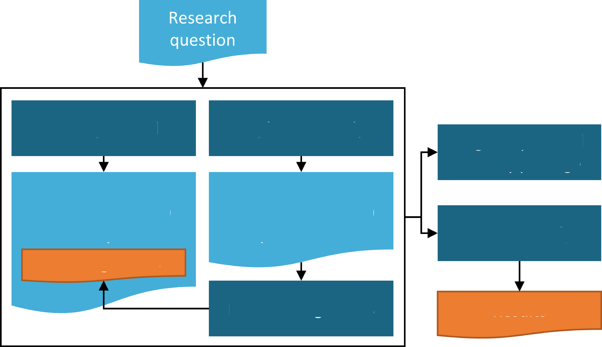

# Các bước nghiên cứu

*Người phụ trách chương: Sara Dempster & Martijn Schuemie*

Tại đây, chúng tôi hướng đến việc cung cấp một hướng dẫn từng bước
chung về thiết kế và thực hiện một nghiên cứu quan sát bằng các công
cụ OHDSI. Chúng tôi sẽ chia nhỏ từng giai đoạn của quy trình nghiên
cứu và sau đó mô tả các bước một cách chung nhất và trong một số
trường hợp thảo luận về các khía cạnh cụ thể của các loại nghiên cứu
chính: (1) đặc điểm hóa, (2) ước tính cấp độ quần thể (PLE), và

\(3\) dự đoán cấp độ bệnh nhân (PLP) được mô tả trong các chương trước
của Cuốn sách OHDSI. Để làm điều đó, chúng tôi sẽ tổng hợp nhiều yếu
tố được thảo luận trong các chương trước theo cách dễ tiếp cận cho
người mới bắt đầu. Đồng thời, chương này có thể đứng độc lập đối với
độc giả muốn có các giải thích thực tế cấp cao với các tùy chọn để
theo đuổi các tài liệu chuyên sâu hơn trong các chương khác khi cần.
Cuối cùng, chúng tôi sẽ minh họa xuyên suốt bằng một vài ví dụ chính.

Ngoài ra, chúng tôi sẽ tóm tắt các hướng dẫn và thực tiễn tốt nhất cho
các nghiên cứu quan sát theo khuyến nghị của cộng đồng OHDSI. Một số
nguyên tắc mà chúng tôi sẽ thảo luận là chung và được chia sẻ với các
khuyến nghị thực tiễn tốt nhất được tìm thấy trong nhiều hướng dẫn
khác cho nghiên cứu quan sát, trong khi các quy trình được khuyến nghị
khác cụ thể hơn cho khuôn khổ OHDSI. Do đó, chúng tôi sẽ làm nổi bật
nơi các phương pháp tiếp cận cụ thể của OHDSI được kích hoạt bởi hệ
sinh thái công cụ OHDSI.

Trong suốt chương này, chúng tôi giả định rằng cơ sở hạ tầng của các
công cụ OHDSI, R và SQL đã sẵn sàng cho độc giả và do đó chúng tôi
không thảo luận về bất kỳ khía cạnh nào của việc thiết lập cơ sở hạ
tầng này trong chương này (xem Chương 8 và 9 để được hướng dẫn). Chúng
tôi cũng giả định độc giả quan tâm đến việc chạy một nghiên cứu chủ
yếu trên dữ liệu tại cơ sở của họ bằng cách sử dụng cơ sở dữ liệu
trong OMOP CDM (cho OMOP ETL, xem Chương 6). Tuy nhiên, chúng tôi nhấn
mạnh rằng một khi gói nghiên cứu đã được chuẩn bị như thảo luận dưới
đây, về nguyên tắc, nó có thể được phân phối và thực thi tại các cơ sở
khác. Các cân nhắc bổ sung cụ thể cho việc chạy các nghiên cứu mạng
lưới OHDSI, bao gồm các chi tiết tổ chức và kỹ thuật, được thảo luận
chi tiết trong Chương 20.

## Hướng dẫn thực tiễn tốt nhất chung

### Định nghĩa nghiên cứu quan sát

Nghiên cứu quan sát là nghiên cứu mà theo định nghĩa, bệnh nhân chỉ
đơn giản được quan sát và không có nỗ lực nào được thực hiện để can
thiệp vào việc điều trị cho các bệnh nhân cụ thể. Đôi khi, dữ liệu
quan sát được thu thập cho một mục đích cụ thể như trong một nghiên
cứu đăng ký, nhưng trong nhiều trường hợp, dữ liệu này được thu thập
cho một mục đích khác ngoài câu hỏi nghiên cứu cụ thể đang được xem
xét. Các ví dụ phổ biến về loại dữ liệu sau là Hồ sơ sức khỏe điện tử
(EHR) hoặc dữ liệu yêu cầu thanh toán hành chính. Các nghiên cứu quan
sát thường được gọi là sử dụng thứ cấp dữ liệu. Một nguyên tắc chỉ đạo
cơ bản để thực hiện bất kỳ nghiên cứu quan sát nào là mô tả rõ ràng
câu hỏi nghiên cứu của mình và chỉ định đầy đủ phương pháp tiếp cận
trước khi thực hiện nghiên cứu. Về khía cạnh này, một nghiên cứu quan
sát không nên khác biệt so với một thử nghiệm lâm sàng, ngoại trừ việc
trong một thử nghiệm lâm sàng, bệnh nhân được tuyển chọn và theo dõi
theo thời gian với mục đích chính là trả lời một câu hỏi cụ thể,
thường là về hiệu quả và/hoặc tính an toàn của một can thiệp điều trị.
Có nhiều cách mà các phương pháp phân tích được sử dụng trong các
nghiên cứu quan sát khác biệt so với các phương pháp được sử dụng
trong các thử nghiệm lâm sàng. Đáng chú ý nhất, việc thiếu ngẫu nhiên
hóa trong các nghiên cứu quan sát PLE đòi hỏi các phương pháp để kiểm
soát nhiễu nếu mục tiêu là rút ra các suy luận nhân quả (xem Chương 12
và 18 để thảo luận chi tiết về các thiết kế nghiên cứu và phương pháp
được OHDSI hỗ trợ cho PLE như các phương pháp loại bỏ nhiễu quan sát
bằng cách cân bằng quần thể trên nhiều đặc điểm).

### Chỉ định trước thiết kế nghiên cứu

Chỉ định trước thiết kế và các tham số của một nghiên cứu quan sát là
rất quan trọng để tránh đưa thêm sai lệch bằng cách vô thức hoặc có ý
thức phát triển phương pháp tiếp cận của mình để đạt được kết quả mong
muốn, đôi khi được gọi là p-hacking. Sự cám dỗ không chỉ định đầy đủ
chi tiết nghiên cứu trước là lớn hơn với việc sử dụng thứ cấp dữ liệu
so với sử dụng sơ cấp vì các dữ liệu này, như EHR và dữ liệu yêu cầu
thanh toán, đôi khi mang lại cho nhà nghiên cứu cảm giác về khả năng
vô hạn, dẫn đến một dòng điều tra quanh co. Chìa khóa ở đây là vẫn áp
đặt cấu trúc nghiêm ngặt của điều tra khoa học bất chấp sự sẵn có dễ
dàng rõ ràng của dữ liệu có sẵn. Nguyên tắc chỉ định trước đặc biệt
quan trọng trong PLE hoặc PLP để đảm bảo kết quả nghiêm ngặt hoặc có
thể tái lập vì những phát hiện này cuối cùng có thể thông báo cho thực
hành lâm sàng hoặc các quyết định quản lý. Ngay cả trong trường hợp
một nghiên cứu đặc điểm hóa được tiến hành hoàn toàn vì lý do khám
phá, vẫn tốt hơn là có một kế hoạch được chỉ định rõ ràng. Nếu không,
một thiết kế nghiên cứu và quy trình phân tích đang phát triển sẽ trở
nên khó quản lý để tài liệu hóa, giải thích và tái lập.

### Đề cương nghiên cứu

Một kế hoạch nghiên cứu quan sát nên được tài liệu hóa dưới dạng một
đề cương được tạo ra trước khi thực hiện một nghiên cứu. Tối thiểu,
một đề cương mô tả câu hỏi nghiên cứu chính, phương pháp tiếp cận và
các chỉ số sẽ được sử dụng để trả lời câu hỏi. Quần thể nghiên cứu nên
được mô tả ở mức độ chi tiết sao cho quần thể nghiên cứu có thể được
hoàn toàn

1.  *Hướng dẫn thực tiễn tốt nhất chung 359*

tái lập bởi những người khác. Ngoài ra, tất cả các phương pháp hoặc
quy trình thống kê và hình thức của các kết quả nghiên cứu dự kiến như
chỉ số, bảng và biểu đồ nên được mô tả. Thông thường, một đề cương
cũng sẽ mô tả một tập hợp các phân tích trước được thiết kế để đánh
giá tính khả thi hoặc sức mạnh thống kê của nghiên cứu. Hơn nữa, các
đề cương có thể chứa mô tả về các biến thể của câu hỏi nghiên cứu
chính được gọi là phân tích độ nhạy. Các phân tích độ nhạy được thiết
kế để đánh giá tác động tiềm tàng của các lựa chọn thiết kế nghiên cứu
đối với các phát hiện nghiên cứu tổng thể và nên được mô tả trước bất
cứ khi nào có thể. Đôi khi các vấn đề không lường trước phát sinh có
thể đòi hỏi một sửa đổi đề cương sau khi một đề cương đã hoàn thành.
Nếu điều này trở nên cần thiết, điều quan trọng là phải tài liệu hóa
sự thay đổi và lý do cho sự thay đổi trong chính đề cương. Đặc biệt
trong trường hợp PLE hoặc PLP, một đề cương nghiên cứu đã hoàn thành
lý tưởng nhất sẽ được ghi lại trong một nền tảng độc lập (như
clinicaltrials.gov hoặc sandbox studyProtocols của OHDSI) nơi các
phiên bản và bất kỳ sửa đổi nào của nó có thể được theo dõi độc lập
với dấu thời gian. Cũng thường xảy ra trường hợp tổ chức của bạn hoặc
chủ sở hữu của nguồn dữ liệu sẽ yêu cầu cơ hội xem xét và phê duyệt đề
cương của bạn trước khi thực hiện nghiên cứu.

### Các phân tích chuẩn hóa

Một lợi thế độc đáo của OHDSI là cách các công cụ hỗ trợ lập kế hoạch,
tài liệu hóa và báo cáo bằng cách công nhận rằng thực sự có một vài
loại câu hỏi chính được hỏi lặp đi lặp lại trong các nghiên cứu quan
sát (Chương 2, 7, 11, 12, 13), từ đó hợp lý hóa quy trình phát triển
đề cương và thực hiện nghiên cứu thông qua tự động hóa các khía cạnh
được lặp lại. Nhiều công cụ được thiết kế để tham số hóa một vài thiết
kế nghiên cứu hoặc chỉ số giải quyết phần lớn các trường hợp sử dụng
sẽ gặp phải. Ví dụ, các nhà nghiên cứu chỉ định quần thể nghiên cứu
của họ và một vài tham số bổ sung và thực hiện nhiều nghiên cứu so
sánh lặp đi lặp lại trên các loại thuốc và/hoặc kết cục khác nhau. Nếu
các câu hỏi của nhà nghiên cứu phù hợp với mẫu chung, có nhiều cách để
tự động hóa việc tạo ra nhiều mô tả cơ bản về quần thể nghiên cứu và
các tham số khác cần thiết cho đề cương. Trong lịch sử, các phương
pháp tiếp cận này được thúc đẩy từ các thí nghiệm OMOP, vốn tìm cách
đánh giá mức độ mà các thiết kế nghiên cứu quan sát có thể tái lập các
liên kết nhân quả đã biết giữa thuốc và các biến cố bất lợi bằng cách
lặp lại trên nhiều thiết kế nghiên cứu và tham số khác nhau.

Phương pháp tiếp cận OHDSI hỗ trợ việc bao gồm tính khả thi và các
chẩn đoán nghiên cứu trong đề cương bằng cách một lần nữa cho phép các
bước này được thực hiện tương đối đơn giản trong một khuôn khổ và các
công cụ chung (xem phần 19.2.4 bên dưới).

### Các gói nghiên cứu

Một động lực khác cho các mẫu và thiết kế chuẩn hóa là ngay cả khi một
nhà nghiên cứu nghĩ rằng một nghiên cứu được mô tả chi tiết đầy đủ
dưới dạng một đề cương, có thể có các yếu tố không thực sự được chỉ
định đầy đủ để tạo ra mã máy tính đầy đủ để thực hiện nghiên cứu. Một
nguyên tắc cơ bản liên quan được kích hoạt bởi khuôn khổ OHDSI là tạo
ra một quy trình có thể truy xuất nguồn gốc và tái lập hoàn toàn được
tài liệu hóa dưới dạng mã máy tính, thường được gọi là một \"gói
nghiên cứu\". Thực tiễn tốt nhất của OHDSI là

ghi lại gói nghiên cứu như vậy trong môi trường git. Gói nghiên cứu
này chứa tất cả các tham số và dấu phiên bản cho cơ sở mã. Như đã đề
cập trước đó, các nghiên cứu quan sát thường đặt ra các câu hỏi có khả
năng tác động đến các quyết định và chính sách y tế công cộng. Do đó,
trước khi hành động dựa trên bất kỳ phát hiện nào, chúng lý tưởng nhất
nên được tái lập trong nhiều bối cảnh bởi các nhà nghiên cứu khác
nhau. Cách duy nhất để đạt được mục tiêu như vậy là mọi chi tiết cần
thiết để tái lập hoàn toàn một nghiên cứu phải được vạch ra rõ ràng và
không để lại cho việc đoán mò hoặc hiểu sai. Để hỗ trợ thực tiễn tốt
nhất này, các công cụ OHDSI được thiết kế để hỗ trợ việc chuyển đổi từ
một đề cương dưới dạng tài liệu văn bản thành một gói nghiên cứu có
thể đọc được bằng máy tính. Một sự đánh đổi của khuôn khổ này là không
phải mọi trường hợp sử dụng hoặc phân tích tùy chỉnh đều có thể dễ
dàng giải quyết bằng các công cụ OHDSI hiện có. Tuy nhiên, khi cộng
đồng phát triển và tiến hóa, nhiều chức năng hơn để giải quyết một
loạt các trường hợp sử dụng lớn hơn đang được thêm vào. Bất kỳ ai tham
gia vào cộng đồng đều có thể đưa ra các đề xuất cho chức năng mới được
thúc đẩy bởi một trường hợp sử dụng mới lạ.

### Dữ liệu cơ bản của CDM

Các nghiên cứu OHDSI dựa trên các cơ sở dữ liệu quan sát được chuyển
đổi sang mô hình dữ liệu chung OMOP (CDM). Tất cả các công cụ OHDSI và
các bước phân tích hạ nguồn đều giả định rằng biểu diễn dữ liệu tuân
thủ các thông số kỹ thuật của CDM (xem Chương 4). Do đó, cũng rất quan
trọng là quy trình ETL (xem Chương 6) để thực hiện điều đó được tài
liệu hóa tốt cho các nguồn dữ liệu cụ thể của bạn vì quy trình này có
thể đưa ra các tạo tác hoặc sự khác biệt giữa các cơ sở dữ liệu tại
các cơ sở khác nhau. Mục đích của OMOP CDM là tiến tới giảm thiểu biểu
diễn dữ liệu cụ thể theo cơ sở, nhưng đây còn lâu mới là một quy trình
hoàn hảo và vẫn là một lĩnh vực đầy thách thức mà cộng đồng tìm cách
cải thiện. Do đó, vẫn rất quan trọng khi thực hiện các nghiên cứu là
cộng tác với các cá nhân tại cơ sở của bạn, hoặc tại các cơ sở bên
ngoài khi thực hiện các nghiên cứu mạng lưới, những người am hiểu sâu
sắc về bất kỳ dữ liệu nguồn nào đã được chuyển đổi sang OMOP CDM.

Ngoài CDM, hệ thống từ vựng chuẩn hóa OMOP (Chương 5) cũng là một
thành phần quan trọng của việc làm việc với khuôn khổ OHDSI để đạt
được khả năng tương tác giữa các nguồn dữ liệu đa dạng. Từ vựng chuẩn
hóa tìm cách xác định một tập hợp các khái niệm chuẩn trong mỗi miền
từ vựng mà tất cả các hệ thống từ vựng nguồn khác được ánh xạ tới.
Bằng cách này, hai cơ sở dữ liệu khác nhau sử dụng hệ thống từ vựng
nguồn khác nhau cho thuốc, chẩn đoán hoặc thủ thuật sẽ có thể so sánh
được khi được chuyển đổi sang CDM. Các từ vựng OMOP cũng chứa các hệ
thống phân cấp hữu ích trong việc xác định các mã phù hợp cho một định
nghĩa thuần tập cụ thể. Một lần nữa, thực tiễn tốt nhất được khuyến
nghị là triển khai các ánh xạ từ vựng và sử dụng các mã của từ vựng
chuẩn hóa OMOP trong các truy vấn hạ nguồn để đạt được đầy đủ lợi ích
của việc ETL cơ sở dữ liệu của bạn sang OMOP CDM và sử dụng từ vựng
OMOP.

## Các bước nghiên cứu chi tiết

### Xác định câu hỏi

Bước đầu tiên là chuyển đổi mối quan tâm nghiên cứu của bạn thành một
câu hỏi chính xác có thể được giải quyết bằng một nghiên cứu quan sát.
Giả sử bạn là một nhà nghiên cứu bệnh tiểu đường lâm sàng và bạn muốn
điều tra chất lượng chăm sóc được cung cấp cho bệnh nhân mắc bệnh tiểu
đường loại 2 (T2DM). Bạn có thể chia mục tiêu lớn hơn này thành các
câu hỏi cụ thể hơn nhiều thuộc về một trong ba loại câu hỏi được mô tả
lần đầu trong Chương 7.

Trong một nghiên cứu đặc điểm hóa, người ta có thể hỏi, \"các thực
hành kê đơn có phù hợp với những gì hiện được khuyến nghị cho những
người mắc T2DM nhẹ so với những người mắc T2DM nặng trong một môi
trường chăm sóc sức khỏe nhất định không?\" Câu hỏi này không hỏi một
câu hỏi nhân quả về hiệu quả của bất kỳ phương pháp điều trị nào so
với phương pháp khác; nó chỉ đơn giản là đặc điểm hóa các thực hành kê
đơn trong cơ sở dữ liệu của bạn so với một tập hợp các hướng dẫn lâm
sàng hiện có.

Có lẽ bạn cũng hoài nghi liệu các hướng dẫn kê đơn cho điều trị T2DM
có tốt nhất cho một nhóm bệnh nhân cụ thể như những người mắc cả chẩn
đoán T2DM và bệnh tim hay không. Dòng điều tra này có thể được chuyển
đổi thành một nghiên cứu PLE. Cụ thể, bạn có thể đặt câu hỏi về hiệu
quả so sánh của 2 nhóm thuốc T2DM khác nhau trong việc ngăn ngừa các
biến cố tim mạch, chẳng hạn như suy tim. Bạn có thể thiết kế một
nghiên cứu để kiểm tra các rủi ro tương đối của việc nhập viện vì suy
tim trong hai nhóm thuần tập bệnh nhân riêng biệt dùng các loại thuốc
khác nhau, nhưng nơi cả hai nhóm thuần tập đều có chẩn đoán T2DM và
bệnh tim.

Ngoài ra, bạn có thể muốn phát triển một mô hình để dự đoán bệnh nhân
nào sẽ tiến triển từ T2DM nhẹ sang T2DM nặng. Điều này có thể được
đóng khung như một câu hỏi PLP và có thể phục vụ để cảnh báo các bệnh
nhân có nguy cơ cao hơn chuyển sang T2DM nặng để được chăm sóc cảnh
giác hơn.

Từ quan điểm hoàn toàn thực dụng, việc xác định một câu hỏi nghiên cứu
cũng đòi hỏi phải đánh giá liệu các phương pháp cần thiết để trả lời
một câu hỏi có phù hợp với chức năng sẵn có trong bộ công cụ OHDSI hay
không (xem Chương 7 để thảo luận chi tiết về các loại câu hỏi có thể
được giải quyết với công cụ hiện tại). Tất nhiên, luôn có thể thiết kế
các công cụ phân tích của riêng bạn hoặc sửa đổi những công cụ hiện có
để trả lời các câu hỏi khác.

### Xem xét tính sẵn có và chất lượng dữ liệu

Trước khi cam kết với một câu hỏi nghiên cứu cụ thể, khuyến nghị nên
xem xét chất lượng của dữ liệu (xem Chương 15) và thực sự hiểu bản
chất của cơ sở dữ liệu chăm sóc sức khỏe quan sát cụ thể của bạn về
các trường nào được điền và các bối cảnh chăm sóc nào mà dữ liệu bao
phủ. Điều này có thể giúp nhanh chóng xác định các vấn đề có thể làm
cho một câu hỏi nghiên cứu không khả thi trong một cơ sở dữ liệu cụ
thể. Dưới đây, chúng tôi chỉ ra một số vấn đề phổ biến có thể phát
sinh.

Hãy quay lại ví dụ trên về việc phát triển một mô hình dự đoán cho sự
tiến triển từ T2DM nhẹ sang T2DM nặng. Lý tưởng nhất là mức độ nghiêm
trọng của T2DM có thể được đánh giá bằng cách kiểm tra

các mức glycosylated hemoglobin (HbA1c) là một phép đo phòng thí
nghiệm phản ánh mức đường huyết của bệnh nhân trung bình trong 3 tháng
trước đó. Các giá trị này có thể có hoặc không có sẵn cho tất cả bệnh
nhân. Nếu không có sẵn cho tất cả hoặc thậm chí một phần bệnh nhân,
bạn sẽ phải xem xét liệu các tiêu chí lâm sàng khác cho mức độ nghiêm
trọng của T2DM có thể được xác định và sử dụng thay thế hay không.
Ngoài ra, nếu các giá trị HbA1c chỉ có sẵn cho một nhóm bệnh nhân, bạn
cũng sẽ cần đánh giá liệu việc chỉ tập trung vào nhóm bệnh nhân này có
dẫn đến sai lệch không mong muốn trong nghiên cứu hay không. Xem
Chương 7 để thảo luận bổ sung về vấn đề dữ liệu bị thiếu.

Một vấn đề phổ biến khác là thiếu thông tin về một bối cảnh chăm sóc
cụ thể. Trong ví dụ PLE được mô tả ở trên, kết cục được đề xuất là
nhập viện vì suy tim. Nếu một cơ sở dữ liệu nhất định không có bất kỳ
thông tin nội trú nào, người ta có thể cần xem xét một kết cục khác để
đánh giá hiệu quả so sánh của các phương pháp điều trị T2DM khác nhau.
Trong các cơ sở dữ liệu khác, dữ liệu chẩn đoán ngoại trú có thể không
có sẵn và do đó người ta sẽ cần xem xét thiết kế của nhóm thuần tập.

### Các quần thể nghiên cứu

Việc xác định một quần thể nghiên cứu hoặc các quần thể là một bước cơ
bản của bất kỳ nghiên cứu nào. Trong nghiên cứu quan sát, một nhóm cá
nhân đại diện cho quần thể nghiên cứu quan tâm thường được gọi là một
nhóm thuần tập (cohort). Các đặc điểm bệnh nhân cần thiết để lựa chọn
vào một nhóm thuần tập sẽ được xác định bởi quần thể nghiên cứu phù
hợp với câu hỏi lâm sàng trong tầm tay. Một ví dụ về một nhóm thuần
tập đơn giản sẽ là bệnh nhân lớn hơn 18 tuổi VÀ có mã chẩn đoán T2DM
trong hồ sơ y tế của họ. Định nghĩa nhóm thuần tập này có hai tiêu chí
được kết nối bằng logic AND. Thông thường các định nghĩa nhóm thuần
tập chứa nhiều tiêu chí hơn được kết nối bằng logic boolean lồng nhau
phức tạp hơn và các tiêu chí tạm thời bổ sung như các giai đoạn nghiên
cứu cụ thể hoặc độ dài thời gian bắt buộc cho giai đoạn cơ sở của bệnh
nhân.

Một tập hợp các định nghĩa nhóm thuần tập được tinh chỉnh đòi hỏi sự
xem xét của tài liệu khoa học phù hợp và lời khuyên từ các chuyên gia
lâm sàng và kỹ thuật, những người hiểu một số thách thức trong việc
diễn giải cơ sở dữ liệu cụ thể của bạn để xác định các nhóm bệnh nhân
phù hợp. Điều quan trọng cần ghi nhớ khi làm việc với dữ liệu quan sát
là các dữ liệu này không cung cấp một bức tranh hoàn chỉnh về lịch sử
y tế của bệnh nhân, mà thay vào đó là một ảnh chụp nhanh trong thời
gian mà độ trung thực của nó phụ thuộc vào cả lỗi của con người và sai
lệch có thể đã được đưa vào trong việc ghi lại thông tin. Một bệnh
nhân nhất định có thể chỉ được theo dõi trong một thời gian hữu hạn
được gọi là giai đoạn quan sát của họ. Đối với một cơ sở dữ liệu hoặc
bối cảnh chăm sóc và bệnh tật hoặc điều trị đang được nghiên cứu, một
nhà nghiên cứu lâm sàng có thể đưa ra các đề xuất để tránh các nguồn
lỗi phổ biến nhất. Để đưa ra một ví dụ đơn giản, một vấn đề phổ biến
trong việc xác định bệnh nhân mắc T2DM là bệnh nhân T1DM đôi khi bị
nhầm lẫn với chẩn đoán T2DM. Vì bệnh nhân mắc T1DM về cơ bản là một
nhóm khác, việc vô tình đưa một nhóm bệnh nhân T1DM vào một nghiên cứu
nhằm kiểm tra bệnh nhân T2DM có thể làm sai lệch kết quả. Để có một
định nghĩa mạnh mẽ về một nhóm thuần tập T2DM, người ta có thể muốn
loại bỏ những bệnh nhân chỉ từng được kê đơn insulin như một phương
pháp điều trị bệnh tiểu đường để tránh việc bệnh nhân T1DM bị đại diện
sai lệch. Tuy nhiên, đồng thời, cũng có thể có những tình huống mà
người ta chỉ đơn giản quan tâm đến

các đặc điểm của tất cả bệnh nhân có mã chẩn đoán T2DM trong hồ sơ y
tế của họ. Trong trường hợp này, có thể không phù hợp để áp dụng thêm
các tiêu chí đủ điều kiện để cố gắng loại bỏ các bệnh nhân T1DM được
mã hóa sai.

Khi định nghĩa của một quần thể nghiên cứu hoặc các quần thể được mô
tả, công cụ OHDSI ATLAS là một điểm khởi đầu tốt để tạo ra các nhóm
thuần tập liên quan. ATLAS và quy trình tạo nhóm thuần tập được mô tả
chi tiết trong Chương 8 và 10. Tóm lại, ATLAS cung cấp một giao diện
người dùng (UI) để xác định và tạo các nhóm thuần tập với các tiêu chí
bao gồm chi tiết. Khi các nhóm thuần tập được xác định trong ATLAS,
một người dùng có thể trực tiếp xuất các định nghĩa chi tiết của họ ở
định dạng có thể đọc được bởi con người để kết hợp vào một đề cương.
Nếu vì lý do nào đó một phiên bản ATLAS không được kết nối với một cơ
sở dữ liệu y tế quan sát, ATLAS vẫn có thể được sử dụng để tạo một
định nghĩa nhóm thuần tập và trực tiếp xuất mã SQL cơ bản để kết hợp
vào một gói nghiên cứu để chạy riêng biệt trên một máy chủ cơ sở dữ
liệu SQL. Việc trực tiếp sử dụng ATLAS được khuyến nghị khi có thể vì
ATLAS cung cấp một số lợi thế vượt xa việc tạo mã SQL cho định nghĩa
nhóm thuần tập (xem bên dưới). Cuối cùng, có thể có một số tình huống
hiếm hoi mà một định nghĩa nhóm thuần tập không thể được triển khai
với UI ATLAS và đòi hỏi mã SQL tùy chỉnh thủ công.

UI ATLAS cho phép xác định các nhóm thuần tập dựa trên nhiều tiêu chí
lựa chọn. Các tiêu chí cho việc nhập và xuất nhóm thuần tập cũng như
các tiêu chí cơ sở có thể được xác định trên cơ sở bất kỳ miền nào của
OMOP CDM như tình trạng, thuốc, thủ thuật, v.v. nơi các mã chuẩn phải
được chỉ định cho mỗi miền. Ngoài ra, các bộ lọc logic dựa trên các
miền này, cũng như các bộ lọc dựa trên thời gian để xác định các giai
đoạn nghiên cứu, và các khung thời gian cơ sở có thể được xác định
trong ATLAS. ATLAS có thể đặc biệt hữu ích khi chọn mã cho mỗi tiêu
chí. ATLAS kết hợp một tính năng duyệt từ vựng có thể được sử dụng để
xây dựng các tập hợp mã cần thiết cho các định nghĩa nhóm thuần tập
của bạn. Tính năng này dựa hoàn toàn vào các từ vựng chuẩn OMOP và có
các tùy chọn để bao gồm tất cả các hậu duệ trong hệ thống phân cấp từ
vựng (xem Chương 5). Do đó, lưu ý rằng tính năng này đòi hỏi tất cả
các mã đã được ánh xạ phù hợp sang các mã chuẩn trong quy trình ETL
(xem Chương 6). Nếu các tập hợp mã tốt nhất để sử dụng trong các tiêu
chí bao gồm của bạn không rõ ràng, đây có thể là một nơi mà một số
phân tích khám phá có thể được đảm bảo trong các định nghĩa nhóm thuần
tập. Ngoài ra, một phân tích độ nhạy chính thức hơn có thể được xem
xét để tính đến các định nghĩa khác nhau có thể có của một nhóm thuần
tập sử dụng các tập hợp mã khác nhau.

Giả sử rằng ATLAS được cấu hình phù hợp để kết nối với một cơ sở dữ
liệu, các truy vấn SQL để tạo các nhóm thuần tập được xác định có thể
được chạy trực tiếp trong ATLAS. ATLAS sẽ tự động gán cho mỗi nhóm
thuần tập một id duy nhất cũng có thể được sử dụng để trực tiếp tham
chiếu nhóm thuần tập trong cơ sở dữ liệu phụ trợ cho việc sử dụng
trong tương lai. Nhóm thuần tập có thể được trực tiếp sử dụng trong
ATLAS để chạy một nghiên cứu tỷ lệ mắc hoặc nó có thể được trỏ đến
trực tiếp trong cơ sở dữ liệu phụ trợ bởi mã trong một gói nghiên cứu
PLE hoặc PLP. Đối với một nhóm thuần tập nhất định, ATLAS chỉ lưu các
id bệnh nhân, ngày chỉ số và ngày xuất nhóm thuần tập của các cá nhân
trong các nhóm thuần tập. Thông tin này là đủ để rút ra tất cả các
thuộc tính hoặc hiệp biến khác có thể cần thiết cho các bệnh nhân như
các hiệp biến cơ sở của bệnh nhân cho một nghiên cứu đặc điểm hóa, PLE
hoặc PLP.

Khi một nhóm thuần tập được tạo ra, các đặc điểm tóm tắt về nhân khẩu
học bệnh nhân và tần suất của các loại thuốc và tình trạng thường gặp
nhất được quan sát có thể được tạo và xem

theo mặc định trực tiếp trong ATLAS.

Trên thực tế, hầu hết các nghiên cứu đòi hỏi phải chỉ định nhiều nhóm
thuần tập hoặc nhiều tập hợp các nhóm thuần tập sau đó được so sánh
theo nhiều cách khác nhau để đạt được những hiểu biết lâm sàng mới.
Đối với PLE và PLP, các công cụ OHDSI cung cấp một khuôn khổ có cấu
trúc để xác định các nhóm thuần tập đa dạng này. Ví dụ, trong một
nghiên cứu hiệu quả so sánh PLE, bạn thường sẽ xác định ít nhất 3 nhóm
thuần tập, một nhóm thuần tập mục tiêu, một nhóm đối chứng và một nhóm
thuần tập kết cục (xem Chương 12). Ngoài ra, để chạy một nghiên cứu
hiệu quả so sánh PLE đầy đủ, bạn cũng sẽ cần một số nhóm thuần tập với
các kết cục đối chứng âm và các kết cục đối chứng dương. Bộ công cụ
OHDSI cung cấp các cách để giúp tăng tốc và trong một số trường hợp tự
động hóa việc tạo ra các nhóm thuần tập đối chứng âm và dương này như
được thảo luận chi tiết trong Chương 18.

Như một lưu ý cuối cùng, việc xác định các nhóm thuần tập cho một
nghiên cứu có thể hưởng lợi từ công việc đang diễn ra trong cộng đồng
OHDSI để xác định một thư viện các kiểu hình mạnh mẽ và được xác nhận,
nơi một kiểu hình về cơ bản là một định nghĩa nhóm thuần tập có thể
xuất. Nếu bất kỳ định nghĩa nhóm thuần tập hiện có nào phù hợp cho
nghiên cứu của bạn, các định nghĩa chính xác có thể được thu được bằng
cách nhập một tệp json vào phiên bản ATLAS của bạn.

### Tính khả thi và chẩn đoán

Khi các nhóm thuần tập được xác định và tạo ra, một quy trình chính
thức hơn để kiểm tra tính khả thi của nghiên cứu trong các nguồn dữ
liệu có sẵn có thể được thực hiện và các phát hiện được tóm tắt trong
đề cương cuối cùng. Một đánh giá về tính khả thi của nghiên cứu có thể
bao gồm một số hoạt động khám phá và đôi khi lặp đi lặp lại. Chúng tôi
mô tả một vài khía cạnh phổ biến ở đây.

Một hoạt động chính ở giai đoạn này sẽ là xem xét kỹ lưỡng sự phân bố
của các đặc điểm trong các nhóm thuần tập của bạn để đảm bảo rằng nhóm
thuần tập bạn tạo ra nhất quán với các đặc điểm lâm sàng mong muốn và
gắn cờ bất kỳ đặc điểm không mong muốn nào. Quay lại ví dụ T2DM của
chúng tôi ở trên, bằng cách đặc điểm hóa nhóm thuần tập T2DM đơn giản
này bằng cách xem xét tần suất của tất cả các chẩn đoán khác nhận
được, người ta có thể gắn cờ vấn đề cũng thu thập bệnh nhân mắc T1DM
hoặc các vấn đề không lường trước khác. Thực hành tốt là xây dựng một
bước như vậy ban đầu đặc điểm hóa bất kỳ nhóm thuần tập mới nào vào đề
cương nghiên cứu như một kiểm tra chất lượng về tính hợp lệ lâm sàng
của định nghĩa nhóm thuần tập. Về mặt triển khai, cách dễ nhất để thực
hiện một lượt đầu tiên tại đây sẽ là kiểm tra nhân khẩu học nhóm thuần
tập và các loại thuốc và tình trạng hàng đầu có thể được tạo theo mặc
định khi một nhóm thuần tập được tạo trong ATLAS. Nếu tùy chọn tạo các
nhóm thuần tập trực tiếp trong ATLAS không có sẵn, SQL thủ công hoặc
sử dụng gói trích xuất tính năng R có thể được sử dụng để đặc điểm hóa
một nhóm thuần tập. Trên thực tế, trong một nghiên cứu PLE lớn hơn
hoặc nghiên cứu PLP, các bước này có thể được xây dựng vào gói nghiên
cứu với các bước trích xuất tính năng.

Một bước phổ biến và quan trọng khác để đánh giá tính khả thi cho PLE
hoặc PLP là đánh giá quy mô nhóm thuần tập và số lượng kết cục trong
các nhóm thuần tập mục tiêu và đối chứng. Tính năng tỷ lệ mắc của
ATLAS có thể được sử dụng để tìm các số lượng này, có thể được sử dụng
để thực hiện các tính toán sức mạnh như được mô tả ở nơi khác.

Một tùy chọn khác được khuyến nghị cao cho một nghiên cứu PLE là hoàn
thành các bước ghép cặp điểm xu hướng (PS) và các chẩn đoán liên quan
để đảm bảo rằng có đủ

sự chồng lấp giữa các quần thể trong các nhóm mục tiêu và đối chứng.
Các bước này được mô tả chi tiết trong Chương 12. Ngoài ra, sử dụng
các nhóm thuần tập ghép cặp cuối cùng này, sức mạnh thống kê sau đó có
thể được tính toán.

Trong một số trường hợp, công việc trong cộng đồng OHDSI chỉ kiểm tra
sức mạnh thống kê sau khi một nghiên cứu được chạy bằng cách báo cáo
một rủi ro tương đối có thể phát hiện tối thiểu (MDRR) dựa trên quy mô
mẫu có sẵn. Phương pháp tiếp cận này có thể hữu ích hơn khi chạy các
nghiên cứu tự động, thông lượng cao trên rất nhiều cơ sở dữ liệu và cơ
sở. Trong kịch bản này, sức mạnh của một nghiên cứu trong bất kỳ cơ sở
dữ liệu nhất định nào có lẽ được khám phá tốt hơn sau khi tất cả các
phân tích đã được thực hiện thay vì lọc trước.

### Hoàn thiện đề cương và gói nghiên cứu

Một khi công việc chân tay cho tất cả các bước trước đó đã được hoàn
thành, một đề cương cuối cùng nên được lắp ráp bao gồm các định nghĩa
nhóm thuần tập chi tiết và thông tin thiết kế nghiên cứu lý tưởng nhất
được xuất từ ATLAS. Trong Phụ lục D, chúng tôi cung cấp một bảng nội
dung mẫu cho một đề cương đầy đủ cho một nghiên cứu PLE. Điều này cũng
có thể được tìm thấy trên github OHDSI. Chúng tôi cung cấp mẫu này như
một hướng dẫn và danh sách kiểm tra toàn diện, nhưng lưu ý một số phần
có thể hoặc không liên quan cho nghiên cứu của bạn.

Như được hiển thị trong Hình 19.1, việc lắp ráp đề cương nghiên cứu
cuối cùng ở dạng có thể đọc được bởi con người nên được thực hiện song
song với việc chuẩn bị tất cả mã nghiên cứu có thể đọc được bằng máy
tính được kết hợp vào gói nghiên cứu cuối cùng. Các bước sau này được
gọi là thực hiện nghiên cứu trong sơ đồ dưới đây. Điều này sẽ bao gồm
xuất gói nghiên cứu đã hoàn thiện từ ATLAS và/hoặc phát triển bất kỳ
mã tùy chỉnh nào có thể được yêu cầu.

Gói nghiên cứu đã hoàn thành sau đó có thể được sử dụng để chỉ thực
hiện các bước chẩn đoán sơ bộ mà sau đó có thể được mô tả trong đề
cương. Ví dụ, trong trường hợp một nghiên cứu PLE nhóm thuần tập người
dùng mới để kiểm tra hiệu quả so sánh của hai phương pháp điều trị,
việc thực hiện sơ bộ các bước chẩn đoán nghiên cứu sẽ đòi hỏi tạo nhóm
thuần tập, tạo điểm xu hướng và ghép cặp để xác nhận rằng các quần thể
mục tiêu và đối chứng có đủ sự chồng lấp để nghiên cứu khả thi. Khi
điều này được xác định, các tính toán sức mạnh có thể được thực hiện
với các nhóm thuần tập mục tiêu và đối chứng đã ghép cặp giao với nhóm
thuần tập kết cục để có được số lượng kết cục và kết quả của các tính
toán này có thể được mô tả trong đề cương. Trên cơ sở các kết quả chẩn
đoán này, một quyết định sau đó có thể được đưa ra liệu có nên tiếp
tục thực hiện mô hình kết cục cuối cùng hay không. Trong bối cảnh của
một nghiên cứu đặc điểm hóa hoặc nghiên cứu PLP, có thể có các bước
tương tự cần được hoàn thành ở giai đoạn này, mặc dù chúng tôi không
cố gắng phác thảo tất cả các kịch bản ở đây.

Quan trọng là, chúng tôi khuyến nghị ở giai đoạn này nên để đề cương
cuối cùng của bạn được xem xét bởi các cộng tác viên lâm sàng và các
bên liên quan.

### Thực hiện nghiên cứu

Khi tất cả các bước trước đó đã được hoàn thành, việc thực hiện nghiên
cứu lý tưởng nhất sẽ đơn giản. Tất nhiên, mã hoặc quy trình nên được
xem xét về độ trung thực với các phương pháp và

{width="4.662498906386702in"
height="2.685937226596675in"}

Hình 19.1: Sơ đồ quy trình nghiên cứu.

các tham số được phác thảo trong đề cương. Cũng có thể cần phải kiểm
tra và gỡ lỗi một gói nghiên cứu để đảm bảo nó chạy phù hợp trong môi
trường của bạn.

### Diễn giải và viết báo cáo

Trong một nghiên cứu được xác định rõ ràng nơi quy mô mẫu đủ và chất
lượng dữ liệu hợp lý, việc diễn giải kết quả thường sẽ đơn giản. Tương
tự, vì hầu hết công việc tạo một báo cáo cuối cùng ngoài việc viết kết
quả cuối cùng được thực hiện trong việc lập kế hoạch và tạo đề cương,
việc viết báo cáo cuối cùng hoặc bản thảo để xuất bản thường cũng sẽ
đơn giản.

Tuy nhiên, có một số tình huống phổ biến mà việc diễn giải trở nên
thách thức hơn và nên được tiếp cận một cách thận trọng.

1.  Quy mô mẫu ở mức biên cho ý nghĩa thống kê và các khoảng tin cậy trở
nên lớn

2.  Cụ thể cho PLE&#58; hiệu chuẩn giá trị p với các đối chứng âm có thể
tiết lộ sai lệch đáng kể

3.  Các vấn đề về chất lượng dữ liệu không lường trước được lộ ra trong
quá trình chạy nghiên cứu

Đối với bất kỳ nghiên cứu nhất định nào, việc báo cáo về bất kỳ mối
quan tâm nào ở trên và điều chỉnh việc diễn giải kết quả nghiên cứu
cho phù hợp sẽ tùy thuộc vào quyết định của các tác giả nghiên cứu.
Như với quy trình phát triển đề cương, chúng tôi cũng khuyến nghị rằng
các phát hiện và diễn giải nghiên cứu nên được xem xét bởi các chuyên
gia lâm sàng và các bên liên quan trước khi phát hành báo cáo cuối
cùng hoặc gửi bản thảo để xuất bản.

3.  *Tóm tắt 367*

## Tóm tắt

{width="0.4455205599300088in"
height="0.4644783464566929in"}

- Study should examine a well-defined question.

- Perform appropriate checks of data quality, completeness and relevance
in advance.

- Recommend to include source database expert in protocol development
pro-cess if possible.

- Document proposed study in a protocol ahead of time.

- Generate study package code in parallel with written protocol and
perform and describe any feasibility and diagnostics prior to
executing the final study.

- Study should be registered and approved (if required) ahead of study
execu-tion.

- Finalized report or manuscript should be reviewed by clinical experts
and other stakeholders.

