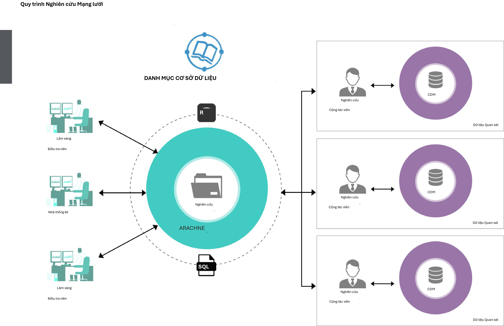
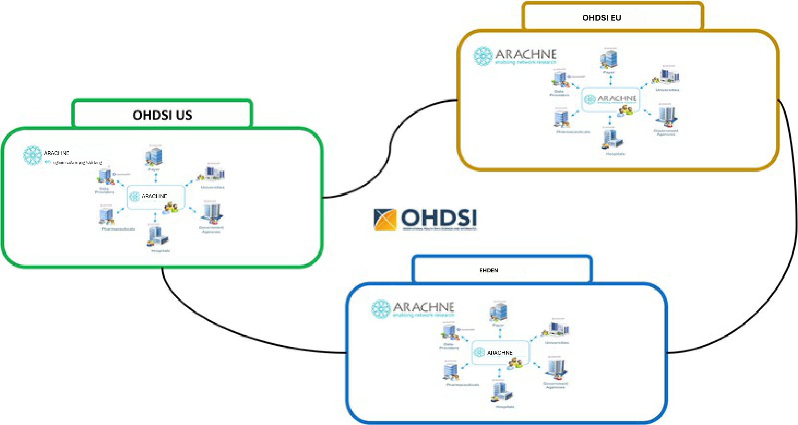

# Nghiên cứu mạng lưới OHDSI

*Chủ biên chương: Kristin Kostka, Greg Klebanov & Sara Dempster*

Sứ mệnh của OHDSI là tạo ra bằng chứng chất lượng cao thông qua nghiên
cứu quan sát. Một cách chính để đạt được điều này là thông qua các
nghiên cứu nghiên cứu hợp tác. Trong các chương trước, chúng tôi đã
thảo luận về cách cộng đồng OHDSI đã soạn thảo các tiêu chuẩn và công
cụ để tạo điều kiện cho nghiên cứu chất lượng cao, có thể tái lập, bao
gồm Từ vựng chuẩn hóa OMOP, Mô hình dữ liệu chung (CDM), các gói
phương pháp phân tích, ATLAS và các bước nghiên cứu (Chương 19) để
chạy một nghiên cứu cơ sở dữ liệu hồi cứu. Các nghiên cứu mạng lưới
OHDSI đại diện cho đỉnh cao của một cách minh bạch, nhất quán và có
thể tái lập để tiến hành nghiên cứu trên một số lượng lớn các dữ liệu
phân tán về mặt địa lý. Trong chương này, chúng tôi sẽ thảo luận về
những gì cấu thành một nghiên cứu mạng lưới OHDSI, cách chạy một
nghiên cứu mạng lưới và thảo luận về các công nghệ kích hoạt như Mạng
lưới nghiên cứu ARACHNE.

## OHDSI như một mạng lưới nghiên cứu

Mạng lưới nghiên cứu OHDSI là một sự hợp tác quốc tế của các nhà
nghiên cứu tìm cách thúc đẩy nghiên cứu dữ liệu quan sát trong chăm
sóc sức khỏe. Ngày nay, mạng lưới bao gồm hơn 100 cơ sở dữ liệu được
chuẩn hóa theo mô hình dữ liệu chung OMOP, đại diện chung cho hơn 1 tỷ
hồ sơ bệnh nhân. OHDSI là một mạng lưới mở, mời các tổ chức chăm sóc
sức khỏe trên toàn cầu có dữ liệu cấp bệnh nhân tham gia mạng lưới
bằng cách chuyển đổi dữ liệu sang OMOP CDM và tham gia vào các nghiên
cứu mạng lưới. Khi các chuyển đổi dữ liệu hoàn tất, các cộng tác viên
được mời báo cáo thông tin cơ sở trong cuộc điều tra dân số Mạng lưới
dữ liệu được duy trì bởi Quản lý chương trình OHDSI. Mỗi cơ sở mạng
lưới OHDSI tham gia tự nguyện. Không có nghĩa vụ cứng nhắc. Mỗi cơ sở
chọn tham gia vào từng nghiên cứu mạng lưới tương ứng. Trong mỗi
nghiên cứu, dữ liệu vẫn ở cơ sở sau một tường lửa. Không có việc gộp
dữ liệu cấp bệnh nhân xảy ra trên các cơ sở mạng lưới. Chỉ các kết quả
tổng hợp được chia sẻ.

{width="0.45499890638670165in"
height="0.455in"}

- **Access to free tools:** OHDSI publishes free, open source tools for
data char-acterization and standardized analytics (e.g. browsing the
clinical concepts, defining and characterizing cohorts, running
Population-Level Estimation and Patient-Level Prediction studies).

- **Participate in a premier research community:** Author and publish
network research, collaborate with leaders across various disciplines
and stakeholder groups.

- **Opportunity to benchmark care:** Network studies can enable clinical
char-acterization and quality improvement benchmarks across data
partners.

## Các nghiên cứu mạng lưới OHDSI

Trong chương trước (Chương 19), chúng tôi đã thảo luận về các cân nhắc
thiết kế chung cho việc chạy một nghiên cứu bằng cách sử dụng CDM. Nói
chung, một nghiên cứu có thể được tiến hành trên một CDM đơn lẻ hoặc
trên nhiều CDM. Nó có thể được chạy trong dữ liệu CDM của một tổ chức
đơn lẻ hoặc trên nhiều tổ chức. Trong phần này, chúng tôi sẽ thảo luận
lý do tại sao bạn có thể muốn mở rộng các phân tích của mình trên
nhiều tổ chức thành một nghiên cứu mạng lưới.

### Động lực cho việc tiến hành một nghiên cứu mạng lưới OHDSI

Một trường hợp sử dụng điển hình cho các nghiên cứu quan sát là kiểm
tra hiệu quả so sánh hoặc tính an toàn của một phương pháp điều trị
trong bối cảnh \"thế giới thực\". Cụ thể hơn, bạn có thể hướng đến
việc tái lập một thử nghiệm lâm sàng trong bối cảnh hậu thị trường để
giải quyết các mối quan tâm về khả năng khái quát hóa các phát hiện từ
một thử nghiệm lâm sàng. Trong các kịch bản khác, bạn có thể muốn chạy
một nghiên cứu so sánh hai phương pháp điều trị chưa bao giờ được so
sánh trong một thử nghiệm lâm sàng vì một phương pháp điều trị đang
được sử dụng ngoài nhãn (off-label). Hoặc bạn có thể cần nghiên cứu
một kết cục an toàn hậu thị trường hiếm gặp mà một thử nghiệm lâm sàng
không đủ sức mạnh để quan sát. Để giải quyết các câu hỏi nghiên cứu
này, có thể không đủ để chạy một nghiên cứu quan sát đơn lẻ trong một
hoặc thậm chí hai cơ sở dữ liệu tại cơ sở của bạn vì bạn chỉ nhận được
một câu trả lời có ý nghĩa trong bối cảnh của một nhóm bệnh nhân cụ
thể.

Kết quả của một nghiên cứu quan sát có thể bị ảnh hưởng bởi nhiều yếu
tố thay đổi theo vị trí của nguồn dữ liệu như sự tuân thủ, sự đa dạng
di truyền, hoặc các yếu tố môi trường, tình trạng sức khỏe tổng thể:
các yếu tố có thể không thể thay đổi trong bối cảnh của một thử nghiệm
lâm sàng ngay cả khi một thử nghiệm tồn tại cho cùng một câu hỏi
nghiên cứu của bạn. Do đó, một động lực điển hình để chạy một nghiên
cứu quan sát trong một mạng lưới là tăng sự đa dạng của các nguồn dữ
liệu và các quần thể nghiên cứu tiềm năng để hiểu mức độ kết quả khái
quát hóa tốt như thế nào. Nói cách khác, các phát hiện nghiên cứu có
thể được tái lập trên nhiều cơ sở không hay chúng khác nhau và nếu
chúng khác nhau, có thể thu được bất kỳ hiểu biết nào về lý do tại sao
không?

Do đó, các nghiên cứu mạng lưới cung cấp cơ hội để điều tra tác động
của các yếu tố \"thế giới thực\" đối với các phát hiện của nghiên cứu
quan sát bằng cách kiểm tra một loạt các bối cảnh và nguồn dữ liệu
rộng lớn.

### Định nghĩa về một nghiên cứu mạng lưới OHDSI

{width="0.45499890638670165in"
height="0.45499890638670165in"}

Phương pháp tiếp cận OHDSI đối với nghiên cứu mạng lưới sử dụng OMOP
CDM và các công cụ chuẩn hóa cũng như các gói nghiên cứu chỉ định đầy
đủ tất cả các tham số để chạy một nghiên cứu. Các phân tích chuẩn hóa
OHDSI được thiết kế đặc biệt để giảm các tạo tác và cải thiện hiệu quả
và khả năng mở rộng của các nghiên cứu mạng lưới.

Các nghiên cứu mạng lưới là một phần quan trọng của cộng đồng nghiên
cứu OHDSI. Tuy nhiên, không có quy định nào bắt buộc một nghiên cứu
OHDSI phải được đóng gói và chia sẻ trên toàn bộ mạng lưới OHDSI. Bạn
vẫn có thể tiến hành nghiên cứu bằng cách sử dụng OMOP CDM và thư viện
phương pháp OHDSI trong một tổ chức đơn lẻ hoặc giới hạn một nghiên
cứu nghiên cứu chỉ cho các tổ chức được chọn. Những đóng góp nghiên
cứu này quan trọng không kém đối với cộng đồng. Việc một nghiên cứu
được thiết kế để chạy trên một cơ sở dữ liệu đơn lẻ, tiến hành một
nghiên cứu trên một tập hợp đối tác hạn chế hay mở nghiên cứu cho sự
tham gia đầy đủ vào mạng lưới OHDSI là tùy thuộc vào quyết định của
từng nhà nghiên cứu. Chương này dự định nói về các nghiên cứu mạng
lưới mở cho tất cả mà cộng đồng OHDSI tiến hành.

**Các yếu tố của một nghiên cứu mạng lưới OHDSI mở: Khi tiến hành một
nghiên cứu mạng lưới OHDSI mở, bạn đang cam kết thực hiện nghiên cứu
hoàn toàn minh bạch. Có một vài thành phần làm cho nghiên cứu OHDSI
trở nên độc đáo. Điều này bao gồm:**

- Tất cả tài liệu, mã nghiên cứu và kết quả sau đó được công khai trên
GitHub OHDSI.

- Các nhà nghiên cứu phải tạo và xuất bản một đề cương nghiên cứu công
khai chi tiết phạm vi và mục đích của phân tích sẽ được thực hiện.

- Các nhà nghiên cứu phải tạo một gói nghiên cứu (thường với R hoặc SQL)
với mã tuân thủ CDM.

- Các nhà nghiên cứu được khuyến khích tham dự các Cuộc gọi cộng đồng
OHDSI để quảng bá và tuyển dụng cộng tác viên cho nghiên cứu mạng lưới
OHDSI của họ.

- Khi kết thúc phân tích, các kết quả nghiên cứu tổng hợp được cung cấp
trên GitHub OHDSI.

- Ở những nơi có thể, các nhà nghiên cứu được khuyến khích xuất bản các
Ứng dụng R Shiny nghiên cứu lên data.ohdsi.org.

Trong phần tiếp theo, chúng tôi sẽ nói về cách tạo nghiên cứu mạng
lưới của riêng bạn cũng như các cân nhắc thiết kế và hậu cần độc đáo
để triển khai một nghiên cứu mạng lưới.

### Các cân nhắc thiết kế cho một nghiên cứu mạng lưới OHDSI

Thiết kế một nghiên cứu để chạy trên mạng lưới OHDSI đòi hỏi một sự
thay đổi mô hình trong cách bạn thiết kế và lắp ráp mã nghiên cứu của
mình. Thông thường, bạn có thể thiết kế một nghiên cứu với một tập dữ
liệu mục tiêu trong tâm trí. Khi làm như vậy, bạn có thể viết mã liên
quan đến những gì bạn biết là

đúng trong dữ liệu bạn đang sử dụng cho phân tích của mình. Ví dụ, nếu
bạn đang lắp ráp một nhóm thuần tập phù mạch, bạn có thể chọn chỉ chọn
các mã khái niệm cho phù mạch được đại diện trong CDM của bạn. Điều
này có thể gây rắc rối nếu dữ liệu của bạn nằm trong một bối cảnh chăm
sóc cụ thể (ví dụ: chăm sóc ban đầu, bối cảnh ngoại trú) hoặc cụ thể
cho một khu vực (ví dụ: tập trung vào Mỹ). Các lựa chọn mã của bạn có
thể đang làm sai lệch định nghĩa nhóm thuần tập của bạn.

Trong một nghiên cứu mạng lưới OHDSI, bạn không còn thiết kế và xây
dựng một gói nghiên cứu chỉ cho dữ liệu của mình. Bạn đang xây dựng
một gói nghiên cứu để được chạy trên nhiều cơ sở trên toàn cầu. Bạn sẽ
không bao giờ thấy dữ liệu cơ bản cho các cơ sở tham gia bên ngoài tổ
chức của riêng bạn. Các nghiên cứu mạng lưới OHDSI chỉ chia sẻ các tệp
kết quả. Gói nghiên cứu của bạn chỉ có thể thu thập dữ liệu có sẵn
trong các miền của CDM. Bạn sẽ cần một phương pháp tiếp cận toàn diện
để tạo tập hợp khái niệm để đại diện cho sự đa dạng của các bối cảnh
chăm sóc mà dữ liệu y tế quan sát được thu thập. Các gói nghiên cứu
OHDSI thường sử dụng cùng một định nghĩa nhóm thuần tập trên tất cả
các cơ sở. Điều này có nghĩa là bạn phải suy nghĩ một cách toàn diện
để tránh làm sai lệch một định nghĩa nhóm thuần tập chỉ đại diện cho
một tập hợp con dữ liệu đủ điều kiện (ví dụ: dữ liệu tập trung vào yêu
cầu thanh toán hoặc dữ liệu cụ thể của EHR) trong mạng lưới. Bạn được
khuyến khích viết một định nghĩa nhóm thuần tập toàn diện có thể được
chuyển sang nhiều CDM. Các gói nghiên cứu OHDSI sử dụng cùng một tập
hợp mã được tham số hóa trên tất cả các cơ sở -- chỉ với các tùy chỉnh
nhỏ để kết nối vào lớp cơ sở dữ liệu và lưu trữ kết quả cục bộ. Sau
này, chúng tôi sẽ thảo luận về các ý nghĩa đối với việc diễn giải các
phát hiện lâm sàng từ các tập dữ liệu đa dạng.

Ngoài sự thay đổi mã hóa lâm sàng, bạn sẽ cần thiết kế để dự đoán các
biến thể trong cơ sở hạ tầng kỹ thuật cục bộ. Mã nghiên cứu của bạn sẽ
không còn chạy trong một môi trường kỹ thuật duy nhất. Mỗi cơ sở mạng
lưới OHDSI đưa ra lựa chọn độc lập riêng về lớp cơ sở dữ liệu. Điều
này có nghĩa là bạn không thể mã hóa cứng một gói nghiên cứu vào một
phương ngữ cơ sở dữ liệu cụ thể. Mã nghiên cứu cần được tham số hóa
thành một loại SQL có thể dễ dàng sửa đổi cho các toán tử trong phương
ngữ đó. Rất may, Cộng đồng OHDSI có các giải pháp như ATLAS,
DatabaseConnector và SqlRender để giúp bạn khái quát hóa gói nghiên
cứu của mình cho sự tuân thủ CDM trên các phương ngữ cơ sở dữ liệu
khác nhau. Các nhà nghiên cứu OHDSI được khuyến khích tìm kiếm sự giúp
đỡ từ các cơ sở nghiên cứu mạng lưới khác để kiểm tra và xác nhận gói
nghiên cứu có thể được thực thi trong các môi trường khác nhau. Khi
các lỗi mã hóa xuất hiện, các nhà nghiên cứu OHDSI có thể sử dụng các
Diễn đàn OHDSI để thảo luận và gỡ lỗi các gói.

### Các cân nhắc hậu cần cho một nghiên cứu mạng lưới OHDSI

OHDSI là một cộng đồng khoa học mở, và trung tâm điều phối trung tâm
OHDSI cung cấp một cơ sở hạ tầng cộng đồng để cho phép các cộng tác
viên của mình dẫn đầu và tham gia vào nghiên cứu cộng đồng. Mỗi nghiên
cứu mạng lưới OHDSI đòi hỏi một nhà nghiên cứu chính, và đó có thể là
bất kỳ cộng tác viên nào trong cộng đồng OHDSI. Các nghiên cứu mạng
lưới OHDSI đòi hỏi sự phối hợp giữa nhà nghiên cứu chính, các nhà
nghiên cứu cộng tác và các đối tác dữ liệu mạng lưới tham gia. Mỗi cơ
sở phải thực hiện thẩm định riêng của mình để đảm bảo đề cương nghiên
cứu được phê duyệt và ủy quyền để được thực hiện trên CDM cục bộ, nếu
được yêu cầu. Các nhà phân tích dữ liệu có thể cần sự hỗ trợ từ nhóm
CNTT cục bộ để cho phép các quyền phù hợp để chạy nghiên cứu. Quy mô
và phạm vi của nhóm nghiên cứu tại mỗi cơ sở sẽ là một hàm số của quy
mô và độ phức tạp của nghiên cứu mạng lưới được đề xuất cũng như sự
trưởng thành của việc áp dụng OMOP CDM và bộ công cụ OHDSI của cơ sở
đó. Mức độ kinh nghiệm mà một cơ sở

có với việc chạy một nghiên cứu mạng lưới OHDSI cũng sẽ ảnh hưởng đến
nhân sự cần thiết. Đối với mỗi nghiên cứu, các hoạt động khởi động cơ
sở có thể bao gồm:

- Đăng ký nghiên cứu với Hội đồng đánh giá thể chế (hoặc tương đương),
nếu được yêu cầu

- Nhận phê duyệt của Hội đồng đánh giá thể chế để thực hiện nghiên cứu,
nếu được yêu cầu

- Nhận quyền cấp cơ sở dữ liệu để đọc/ghi một lược đồ vào CDM đã được
phê duyệt

- Đảm bảo cấu hình môi trường RStudio chức năng để thực hiện gói nghiên
cứu

- Xem xét mã nghiên cứu cho bất kỳ bất thường kỹ thuật nào

- Làm việc với nhóm CNTT cục bộ để cho phép và cài đặt bất kỳ gói R phụ
thuộc nào cần thiết để thực hiện gói trong các ràng buộc kỹ thuật

, quality control is a fundamental and iterative piece
of the ETL process. This should be done regularly outside of the network
study process. For a network study, a study lead may ask to review
participating site's data quality reports or design custom SQL queries
to understand potential variation in contributing data sources. For more
detail on the data quality efforts going on within OHDSI, please see
Chapter
[15](#_bookmark448).](media/image6.png){width="0.45499890638670165in"
height="0.45499890638670165in"}

Mỗi cơ sở sẽ có một nhà phân tích dữ liệu cục bộ thực hiện gói nghiên
cứu. Cá nhân này phải xem xét đầu ra của gói nghiên cứu để đảm bảo
không có thông tin nhạy cảm nào được truyền đi, mặc dù tất cả dữ liệu
trong CDM đã được khử định danh. Khi bạn đang sử dụng các phương pháp
OHDSI được xây dựng trước như Ước tính hiệu ứng cấp độ quần thể (PLE)
và Dự đoán cấp độ bệnh nhân (PLP), có các cài đặt có thể cấu hình cho
số lượng ô tối thiểu cho một phân tích nhất định. Nhà phân tích dữ
liệu được yêu cầu xem xét các ngưỡng này và đảm bảo nó tuân thủ các
chính sách quản trị cục bộ.

Khi chia sẻ kết quả nghiên cứu, nhà phân tích dữ liệu phải tuân thủ
tất cả các chính sách quản trị cục bộ, bao gồm phương pháp truyền kết
quả và tuân thủ các quy trình phê duyệt để xuất bản kết quả bên ngoài.
Các nghiên cứu mạng lưới OHDSI không chia sẻ dữ liệu cấp bệnh nhân.
Nói cách khác, dữ liệu cấp bệnh nhân từ các cơ sở khác nhau không bao
giờ được gộp lại trong một môi trường trung tâm. Các gói nghiên cứu
tạo ra các tệp kết quả được thiết kế để trở thành kết quả tổng hợp (ví
dụ: thống kê tóm tắt, ước tính điểm, biểu đồ chẩn đoán, v.v.) và không
chia sẻ thông tin cấp bệnh nhân. Nhiều tổ chức không yêu cầu các thỏa
thuận chia sẻ dữ liệu phải được thực hiện giữa các thành viên nhóm
nghiên cứu tham gia. Tuy nhiên, tùy thuộc vào các tổ chức liên quan và
các nguồn dữ liệu, có thể cần phải có các thỏa thuận chia sẻ dữ liệu
chính thức hơn và được ký bởi các thành viên nhóm nghiên cứu cụ thể.
Nếu bạn là chủ sở hữu dữ liệu quan tâm đến việc tham gia vào các
nghiên cứu mạng lưới, bạn được khuyến khích tham khảo nhóm quản trị
cục bộ của mình để hiểu các chính sách nào đang được áp dụng và phải
được thực hiện để tham gia các nghiên cứu cộng đồng
OHDSI.

## Chạy một nghiên cứu mạng lưới OHDSI

Chạy một nghiên cứu mạng lưới OHDSI có ba giai đoạn chung riêng biệt:

- Thiết kế nghiên cứu và tính khả thi

- Thực hiện nghiên cứu

- Phổ biến kết quả và xuất bản

### Thiết kế nghiên cứu và tính khả thi

Giai đoạn tính khả thi của nghiên cứu (hoặc giai đoạn trước nghiên
cứu) xác định một câu hỏi nghiên cứu và mô tả quy trình để trả lời câu
hỏi này thông qua đề cương nghiên cứu. Giai đoạn này tập trung vào
việc đánh giá tính khả thi của việc thực hiện đề cương nghiên cứu trên
các cơ sở tham gia.

Kết quả của giai đoạn tính khả thi là việc tạo ra một đề cương và gói
nghiên cứu đã hoàn thiện được xuất bản sẵn sàng cho việc thực hiện
mạng lưới. Đề cương chính thức sẽ chi tiết nhóm nghiên cứu, bao gồm
nhà nghiên cứu chính được chỉ định (thường là tác giả liên hệ cho mục
đích xuất bản), và thông tin về tiến độ cho nghiên cứu. Đề cương là
một thành phần quan trọng để các cơ sở mạng lưới bổ sung xem xét, phê
duyệt và thực hiện đầy đủ gói nghiên cứu trên dữ liệu CDM của họ. Một
đề cương phải bao gồm thông tin về quần thể nghiên cứu, các phương
pháp đang được sử dụng, cách kết quả sẽ được lưu trữ và phân tích cũng
như cách kết quả nghiên cứu sẽ được phổ biến sau khi hoàn thành (ví
dụ: một ấn phẩm, bài thuyết trình tại hội nghị khoa học, v.v.).

Giai đoạn tính khả thi không phải là một quy trình được xác định rõ
ràng. Đó là một loạt các hoạt động phụ thuộc rất nhiều vào loại nghiên
cứu được đề xuất. Tối thiểu, nhà nghiên cứu chính sẽ dành thời gian
xác định các cơ sở mạng lưới liên quan có chứa (các) quần thể bệnh
nhân mục tiêu với thông tin phơi nhiễm thuốc, thông tin thủ thuật,
tình trạng hoặc thông tin nhân khẩu học được yêu cầu. Ở những nơi có
thể, nhà nghiên cứu chính nên tạm thời sử dụng CDM của riêng họ để
thiết kế các nhóm thuần tập mục tiêu. Tuy nhiên, không có yêu cầu nào
buộc nhà nghiên cứu chính phải có quyền truy cập vào một OMOP CDM trực
tiếp với dữ liệu bệnh nhân thực để chạy một nghiên cứu mạng lưới. Nhà
nghiên cứu chính có thể thiết kế định nghĩa nhóm thuần tập mục tiêu
của họ bằng cách sử dụng dữ liệu tổng hợp (ví dụ: CMS Synthetic Public
Use Files, SyntheticMass từ Mitre hoặc Synthea) và yêu cầu các cộng
tác viên tại các cơ sở mạng lưới OHDSI giúp xác nhận tính khả thi của
nhóm thuần tập này. Các hoạt động tính khả thi có thể bao gồm yêu cầu
các cộng tác viên tạo và đặc điểm hóa các nhóm thuần tập bằng cách sử
dụng các tệp JSON của các định nghĩa nhóm thuần tập từ ATLAS hoặc kiểm
tra các gói nghiên cứu R và chạy các chẩn đoán ban đầu như được thảo
luận trong Chương 19. Đồng thời, nhà nghiên cứu chính có thể cần bắt
đầu bất kỳ quy trình cụ thể của tổ chức nào để phê duyệt một nghiên
cứu OHDSI tại tổ chức tổ chức, nếu được yêu cầu -- chẳng hạn như phê
duyệt của Hội đồng đánh giá thể chế nội bộ. Trách nhiệm của nhà nghiên
cứu chính là hoàn thành các hoạt động cụ thể của tổ chức này trong
giai đoạn tính khả thi.

### Thực hiện nghiên cứu

Sau khi hoàn thành các bài tập tính khả thi, nghiên cứu tiến tới giai
đoạn thực hiện. Giai đoạn này đại diện cho thời điểm các cơ sở mạng
lưới OHDSI có thể chọn tham gia vào phân tích. Giai đoạn này là khi
các cân nhắc thiết kế và hậu cần mà chúng tôi đã thảo luận trở nên
quan trọng nhất.

Một nghiên cứu sẽ chuyển sang thực hiện khi nhà nghiên cứu chính tiếp
cận cộng đồng OHDSI để chính thức thông báo một nghiên cứu mạng lưới
OHDSI mới và chính thức bắt đầu tuyển dụng các cơ sở tham gia. Nhà
nghiên cứu chính sẽ xuất bản đề cương nghiên cứu lên GitHub OHDSI. Nhà
nghiên cứu chính sẽ thông báo nghiên cứu trên Cuộc gọi cộng đồng OHDSI
hàng tuần và Diễn đàn OHDSI, mời các trung tâm tham gia và các cộng
tác viên. Khi các cơ sở chọn tham gia, nhà nghiên cứu chính sẽ liên
lạc trực tiếp với từng cơ sở và cung cấp thông tin về kho lưu trữ
GitHub nơi đề cương nghiên cứu và mã được xuất bản cũng như hướng dẫn
cách thực hiện gói nghiên cứu. Lý tưởng nhất, một nghiên cứu mạng lưới
sẽ được thực hiện song song bởi tất cả các cơ sở, vì vậy kết quả cuối
cùng được chia sẻ đồng thời đảm bảo rằng các thành viên nhóm của không
cơ sở nào bị sai lệch bởi kiến thức về các phát hiện của nhóm khác.

Tại mỗi cơ sở, nhóm nghiên cứu sẽ đảm bảo nghiên cứu tuân thủ các quy
trình của tổ chức để nhận phê duyệt tham gia nghiên cứu, thực hiện gói
và chia sẻ kết quả bên ngoài. Điều này có khả năng bao gồm việc nhận
miễn trừ hoặc phê duyệt của Hội đồng đánh giá thể chế (IRB) hoặc tương
đương cho đề cương được chỉ định. Khi nghiên cứu được phê duyệt để
chạy, các nhà khoa học/thống kê dữ liệu cơ sở sẽ làm theo hướng dẫn
của nhà nghiên cứu chính để truy cập gói nghiên cứu OHDSI và tạo kết
quả theo định dạng chuẩn hóa theo hướng dẫn của OHDSI. Mỗi cơ sở tham
gia sẽ tuân thủ các quy trình nội bộ của tổ chức liên quan đến các quy
tắc chia sẻ dữ liệu. Các cơ sở không nên chia sẻ kết quả trừ khi đạt
được phê duyệt hoặc miễn trừ từ IRB hoặc các quy trình phê duyệt tổ
chức khác.

Nhà nghiên cứu chính sẽ chịu trách nhiệm truyền đạt cách họ muốn nhận
kết quả (ví dụ: qua SFTP hoặc một thùng Amazon S3 an toàn) và khung
thời gian để trả kết quả. Các cơ sở có thể chỉ định nếu phương pháp
truyền không tuân thủ đề cương nội bộ và một giải pháp thay thế có thể
được phát triển cho phù hợp.

Trong giai đoạn thực hiện, nhóm nghiên cứu tập thể (bao gồm nhà nghiên
cứu chính và các nhóm cơ sở tham gia) có thể lặp lại trên kết quả, nếu
các điều chỉnh hợp lý được yêu cầu. Nếu phạm vi và mức độ của đề cương
phát triển vượt ra ngoài những gì được phê duyệt, trách nhiệm của cơ
sở tham gia là truyền đạt điều này cho tổ chức của họ bằng cách làm
việc với nhà nghiên cứu chính để cập nhật đề cương sau đó gửi lại đề
cương để xem xét và phê duyệt lại bởi IRB cục bộ.

Cuối cùng, trách nhiệm của nhà nghiên cứu chính và bất kỳ nhà khoa
học/thống kê dữ liệu hỗ trợ nào là thực hiện việc tổng hợp kết quả
trên các trung tâm và thực hiện phân tích tổng hợp, nếu phù hợp. Cộng
đồng OHDSI có các phương pháp luận đã được xác nhận để tổng hợp các
tệp kết quả được chia sẻ từ nhiều cơ sở mạng lưới thành một câu trả
lời duy nhất. Gói EvidenceSynthesis là một gói R có sẵn miễn phí chứa
các quy trình để kết hợp bằng chứng và chẩn đoán trên nhiều nguồn,
chẳng hạn như nhiều cơ sở dữ liệu trong một nghiên cứu phân tán. Điều
này bao gồm các chức năng để thực hiện phân tích tổng hợp và biểu đồ
rừng.

Nhà nghiên cứu chính sẽ cần giám sát sự tham gia của cơ sở và giúp
loại bỏ các rào cản trong việc thực hiện gói bằng cách thường xuyên
kiểm tra với các cơ sở tham gia. Thực hiện nghiên cứu không phải là
một kích thước phù hợp cho tất cả tại mỗi cơ sở. Có thể có những thách
thức liên quan đến lớp cơ sở dữ liệu (ví dụ: quyền truy cập / quyền
lược đồ) hoặc công cụ phân tích trong môi trường của họ (ví dụ: không
thể cài đặt các gói cần thiết, không thể truy cập cơ sở dữ liệu thông
qua R, v.v.). Cơ sở tham gia

sẽ ở vị trí lái xe và sẽ truyền đạt những rào cản nào tồn tại để thực
hiện nghiên cứu. Cuối cùng, quyền quyết định của cơ sở tham gia là huy
động các nguồn lực phù hợp để giúp giải quyết các vấn đề gặp phải
trong CDM cục bộ của họ.

Trong khi các nghiên cứu OHDSI có thể được thực hiện nhanh chóng,
khuyến nghị nên dành một khoảng thời gian hợp lý để tất cả các cơ sở
tham gia thực hiện nghiên cứu và nhận các phê duyệt phù hợp để xuất
bản kết quả. Các cơ sở mạng lưới OHDSI mới hơn có thể thấy nghiên cứu
mạng lưới đầu tiên họ tham gia lâu hơn bình thường khi họ làm việc
thông qua các vấn đề với cấu hình môi trường như quyền cơ sở dữ liệu
hoặc cập nhật thư viện phân tích. Hỗ trợ có sẵn từ Cộng đồng OHDSI.
Các vấn đề có thể được đăng lên Diễn đàn OHDSI khi chúng được gặp
phải.

Nhà nghiên cứu chính nên đặt các cột mốc nghiên cứu trong đề cương và
truyền đạt ngày đóng nghiên cứu dự kiến trước để hỗ trợ việc quản lý
tiến độ nghiên cứu tổng thể. Nếu tiến độ không được tuân thủ, trách
nhiệm của nhà nghiên cứu chính là thông báo cho các cơ sở tham gia về
các cập nhật cho lịch trình nghiên cứu và quản lý tiến độ tổng thể của
việc thực hiện nghiên cứu.

### Phổ biến kết quả và xuất bản

Trong giai đoạn phổ biến kết quả và xuất bản, nhà nghiên cứu chính sẽ
cộng tác với những người tham gia khác về các nhiệm vụ hành chính khác
nhau, chẳng hạn như phát triển bản thảo và tối ưu hóa các hình ảnh hóa
dữ liệu. Khi nghiên cứu được thực hiện và kết quả được lưu trữ tập
trung để nhà nghiên cứu chính phân tích thêm. Nhà nghiên cứu chính
chịu trách nhiệm tạo và phổ biến các kết quả nghiên cứu đầy đủ (ví dụ:
một Ứng dụng Shiny) để các trung tâm tham gia xem xét. Nếu nhà nghiên
cứu chính đang sử dụng một khung nghiên cứu OHDSI, được tạo bởi Atlas
hoặc được sửa đổi thủ công từ mã GitHub, Ứng dụng Shiny sẽ tự động
được tạo. Trong trường hợp nhà nghiên cứu chính đang tạo mã tùy chỉnh,
nhà nghiên cứu chính có thể sử dụng Diễn đàn OHDSI để yêu cầu trợ giúp
tạo Ứng dụng Shiny của riêng họ cho gói nghiên cứu của họ.

{width="0.45499890638670165in"
height="0.45499890638670165in"}

Khi các bản thảo được viết, mỗi cộng tác viên tham gia được khuyến
khích xem xét và đảm bảo đầu ra tuân thủ các quy trình xuất bản bên
ngoài. Tối thiểu, cơ sở tham gia nên chỉ định một trưởng nhóm xuất bản
-- cá nhân này sẽ đảm bảo rằng các quy trình nội bộ được tuân thủ
trong quá trình chuẩn bị và gửi bản thảo. Việc lựa chọn tạp chí nào để
gửi nghiên cứu là tùy thuộc vào quyết định của nhà nghiên cứu chính,
mặc dù nên là kết quả của cuộc thảo luận hợp tác khi bắt đầu nghiên
cứu. Tất cả các đồng tác giả trong các nghiên cứu OHDSI dự kiến sẽ đáp
ứng các hướng dẫn tác giả ICMJE.2 Việc trình bày kết quả có thể xảy ra
trong bất kỳ diễn đàn nào họ chọn (ví dụ: một Hội nghị chuyên đề
OHDSI, một thủ tục học thuật khác hoặc trong một ấn phẩm tạp chí). Các
nhà nghiên cứu cũng được mời trình bày OHDSI

^2http://www.icmje.org/recommendations/browse/roles-and-duty/defining-the-role-of-^

[tác giả và người đóng
góp.html](http://www.icmje.org/recommendations/browse/roles-and-responsibilities/defining-the-role-of-authors-and-contributors.html)

Các nghiên cứu mạng lưới trên các cuộc gọi
cộng đồng OHDSI hàng tuần và tại các Hội nghị chuyên đề OHDSI trên
toàn cầu.

## Hướng tới tương lai: Sử dụng tự động hóa nghiên cứu mạng lưới

Quy trình nghiên cứu mạng lưới hiện tại là thủ công -- với các thành
viên nhóm nghiên cứu sử dụng nhiều cơ chế khác nhau (bao gồm Wiki,
GitHub và email) để cộng tác về thiết kế nghiên cứu, chia sẻ mã và kết
quả. Quy trình này không nhất quán và có thể mở rộng và để giải quyết
vấn đề đó, cộng đồng OHDSI đang tích cực làm việc để hệ thống hóa các
quy trình nghiên cứu.

{width="4.36125in"
height="2.818124453193351in"}

Hình 20.1: Quy trình nghiên cứu mạng lưới ARACHNE.

ARACHNE là một nền tảng được thiết kế để hợp lý hóa và tự động hóa quy
trình tiến hành các nghiên cứu mạng lưới. ARACHNE sử dụng các tiêu
chuẩn OHDSI và thiết lập một quy trình nghiên cứu quan sát nhất quán,
minh bạch, an toàn và tuân thủ trên nhiều tổ chức. ARACHNE chuẩn hóa
quy trình giao tiếp để truy cập dữ liệu và trao đổi kết quả phân tích,
đồng thời cho phép xác thực và ủy quyền cho nội dung bị hạn chế. Nó
đưa các tổ chức tham gia - nhà cung cấp dữ liệu, nhà nghiên cứu, nhà
tài trợ và nhà khoa học dữ liệu - vào một nhóm nghiên cứu cộng tác duy
nhất và tạo điều kiện cho sự phối hợp nghiên cứu quan sát từ đầu đến
cuối. Công cụ này cho phép tạo ra một môi trường thực thi R, Python và
SQL đầy đủ, dựa trên tiêu chuẩn bao gồm các quy trình phê duyệt được
kiểm soát bởi người giám sát dữ liệu.

ARACHNE được xây dựng để cung cấp sự tích hợp liền mạch với các công
cụ OHDSI khác, bao gồm các báo cáo ACHILLES và khả năng nhập các tạo
tác thiết kế ATLAS, tạo các gói khép kín và tự động thực thi chúng
trên nhiều cơ sở. Tầm nhìn tương lai là cuối cùng cho phép nhiều mạng
lưới được liên kết với nhau vì mục đích tiến hành nghiên cứu không chỉ
giữa các tổ chức trong một mạng lưới duy nhất, mà còn giữa các tổ chức

trên nhiều mạng lưới.

{width="4.494374453193351in"
height="2.3962489063867016in"}

Hình 20.2: Mạng lưới các mạng lưới ARACHNE.

## Thực tiễn tốt nhất cho các nghiên cứu mạng lưới OHDSI

Khi bạn đang tiến hành một nghiên cứu mạng lưới, cộng đồng OHDSI sẵn
sàng hỗ trợ bạn trong việc đảm bảo bạn tuân thủ thực tiễn tốt nhất cho
các nghiên cứu mạng lưới OHDSI.

**Thiết kế nghiên cứu và tính khả thi: Khi chạy một nghiên cứu mạng
lưới, hãy đảm bảo rằng bạn không làm sai lệch thiết kế nghiên cứu của
mình sang một loại dữ liệu duy nhất. Nhiệm vụ hài hòa các định nghĩa
nhóm thuần tập để đại diện cho các quần thể nhất quán trên tất cả các
cơ sở có thể liên quan nhiều hơn hoặc ít hơn tùy thuộc vào mức độ
không đồng nhất của các loại dữ liệu và mức độ cẩn thận mà cơ sở
nghiên cứu tuân theo tất cả các quy ước chuẩn hóa để chuyển đổi dữ
liệu sang OMOP CDM. Lý do điều này rất quan trọng là nhu cầu kiểm soát
sự khác biệt trong việc thu thập, biểu diễn và chuyển đổi dữ liệu trên
các cơ sở mạng lưới so với những khác biệt có ý nghĩa lâm sàng. Đặc
biệt, đối với các nghiên cứu hiệu quả so sánh, các thách thức có thể
phát sinh trong việc đảm bảo các nhóm thuần tập phơi nhiễm và định
nghĩa nhóm thuần tập kết cục đồng nhất trên các cơ sở. Ví dụ, thông
tin phơi nhiễm thuốc có thể đến từ nhiều nguồn dữ liệu khác nhau có
thể thay đổi về khả năng phân loại sai của chúng. Một yêu cầu thanh
toán cấp phát thuốc từ một chương trình bảo hiểm y tế có thể được xét
duyệt, nghĩa là khi có một yêu cầu cho một loại thuốc, có một cơ hội
rất tốt là người đó đã hoàn thành đơn thuốc. Tuy nhiên, một đơn thuốc
được nhập vào EHR có thể là tất cả những gì có sẵn, không có liên kết
với dữ liệu khác để xác định liệu đơn thuốc có được cấp hoặc tiêu thụ
hay không. Có thể có một khoảng thời gian giữa hồ sơ của bác sĩ viết
đơn thuốc, thời điểm dược sĩ cấp thuốc, thời điểm bệnh nhân lấy thuốc
tại nhà thuốc, và thời điểm bệnh nhân thực sự tiêu thụ viên thuốc đầu
tiên của mình. Sai số đo lường này có thể làm sai lệch kết quả trên
bất kỳ trường hợp sử dụng phân tích nào. Do đó, điều quan trọng là
phải thực hiện tính khả thi của nghiên cứu để đánh giá sự phù hợp của
việc tham gia cơ sở dữ liệu khi phát triển đề cương nghiên cứu.**

**Thực hiện nghiên cứu: Ở những nơi có thể, các nhà nghiên cứu chính
được khuyến khích sử dụng ATLAS, Thư viện phương pháp OHDSI và Khung
nghiên cứu OHDSI để tạo mã nghiên cứu sử dụng các gói phân tích chuẩn
hóa nhiều nhất có thể. Mã nghiên cứu phải luôn tuân thủ CDM, theo cách
bất khả tri lớp cơ sở dữ liệu bằng cách sử dụng các gói OHDSI. Hãy
chắc chắn tham số hóa tất cả các chức năng và biến (ví dụ: không kết
nối cơ sở dữ liệu cứng, đường dẫn ổ cứng cục bộ, giả định một hệ điều
hành nhất định). Khi tuyển dụng các cơ sở tham gia, nhà nghiên cứu
chính nên đảm bảo rằng mỗi cơ sở mạng lưới tuân thủ CDM và thường
xuyên cập nhật các từ vựng chuẩn hóa OMOP. Nhà nghiên cứu chính nên
thực hiện thẩm định để đảm bảo với mỗi cơ sở mạng lưới đã thực hiện và
tài liệu hóa các kiểm tra chất lượng dữ liệu trên CDM của họ (ví dụ:
đảm bảo ETL đã tuân theo các quy tắc và quy ước kinh doanh THEMIS, dữ
liệu chính xác đã được đặt vào các bảng và trường CDM chính xác). Mỗi
nhà phân tích dữ liệu được khuyến khích cập nhật các gói R cục bộ của
họ lên các phiên bản gói OHDSI mới nhất trước khi thực hiện gói nghiên
cứu.**

**Kết quả và phổ biến: Nhà nghiên cứu chính nên đảm bảo mỗi cơ sở tuân
thủ các quy tắc quản trị cục bộ trước khi kết quả được chia sẻ. Khoa
học mở, có thể tái lập có nghĩa là mọi thứ được thiết kế và thực thi
đều trở nên có sẵn. Các nghiên cứu mạng lưới OHDSI hoàn toàn minh bạch
với tất cả tài liệu và kết quả sau đó được xuất bản lên kho lưu trữ
GitHub OHDSI hoặc máy chủ R Shiny data.ohdsi.org. Khi bạn chuẩn bị bản
thảo của mình, nhà nghiên cứu chính nên xem xét các nguyên tắc của
OMOP CDM và Từ vựng chuẩn hóa để đảm bảo tạp chí hiểu cách dữ liệu có
thể thay đổi trên các cơ sở mạng lưới OHDSI. Ví dụ, nếu bạn đang thực
hiện một nghiên cứu mạng lưới sử dụng các cơ sở dữ liệu yêu cầu thanh
toán và EHR, bạn có thể được các nhà đánh giá tạp chí yêu cầu giải
thích cách duy trì tính toàn vẹn của định nghĩa nhóm thuần tập trên
nhiều loại dữ liệu. Một nhà đánh giá có thể muốn hiểu cách giai đoạn
quan sát OMOP (như đã thảo luận trong Chương 4 so sánh với một tệp đủ
điều kiện -- một tệp tồn tại trong các cơ sở dữ liệu yêu cầu thanh
toán để quy định khi nào một người được và không được bảo hiểm bởi một
nhà cung cấp bảo hiểm. Điều này vốn dĩ đang yêu cầu tập trung vào một
yếu tố tạo tác của chính các cơ sở dữ liệu và tập trung vào ETL về
cách CDM chuyển đổi các hồ sơ thành các quan sát. Trong trường hợp
này, nhà nghiên cứu mạng lưới chính có thể thấy hữu ích khi tham chiếu
cách GIAI ĐOẠN QUAN SÁT OMOP CDM được tạo ra và mô tả cách các quan
sát được tạo ra bằng cách sử dụng các cuộc gặp gỡ trong hệ thống
nguồn. Thảo luận bản thảo có thể cần thừa nhận các hạn chế của cách dữ
liệu EHR, không giống như dữ liệu yêu cầu thanh toán phản ánh tất cả
các cuộc gặp gỡ đã thanh toán cho khoảng thời gian đó họ được bảo
hiểm, nó không ghi lại khi một người gặp một nhà cung cấp sử dụng một
EHR hồ sơ khác và do đó, các khoảng nghỉ trong giai đoạn quan sát có
thể xảy ra vì người đó tìm kiếm sự chăm sóc từ một nhà cung cấp ngoài
EHR. Đây là một tạo tác của cách dữ liệu tồn tại trong hệ thống mà nó
được thu thập. Nó không phải là một sự khác biệt có ý nghĩa lâm sàng
nhưng có thể gây nhầm lẫn cho những người không quen thuộc với cách
OMOP dẫn xuất bảng giai đoạn quan sát. Rất đáng để giải thích trong
phần thảo luận để làm rõ quy ước không quen thuộc này. Tương tự, nhà
nghiên cứu chính có thể thấy hữu ích khi mô tả dịch vụ thuật ngữ được
cung cấp bởi các từ vựng chuẩn OMOP cho phép một khái niệm lâm sàng
giống nhau ở bất cứ nơi nào nó được thu thập. Luôn luôn có các quyết
định được đưa ra trong việc ánh xạ các mã nguồn sang các khái niệm
chuẩn, tuy nhiên các quy ước THEMIS và kiểm tra chất lượng CDM có thể
giúp cung cấp thông tin về nơi thông tin nên đi và mức độ cơ sở dữ
liệu tuân thủ nguyên tắc đó.**

## Tóm tắt

{width="0.4455205599300088in"
height="0.4644783464566929in"}

- An OHDSI study becomes an OHDSI Network study when it is run across
multiple CDMs at different institutions.

- OHDSI network studies are open to all. Anyone can lead a network
study. Anyone with an OMOP compliant database may opt to participate
and con-tribute results.

- Need help running a network study? Consult with the OHDSI Study
Nurture Committee to help design and execute your study.

- **Sharing is caring.** All study documentation, code and results are
published on the OHDSI GitHub or in an R Shiny application. Study
leads are invited to present their research at OHDSI events.

Chương A

