# Gợi ý trả lời

Phụ lục này chứa các gợi ý trả lời cho các
bài tập trong sách.

## Mô hình dữ liệu chung (CDM)

#### Bài tập 4.1

Dựa trên mô tả trong bài tập, hồ sơ của John sẽ trông giống như Bảng
E.1.

Bảng E.1: Bảng NGƯỜI.

Tên cột Giá trị Giải thích

PERSON_ID 2 Một số nguyên duy nhất. GENDER_CONCEPT_ID 8507 ID khái
niệm cho giới tính nam là 8507. YEAR_OF_BIRTH 1974

MONTH_OF_BIRTH 8

DAY_OF_BIRTH 4

BIRTH_DATETIME 1974-08-04

00:00:00

DEATH_DATETIME KHÔNG CÓ

Khi không biết thời gian, nửa đêm (00:00) sẽ được sử dụng.

RACE_CONCEPT_ID 8516 ID khái niệm cho người da đen hoặc người gốc Phi

Mỹ là 8516.

DÂN TỘC\_ CONCEPT_ID

38003564 38003564 đề cập đến "Không phải gốc Tây Ban Nha".

LOCATION_ID Địa chỉ của anh ấy không được biết.

PROVIDER_ID Nhà cung cấp dịch vụ chăm sóc ban đầu của anh ấy không
được biết.

CARE_SITE Cơ sở chăm sóc ban đầu của anh ấy không được biết.

PERSON_SOURCE_VALUE GIỚI TÍNH_SOURCE\_ VALUE

NULL Không được cung cấp.

Man Văn bản được sử dụng trong phần mô tả.

Tên cột Giá trị Giải thích

Giới tính_SOURCE\_ CONCEPT_ID RACE_SOURCE\_ VALUE RACE_SOURCE\_
CONCEPT_ID ETHNICITY_SOURCE\_ VALUE DÂN TỘC_SOURCE\_ CONCEPT_ID

Người Mỹ gốc Phi 0

NULL 0

Văn bản được sử dụng trong phần mô tả.

#### Bài tập 4.2

Dựa trên mô tả trong bài tập, hồ sơ của John sẽ trông giống như Bảng
E.2.

Bảng E.2: Bảng OBSERVATION_PERIOD.

Tên cột Giá trị Giải thích

QUAN SÁT\_ PERIOD_ID

2 Một số nguyên duy nhất.

PERSON_ID 2 Đây là khóa ngoại dẫn đến hồ sơ của John trong

bảng PERSON.

OBSERVATION_PERIOD_2015-01-01 Ngày đăng ký.

OBSERVATION_PERIOD_2019-07-01 Không có dữ liệu nào được mong đợi sau
ngày

END_DATE PERIOD_TYPE\_ CONCEPT_ID

trích xuất dữ liệu.

44814722 44814724 đề cập đến "Thời gian trong khi đăng ký bảo hiểm".

#### Bài tập 4.3

Dựa trên mô tả trong bài tập, hồ sơ của John sẽ trông giống như Bảng
E.3.

Bảng E.3: Bảng DRUG_EXPOSURE.

+------------------+----------+------------------------------+
| Tên cột          | Giá trị  | > Giải thích                 |
+==================+==========+==============================+
| DRUG_EXPOSURE_ID | 1001     | > Một số nguyên duy nhất     |
+------------------+----------+------------------------------+
| PERSON_ID        | 2        | > Đây là khóa ngoại dẫn đến  |
|                  |          | > hồ sơ của John trong       |
+------------------+----------+------------------------------+
|                  |          | > bảng PERSON.               |
+------------------+----------+------------------------------+
| DRUG_CONCEPT_ID  | 19078461 | > Mã NDC được cung cấp ánh   |
|                  |          | > xạ tới                     |
+------------------+----------+------------------------------+
|                  |          | > Khái niệm chuẩn 19078461.  |
+------------------+----------+------------------------------+

1.  *Mô hình dữ liệu chung (CDM) 411*

Tên cột Giá trị Giải thích

DRUG_EXPOSURE\_ START_DATE

2019-05-01 Ngày bắt đầu phơi nhiễm với thuốc.

DRUG_EXPOSURE\_ START_DATETIME

2019-05-01

00:00:00

Nửa đêm được sử dụng vì không rõ thời gian.

DRUG_EXPOSURE\_ END_DATE

2019-05-31 Dựa trên ngày bắt đầu + số ngày cung cấp.

DRUG_EXPOSURE\_ END_DATETIME

2019-05-31

00:00:00

Nửa đêm được sử dụng vì thời gian không xác định.

VERBATIM_END_DATE NULL Không được cung cấp.

DRUG_TYPE\_ CONCEPT_ID

38000177 38000177 chỉ ra "Đơn thuốc đã được viết".

STOP_REASON NULL

REFILLS NULL

QUANTITY NULL Không được cung cấp. DAYS_SUPPLY 30 Như mô tả trong bài
tập. SIG NULL Không được cung cấp.

ROUTE_CONCEPT_ID 4132161 4132161 chỉ ra "Đường uống". LOT_NUMBER NULL
Không được cung cấp.

PROVIDER_ID NULL Không được cung cấp.

VISIT_OCCURRENCE\_ ID

NULL Không có thông tin về chuyến thăm khám nào được cung cấp.

VISIT_DETAIL_ID vô giá trị

DRUG_SOURCE\_ VALUE DRUG_SOURCE\_ CONCEPT_ID ROUTE_SOURCE\_ VALUE

76168009520 Đây là mã NDC được cung cấp.

583945 583945 đại diện cho giá trị nguồn thuốc (mã NDC "76168009520").

NULL

#### Bài tập 4.4

Để tìm tập hợp các bản ghi, chúng ta có thể truy vấn bảng
CONDITION_OCCURRENCE:

**library**(DatabaseConnector)

connection \<- **connect**(connectionDetails) sql \<- \"SELECT \*

FROM \@cdm.condition_occurrence

WHERE condition_concept_id = 192671;\"

result \<- **renderTranslateQuerySql**(connection, sql, cdm =
\"main\") **head**(result)

\## CONDITION_OCCURRENCE_ID PERSON_ID CONDITION_CONCEPT_ID \...

+--------------+-----------+-----------+--------------+
| \## 1        | 4657      | > 273     | 192671 \...  |
+==============+==========:+===========+=============:+
| \## 2        | 1021      | > 61      | 192671 \...  |
+--------------+-----------+-----------+--------------+
| \## 3        | 5978      | > 351     | 192671 \...  |
+--------------+-----------+-----------+--------------+
| \## 4        | 9798      | > 579     | 192671 \...  |
+--------------+-----------+-----------+--------------+
| \## 5        | 9301      | > 549     | 192671 \...  |
+--------------+-----------+-----------+--------------+
| \## 6        | 1997      | > 116     | 192671 \...  |
|              |           |           |              |
| **Bài tập    |           |           |              |
| 4.5**        |           |           |              |
+--------------+-----------+-----------+--------------+

Để tìm tập hợp các bản ghi, chúng ta có thể truy vấn bảng
CONDITION_OCCURRENCE bằng cách sử dụng trường CONDITION_SOURCE_VALUE:

sql \<- \"SELECT \*

FROM \@cdm.condition_occurrence

WHERE condition_source_value = \'K92.2\';\"

result \<- **renderTranslateQuerySql**(connection, sql, cdm =
\"main\") **head**(result)

\## CONDITION_OCCURRENCE_ID PERSON_ID CONDITION_CONCEPT_ID \...

+--------------+-----------+-----------+-----------+------+
| \## 1        | 4657      | > 273     | 192671    | \... |
+==============+==========:+===========+==========:+:====:+
| \## 2        | 1021      | > 61      | 192671    | \... |
+--------------+-----------+-----------+-----------+------+
| \## 3        | 5978      | > 351     | 192671    | \... |
+--------------+-----------+-----------+-----------+------+
| \## 4        | 9798      | > 579     | 192671    | \... |
+--------------+-----------+-----------+-----------+------+
| \## 5        | 9301      | > 549     | 192671    | \... |
+--------------+-----------+-----------+-----------+------+
| \## 6        | 1997      | > 116     | 192671    | \... |
|              |           |           |           |      |
| **Bài tập    |           |           |           |      |
| 4.6**        |           |           |           |      |
+--------------+-----------+-----------+-----------+------+

Thông tin này được lưu trữ trong bảng OBSERVATION_PERIOD:

**library**(DatabaseConnector)

connection \<- **connect**(connectionDetails) sql \<- \"SELECT \*

FROM \@cdm.observation_period WHERE person_id = 61;\"

**renderTranslateQuerySql**(connection, sql, cdm = \"main\")

\## OBSERVATION_PERIOD_ID PERSON_ID OBSERVATION_PERIOD_START_DATE \...
\## 1 61 61 1968-01-21 \...

2.  *Từ vựng chuẩn hóa 413*

## Từ vựng chuẩn hóa

#### Bài tập 5.1

ID khái niệm 192671 ("Xuất huyết tiêu hóa")

#### Bài tập 5.2

Các mã ICD-10CM:

- K29.91 "Viêm dạ dày tá tràng, không xác định, có xuất huyết"

- K92.2 "Xuất huyết tiêu hóa, không xác định" Các mã ICD-9CM&#58;

- 578 "Xuất huyết tiêu hóa"

- 578.9 "Xuất huyết đường tiêu hóa, không xác định"

#### Bài tập 5.3

Các thuật ngữ ưu tiên MedDRA:

- "Xuất huyết tiêu hóa" (ID khái niệm 35707864)

- "Xuất huyết ruột" (ID khái niệm 35707858)

## Trích xuất - Chuyển đổi - Nạp (ETL)

#### Bài tập 6.1

A)  Các chuyên gia dữ liệu và chuyên gia CDM cùng nhau thiết kế ETL

B)  Những người có kiến thức y khoa tạo ra các ánh xạ mã

C)  Một nhân viên kỹ thuật thực hiện ETL

D)  Tất cả đều tham gia vào quá trình kiểm soát chất lượng

#### Bài tập 6.2

Cột Giá trị Câu trả lời

PERSON_ID A123B456 Cột này có kiểu dữ liệu là

số nguyên nên giá trị bản ghi nguồn cần được chuyển đổi sang giá trị
số.

GIỚI_CONCEPT_ID 8532

Cột Giá trị Câu trả lời

YEAR_OF_BIRTH NULL Nếu chúng ta không biết tháng hoặc ngày

sinh, chúng ta không đoán. Một người có thể tồn tại mà không cần tháng
hoặc ngày sinh. Nếu một người thiếu năm sinh, người đó nên bị loại bỏ.
Người này sẽ phải bị loại bỏ do không có năm sinh.

MONTH_OF_BIRTH NULL DAY_OF_BIRTH NULL

RACE_CONCEPT_ID 0 Chủng tộc là DA TRẮNG (WHITE), nên được ánh xạ thành
8527.

ETHNICITY_CONCEPT\_ 8527 Không có dân tộc nào được cung cấp,

ID PERSON_SOURCE_VALUE GIỚI TÍNH_SOURCE\_ VALUE

A123B456 F

điều này nên được ánh xạ thành 0.

RACE_SOURCE_VALUE TRẮNG

ETHNICITY_SOURCE\_ VALUE

KHÔNG CUNG CẤP

#### Bài tập 6.3

***
Cột                   Giá trị
--------------------- ------------
VISIT_OCCURRENCE_ID   1

PERSON_ID             11

VISIT_START_DATE      2004-09-26

VISIT_END_DATE        2004-09-30

VISIT_CONCEPT_ID      9201

VISIT_SOURCE_VALUE    nội trú
***

## Các trường hợp sử dụng phân tích dữ liệu

#### Bài tập 7.1

1.  Đặc điểm hóa

2.  Dự đoán cấp độ bệnh nhân

3.  Ước tính cấp độ quần thể

*E.5. SQL và R 415*

#### Bài tập 7.2

Có lẽ là không. Việc xác định một nhóm thuần tập không tiếp xúc có thể
so sánh được với nhóm thuần tập tiếp xúc diclofenac của bạn thường là
không thể, vì mọi người dùng diclofenac đều có lý do. Điều này ngăn
cản việc so sánh giữa các cá nhân. Có thể thực hiện so sánh trong nội
bộ một cá nhân, nghĩa là xác định thời điểm một bệnh nhân trong nhóm
diclofenac không tiếp xúc, nhưng một vấn đề tương tự lại xảy ra ở đây:
những khoảng thời gian này có khả năng không thể so sánh được, vì có
những lý do khiến một người tiếp xúc vào thời điểm này nhưng lại không
tiếp xúc vào thời điểm khác.

## SQL và R

#### Bài tập 9.1

Để tính số lượng người, chúng ta có thể truy vấn bảng PERSON:

**library**(DatabaseConnector)

connection \<- **connect**(connectionDetails) sql \<- \"SELECT
COUNT(\*) AS person_count FROM \@cdm.person;\"

**renderTranslateQuerySql**(connection, sql, cdm = \"main\")

\## PERSON_COUNT \## 1 2694

#### Bài tập 9.2

Để tính số lượng người có ít nhất một đơn thuốc celecoxib, chúng ta có
thể truy vấn bảng DRUG_EXPOSURE. Để tìm tất cả các loại thuốc chứa
thành phần celecoxib, chúng ta nối với các bảng CONCEPT_ANCESTOR và
CONCEPT:

**library**(DatabaseConnector)

connection \<- **connect**(connectionDetails)

sql \<- \"SELECT COUNT(DISTINCT(person_id)) AS person_count FROM
\@cdm.drug_exposure

INNER JOIN \@cdm.concept_ancestor

ON drug_concept_id = descendant_concept_id INNER JOIN \@cdm.concept
ingredient

ON ancestor_concept_id = ingredient.concept_id WHERE
LOWER(ingredient.concept_name) = \'celecoxib\' AND
ingredient.concept_class_id = \'Ingredient\'

AND ingredient.standard_concept = \'S\';\"

**renderTranslateQuerySql**(connection, sql, cdm = \"main\")

\## PERSON_COUNT

\## 1 1844

Lưu ý rằng chúng ta sử dụng COUNT(DISTINCT(person_id)) để tìm số lượng
người riêng biệt, vì một người có thể có nhiều hơn một đơn thuốc. Cũng
lưu ý rằng chúng ta sử dụng hàm LOWER để làm cho việc tìm kiếm
"celecoxib" không phân biệt chữ hoa chữ thường.

Ngoài ra, chúng ta có thể sử dụng bảng DRUG_ERA, vốn đã được tổng hợp
đến cấp độ thành phần:

**library**(DatabaseConnector)

connection \<- **connect**(connectionDetails)

sql \<- \"SELECT COUNT(DISTINCT(person_id)) AS person_count FROM
\@cdm.drug_era

INNER JOIN \@cdm.concept ingredient

ON drug_concept_id = ingredient.concept_id

WHERE LOWER(ingredient.concept_name) = \'celecoxib\' AND
ingredient.concept_class_id = \'Ingredient\' AND
ingredient.standard_concept = \'S\';\"

**renderTranslateQuerySql**(connection, sql, cdm = \"main\")

\## PERSON_COUNT \## 1 1844

#### Bài tập 9.3

Để tính số lượng chẩn đoán trong thời gian tiếp xúc, chúng ta mở rộng
truy vấn trước đó bằng cách nối với bảng CONDITION_OCCURRENCE. Chúng
ta nối với bảng CONCEPT_ANCESTOR để tìm tất cả các khái niệm tình
trạng bệnh lý ngụ ý xuất huyết tiêu hóa:

**library**(DatabaseConnector)

connection \<- **connect**(connectionDetails) sql \<- \"SELECT
COUNT(\*) AS diagnose_count FROM \@cdm.drug_era

INNER JOIN \@cdm.concept ingredient

ON drug_concept_id = ingredient.concept_id INNER JOIN
\@cdm.condition_occurrence

ON condition_start_date \>= drug_era_start_date AND
condition_start_date \<= drug_era_end_date

INNER JOIN \@cdm.concept_ancestor

ON condition_concept_id =descendant_concept_id WHERE
LOWER(ingredient.concept_name) = \'celecoxib\' AND
ingredient.concept_class_id = \'Ingredient\'

AND ingredient.standard_concept = \'S\' AND ancestor_concept_id =
192671;\"

**renderTranslateQuerySql**(connection, sql, cdm = \"main\")

\## DIAGNOSE_COUNT \## 1 41

Lưu ý rằng trong trường hợp này, việc sử dụng bảng DRUG_ERA thay vì
bảng DRUG_EXPOSURE là rất cần thiết, vì các lần tiếp xúc thuốc với
cùng một thành phần có thể chồng lấp, nhưng các giai đoạn dùng thuốc
(drug eras) thì không. Điều này có thể dẫn đến việc đếm trùng. Ví dụ,
hãy tưởng tượng một người nhận hai loại thuốc chứa celecoxib cùng một
lúc. Điều này sẽ được ghi lại thành hai lần tiếp xúc thuốc, vì vậy bất
kỳ chẩn đoán nào xảy ra trong thời gian tiếp xúc đó sẽ bị đếm hai lần.
Hai lần tiếp xúc này sẽ được hợp nhất thành một giai đoạn dùng thuốc
duy nhất không chồng lấp.

## Xác định các nhóm thuần tập

#### Bài tập 10.1

Chúng ta tạo các tiêu chí sự kiện ban đầu để mã hóa các yêu cầu này:

- Người dùng mới sử dụng diclofenac

- Từ 16 tuổi trở lên

- Có ít nhất 365 ngày quan sát liên tục trước khi tiếp xúc. Khi hoàn
tất, phần sự kiện nhập nhóm thuần tập sẽ trông giống như Hình E.1.

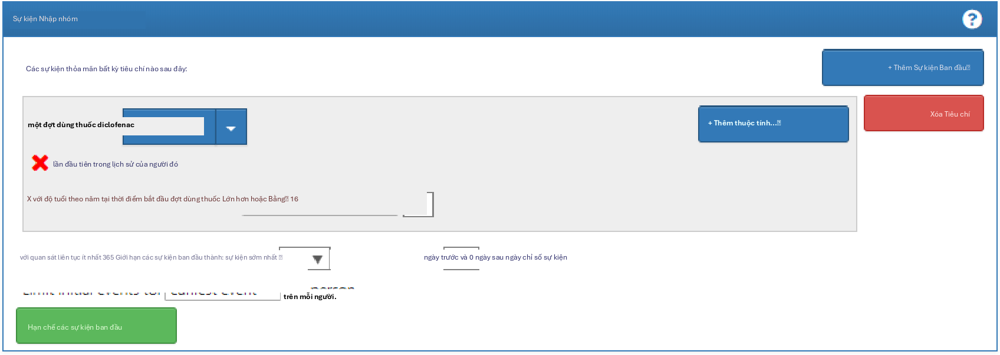{width="5.341874453193351in"
height="1.8965616797900262in"}

Hình E.1: Cài đặt sự kiện nhập nhóm thuần tập cho người dùng mới sử
dụng diclofenac

Biểu thức tập hợp khái niệm cho diclofenac sẽ trông giống như Hình
E.2, bao gồm thành phần 'Diclofenac' và tất cả các khái niệm con của
nó, do đó bao gồm tất cả các loại thuốc chứa thành phần diclofenac.

Tiếp theo, chúng ta yêu cầu không có tiền sử tiếp xúc với bất kỳ loại
NSAID nào, như được hiển thị trong Hình E.3.

Biểu thức tập hợp khái niệm cho các loại NSAID sẽ trông giống như Hình
E.4, bao gồm nhóm NSAID và tất cả các khái niệm con của nó, do đó bao
gồm tất cả các loại thuốc chứa bất kỳ NSAID nào.

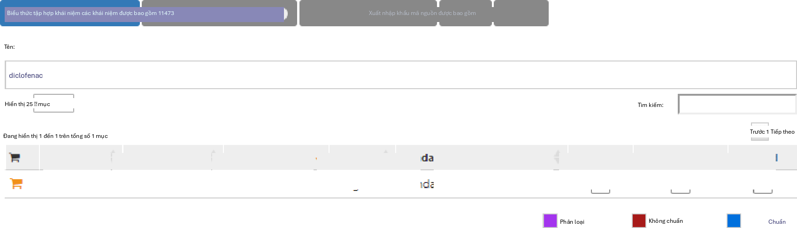{width="5.348437226596675in"
height="1.5290616797900263in"}

Hình E.2: Biểu thức tập hợp khái niệm cho diclofenac.

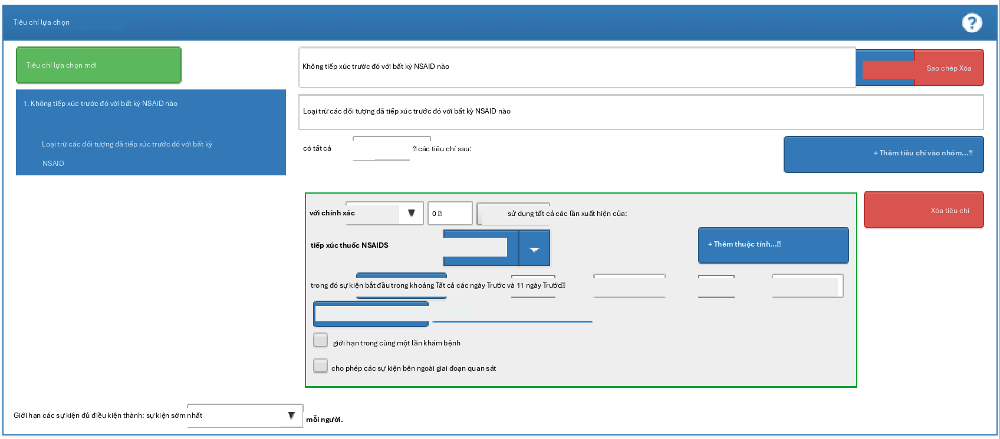{width="5.341874453193351in"
height="2.349374453193351in"}

Hình E.3: Yêu cầu không có tiền sử tiếp xúc với bất kỳ loại NSAID nào.

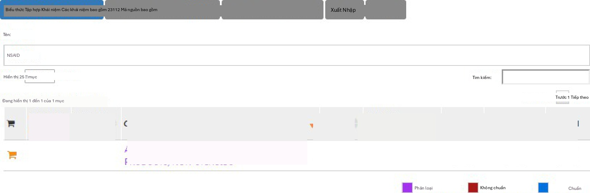{width="5.348437226596675in"
height="1.7521872265966754in"}

Hình E.4: Biểu thức tập hợp khái niệm cho các loại NSAID

Ngoài ra, chúng ta yêu cầu không có tiền sử chẩn đoán ung thư, như
được hiển thị trong Hình E.5.

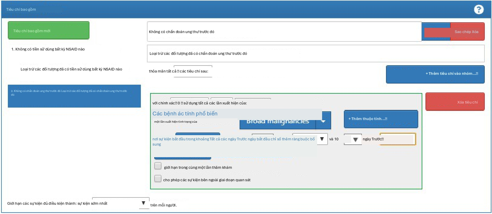{width="5.3353127734033245in"
height="2.323124453193351in"}

Hình E.5: Yêu cầu không có tiền sử chẩn đoán ung thư.

Biểu thức tập hợp khái niệm cho "Các bệnh ác tính rộng" sẽ trông giống
như Hình E.6, bao gồm khái niệm cấp cao "Bệnh tân sinh ác tính" và tất
cả các khái niệm con của nó.

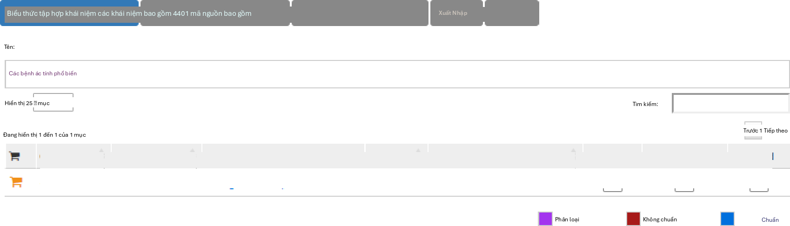{width="5.348437226596675in"
height="1.5290616797900263in"}

Hình E.6: Biểu thức tập hợp khái niệm cho các bệnh ác tính rộng

Cuối cùng, chúng ta xác định các tiêu chí thoát nhóm thuần tập là
ngừng tiếp xúc (cho phép khoảng trống 30 ngày), như được hiển thị
trong Hình E.7.

#### Bài tập 10.2

Để dễ đọc, chúng ta chia SQL thành hai bước. Trước tiên, chúng ta tìm
tất cả các lần xuất hiện tình trạng nhồi máu cơ tim và lưu trữ chúng
trong một bảng tạm gọi là "#diagnoses":

**library**(DatabaseConnector)

connection \<- **connect**(connectionDetails) sql \<- \"SELECT
person_id AS subject_id,

condition_start_date AS cohort_start_date INTO #diagnoses

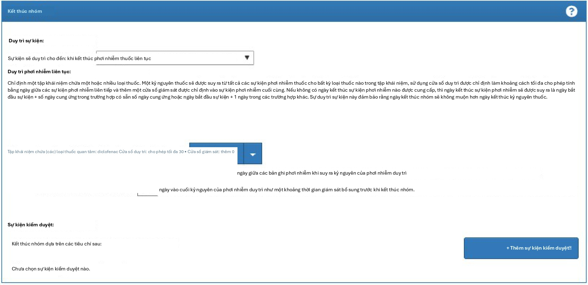{width="5.341874453193351in"
height="2.585624453193351in"}

Hình E.7: Thiết lập ngày thoát nhóm thuần tập.

FROM \@cdm.condition_occurrence WHERE condition_concept_id IN (

SELECT descendant_concept_id FROM \@cdm.concept_ancestor

WHERE ancestor_concept_id = 4329847 \-- Myocardial infarction

)

AND condition_concept_id NOT IN ( SELECT descendant_concept_id FROM
\@cdm.concept_ancestor

WHERE ancestor_concept_id = 314666 \-- Old myocardial infarction

);\"

**renderTranslateExecuteSql**(connection, sql, cdm = \"main\")

Sau đó, chúng ta chỉ chọn những trường hợp xảy ra trong chuyến thăm
khám nội trú hoặc cấp cứu, sử dụng một COHORT_DEFINITION_ID duy nhất
(chúng ta đã chọn '1'):

sql \<- \"INSERT INTO \@cdm.cohort ( subject_id,

cohort_start_date, cohort_definition_id

)

SELECT subject_id, cohort_start_date,

CAST (1 AS INT) AS cohort_definition_id FROM #diagnoses

INNER JOIN \@cdm.visit_occurrence ON subject_id = person_id

AND cohort_start_date \>= visit_start_date AND cohort_start_date \<=
visit_end_date

WHERE visit_concept_id IN (9201, 9203, 262); \-- Inpatient or ER;\"

**renderTranslateExecuteSql**(connection, sql, cdm = \"main\")

Lưu ý rằng một phương pháp thay thế là nối các tình trạng bệnh lý với
các chuyến thăm khám dựa trên VISIT_OCCURRENCE_ID, thay vì yêu cầu
ngày xảy ra tình trạng bệnh lý phải nằm trong khoảng thời gian bắt đầu
và kết thúc của chuyến thăm khám. Cách này có khả năng chính xác hơn
vì nó đảm bảo rằng tình trạng bệnh lý được ghi lại liên quan đến
chuyến thăm khám nội trú hoặc cấp cứu. Tuy nhiên, nhiều cơ sở dữ liệu
quan sát không ghi lại mối liên kết giữa chuyến thăm khám và chẩn
đoán, do đó chúng ta chọn sử dụng ngày tháng, có khả năng mang lại độ
nhạy cao hơn nhưng có lẽ độ đặc hiệu thấp hơn.

Lưu ý rằng chúng ta cũng bỏ qua ngày kết thúc nhóm thuần tập. Thông
thường, khi một nhóm thuần tập được sử dụng để xác định kết quả, chúng
ta chỉ quan tâm đến ngày bắt đầu nhóm thuần tập và không có lý do gì
để tạo ra một ngày kết thúc nhóm thuần tập (được xác định không rõ
ràng).

Khuyến nghị nên xóa sạch mọi bảng tạm khi không còn cần thiết:

sql \<- \"TRUNCATE TABLE #diagnoses; DROP TABLE #diagnoses;\"

**renderTranslateExecuteSql**(connection, sql)

## Đặc điểm hóa

#### Bài tập 11.1

Trong ATLAS, chúng ta nhấp vào và chọn nguồn dữ liệu mà chúng ta quan
tâm. Chúng ta có thể chọn báo cáo Tiếp xúc thuốc (Drug Exposure), chọn
tab "Bảng" (Table) và tìm kiếm "celecoxib" như được hiển thị trong
Hình E.8. Tại đây, chúng ta thấy rằng cơ sở dữ liệu cụ thể này có các
lần tiếp xúc với nhiều loại chế phẩm celecoxib khác nhau. Chúng ta có
thể nhấp vào bất kỳ loại thuốc nào trong số này để có cái nhìn chi
tiết hơn, ví dụ như hiển thị phân bố độ tuổi và giới tính cho các loại
thuốc
này.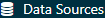{width="1.093918416447944in"
height="0.18752843394575677in" .book-icon}

#### Bài tập 11.2

Nhấp vào và sau đó chọn "Nhóm thuần tập mới" (New cohort) để tạo một
nhóm thuần tập mới. Đặt cho nhóm thuần tập một cái tên có ý nghĩa (ví
dụ: "Người dùng mới Celecoxib") và đi đến tab "Tập hợp khái niệm"
(Concept Sets). Nhấp vào "Tập hợp khái niệm mới" (New Concept Set) và
đặt cho tập hợp khái niệm của bạn một cái tên có ý nghĩa (ví dụ:
"Celecoxib"). Mở mô-đun, tìm kiếm "celecoxib", giới hạn Lớp (Class)
thành "Thành phần" (Ingredient) và Khái niệm chuẩn (Standard Concept)
thành "Chuẩn" (Standard), rồi nhấp để thêm khái niệm vào tập hợp khái
niệm của bạn như được hiển thị trong Hình
E.9.{width="1.301920384951881in"
height="0.18747594050743657in" .book-icon}{width="0.635336832895888in"
height="0.18747594050743657in" .book-icon}

phần" (Ingredient) và Khái niệm chuẩn (Standard Concept) thành "Chuẩn"
(Standard), rồi nhấp để thêm khái niệm vào tập hợp khái niệm của bạn
như được hiển thị trong Hình
E.9.{width="0.15622922134733158in"
height="0.12498359580052494in" .book-icon}

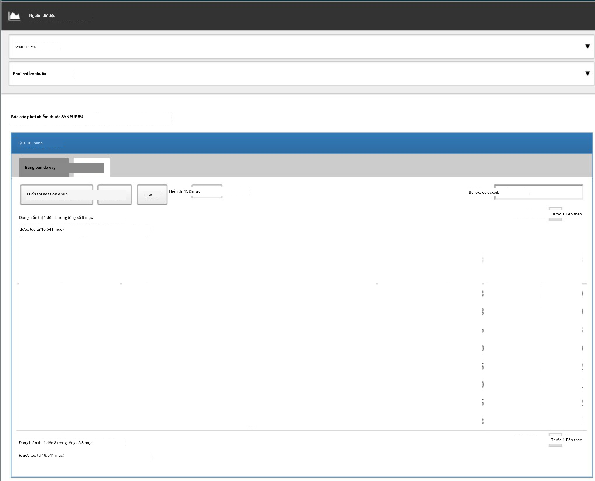{width="5.3125in"
height="4.296874453193351in"}

Hình E.8: Đặc điểm hóa nguồn dữ liệu.

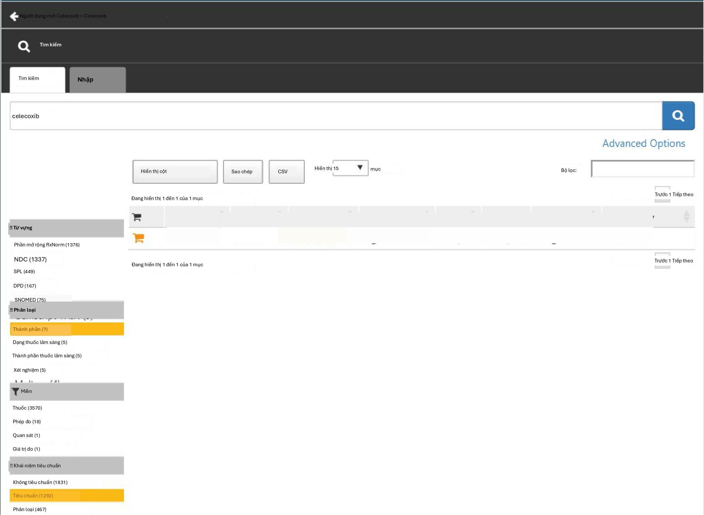{width="5.380207786526684in"
height="3.942707786526684in"}

Hình E.9: Chọn khái niệm chuẩn cho thành phần "celecoxib".

Nhấp vào mũi tên trái hiển thị ở phía trên bên trái của Hình E.9 để
quay lại định nghĩa nhóm thuần tập của bạn. Nhấp vào "+Thêm sự kiện
ban đầu" (+Add Initial Event) và sau đó chọn "Thêm giai đoạn dùng
thuốc" (Add Drug Era). Chọn tập hợp khái niệm bạn đã tạo trước đó cho
tiêu chí giai đoạn dùng thuốc. Nhấp vào "Thêm thuộc tính..." (Add
attribute...) và chọn "Thêm tiêu chí tiếp xúc lần đầu" (Add First
Exposure Criteria). Đặt yêu cầu quan sát liên tục ít nhất 365 ngày
trước ngày chỉ mục. Kết quả sẽ trông giống như Hình E.10. Để nguyên
các phần Tiêu chí bao gồm (Inclusion Criteria), Thoát nhóm thuần tập
(Cohort Exit) và Giai đoạn nhóm thuần tập (Cohort Eras). Hãy đảm bảo
lưu định nghĩa nhóm thuần tập bằng cách nhấp và đóng nó bằng cách
nhấp.{width="0.18747594050743657in"
height="0.18747594050743657in" .book-icon}{width="0.18747594050743657in"
height="0.18747594050743657in" .book-icon}

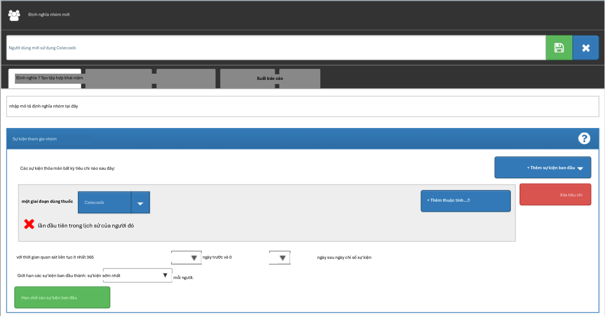{width="5.380207786526684in"
height="2.817707786526684in"}

Hình E.10: Một định nghĩa nhóm thuần tập người dùng mới celecoxib đơn
giản.

Bây giờ chúng ta đã xác định được nhóm thuần tập của mình, chúng ta có
thể đặc điểm hóa nó. Nhấp vào và sau đó chọn "Đặc điểm hóa mới" (New
Characterization). Đặt cho đặc điểm hóa của bạn một cái tên có ý nghĩa
(ví dụ: "Đặc điểm hóa người dùng mới Celecoxib"). Trong phần Định
nghĩa nhóm thuần tập (Cohort Definitions), nhấp vào "Nhập" (Import) và
chọn định nghĩa nhóm thuần tập bạn vừa tạo. Trong phần "Phân tích đặc
trưng" (Feature Analyses), nhấp vào "Nhập" (Import) và chọn ít nhất
một phân tích tình trạng bệnh lý và một phân tích thuốc, ví dụ: "Giai
đoạn nhóm thuốc bất kỳ thời điểm nào trước đó" (Drug Group Era Any
Time Prior) và "Giai đoạn nhóm tình trạng bệnh lý bất kỳ thời điểm nào
trước đó" (Condition Group Era Any Time
Prior).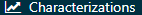{width="1.479808617672791in"
height="0.1563167104111986in" .book-icon}

Định nghĩa đặc điểm hóa của bạn bây giờ sẽ trông giống như Hình E.11.
Hãy đảm bảo lưu các cài đặt đặc điểm hóa bằng cách
nhấp.{width="0.18747594050743657in"
height="0.18747594050743657in" .book-icon}

Nhấp vào tab "Thực thi" (Executions) và nhấp vào "Tạo" (Generate) cho
một trong các nguồn dữ liệu. Có thể mất một lúc để quá trình tạo hoàn
tất. Khi hoàn tất, chúng ta có thể nhấp vào "Xem kết quả mới nhất"
(View latest results). Màn hình kết quả sẽ trông giống như Hình E.12,
cho thấy ví dụ như đau và bệnh khớp thường được quan sát thấy, điều
này không có gì ngạc nhiên vì đây là những chỉ định cho celecoxib. Ở
phía dưới danh sách, chúng ta có thể thấy những tình trạng bệnh lý mà
chúng ta không ngờ tới.

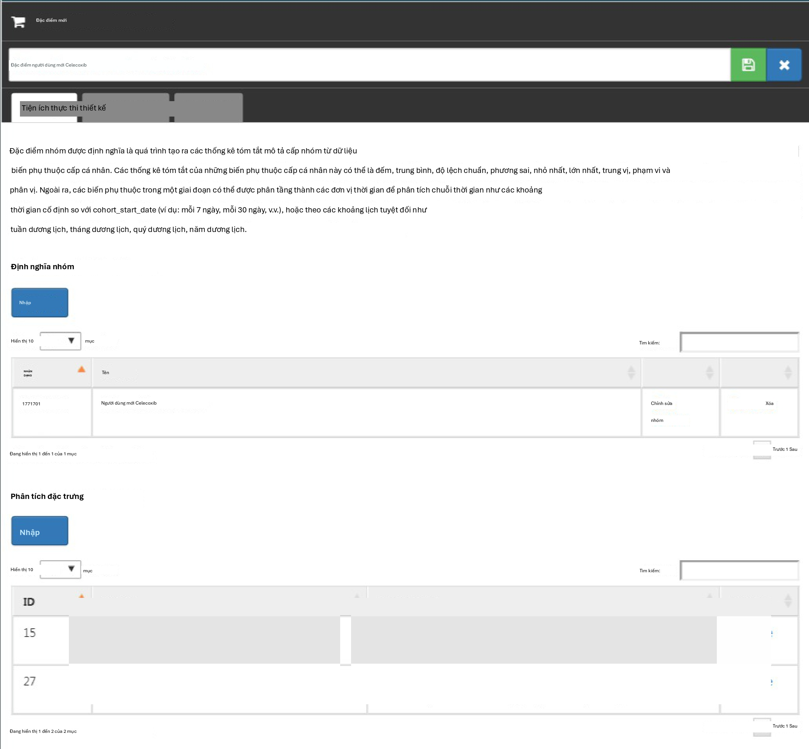{width="5.375in"
height="4.979166666666667in"}

Hình E.11: Cài đặt đặc điểm hóa.

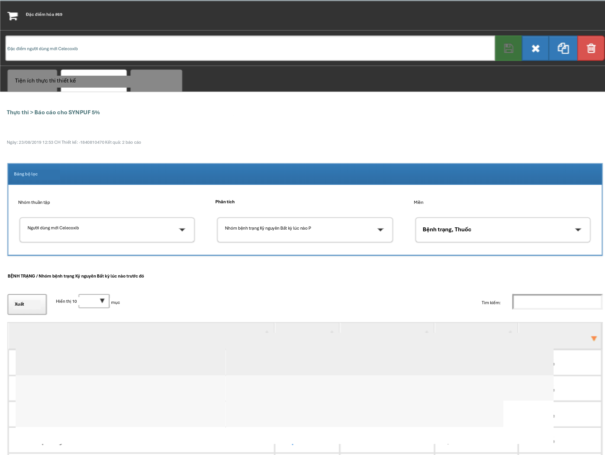{width="5.322916666666667in"
height="4.010416666666667in"}

Hình E.12: Cài đặt đặc điểm hóa.

#### Bài tập 11.3

Nhấp vào và sau đó chọn "Nhóm thuần tập mới" (New cohort) để tạo một
nhóm thuần tập mới. Đặt cho nhóm thuần tập một cái tên có ý nghĩa (ví
dụ: "Xuất huyết tiêu hóa") và đi đến tab "Tập hợp khái niệm" (Concept
Sets). Nhấp vào "Tập hợp khái niệm mới" (New Concept Set) và đặt cho
tập hợp khái niệm của bạn một cái tên có ý nghĩa (ví dụ: "Xuất huyết
tiêu hóa"). Mở mô-đun, tìm kiếm "Gastrointestinal hemorrhage", và nhấp
vào bên cạnh khái niệm hàng đầu để thêm khái niệm vào tập hợp khái
niệm của bạn như được hiển thị trong Hình
E.13.{width="1.301920384951881in"
height="0.18747594050743657in" .book-icon}{width="0.635336832895888in"
height="0.18747594050743657in" .book-icon}{width="0.15622922134733158in"
height="0.12498359580052494in" .book-icon}

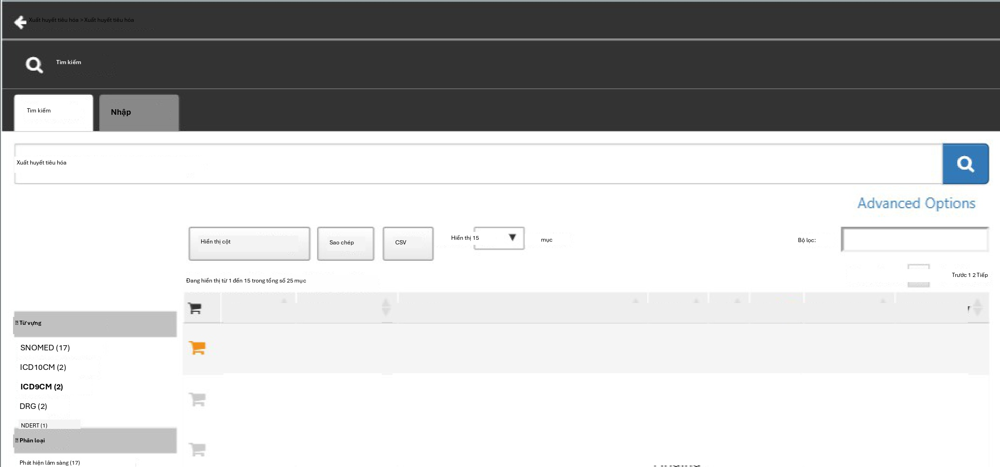{width="5.369791119860017in"
height="2.5104166666666665in"}

Hình E.13: Chọn khái niệm chuẩn cho "Gastrointestinal hemorrhage".

Nhấp vào mũi tên trái hiển thị ở phía trên bên trái của Hình E.13 để
quay lại định nghĩa nhóm thuần tập của bạn. Mở lại tab "Tập hợp khái
niệm" (Concept Sets) và chọn "Các khái niệm con" (Descendants) bên
cạnh khái niệm xuất huyết tiêu hóa, như được hiển thị trong Hình E.14.

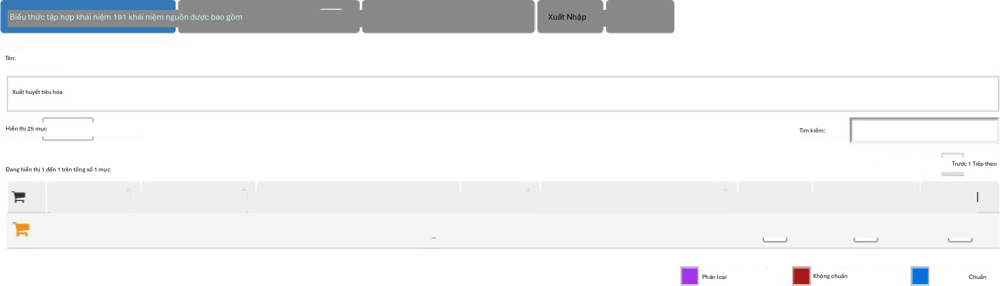{width="5.3125in"
height="1.5208333333333333in"}

Hình E.14: Thêm tất cả các khái niệm con vào "Xuất huyết tiêu hóa".

Quay lại tab "Định nghĩa" (Definition), nhấp vào "+Thêm sự kiện ban
đầu" (+Add Initial Event) và sau đó chọn "Thêm lần xuất hiện tình
trạng bệnh lý" (Add Condition Occurrence). Chọn tập hợp khái niệm bạn
đã tạo trước đó cho tiêu chí lần xuất hiện tình trạng bệnh lý. Kết quả
sẽ trông giống như Hình E.15. Để nguyên các phần Tiêu chí bao gồm,
Thoát nhóm thuần tập và Giai đoạn nhóm thuần tập. Hãy đảm bảo lưu định
nghĩa nhóm thuần tập bằng cách nhấp và đóng nó bằng cách
nhấp.{width="0.18747594050743657in"
height="0.18747594050743657in" .book-icon}{width="0.18747594050743657in"
height="0.18747594050743657in" .book-icon}

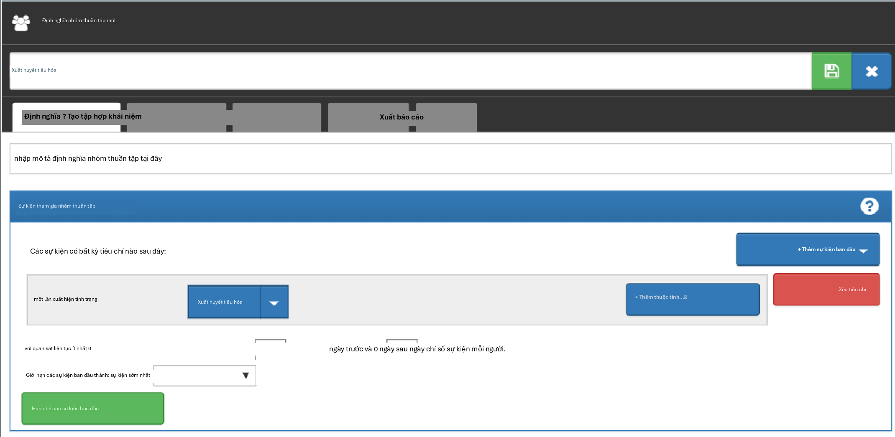{width="5.348957786526684in"
height="2.6145833333333335in"}

Hình E.15&#58; Một định nghĩa nhóm thuần tập xuất huyết tiêu hóa đơn giản.

Bây giờ chúng ta đã xác định được nhóm thuần tập của mình, chúng ta có
thể tính toán tỷ lệ mắc bệnh. Nhấp vào và sau đó chọn "Phân tích mới"
(New Analysis). Đặt cho phân tích của bạn một cái tên có ý nghĩa (ví
dụ: "Tỷ lệ mắc xuất huyết tiêu hóa sau khi bắt đầu dùng celecoxib").
Nhấp vào "Thêm nhóm thuần tập mục tiêu" (Add Target Cohort) và chọn
nhóm thuần tập người dùng mới celecoxib của chúng ta. Nhấp vào "Thêm
nhóm thuần tập kết quả" (Add Outcome Cohort) và thêm nhóm thuần tập
xuất huyết tiêu hóa mới của chúng ta. Đặt Thời gian nguy cơ (Time At
Risk) kết thúc 1095 ngày sau ngày bắt đầu. Phân tích bây giờ sẽ trông
giống như Hình E.16. Hãy đảm bảo lưu các cài đặt phân tích bằng cách
nhấp.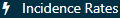{width="1.2505238407699037in"
height="0.18757764654418196in" .book-icon}{width="0.18747594050743657in"
height="0.18747594050743657in" .book-icon}

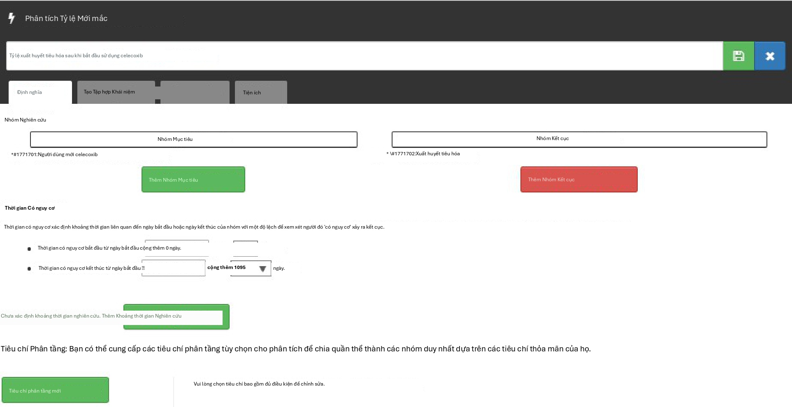{width="5.389998906386702in"
height="2.765in"}

Hình E.16&#58; Phân tích tỷ lệ mắc bệnh.

Nhấp vào tab "Tạo" (Generation) và nhấp vào "Tạo" (Generate). Chọn một
trong các nguồn dữ liệu và nhấp "Tạo". Khi hoàn tất, chúng ta có thể
thấy tỷ lệ mắc bệnh và tỷ lệ phần trăm được tính toán, như được hiển
thị trong Hình E.17.

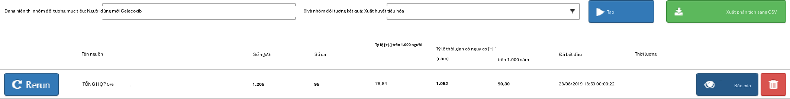{width="5.312501093613299in"
height="0.6718744531933508in"}

Hình E.17: Kết quả tỷ lệ mắc bệnh.

## Ước tính cấp độ quần thể

#### Bài tập 12.1

Chúng ta chỉ định tập hợp các hiệp biến mặc định, nhưng chúng ta phải
loại trừ hai loại thuốc mà chúng ta đang so sánh, bao gồm tất cả các
khái niệm con của chúng, vì nếu không, mô hình xu hướng của chúng ta
sẽ trở nên dự đoán hoàn hảo:

**library**(CohortMethod)

nsaids \<- **c**(1118084, 1124300) *\# celecoxib, diclofenac*

covSettings \<- **createDefaultCovariateSettings**(
excludedCovariateConceptIds = nsaids, addDescendantsToExclude = TRUE)

*\# Load data:*

cmData \<- **getDbCohortMethodData**( connectionDetails =
connectionDetails, cdmDatabaseSchema = \"main\",

targetId = 1,

comparatorId = 2,

outcomeIds = 3, exposureDatabaseSchema = \"main\", exposureTable =
\"cohort\", outcomeDatabaseSchema = \"main\", outcomeTable =
\"cohort\", covariateSettings = covSettings)

**summary**(cmData)

\## Tóm tắt đối tượng CohortMethodData \##

\## ID khái niệm điều trị: 1 \## ID khái niệm so sánh: 2 \## ID khái
niệm kết quả: 3 \##

\## Số người được điều trị: 1800 \## Số người so sánh: 830 \##

\## Số lượng kết quả:

\## Số sự kiện Số người

\## 3 479 479 \##

\## Hiệp biến:

\## Số lượng hiệp biến: 389

\## Số giá trị hiệp biến khác không: 26923

#### Bài tập 12.2

Chúng ta tạo quần thể nghiên cứu theo các thông số kỹ thuật và xuất
biểu đồ suy giảm:

studyPop \<- **createStudyPopulation**( cohortMethodData = cmData,
outcomeId = 3,

washoutPeriod = 180, removeDuplicateSubjects = \"remove all\",
removeSubjectsWithPriorOutcome = TRUE, riskWindowStart = 0,

startAnchor = \"cohort start\", riskWindowEnd = 99999)

**drawAttritionDiagram**(studyPop)

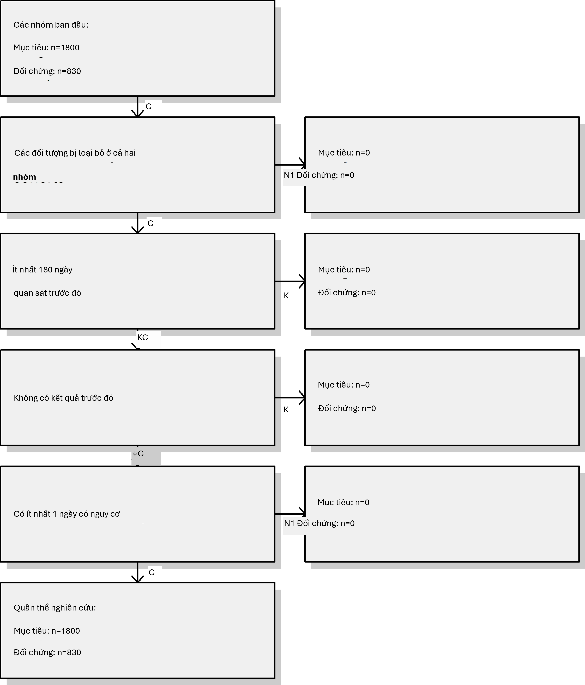{width="3.7435411198600175in"
height="4.388124453193351in"}

Chúng ta thấy rằng chúng ta không mất bất kỳ đối tượng nào so với các
nhóm thuần tập ban đầu, có lẽ vì các hạn chế được sử dụng ở đây đã
được áp dụng trong các định nghĩa nhóm thuần tập.

#### Bài tập 12.3

Chúng ta khớp một mô hình kết quả đơn giản bằng cách sử dụng hồi quy
Cox:

model \<- **fitOutcomeModel**(population = studyPop,

modelType = \"cox\")

model

\## Loại mô hình: cox \## Phân tầng: FALSE

\## Sử dụng hiệp biến: FALSE

\## Sử dụng trọng số xác suất nghịch đảo của điều trị: FALSE \## Trạng
thái: OK

\##

\## Ước tính .95 dưới .95 trên logRr seLogRr

\## điều trị 1.34612 1.10065 1.65741 0.29723 0.1044

Có khả năng là người dùng celecoxib không thể thay thế cho người dùng
diclofenac và những khác biệt cơ bản này đã dẫn đến các nguy cơ kết
quả khác nhau. Nếu chúng ta không điều chỉnh cho những khác biệt này,
giống như trong phân tích này, chúng ta có khả năng tạo ra các ước
tính thiên lệch.

#### Bài tập 12.4

Chúng ta khớp một mô hình xu hướng trên quần thể nghiên cứu của mình,
sử dụng tất cả các hiệp biến mà chúng ta đã trích xuất. Sau đó, chúng
ta hiển thị phân phối điểm ưu tiên:

ps \<- **createPs**(cohortMethodData = cmData,

population = studyPop)

{width="4.239374453193351in"
height="2.8328116797900265in"}

Lưu ý rằng phân phối này trông hơi lạ, với một vài điểm tăng đột biến.
Điều này là do chúng ta đang sử dụng một tập dữ liệu mô phỏng rất nhỏ.
Các phân phối điểm ưu tiên thực tế có xu hướng mượt mà hơn nhiều.

Mô hình xu hướng đạt được AUC là 0.63, cho thấy có những khác biệt
giữa nhóm mục tiêu và nhóm so sánh. Chúng ta thấy khá nhiều sự chồng
lấp giữa hai nhóm, cho thấy việc điều chỉnh PS có thể làm cho chúng
tương đương hơn.

#### Bài tập 12.5

Chúng ta phân tầng quần thể dựa trên điểm xu hướng và tính toán sự cân
bằng hiệp biến trước và sau khi phân tầng:

strataPop \<- **stratifyByPs**(ps, numberOfStrata = 5) bal \<-
**computeCovariateBalance**(strataPop, cmData)
**plotCovariateBalanceScatterPlot**(bal,

showCovariateCountLabel = TRUE, showMaxLabel = TRUE,

beforeLabel = \"Before stratification\", afterLabel = \"After
stratification\")

{width="3.5268744531933507in"
height="3.497082239720035in"}

Chúng ta thấy rằng các hiệp biến cơ bản khác nhau cho thấy sự khác
biệt chuẩn hóa về giá trị trung bình lớn (\>0.3) trước khi phân tầng
(trục x). Sau khi phân tầng, sự cân bằng được tăng lên, với sự khác
biệt chuẩn hóa tối đa \<= 0.1.

#### Bài tập 12.6

Chúng ta khớp một mô hình kết quả bằng cách sử dụng hồi quy Cox, nhưng
phân tầng nó theo các tầng PS:

adjModel \<- **fitOutcomeModel**(population = strataPop,

modelType = \"cox\", stratified = TRUE)

adjModel

\## Loại mô hình: cox \## Phân tầng: TRUE

\## Sử dụng hiệp biến: FALSE

\## Sử dụng trọng số xác suất nghịch đảo của điều trị: FALSE \## Trạng
thái: OK

\##

\## Ước tính thấp hơn .95 cao hơn .95 logRr seLogRr \## điều trị
1.13211 0.92132 1.40008 0.12409 0.1068

Chúng ta thấy ước tính đã điều chỉnh thấp hơn ước tính chưa điều chỉnh
và khoảng tin cậy 95% hiện bao gồm 1. Điều này là do chúng ta hiện
đang điều chỉnh cho các khác biệt cơ bản giữa hai nhóm tiếp xúc, do đó
giảm bớt sự thiên lệch.

## Dự đoán cấp độ bệnh nhân

#### Bài tập 13.1

Chúng ta chỉ định một tập hợp các cài đặt hiệp biến và sử dụng hàm
getPlpData để trích xuất dữ liệu từ cơ sở dữ liệu:

**thư viện(PatientLevelPrediction) covSettings \<-
createCovariateSettings(**

useDemographicsGender = TRUE, useDemographicsAge = TRUE,
useConditionGroupEraLongTerm = TRUE, useConditionGroupEraAnyTimePrior
= TRUE, useDrugGroupEraLongTerm = TRUE, useDrugGroupEraAnyTimePrior =
TRUE, useVisitConceptCountLongTerm = TRUE, longTermStartDays = -365,

endDays = -1)

plpData \<- **getPlpData**(connectionDetails = connectionDetails,

cdmDatabaseSchema = \"chính\", cohorDatabaseSchema = \"chính\",
cohorTable = \"nhóm thuần tập\", cohortId = 4,

covariateSettings = covSettings, resultDatabaseSchema = \"main\",
resultTable = \"cohort\", resultIds = 3)

**summary**(plpData)

\## Tóm tắt đối tượng plpData \##

\## ID khái niệm nhóm thuần tập có nguy cơ: -1 \## ID khái niệm kết
quả: 3

\##

\## Số người: 2630

\##

\## Số lượng kết quả:

\## Số sự kiện Số người \## 3 479 479

\##

\## Hiệp biến:

\## Số lượng hiệp biến: 245

\## Số giá trị hiệp biến khác không: 54079

#### Bài tập 13.2

Chúng ta tạo một quần thể nghiên cứu cho kết quả quan tâm (trong
trường hợp này là kết quả duy nhất mà chúng ta đã trích xuất dữ liệu),
loại bỏ các đối tượng đã trải qua kết quả trước khi họ bắt đầu dùng
NSAID và yêu cầu 364 ngày thời gian nguy cơ:

population \<- **createStudyPopulation**(plpData = plpData,

outcomeId = 3,

washoutPeriod = 364, firstExposureOnly = FALSE,

removeSubjectsWithPriorOutcome = TRUE, priorOutcomeLookback = 9999,

riskWindowStart = 1,

riskWindowEnd = 365, addExposureDaysToStart = FALSE,
addExposureDaysToEnd = FALSE, minTimeAtRisk = 364, requireTimeAtRisk =
TRUE, includeAllOutcomes = TRUE)

**nrow**(population)

\## \[1\] 2578

Trong trường hợp này, chúng ta đã mất một vài người bằng cách loại bỏ
những người đã có kết quả trước đó và bằng cách yêu cầu thời gian nguy
cơ ít nhất 364 ngày.

#### Bài tập 13.3

Chúng ta chạy mô hình LASSO bằng cách tạo một đối tượng cài đặt mô
hình trước, sau đó gọi hàm runPlp. Trong trường hợp này, chúng ta thực
hiện phân chia theo người, huấn luyện mô hình trên 75% dữ liệu và đánh
giá trên 25% dữ liệu:

lassoModel \<- **setLassoLogisticRegression**(seed = 0)

lassoResults \<- **runPlp**(population = population,

plpData = plpData, modelSettings = lassoModel,

testSplit = \'person\', testFraction = 0.25,

nfold = 2,

splitSeed = 0)

Lưu ý rằng đối với ví dụ này, hãy đặt các hạt giống ngẫu nhiên cho cả
xác thực chéo LASSO và phân chia huấn luyện-kiểm tra để đảm bảo kết
quả sẽ giống nhau trên nhiều lần chạy.

Bây giờ chúng ta có thể xem kết quả bằng ứng dụng Shiny:

**viewPlp**(lassoResults)

Thao tác này sẽ khởi chạy ứng dụng như được hiển thị trong Hình E.18.
Tại đây, chúng ta thấy AUC trên tập kiểm tra là 0.645, tốt hơn so với
đoán ngẫu nhiên, nhưng có lẽ chưa đủ tốt cho thực hành lâm sàng.

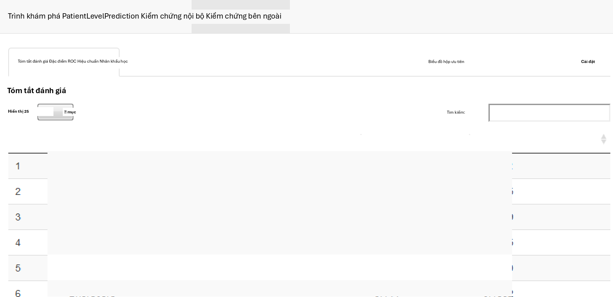{width="5.352916666666666in"
height="2.597916666666667in"}

Hình E.18: Ứng dụng Shiny dự đoán cấp độ bệnh nhân.

## Chất lượng dữ liệu

#### Bài tập 15.1

Để chạy ACHILLES:

**library**(ACHILLES)

result \<- **achilles**(connectionDetails,

cdmDatabaseSchema = \"main\", resultsDatabaseSchema = \"main\",

sourceName = \"Eunomia\", cdmVersion = \"5.3.0\")

#### Bài tập 15.2

Để chạy Bảng điều khiển chất lượng dữ liệu (Data Quality Dashboard):

DataQualityDashboard**::executeDqChecks**( connectionDetails,

cdmDatabaseSchema = \"main\", resultsDatabaseSchema = \"main\",
cdmSourceName = \"Eunomia\",

outputFolder = \"C:/dataQualityExample\")

#### Bài tập 15.3

Để xem danh sách các kiểm tra chất lượng dữ liệu:

DataQualityDashboard**::viewDqDashboard**(
\"C:/dataQualityExample/Eunomia/results_Eunomia.json\")

